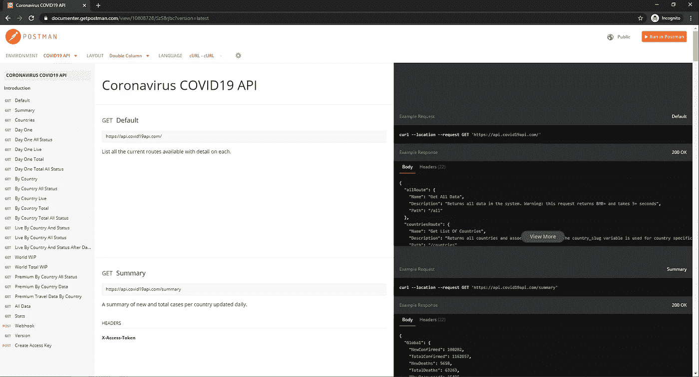
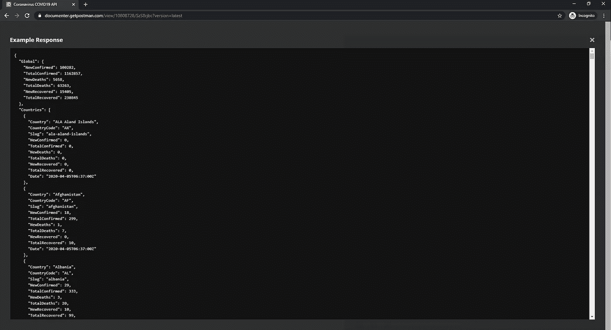
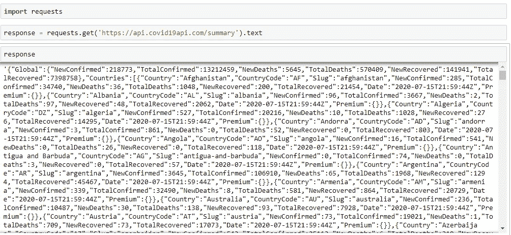
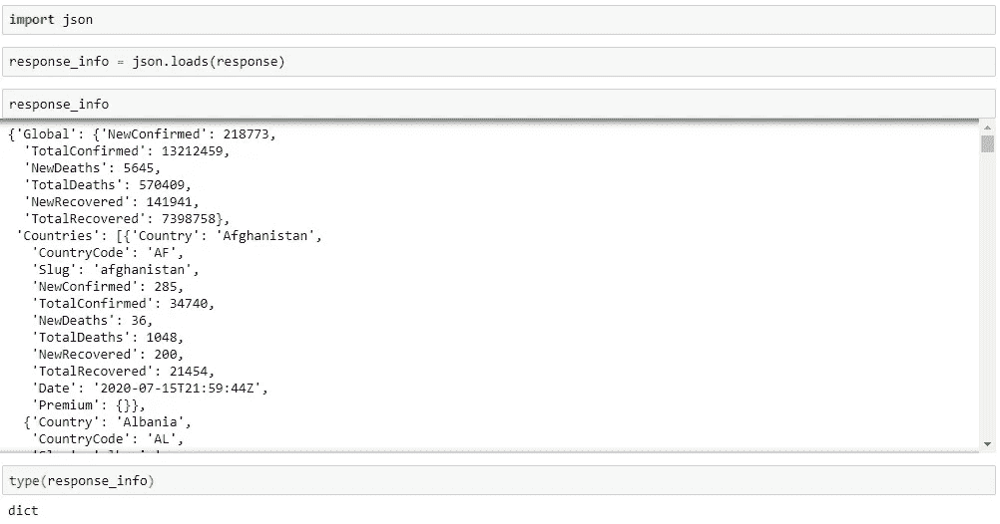
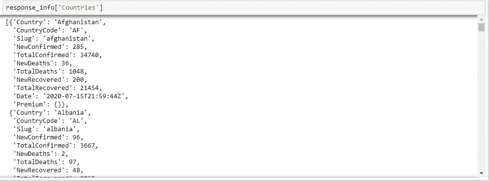
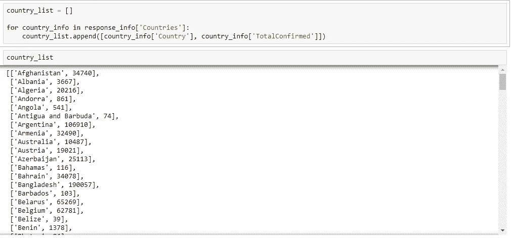
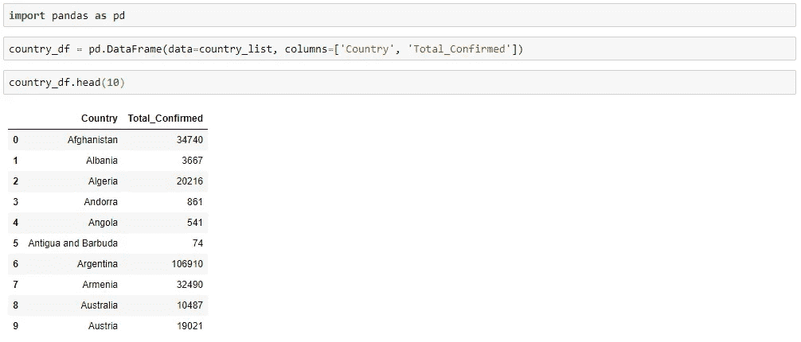

# 使用 Python 的 JSON 和 API

> 原文：<https://towardsdatascience.com/json-and-apis-with-python-fba329ef6ef0?source=collection_archive---------0----------------------->

## 使用 Python 的 JSON 和 API 介绍


肖恩·林在 [Unsplash](https://unsplash.com?utm_source=medium&utm_medium=referral) 上的照片

## 介绍

在另一个教程中，我们讨论了如何用 python 进行[网页抓取。网络抓取的目标是从网站或网页获取数据。嗯，有时候一个网站可以让用户通过 API(应用编程接口)更容易地直接访问他们的数据。这基本上意味着该公司制作了一组专用的 URL，以纯形式提供这些数据(意味着没有任何表示格式)。这种纯数据通常是 JSON (JavaScript 对象表示法)格式，我们可以使用 python 解析并提取我们需要的内容。](https://medium.com/towards-artificial-intelligence/web-scraping-with-python-6d01f5e9378f)

对于本教程，我们将使用在 covid19api.com 发现的免费 API，提供冠状病毒的数据。我们将找到每个国家确诊病例的总数，然后我们将创建一个包含这些信息的熊猫数据框架。所以让我们开始吧！

[](https://pub.towardsai.net/web-scraping-with-python-6d01f5e9378f) [## 使用 Python 进行 Web 抓取

### 如何在 python 中使用漂亮的 soup 和请求库进行网页抓取

pub.towardsai.net](https://pub.towardsai.net/web-scraping-with-python-6d01f5e9378f) 

## 检查 API

如果你进入 [API](https://documenter.getpostman.com/view/10808728/SzS8rjbc?version=latest) 的文档页面，你会看到:



*这向我们展示了 API 中的不同 URL、它们提供的信息以及右边这些 URL 的请求/响应示例。*

我们可以看到，我们正在寻找的信息在摘要页面。我们可以单击右侧的“查看更多”,这样我们就可以看到来自该 URL 的响应:



这是一个 JSON 对象！如您所见，它非常类似于 python 字典，由键值对组成。事实上，为了让我们解析它并从中提取我们想要的东西，我们最终会将它转换成 python dictionary 对象。经过检查，我们可以看到它看起来像一个嵌套的字典。外部字典具有关键字“Global”(具有字典的值)和“Countries”(具有由字典组成的列表的值，每个字典对应一个特定的国家)。

[](/two-ways-to-create-tables-in-python-2e184c9f9876) [## 在 Python 中创建表的两种方法

### Python 中制表和熊猫数据帧函数的性能比较

towardsdatascience.com](/two-ways-to-create-tables-in-python-2e184c9f9876) 

## 从 API 发出 HTTP 请求

因此，让我们打开一个 jupyter 笔记本，从那个 [URL](https://api.covid19api.com/summary) 请求信息。我们将使用请求库从那个 [U](https://api.covid19api.com/summary) RL 发出一个 HTTP 请求，并将响应对象的文本保存在变量 response 下:

```
response = requests.get(‘https://api.covid19api.com/summary’).text
```



*这显示了 API 对我们的 HTTP 请求的响应。如您所见，这是一个 JSON 格式的长 python 字符串。*

[](/using-string-methods-in-pandas-5e4509ff1f5f) [## 在 Pandas 中使用字符串方法

### 如何将字符串方法应用于 pandas 数据框架中的列

towardsdatascience.com](/using-string-methods-in-pandas-5e4509ff1f5f) 

## 创建 Python 字典

由于响应是 JSON 格式的，我们可以将这个字符串加载到 python 中，并将其转换成 python 字典。我们首先需要导入 json 库，然后我们可以使用 json 库中的 loads 方法，并向它传递我们的字符串:

```
response_info = json.loads(response)
```



注意我们的 response_info 变量的类型现在是一个 python 字典！

既然我们的响应是 python 字典的形式，我们可以使用我们所知道的 python 字典来解析它并提取我们需要的信息！

**还要注意:**requests 库有一个内置的 [json 解码器](https://requests.readthedocs.io/en/master/user/quickstart/#json-response-content)，我们可以用它来代替 JSON 模块，后者会将我们的 JSON 对象转换成 python 字典。但是，我在本教程中使用了上述方法来介绍 json 模块。如果我们在请求模块中使用 JSON 解码器，代码看起来会是这样的:

```
requests.get(‘https://api.covid19api.com/summary’).json()
```

## 解析字典

如前所述，我们希望创建一个包含两列的熊猫数据框架:国家和该国确诊病例总数。我们可以通过循环外部字典的“Countries”键的值来实现这一点:



如您所见，我们的“Countries”键的值只是一个字典列表，每个字典都包含对应于特定国家的键-值对。因此，我们需要遍历这个字典列表，从每个字典中提取“Country”和“TotalConfirmed”关键字的值，然后将它们追加到一个新列表中，如下所示:

```
country_list = []for country_info in response_info[‘Countries’]:
 country_list.append([country_info[‘Country’], country_info[‘TotalConfirmed’]])
```

这将遍历字典列表，从每个字典中提取“Country”和“TotalConfirmed”键的值到一个列表中，然后将这个结果列表添加到我们的 country_list 中。我们将以一个列表列表结束，外部列表中的每个列表或元素都包含国家名称和该特定国家的确诊病例总数。

[](/how-to-use-loc-in-pandas-49ed348a4117) [## 如何在熊猫身上使用 loc

### 了解如何使用 pandas Python 库中的 loc 方法

towardsdatascience.com](/how-to-use-loc-in-pandas-49ed348a4117) 

## 创建熊猫数据框架

我们现在将使用这个 country_list 和 pandas 数据帧构造函数创建一个 pandas 数据帧:

```
country_df = pd.DataFrame(data=country_list, columns=[‘Country’, ‘Total_Confirmed’])
```



成功！我们现在有一个包含两列的数据框架:Country 和 Total_Confirmed！

如果你喜欢阅读这样的故事，并想支持我成为一名作家，考虑注册成为一名媒体会员。每月 5 美元，你可以无限制地阅读媒体上的故事。如果你用我的 [*链接*](https://lmatalka90.medium.com/membership) *注册，我会赚一小笔佣金。*

[](https://lmatalka90.medium.com/membership) [## 通过我的推荐链接加入媒体——卢艾·马塔尔卡

### 阅读卢艾·马塔尔卡的每一个故事(以及媒体上成千上万的其他作家)。您的会员费直接支持…

lmatalka90.medium.com](https://lmatalka90.medium.com/membership) 

## 结论

在本教程中，我们简要介绍了什么是 API 和 JSON。然后，我们向一个[冠状病毒 COVID19 API](http://covid19api.com) 发出 HTTP 请求，以获取每个国家确诊的冠状病毒病例总数的信息。然后，我们将这个对我们请求的 JSON 响应转换成一个 python 字典。然后我们解析这个字典，提取我们要寻找的信息，然后创建一个包含这些信息的熊猫数据帧。