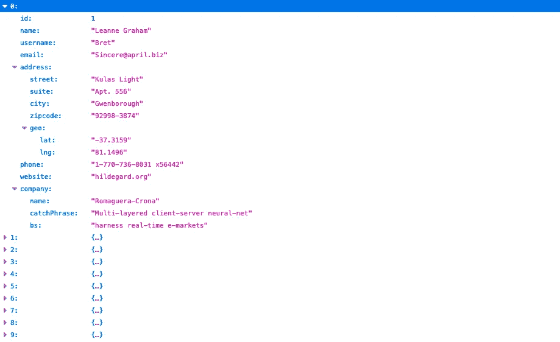
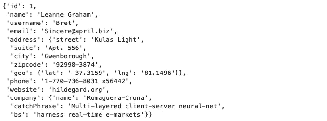
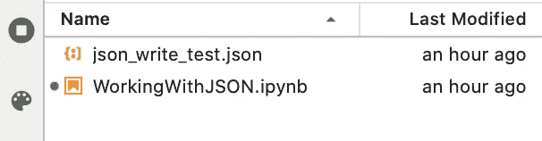
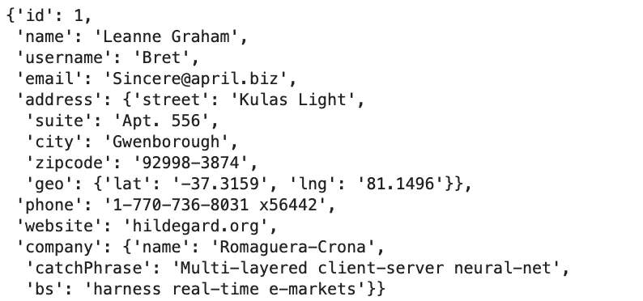
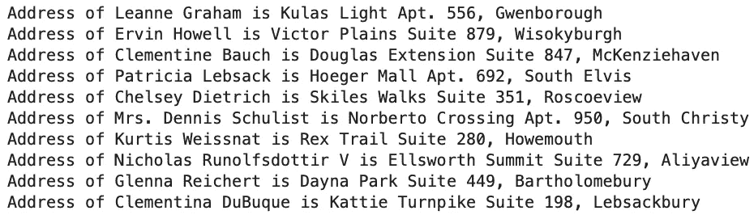
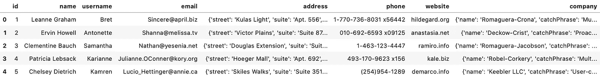
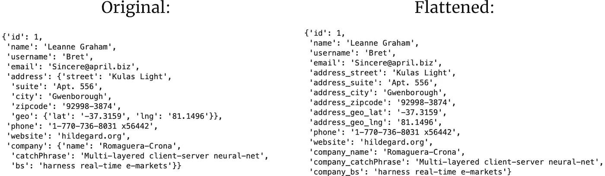
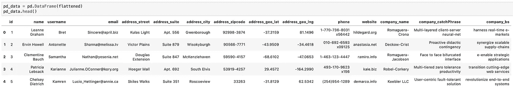

# JSON 为 Python 用户解释:数据科学版

> 原文：<https://towardsdatascience.com/json-explained-for-python-users-data-science-edition-18e9859944da?source=collection_archive---------18----------------------->

## 使用 JSON 数据是不可避免的——让我们正确地学习它。

JSON 数据无处不在。它仍然不是数据科学家最广泛使用的数据格式，因为数据集存储在 CSV 或数据库中。今天，您将学习如何处理 JSON，以及如何在您的数据科学项目中使用它。


安德斯·吉尔登在 [Unsplash](https://unsplash.com?utm_source=medium&utm_medium=referral) 上的照片

*但是 JSON 是什么？*

好问题。JSON 代表“JavaScript 对象表示法”，是一种简单且众所周知的数据格式。一旦你习惯了括号，人类很容易读写。此外，每一种主要的编程语言本身都支持它。

JSON 类型建立在两种数据结构之上:

1.  对象—键/值对的集合
2.  数组-值列表

并且使用起来非常简单。

这是一篇没有废话的文章，目标是尽快让你的手脏起来。我们一会儿将连接到一个实际的 API，然后讨论基础知识。稍后您将看到我最喜欢的 JSON 功能，从数据科学的角度来看。

我们开始吧。

# API 连接

如果您还没有启动笔记本电脑环境，请启动它。我们现在将只使用**请求**库:

```
import requests
```

让我们先来探索一下 API。它可以在[此链接](https://jsonplaceholder.typicode.com/users)上找到，包含一些用户的虚拟数据。完美满足我们的需求。



让我们把它装进去，好吗？这个过程很简单，就像 Python 中的大多数东西一样:

```
req = requests.get(‘[https://jsonplaceholder.typicode.com/users'](https://jsonplaceholder.typicode.com/users'))
req**>>> <Response [200]>**
```

这个 200 状态代码意味着请求已经成功，我们已经准备好处理数据了。让我们将 JSON 数据存储到一个单独的变量中:

```
users = req.json()
users[0]
```



你看到这有多简单了吗？

现在让我们来看看**用户**变量。我已经指出 JSON 是建立在两种结构上的——对象和数组——让我们看看这种说法是否成立:

```
type(users)**>>> list**type(users[0])**>>> dict**
```

它成立——因为列表和数组是同义词(ish ),而字典可以被解释为对象。接下来将讨论保存和加载 JSON 数据。

# 保存和加载数据

我们可以使用纯 Python 功能来保存和读取 JSON 数据。以下是如何实现节约的方法:

```
import jsonwith open(‘json_write_test.json’, ‘w’) as f:
    json.dump(users, f, indent=4)
```

**indent** 参数是可选的，它表示单个选项卡应该有多大。非常类似于 Python 的 4 空格缩进语法。我们可以验证文件是否确实被保存了:



读取过程非常相似——我们只需要从写模式切换到读模式，并使用 **load()** 函数，而不是 **dump()** :

```
with open(‘json_write_test.json’) as f:
    data = json.load(f)
```

我们可以再次验证该过程是成功的:



这几乎涵盖了阅读和写作。

# 使用 JSON

这将是一个简短的部分。*为什么？*因为使用 JSON 就像使用 Python 字典一样。我来详细说明一下。

默认情况下，JSON 数据不是 Python 字典的数组。但是当加载到 Python 中时，就变成了一次。因此，我们可以将 JSON 数据视为字典列表。

**这里有一个例子:**我们想打印每个用户的姓名和完整地址，不包括邮政编码。这很简单:

```
for row in users:
    print(f”Address of {row[‘name’]} is {row[‘address’][‘street’]} {row[‘address’][‘suite’]}, {row[‘address’][‘city’]}”)
```



这篇文章看起来有点乱，但是只要把代码复制到你的笔记本上就可以了。你马上就会明白它的要点。这是你应该知道的。下一节将介绍我最喜欢的处理 JSON 的方式——数据科学方式。

# JSON 扁平化

用像*熊猫*这样的库读取 JSON 数据有时会有问题。如果没有嵌套(对象中的对象)，那么一切都会好的。大多数真实世界的数据是嵌套的，我们需要以某种方式解决这个问题。

下面是将我们的 JSON 数据加载到一个 *Pandas 数据帧*时会发生的情况:

```
pd_data = pd.DataFrame(data)
pd_data.head()
```



在**地址**列之前看起来还不错，在那里地址本身被分成街道、套房、城市和邮政编码。同样适用于**公司**栏。

但是我们如何解决这个问题呢？

前段时间我使用定制库进行 JSON 扁平化，但是有几次它们并没有像宣传的那样工作。这就是我想出这个函数的原因，得到了堆栈溢出的一点帮助:

```
def flatten_json(json):
    output = {}

    def flatten(inpt, name=’’):
        if type(inpt) is dict:
            for elem in inpt:
                flatten(inpt[elem], name + elem + ‘_’)
        elif type(inpt) is list:
            i = 0
            for elem in inpt:
                flatten(elem, name + str(i) + ‘_’)
                i += 1
        else:
            output[name[:-1]] = inpt

    flatten(json)
    return output
```

该函数几乎是不言自明的，必须应用于数据的每一行。如果您有一个 100 个 JSON 对象的数组，您不能只将函数应用于数组本身，而是要应用于数组的每个元素。方法如下:

```
flattened = [flatten_json(row) for row in data]
```

以下是现在数据的不同之处:



原始和展平数据的第一条记录

注意展平的数据中没有缩进，以及所有以前嵌套的元素现在都有前缀。

转换到 Pandas 数据帧的过程现在按预期工作:



今天到此为止。让我们在下一部分总结一下。

# 在你离开之前

我使用过的大多数 API 都以 JSON 或 XML 的形式返回数据——这由您来选择。JSON 要简单得多，至少在 Python 中是这样。

您还可以将 JSON 存储在数据库中:

*   SQL 数据库的 LOB 格式
*   NoSQL 数据库的“原始”格式

但那是以后的事了。感谢您的阅读，希望对您有用。

*喜欢这篇文章吗？成为* [*中等会员*](https://medium.com/@radecicdario/membership) *继续无限制学习。如果你使用下面的链接，我会收到你的一部分会员费，不需要你额外付费。*

[](https://medium.com/@radecicdario/membership) [## 通过我的推荐链接加入 Medium-Dario rade ci

### 作为一个媒体会员，你的会员费的一部分会给你阅读的作家，你可以完全接触到每一个故事…

medium.com](https://medium.com/@radecicdario/membership)