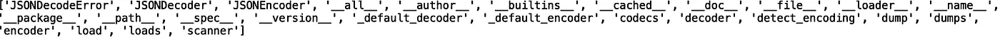
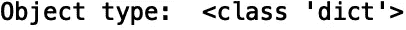
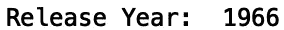
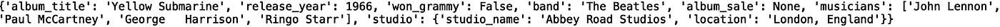
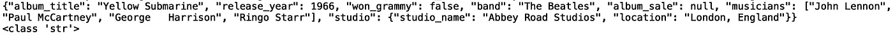

# Python 中的 JSON 对象

> 原文：<https://towardsdatascience.com/json-objects-in-python-f45e04281c30?source=collection_archive---------16----------------------->

## Python 中 JSON 对象的介绍


[来源](https://www.pexels.com/photo/macbook-pro-iphone-cup-desk-7974/)

Java Script Object Notation (JSON)是一种轻量级数据格式，与 python 字典有许多相似之处。JSON 对象非常有用，因为浏览器可以快速解析它们，这对于在客户机和服务器之间传输数据非常理想。在本帖中，我们将讨论如何使用 python 的 JSON 库来发送和接收 JSON 数据。

我们开始吧！

首先，让我们来看看下面这个 JSON 包，里面有关于甲壳虫乐队的专辑*黄色潜水艇*的信息:

```
{
     "album_title" : "Yellow Submarine",     
     "release_year" : 1966,   
     "won_grammy" : false,
     "band" : "The Beatles",
     "album_sale": null
     "musicians" : ["John Lennon", "Paul McCartney", "George   Harrison", "Ringo Starr"],
     "studio" : {"studio_name": "Abbey Road Studios", "location": "London, England"}
     }
```

在 JSON 对象中，键是字符串，值可以是字符串、数字(浮点数或整数)、布尔值、列表、null 或其他 JSON 对象。从这个例子中可以看出 python 字典和 JSON 对象之间有一些差异。例如，布尔值为小写，而“无”值为“空”。python 字典的等价形式是:

```
{
     "album_title" : "Yellow Submarine",     
     "release_year" : 1966,   
     "won_grammy" : False,
     "band" : "The Beatles",
     "album_sale": None
     "musicians" : ["John Lennon", "Paul McCartney", "George   Harrison", "Ringo Starr"],
     "studio" : {"studio_name": "Abbey Road Studios", "location": "London, England"}
     }
```

现在，让我们将示例 JSON 数据保存到一个名为“album.txt”的文本文件中。我是使用终端命令行和“vim”文本编辑器来完成的，但是您也可以使用任何您喜欢的工具。接下来，在 python 脚本中，让我们导入 JSON 模块:

```
import json
```

让我们使用“dir()”方法来看看本模块中可用的方法:

```
print(dir(json))
```



我们将重点关注加载和转储方法。要继续，让我们使用 open 方法打开文件。在 open 方法中，让我们指定文件名“album.txt”和模式(读或写)。我们将读取文件，因此模式为“r”:

```
album_json_file = open("album.txt", "r")
```

接下来，我们可以使用 load 方法从我们的文件中加载 JSON 数据:

```
album = json.load(album_json_file)
```

加载 JSON 数据后，我们关闭文件:

```
album_json_file.close()
```

我们现在可以打印加载的 JSON 数据了:

```
print(album)
```


如果我们打印这个对象的类型，我们会看到它是一个 python 字典:

```
print(type(album))
```



让我们看看 JSON 对象和 python 字典之间的区别。JSON 对象中的' won_grammy '值是' false '，而在字典中是大写的' False '。此外,“album_sale”值 Null 在 python 字典中被解析为“None”。

既然我们已经将数据加载为一个字典，我们可以通过键访问解析后的字典中的值。例如，如果我们想要访问“相册标题”,我们执行以下操作:

```
print("Album Title: ", album['album_title'])
```


或者如果我们想查看专辑发行的年份:

```
print("Release Year: ", album['release_year'])
```



在客户机/服务器应用程序中，JSON 对象通常以字符串的形式出现。例如，我们用于相册信息的 JSON 对象可以是这样的:

```
album_string = """{"album_title" : "Yellow Submarine",
     "release_year" : 1966,
     "won_grammy" : false,
     "band" : "The Beatles",
     "album_sale": null,
     "musicians" : ["John Lennon", "Paul McCartney", "George   Harrison", "Ringo Starr"],
     "studio" : {"studio_name": "Abbey Road Studios", "location": "London, England"}
     }"""
```

为了使用 JSON 模块加载这些数据，我们使用' loads()'方法:

```
album_s = json.loads(album_string)
album_string.close()
print(album_s)
```



现在，假设我们从字典格式的数据开始，并希望将这些数据以 JSON 格式发送到数据库。我们可以使用 dumps 方法将字典转换成字符串 JSON 对象。让我们定义我们的原始字典:

```
album2 = {'album_title': 'Yellow Submarine', 'release_year': 1966, 'won_grammy': False, 
 'band': 'The Beatles', 'album_sale': None, 'musicians': ['John Lennon', 'Paul McCartney', 'George   Harrison', 'Ringo Starr'], 
 'studio': {'studio_name': 'Abbey Road Studios', 'location': 'London, England'}}
```

接下来，让我们使用 dumps 方法打印字符串 JSON 对象:

```
print(json.dumps(album2))
print(type(json.dumps(album2)))
```



我们的字典被正确解析为一个字符串 JSON 对象。我们看到“album_sale”值“None”现在为“null”，而“won_grammy”值“false”现在为“False”。

最后，我们可以把这个 JSON 对象写到一个。txt '文件使用转储方法:

```
file2 = open("album2.txt", "w")
json.dump(album2, file2)
```

我就讲到这里，但是您可以自己随意摆弄代码。

## 结论

总之，在这篇文章中，我们讨论了如何使用 python JSON 库发送和接收 JSON 数据。我们讨论了帮助我们接收数据的加载方法和帮助我们发送数据的转储方法。如果你有兴趣学习更多关于在 python 中使用 JSON 对象的知识，我推荐[苏格拉底的 YouTube 教程](https://www.youtube.com/watch?v=pTT7HMqDnJw)。我希望你觉得这篇文章有用/有趣。这篇文章的代码可以在 [GitHub](https://github.com/spierre91/medium_code/blob/master/basic_python/json_tutorial.py) 上找到。感谢您的阅读！