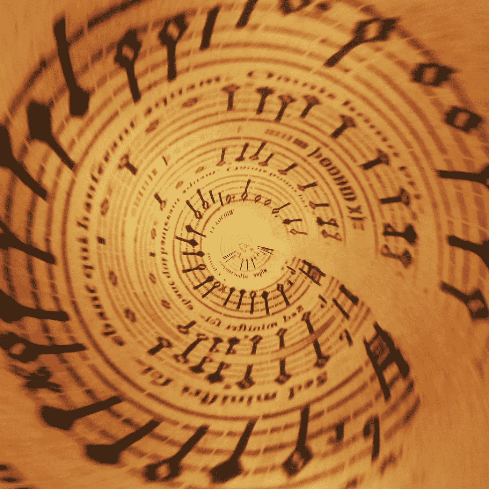
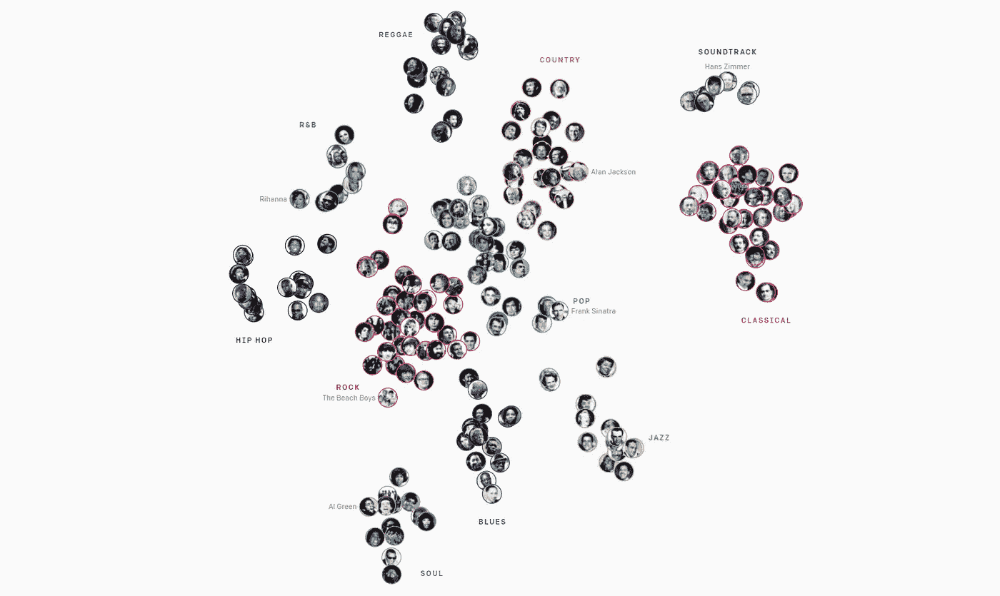
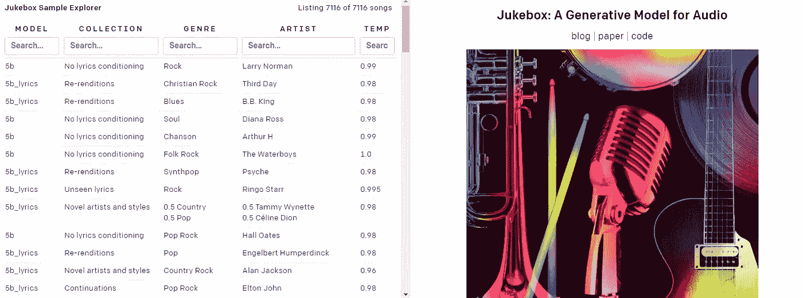
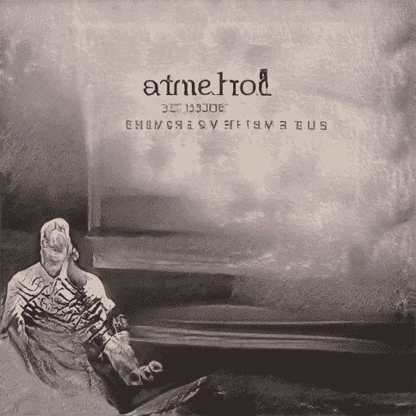
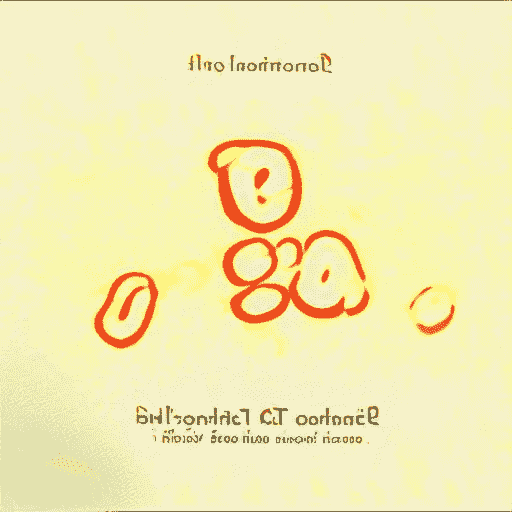
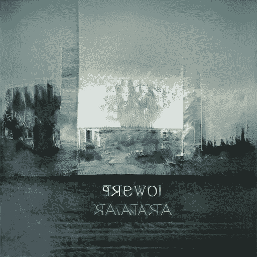

# OpenAI 的点唱机。

> 原文：<https://towardsdatascience.com/jukebox-by-openai-2f73638b3b73?source=collection_archive---------9----------------------->

## 人工智能生成音乐的魅力(附样本和 Colab 笔记本)

作者图片

# 点唱机——人工智能作曲家。

如果你仔细听，你会听到它们:来自另一个世界的声音。我听到了。嗯，不是直接，而是用点唱机。

JukeBox 是一个生成音乐的[神经网络](https://openai.com/blog/jukebox/)，一个由 OpenAI 团队实现的项目。他们开发了神经框架，并对不同音乐家、作曲家和乐队的 120 万首歌曲和音乐片段进行了训练。

这是一张音乐家地图:

来源:【https://openai.com/blog/jukebox/[(截图:作者)](https://openai.com/blog/jukebox/)

已经有各种各样的方法和人工智能驱动的模型来产生音乐，但直到现在，他们仍然能够创造出一些 MIDI 质量的旋律。

例如，这首曲子是我用 TensorFlow powered Magenta 框架的 Piano Transformer 创作的(试用: [Colab Notebook](https://colab.research.google.com/notebooks/magenta/piano_transformer/piano_transformer.ipynb#scrollTo=tciXVi5eWG_1) )

**钢琴变形金刚**像 GPT-3 中的变形金刚一样，使用了自我关注，这给旋律带来了一些内在的连贯性，相当具有算法张力(嗯，JS 巴赫也用算法创作了他的赋格曲)。

**JukeBox** 使用变压器，但有另一种方法:对音频数据进行采样和上采样。这确实意味着，这个音乐模型“知道”各种风格和声音听起来如何，并写出它的解释。作为音频文件。

我在关于使用人工智能制作播客的教程中写过关于点唱机和其他音乐模型的内容:

在这篇文章中，我想与你分享我的一些惊人发现。

# 它是如何工作的？

在“ [DEVS](https://www.imdb.com/title/tt8134186/) ”系列中有一个激动人心的时刻，科学家们对不可能的事情有了越来越清晰的认识——随着每一次迭代，他们都能越来越好地看到不可思议的事情。

使用点唱机你可以体验类似的感觉。有一款[官方 Colab 笔记本](https://colab.research.google.com/github/openai/jukebox/blob/master/jukebox/Interacting_with_Jukebox.ipynb)可以用。

但也有 Colab 笔记本，[SMarioMan](https://colab.research.google.com/github/SMarioMan/jukebox/blob/master/jukebox/Interacting_with_Jukebox.ipynb)增强，( [GitHub](https://github.com/SMarioMan) )。它允许你在谷歌硬盘上存储数据——以防你的笔记本电脑崩溃。因为你需要时间来创作音乐——长达 8-10 个小时。

这里有一个由 **Broccaloo** 制作的关于使用点唱机的非常有用的视频教程:

首先，你需要定义一个艺术家和流派。你可以在 OpenAI 生成的巨大的人工智能音乐播放列表中找到 JukeBox 训练的所有艺术家和流派:

 [## OpenAI Jukebox 示例资源管理器

### 浏览所有样品

jukebox.openai.com](https://jukebox.openai.com/) 

点唱机播放列表，作者截图

**第二次**，在 10-30 分钟内 ***(第 2 级)*** 生成几个样本(默认为 3 个项目)。如果你不喜欢，你可以重新播放。

**第三个**，生成您满意的样本— **升级*(1 级和 0 级)*** 。这需要时间，有时是半天。有时笔记本崩溃(连接中断，谷歌服务器问题等。等等。).但是如果你使用 SMarioMan 的笔记本，你所有的进展都存储在你安装的 GoogleDrive 中——你可以继续使用那里保存的检查点。

Colab 笔记本还能做什么？你可以…

*   **重采样**现有的音乐片段(AI 可以从指定的时间点继续)
*   尝试选择不同的**艺术家和流派**
*   **高档**已经完成的音乐作品质量更好
*   输入你的短信，运气好的话，人工智能生成的歌手会表演出来。

同时，我们可以观察到非常有趣的结果。跟随莱昂纳多·古铁雷斯，他对点唱机做了很多实验。利用我们对 AC/DC 歌词的共同改写，他创作了一个新版本的“在黑暗中拍摄”:

布罗卡罗(他在上面做了一个非常有用的视频教程)也做了有趣的实验:

Discord 上甚至有一个点唱机用户的粉丝社区:

 [## 加入点唱机 AI 不和谐服务器！

### 查看 Discord 上的点唱机 AI 社区-与 469 名其他成员一起玩，享受免费的语音和文本聊天。

discord.com](http://discord.com/invite/6At7WwM) 

# **来自异次元的声音。**

点唱机上最让我着迷的是什么？不完全是模仿现有的表演者或演绎著名的作品，而是发现隐藏的宝石。机器的音乐幻觉。独特的声音景观。

恐怖谷已经过时了。这不再是一种怪异或令人毛骨悚然的感觉——这是遇到人工美学的幸福。

事实上，这些作品都是独一无二的:每一次都有一首新的前所未有的音乐作品产生——而且你可以肯定(就像 GPT 3 号的)这个序列永远不会重复。只是给你的。只有现在和这里。

我的第一次实验让我起鸡皮疙瘩。第二层已经很特别了，不是真正的音乐作品。越是向上采样，它就变得越迷人和清晰:

*二级:*

*一级:*

*0 级:*

听起来…很奇怪。就像记录一个未知国家和未知文化的配乐。

的确，点唱机完美地模仿语言。它可以解释你预先设定的文本，但它也可以产生一种语言的音乐解释。

你可以把它和 StyleGAN2 相比，style gan 2 解释文字的视觉效果而不是语义:

由 StyleGAN2 驱动的[art breader](/artbreeder-draw-me-an-electric-sheep-841babe80b67?source=friends_link&sk=2fff2b9e102ce632d725e58bfa4c67dd)生成的图像(我将它们用作虚构的 AI 相册的封面)，由作者生成的图像

称之为 **Brut Art** ，称之为 **Glitch Art** ，但是 JukeBox 生成的一些音频样本却异常强烈。这里是我最喜欢的一些，我非常想知道你对它的看法？

# 你从未听过的声音。

除了上面的电影配乐，我还有几首音乐特别吸引我的兴趣。暂时忘记机器学习和理论。只要闭上眼睛，听音乐，保持对各种音频现象的关注。为了获得最佳体验，我建议使用耳机。

## **赛博布鲁斯/自由风格爵士乐**

点唱机非常适合爵士乐。尤其是充满了同步和变调的自由式或实验性作品。上面的第一个片段也是用声音传递的——你可以识别单词，你也可以听到它模仿英语，但那是唯一的模仿。第二张唱片也有鼓舞人心的*大乐队*氛围——乐器的音质令人惊叹。

现象:你在这里观察到的另一个令人兴奋的现象——大部分生成的音乐片段已经完成作曲。它们不会在你设置好音乐长度的那一秒突然结束(至少不是全部)。同样的音乐变压器使旋律连贯的工作往往能使优雅的音乐结束。

**声音**

听听这把木吉他——你甚至可以听到吉他琴弦的刮擦声，仿佛这里不仅产生了音乐，还产生了音乐家。

现象:在上面的例子中，你会观察到(0:27 分钟)一些尖锐的音调，好像有人在鼓掌。只有两次——从现在开始，旋律节奏与这次鼓掌一致。变压器转换音乐，而不破坏其声学美学。

## 中世纪音乐剧

这很特别:闭上眼睛，你会想象一个有演员的舞台，他们的表演，甚至观众的反应。

**现象:**听这首曲子你有什么想象？我几乎看到一个欢闹的国王伴着喇叭声入场(伴随着观众的笑声)，然后在一些*柴可夫斯基的*样本之后是一首情歌(结尾是主角唱“给你！.."(他可能会在他的女士面前跪下)，公众无法用热烈的掌声、笑声和口哨来掩饰自己的情绪。一个不存在的戏剧表演的非常有机和现实的视觉。

## 在峡湾中歌唱

这首曲子是在*玛丽莎·纳德勒*上训练的，但在开始时，一个女孩的声音用一种不存在的语言演唱。独奏结束后，铿锵有力的音乐开始，脆弱的声音变得浑厚。

现象:强度、回声和气氛令人无法抗拒。我使用的是由 [RoseBud 提供的](https://www.rosebud.ai/) [TokkingHeads](https://talkingheads.rosebud.ai/) 服务。AI (实现 i.a. [一阶运动模型](/first-order-motion-model-ab3908407208?sk=e8772741be0db5da9e3f9af5ec392ffc))来可视化该性能:

**观察:**点唱机产生独特的风格和语言，可以帮助音乐家和作曲家获得新的令人惊讶的想法和灵感。

## 我没有任何问题(如特雷西·查普曼所唱)

在这两个版本中，我选择了*特雷西·查普曼*作为表演者。正文是 GPT 为我写的——3:

 [## 一块石头和一首诗

### 非人类诗歌

thecreative .咖啡馆](https://thecreative.cafe/a-rock-and-a-poem-8e14a791a092) 

这很有效 Tracy 演唱人工智能生成的歌词的独特声音(我爱上了这首 GPT 3 的诗)。

现象:就像在其他人工智能生成的歌曲中一样，即使你为歌唱指定了歌词，人工智能也不一定会服从并使用你的文本。有时——甚至经常——它用额外的语言错误来扩充文本。这种意想不到的和个人的随机性再次证明，人工智能作为一个创造性的实例，肯定不仅仅是一些算法音乐预测方法。

## 人生不过是一场梦

为了这首歌，我训练点唱机上的童谣“*划划划你的船*”和*吉米·卡伦*作为表演者。还是那句话，你不仅能听到著名韵文的正文，还能听到一些语言故障。

**现象:**在这个案例中，给我留下深刻印象的不仅仅是声音的爵士配乐和强大的瘴气。但也是无意的，但完美实现的省略号:“仅仅，仅仅，仅仅，仅仅”……而小船正漂向光的海洋。

**观察:**点唱机可以给我们有趣的音乐隐喻的想法。

顺便说一句。这是另一个版本的“*划你的船”*，听起来更像是一首爵士冷战情歌*“来自俄国的爱”*:

## 管弦乐队的陷阱

这首乐曲听起来令人震惊——它以实验性的管弦乐声音开始，残酷而尖锐的尺八或萨克斯管音调，其他乐器加入了不和谐的声音，但随后出现了和声合唱。

如果我没有从 JukeBox Notebook 获得这首音乐，我会认为它是 UbuWeb 音频部分的某首音乐杰作。

**现象:**在吉米·卡伦接受训练，但在“经典音乐”流派中带来了有趣而独特的结果——训练基地再也认不出来了。混合方面会导致令人惊讶的效果。

如果你想听更多:收听我的每日 [#LatentVoices](https://twitter.com/hashtag/LatentVoices) 频道，或者查看我在 Soundcloud 上的[#自动点唱机播放列表](https://soundcloud.com/merzmensch/sets/ai-music)。

或者创作你的音乐并在这里与我们分享。