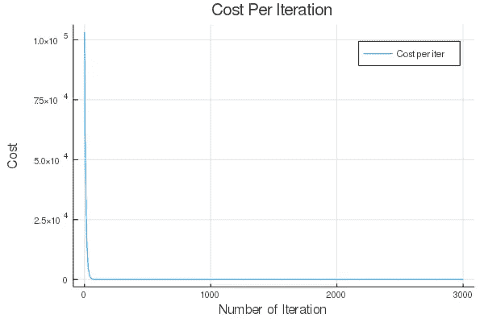

# Julia 负责数据科学

> 原文：<https://towardsdatascience.com/julia-for-data-science-how-to-build-linear-regression-from-scratch-with-julia-6d1521a00611?source=collection_archive---------29----------------------->

## 在 Julia 中从零开始建立具有梯度下降的多元线性回归


图片来源:[朱丽亚话语](https://discourse.julialang.org/t/open-graph-image-for-the-julia-repository/23384)

目前，Python 和 R 无疑是机器学习领域使用最广泛的编程语言。不幸的是，这些编程的高级和优雅的抽象通常是有代价的，尤其是在处理大型系统时。在我们开始之前，这篇文章不会对 Python 或 R 进行无休止的抨击，所以任何有这种期望的读者都应该去别处看看。相反，这篇文章旨在启发和告知读者 Julia 可能会加入他们的工具箱。归根结底，所有这些编程语言都只是具有不同用例的工具。

## 朱莉娅到底是什么？

[Julia](https://julialang.org/) 被描述为一种动态编程语言，它专注于高性能，即使是高级抽象。因此，这种语言非常适合数字和科学计算。2009 年，4 名计算机科学家(其中 3 人的照片如下)共同创造了 Julia。


Juila 图像信用的共同创造者:麻省理工学院新闻

## "说话像 Python，走路像 C ."

这一行是最常用的引用之一，总而言之，这是这种编程语言的主要优点。有些读者可能读过关于臭名昭著的“*两种语言问题*”的报道。对于门外汉来说，这两个语言问题简单地描述了这种情况；

> 开发人员必须用 C/C++等低级语言重新编写代码库的关键和性能部分，因为 Python/R 等高级语言由于其高级抽象而在某些任务上可能会很慢

在 Python 和 r 等高级语言中，快速构建新想法的原型相对更容易。这些语言在数据科学生态系统中占据如此主导地位的一个主要原因是，数据科学生态系统严重依赖于尽快尝试新想法。这里的折衷(就速度而言)对于中小规模的应用程序来说是可以接受的，但是对于大规模的系统和应用程序来说非常明显。

Julia 被称为可以解决这种双语言问题的语言，它提供了 Python/R 这样的高级语言的友好性，同时匹配 C/C++这样的低级语言的速度。

gif 信用:[https://giphy.com](https://giphy.com/gifs/how-H6JdkRnhXQaImiCYp2/media)

## "足够的速度基准，告诉我如何使用它！"

我听说过朱莉娅，但我总是想知道它的用法。有 Python/R 那么简单吗？

这篇文章简单地通过使用 Julia 的梯度下降从零开始构建多元线性回归来测试这个断言。我使用 Python 和 R 已经有几年了，所以我决定看看用 Julia 来快速解决这样的任务有多快。这篇文章不是 Julia 和其他语言之间的基准测试，因为这样的测试已经被很好地覆盖了，而是关注于这种语言对那些习惯于 Python/R 的人的用户友好性。

## 数据

将用于该测试的数据集是来自 UCI 数据仓库的[联合循环发电厂数据集](https://archive.ics.uci.edu/ml/datasets/combined+cycle+power+plant) ( *Sheet5* )。这里的目的是生成一个模型，该模型可以根据 4 个数值(连续)特征预测***【EP】***:

*   **温度(AT)** 在 *1.81 摄氏度*和 *37.11 摄氏度*范围内。
*   **排气真空(V)** 在*25.36–81.56*厘米汞柱范围内。
*   **环境压力(AP)** 在*992.89–1033.30*毫巴范围内。
*   **相对湿度**在 *25.56%到 100.16%的范围内。*

## 建模工作流

这个实验的攻击计划就像一个典型的建模工作流，其中数据将是:

*   **加载到内存**:数据以 DataFrame 对象的形式加载到内存中，大多数读者对这段代码已经很熟悉了:

*   **为算法进行预处理:**随着数据成功加载到内存中，现在让我们将它分成一个训练和验证集，使用比例 *80%* 用于模型的训练，保留 *20%* 用于生成模型的评估。下面的代码片段实现了这个功能(但是更健壮的方法是打乱索引)。我们的目标是快速启动并运行，所以这就足够了。

正如您可能已经注意到的，这些特征处于不同的标度(从百分比到毫巴)，这对于大多数算法来说可能是有问题的，因此常见的做法是标准化特征，以便它们可以处于相同的“*标度*”。下面代码片段中的两个函数用于标准化训练和测试特性。

我们的数据现在已经过预处理，可以进行建模了。

*   **模型拟合&评估**:这里的目标是找到一个线性模型，最好地最小化良好的旧均方差函数。我们的均方成本函数本质上是一个半均方函数，其定义如下:

定义好成本函数后，让我们使用梯度下降法为每个特征(包括常数)找到最佳权重，使成本函数最小化。下一个函数负责处理这个问题:

***NB*** *:这个实现实现了没有正则化的梯度下降(我鼓励你添加到你自己的实现中)。*

现在，让我们通过绘制成本历史向量𝐉:来检查梯度下降是否有效并最小化我们的成本函数



每个时期的成本

从图中可以看出，随着迭代次数的增加，成本下降，直到在某个点持平。看来梯度下降在寻找最小化我们的成本函数的权重方面做得很好。

gif 信用:[https://giphy.com](https://giphy.com/gifs/how-H6JdkRnhXQaImiCYp2/media)

现在是时候做一些预测并评估我们新的闪亮回归模型的性能了。两个新函数用于生成预测并对训练和测试数据集进行评分。

从评分函数来看，训练集和测试集的**均方根误差** ( **RMSE** )为:

```
**RMSE** for Training Set: **4.578258826855693**
**RMSE** for Testing Set: **4.473104537374325**
```

现在让我们看看模型在两个数据集中的预测能力(根据 **R 平方值**),以及该函数:

```
**Training R²** score for test sets: **0.9274046053983883**
**Testing R²** score for test sets: **0.9335248094191678**
```

这些分数似乎表明，一些像样的预测能力( **0.927 & 0.934** )！

gif 信用:[https://giphy.com/](https://giphy.com/)

然而，测试分数优于训练分数，这似乎表明该模型对数据拟合不足。修改阿尔法项( *α* )和/或迭代次数( *n_iter* )应该可以从这个模型中挤出更多的性能，但是我将让读者自己去修改。

## 基于这个朱莉娅实验的好恶

从这个实验中，我基于之前与 Python 和 r 的互动，自然对 Julia 有了一些好恶。

**喜欢**

*   本地 Unicode/符号支持:我最喜欢的 Julia 无疑是它对 Unicode 和科学符号的本地支持。在脚本中使用' *θ* 而不是'*θ*'，使用'α'而不是' alpha '，这很酷也很简洁。这是一种为科学/数字计算而从头开始构建的语言！我发现每次我不得不使用科学记数法时，我都在微笑。
*   一种语言的语法在它快速将思想原型化的能力中起着关键的作用。Julia 的语法和 Python 没什么区别。就语法而言，Julia 感觉自己是 Python 和 Matlab 之间的私生子。在大多数情况下，我需要快速查找文档，以避开一些糟糕的语法调用。此外，用真正的科学符号分享和阅读科学代码是非常容易的！
*   **对现有 Python/R 生态系统的支持:**作为一门年轻的语言，预计生态系统中会缺少一些急需的包。然而，令人耳目一新的是，现有的 Python/R 包可以在 Julia 中使用。这种功能让朱莉娅享受成熟的生态系统的好处，并避免不必要的重新发明某些车轮。

**不喜欢**

*   **缓慢的预编译时间:**与 Python/R 相比，人们注意到的第一件事是在 Julia 中加载包所花费的时间。每次加载包都需要预编译，这确实需要一些明显的时间(*超过 10 秒*)。对于习惯于即时导入包的 Python/R 用户来说，这可能会令人沮丧。
*   **年轻的语言/生态系统**:无论是 Python 还是 r，几乎都有一些常见的数据角力任务的包，Julia 作为一个新人，自然没有老牌语言享有的那么原生丰富的生态系统。然而，这个问题现在可以通过使用 PyCall & JuliaCall 包支持从 Python 和 R 导入来解决。
*   **缺乏传统的 OOP 支持:**Python 对于数据科学应用程序的魅力和广泛采用的部分原因是它用面向对象编程构造函数的简洁而方便的方式。例如，如果所有预处理功能以及所有学习到的参数都可以在一个类中获得，那将是非常简洁的。Julia 采用了" [*多重分派*](https://en.wikipedia.org/wiki/Multiple_dispatch) "范例，这有助于它比其他高级语言更快。

## 结论

Julia 是一种很有前途的语言，它是为数字和科学计算而从头开始构建的。在这篇文章中，我已经展示了在 Julia 中建立原型相对容易，并成功实现了使用梯度下降的多元线性回归。这是每一个数据至少应该保持的一种语言，并且是一个数字眼睛。对于 Julia 来说，有一些令人惊讶的数据科学软件包。拿些数据集，和 Julia 玩玩，让我知道你的想法？在我看来，启动并运行的最佳方式是安装使用 Atom 的 IDE 附带的 JuliaPro。

一如既往，我期待着反馈(好的或坏的！).这个博客的 [GitHub 库](https://github.com/PyDataBlog/Python-for-Data-Science)上可以找到这个[pos](https://github.com/PyDataBlog/Python-for-Data-Science/tree/master/Tutorials/power_plant_project)t 的所有功能的脚本。最后，你可以在我的个人博客上查看其他帖子。直到下一个帖子，祝你在茱莉亚编码愉快！