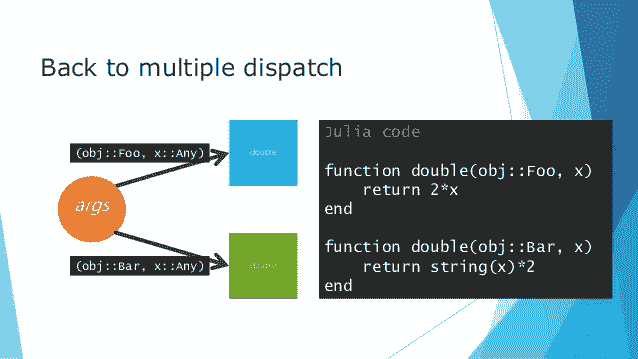
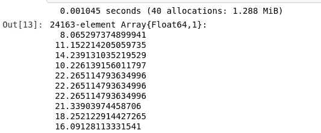
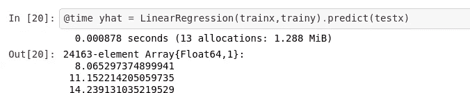

# Julia Oop Vs. Julia Dispatch:谁是速度王？

> 原文：<https://towardsdatascience.com/julia-oop-vs-julia-dispatch-who-is-the-speed-king-ed0fc809d0d1?source=collection_archive---------32----------------------->

## 这种拙劣的方法能打败朱莉娅稳健的调度吗？

[](/how-im-using-functional-oop-for-machine-learning-533c1d764628) [## 我如何使用面向对象的函数来进行机器学习

### 我如何以及为什么将面向对象的范例应用于 Julia 机器学习。

towardsdatascience.com](/how-im-using-functional-oop-for-machine-learning-533c1d764628) 

在我之前写的一篇文章中，我在 Julia 的机器学习包中取得了相当大的进步，车床，它允许在主要功能的多范例语言 Julia 中进行面向对象的编程。这个概念本身对 Julia 来说是非常独特的，因为构造的类型是在没有返回的情况下创建的，也没有通常用于构造该类型的结构。

不管这个概念有多有用，为了对已经存在了一段时间的软件做出重大改变，我认为测试是很重要的。车床的利基主要是机器学习大师，他们在寻找以下参数:

*   快的
*   使用方便
*   可扩张的
*   可攀登的
*   轻量级选手

这些是车床作为一个软件的支柱，任何修改都需要符合这些参数，并超过在一个或另一个参数中失去阵地的成本。在我们研究“新手”之前，让我们先看看车床目前使用的方法，

> 朱莉娅的派遣

# 我们拥有的

Julia 的 dispatch 是一种奇妙的方式，它使用一种泛型编程概念将方法作为结构的属性来应用，这种通用编程概念是从函数范式中建立起来的，并包含在 ML 编程语言参数多态性中。Julia 的 dispatch 没有使用典型的函数式方法(方法与存储在类型中的静态数据进行交互),而是本质上应用了一个通用规则，通过方法将流量导向语言本身。

## 快的

就速度而言，朱莉娅的调度肯定是最慢的。与使用条件或单个函数相比，使用轻量级调度可以使速度翻倍。首先，Julia 是一种考虑到速度而构建的语言，因此非常快，但是，将语言的自然速度与编写良好、调度良好的代码结合起来，可以使 Julia 在竞争中脱颖而出。

## 使用方便

使用 Lathe 中的当前解决方案，可以通过一个通用方法(predict()方法)轻松地分派类型，如下所示:

```
using Lathe.models: predict, FourSquare
yhat = predict(FourSquare(trainX,trainy), testX)
```

再加上内置的？()文档在车床，我相信这是比较直截了当的，易于使用。最重要的是，已经不太需要异常处理了，因为车床是与数据帧绑定在一起的。JL，并使用 Julia 的基类型。这是我在许多语言中见过的问题，包括 Julia，但最常见的是在 Python 中，因为 Python 作为一种统计语言具有可扩展和极简的特性(没有 Numpy 就没有多少线性代数，所以用其他东西构建的包会自动受到限制。)每当我试图通过列表函数传递 Numpy 数组，以及通过各种函数传递 Pandas 系列时，我肯定会遇到问题。

## 可扩张的

使用 Julia 的调度允许在显式导入时修改车床。我认为这是召唤一个一致的生态系统的巨大好处。与车床无关的包仍然有扩展车床功能的潜力。所有的扩展都可以很容易地使用 Julia 的调度来完成和重新路由，使得扩展车床变得简单明了。

## 可攀登的

作为一名数据科学家，对我来说最重要的事情之一是构建一些可以扩展到大型应用程序的东西，同时在较小规模的应用程序中也能做得很好。幸运的是，通过大量艰苦的工作，车床模型是可部署的，并且能够用 Genie 完全自动化。自动化的范围可以从再培训和序列化到测试。

## 轻量级选手

Julia 的调度相对简单，因为它需要三个关键部分:

*   派单本身(一行)
*   要分派到的函数
*   要分派给函数的类型

这是一个相对轻量级的解决方案，因为它不需要带有几个函数的大型类，而是让语言在使用数据进行实际计算方面对结构的属性负责。

# 已经很不错了

有了车床的所有这些支柱，让 Julia 进行面向对象编程的晦涩技巧有可能胜过 dispatch 吗？使用 dispatch 的最大问题是缺少初始化。缺少初始化意味着没有训练函数，任何计算出的值都需要在再次使用模型之前重新计算，这是很糟糕的。

然而，在很多情况下，这并不重要，因为 Julia 语言可以弥补我们的罪过。每当大型神经网络在车床的新神经网络框架内被训练时，这个问题就会出现。显然，不能在每次需要访问模型时都计算成本，保存值的状态对于缓解这个问题是绝对必要的。

除了能够在初始化时训练模型之外，测试这将对整体进行预测和调度数据以及扩展数据调度和允许数据变异的性能影响也很重要。

> 所以我们来测试一下吧！

# 设置

> [本次测试的开源笔记本](https://github.com/emmettgb/Emmetts-DS-NoteBooks/blob/master/Julia/Super%20struct%20vs%20dispatch%20performance.ipynb)

为了测试这种新的函数方法，我决定加载一个数据集，我坐在我的计算机上进行回归性能测试，正式名称为

> 天气历史. csv

我们可以在 using CSV.jl 中读取这个 CSV 文件:

```
**using** DataFrames, CSV
df = CSV.read("weatherHistory.csv")
```

由于 Julia 省略了列的打印，下一步是显示数据框中的每一列，这样我们就可以知道我们可以使用什么特征来预测特定的目标。我们可以使用 show()方法的参数 allcols (bool 类型)来实现这一点，该方法用于显示数据帧，如下所示:

```
show(df,allcols=true)
```

因为我们是在进行性能测试，所以我将我选择的两个特性，温度和湿度，分成两列数据帧。这将使查看数据变得更加容易，同时也使数据整体更加清晰。

```
df = DataFrame(:Temp => df[Symbol("Temperature (C)")], :Humidity => df[:Humidity])
```

接下来，我决定我的特性和目标，并使用符号通过变量名访问它们(例如，万一我们以后想改变特性):

```
target = :Temp
Feature = :Humidity
```

和训练测试分割:

```
**using** Lathe.preprocess: TrainTestSplit
train, test = TrainTestSplit(df)
```

现在它就像插入我们刚刚分配的变量一样简单:

```
trainx = train[Feature]
trainy = train[target]
testx = test[Feature]
testy = test[target]
```

现在让我们从车床模型中导入我们需要的东西，并预测:

```
**using** Lathe.models: predict, LinearRegression
```



现在使用相同的代码，但是采用超结构形式(我以前的文章给出了源代码):



一直以来，在一系列可能让我的 CPU 想提前退休的压力测试中，Julia oop 的表现超过了 Julia 的 dispatch。更令人吃惊的是分配减少了大约 67%(平均 70%(当重复测试时))，计算时间减少了大约 16%(平均 18%(当重复测试时))。

> 所以没错，确实是高效了很多。


# 结论

我认为这种新方法显示了很大的可伸缩性，然而，可能只是可扩展性概念中的一个弹孔。没有明确确定的类型，我们会冒方法普遍无法识别结构的风险，并且需要嵌入与类型相关的所有函数，这很不幸。另一个不幸的副作用是遗留代码的死亡。车床已经正式离开了长期的支持，0.0.1 已经从一开始，这是一种悲哀。幸运的是，我确实相信这种进步利大于弊，并且肯定会允许在预测建模的多个领域进行扩展。