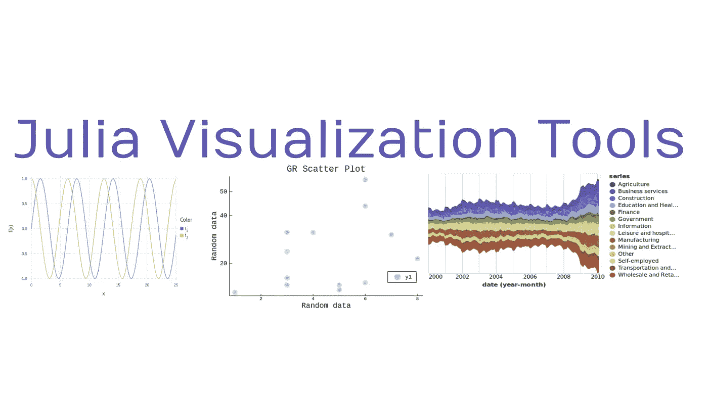
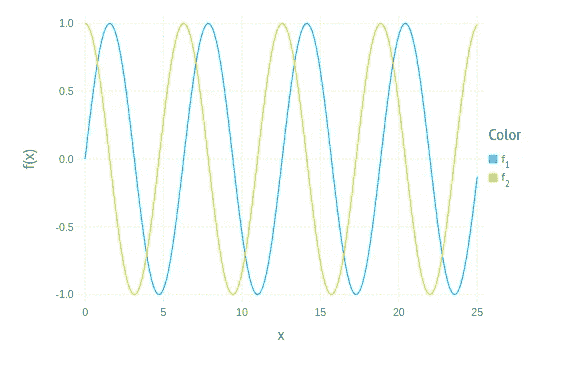
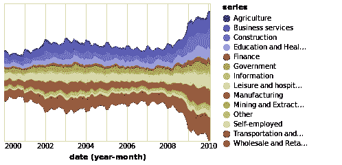

# Julia 可视化库:哪个最好？

> 原文：<https://towardsdatascience.com/julia-visualization-libraries-which-is-best-e4108d3eeaba?source=collection_archive---------11----------------------->

## 意见

## Julia 语言中常用的可视化库概述

(图片由作者提供)

# 介绍

Julia 编程语言是一种相对年轻的、新兴的科学和数值计算语言。虽然根据我的经验，Julia 客观上更快，主观上更有乐趣，但它的生态系统是短视的。Julia 的生态系统相对不成熟，主要当然是因为 Julia 是如此年轻的语言。也就是说，朱莉娅的生态系统正在快速进化。

在任何数据科学体系中，最重要的软件包之一是数据可视化软件。虽然 Julia 可能没有像 Bokeh 和 Plot.ly 这样最现代和最完善的 Python 库，但它在数据可视化方面确实有一些相对强大的选项。然而，对于新用户来说，这个新的生态系统可能有点令人生畏，并且很难选择正确的软件包。

# 我的偏好(前言)

关于图形库和一般的模块，我想解释的一件事是，有时有主观和客观的原因，人们可能更喜欢使用一个而不是另一个。也就是说，虽然这篇文章将主要关注客观点，但我的偏好肯定会在某个时候出现。

在 Julia 的三大数据可视化包中，有许多完全不同的方法在起作用。有时候，某些方法可能会被一些人喜欢，而被另一些人讨厌。说完这些，下面是我的结论和对当今三个最大的 Julia 语言绘图库的比较。

# Plots.jl

(图片由作者提供)

Plots.jl 是一个包，可以作为一个高级 API，用于处理几个不同的绘图后端。这包括 GR，Matplotlib。Pyplot，最后是 Plot.ly。该软件包主要用于 Julia 生态系统还不成熟，无法支持纯 Julian 图形架构的时候。话虽如此，但现在情况已经不同了——所以就可用性而言，我当然不会推荐 Plots.jl。

Plots.jl 的第一个也是最明显的缺陷是它本质上是其他软件的接口。有些软件还依赖 PyCall.jl，这意味着 Pyplot 和 Plot.ly 可视化的运行速度要比 Julian 软件包慢得多。此外，PyCall.jl 实际上比使用 Python 本身要慢，因此将 Plots.jl 与 Julia 一起使用，而不是将 Plot.ly 或 Pyplot 与 Python 一起使用，这为 Python 实现提供了客观优势。

这个包的另一个大问题是绝对荒谬的 JIT 预编译时间。这是一个问题的原因，因为需要编译三个不同的包，其中没有一个是本地的 Julia，模块才能工作。

另一方面，Plots.jl 的一个优点是它的可靠性和简单性。事实上，它依赖于古老的后端，这意味着这个包很少被破坏。Plots.jl 包也相对简单易用，尤其是使用默认的 GR 后端。如果你想学习更多关于使用 Plots.jl 的 GR 后端的知识，我在这里有一个完整的教程:

 [## 在 Julia 中美化您的 GR 可视化

### 没错，又是 Julia，我保证 R，Scala，Python 还在这个爱情圈里

towardsdatascience.com](/spruce-up-your-gr-visualizations-in-julia-88a964450a7) 

# 牛虻. jl

(图片由作者提供)

在某种程度上，牛虻. jl 是朱莉娅对 Plot.ly 的回答。从主观上来说，牛虻是该语言中我最喜欢的可视化库，但从客观上来说，与其他竞争模块相比，它也非常棒。牛虻通过 Javascript 集成产生了漂亮的交互式可视化效果，这是这个列表中的任何其他可视化软件包都无法真正感受到的概念。

牛虻也是用纯朱丽亚写的。与 Plots.jl 相比，牛虻预编译只需要几毫秒，并且可以在很短的时间内完成可视化。

虽然《牛虻》在这个列表中是我最喜欢的，但它也有一些明显的缺陷。首先，它不一定是最多样化的包。在可视化中很难得到你想要的确切的东西，因为用牛虻很难从头开始构建东西。也就是说，这个问题主要是 Javascript 实现的结果，并且主要是在与更静态的解决方案进行比较时才会感觉到。如果你想了解更多关于牛虻的信息，我这里有一整篇文章:

 [## 牛虻. JL——来自你梦中的纯朱莉娅绘图库

### 看看朱莉娅对 2020 年统计绘图的最佳选择

towardsdatascience.com](/gadfly-jl-the-pure-julia-plotting-library-from-your-dreams-3ee6ca107a5c) 

# VegaLite.jl

(图片由作者提供)

另一个为 Julia 准备的很棒的可视化软件包是 VegaLite.jl，VegaLite 可以被认为是对 Python 的 Seaborn 之类的东西的 Julian 回应。与牛虻类似，Julian VegaLite 实现是用纯 Julia 编写的。VegaLite 的伟大之处在于它的包容性和令人难以置信的活力。

虽然 VegaLite 可能没有牛虻的交互性，但它肯定是一个非常棒的可视化库，可以令人难以置信地定制。VegaLite 和牛虻之间的一个显著区别是 VegaLite 由组合在一起形成组合物的模块化部分组成。因此，VegaLite 是一个更加多样化的套餐，有很多选择。

# 结论

尽管 Julia 在过去没有最好的图形库实现，但很明显这正在迅速改变。不仅有新的纯朱利安选项可供使用，但他们也是相当神奇的选择。这三个中我最喜欢的通常是牛虻。这是因为我喜欢交互式可视化。牛虻的方法也非常简单，这使得用最少的努力就可以很容易地建立和运行一些可视化。也就是说，对于数据分析的深度可视化，VegaLite 可能是 Julia 程序员的最佳选择之一。