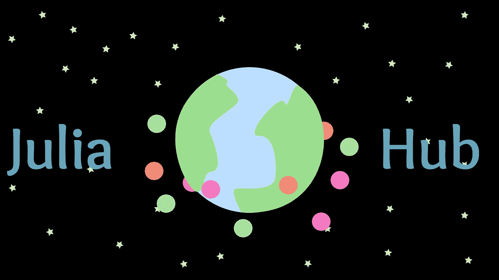
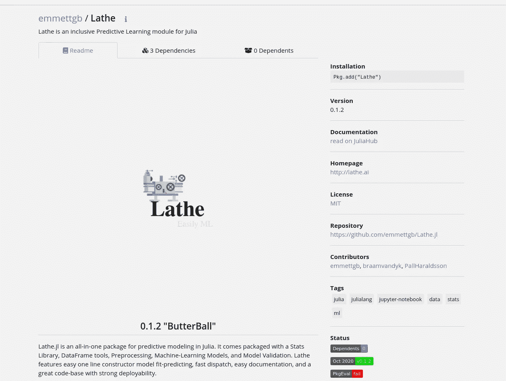

# JuliaHub:将包和文档放在一起的最好方法

> 原文：<https://towardsdatascience.com/juliahub-the-greatest-approach-to-putting-together-packages-and-documentation-707688a472d2?source=collection_archive---------55----------------------->

## JuliaHub 如何自动化所有程序员讨厌做的事情。

(图片由作者提供)

Julia 编程语言是一种年轻的、崭露头角的语言，它采用出色的方法来解决现代编程中的问题。首先，这种语言非常灵活，而且这种语言自带的所有标准软件背后都添加了非常强大的方法论，这使得这种语言变得更加流畅。这种想法可以在很多方面感受到，例如 Julia 对虚拟环境和依赖关系的抢先方法，这使得管理项目语言中的依赖关系变得轻而易举，而不管团队的规模如何。

Julia computing 的一个相当新的前沿功能是新的 Julia Hub 网站，它仍处于测试阶段。如果你想看看这个网站的现状，你可以点击这里查看:

 [## JuliaHub

### 编辑描述

juliahub.com](https://juliahub.com/ui/Home) 

每当注册一个 Julia 包时，将包添加到 Julia General registry 的 pull 请求是完全自动化的，由 Registrator.jl bot 完成，这已经非常方便了。每当软件包被添加到 Julia General registry 时，它们也被添加到可从 JuliaHub 网站访问的数据块中。

# 包搜索

有时候很难找到很棒的软件包来做特定的工作。JuliaHub 用自己的包浏览器解决了这个老问题，它允许用户按名称、学科或功能浏览包。这使得发现新的和令人兴奋的技术变得容易，并使终身学习者保持警觉，等待他们可能遇到的下一个令人敬畏的图书馆。

此外，从软件包的页面上，您可以找到更多关于它的信息！例如，您可以阅读描述，访问 Github 页面，甚至查看文档。更进一步，您可以对特定项目、贡献者、README.md，甚至依赖于它的其他包的所有依赖关系进行概述。只要看看 JuliaHub 上的车床. jl 页面就知道了:

(图片由作者提供)

不用说，这太棒了！能够在一个地方访问所有这些信息非常方便。作为一名程序员，您可能需要的唯一其他东西是您正在查看的包的文档。

> 等等。

(图片由作者提供)

# 证明文件

在过去，我曾经谈到过 Documenter.jl，它是一个 Julia 包，可以从代码中提取文档字符串，并将其放入漂亮的 HTML5 模板中，这些模板是可部署的、可搜索的，并且是完全自动创建的。如果您想了解更多关于 Documenter.jl 的内容以及如何使用它，您可以在这里查看那篇文章:

 [## 如何用 Documenter.jl 自动化 Julia 文档

### 没有文档，软件是没有用的，所以用 Documenter.jl 把文档的痛苦去掉吧

towardsdatascience.com](/how-to-automate-julia-documentation-with-documenter-jl-21a44d4a188f) 

这种自动化文档在 JuliaHub 网站上采用了一种全新而出色的方法。没错，Documenter 基于 web 的文档是自动生成的，甚至更好——由 JuliaHub 免费托管。这是一个革命性的想法，用一种语言为每个库创建一致的、自动化的和简单的文档，所有这些都可以在一个地方容易地获得。不再需要搜索来找到你需要的文档，现在你可以在一个地方以完全相同的格式找到它们！

# 结论

JuliaHub 是一种有趣且吸引人的方法，可以解决当今文档和包信息的许多问题。尽管 JuliaHub 可能还处于测试阶段，相对来说还不成熟，但很明显，它正在成为开发人员和有抱负的软件工程师的一个很好的工具。不仅如此，通过舒适地将每个软件包上的信息方便地放在一个地方，这无疑使开发新软件变得更加容易。

自从我开始使用 JuliaHub，我也发现自己拿起包裹的速度很快。像 JuliaHub 这样一个简单而包容的环境，提供了一个近乎完美的环境来促进探索和学习——这是我非常欣赏的，因为我是一个知识迷——尤其是在计算机和其他领域；朱莉娅。