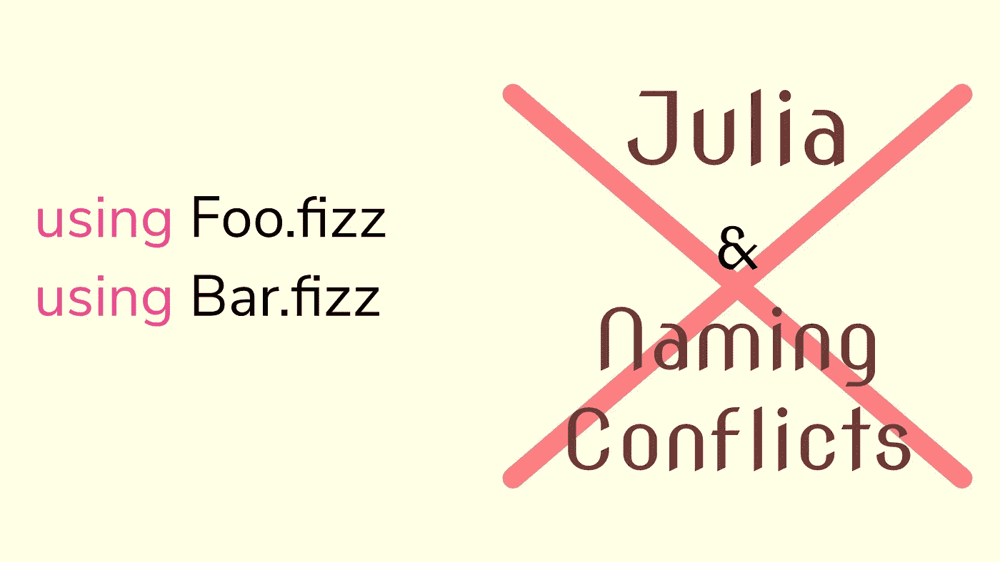

# Julia 关于名称空间的大问题

> 原文：<https://towardsdatascience.com/julias-big-problem-with-namespace-996d2e9ed71e?source=collection_archive---------17----------------------->

## 作为一名 Julia 开发者，这是一个可能会影响你的重大问题。



(图片由作者提供)

# 背景

J ulia 是一种现代而年轻的编程语言，自 2018 年 8 月发布 1.0 版本以来，它一直在科学计算界掀起风暴。尽管 Julia 作为一种语言有大量对开发人员有用的奇妙属性，如多态性、极其动态的语法和类型，但由于 Julia 是一种如此年轻且相对复杂的语言，所以很容易理解为什么编程语言会出现一些问题。

为了理解为什么 Julia 不擅长处理命名冲突，我们需要看看 Julian 模块是如何工作的。首先，模块的标准标识符是“module”，所以我们可以创建一个类似这样的模块:

```
module fizz
    function buzz(foo)
        return(foo)
    endend
```

这将使一个叫做 fizz 的模块具有一个小时候叫做 buzz 的功能。我们可以通过以下任何一种方式访问 buzz:

```
using fizzfizz.buzz(foo)using fizz: buzzbuzz(foo)import fizzfizz.buzz(foo)import fizz: buzzbuzz.foo
```

每当我们进口 buzz 而不含 fizz 时，我们使用的是所谓的直接进口。这意味着我们将只使用这个特定的函数，模块的其余部分不会加载到我们的环境中。这是防止命名冲突的一个很好的方法，因为如果我们只需要来自不同模块的特定方法或结构，那么我们可以相应地获取它们。还应注意“进口”和“使用”之间的区别。每当我们使用“导入”时，我们都是显式地导入模块、函数或类型。这意味着我们计划对它进行扩展。例如，我可以有这样一个调度方法:

```
module fizz
    buzz(foo::Int64) = add_5(foo)
    buzz(foo::Bool) = negate(foo)
end
```

然后显式导入它并为更多类型提供操作:

```
function add_10(foo)
    return(foo + 10)
endimport fizz: buzzbuzz(foo::Float64) = add_10(foo)
```

当然，这将使得如果一个 float 被用于这个方法，我们将调用我的新 add_10 函数，它被用 dispatch 路由到这个函数。

通常，这些命名约定不容易发生冲突。在直接导入时，我们不太可能会遇到问题，如果我们在冲突出现时没有意识到冲突，这种情况肯定不会发生。然而，您可能会遇到的问题是，大多数 Julia 模块完全遵循函数范式。这意味着它们可能会在导出之上使用导出——这将危及您的个人命名约定。考虑以下模块:

```
module fizz
    buzz(foo::Int64) = add_5(foo)
    buzz(foo::Bool) = negate(foo) export buzz
end
```

导出参数的不同之处在于，现在只要导入模块 fizz，我们就可以直接访问 buzz。请注意，这是大多数 Julia 包的典型约定。

```
using fizzbuzz(foo)
```

记住这一点，考虑两个流行的 Julia 模块:

> 牛虻. jl 和剧情. jl

这两个都是使用 plot()方法的图形库。虽然它们仍然采用完全不同的参数，但这些都是常规函数，而不是调度操作。另一个需要注意的重要事情是，它们都采用了许多关键字参数，这在 dispatch 中几乎是不可能的。这两个方法都是导出的，这意味着每当我们导入它们时，我们毫无疑问会遇到命名冲突。如果我们使用直接的约定，比如使用`Plots: plot` ，这可能是不正确的，但是如果我们想一前一后地使用两个包，这仍然是一个问题。

另外，如果你想了解更多关于这两个图形库的知识，我写了一些很好的文章，你可以在这两个库上查阅！：

[](/gadfly-jl-the-pure-julia-plotting-library-from-your-dreams-3ee6ca107a5c) [## 牛虻. JL——来自你梦中的纯朱莉娅绘图库

### 看看朱莉娅对 2020 年统计绘图的最佳选择

towardsdatascience.com](/gadfly-jl-the-pure-julia-plotting-library-from-your-dreams-3ee6ca107a5c) [](/spruce-up-your-gr-visualizations-in-julia-88a964450a7) [## 在 Julia 中美化您的 GR 可视化

### 没错，又是 Julia，我保证 R，Scala，Python 还在这个爱情圈里

towardsdatascience.com](/spruce-up-your-gr-visualizations-in-julia-88a964450a7) 

# 截至 1.5.1 的补救措施

W 虽然作为一门语言，这个问题很难解决，但现在 Julia 中有一些东西可以帮助解决这个问题。首先，在处理命名冲突时，dispatch 将会是一个很好的朋友，它有可能帮助您解决在 Julia 语言中可能遇到的大多数命名问题。然而，正如我在上面提到的，分派带有大量关键字参数的方法是相当困难的，有时甚至是不可能的。因此，尽管派遣可能是避免冲突的较好方法之一，但它肯定不是避免上述冲突的万无一失的方法。

考虑如何避免编程语言中的命名冲突的一个很好的方法是环顾四周，看看其他编程语言是如何避免冲突的。在很多方面与 Julia 非常相似的语言的一个很好的例子当然是 Python。Python 使用可由用户定义的别名来非常有效地避免命名冲突。然而，当我们在 Julia 中查看这个相同的概念时，我们看到虽然别名是可能的，但它仍然不能使我们绕过名称冲突:

```
**import** Queryverse 
**const** qv = Queryverse
```

虽然这似乎是一个解决方案，但问题仍然存在，因为您已经定义了 Queryverse 及其所有导出的标识符，它们将与以相同名称进入您的环境的新标识符冲突。在这方面，我们可能得到的最接近的方法是显式导入一个特定的方法或类型，然后设置一个与该类型相等的常数。

除了这两个相当简单且不太有用的解决方案之外，真的没有太多的可能来避免命名冲突，就像 Julia 语言中的瘟疫一样。至少据我所知，这两个是预防的最佳选择，但如果你已经在试图解决这个问题，它们不会让你脱离困境。

# 来自 C++的解决方案

伴随着一些开发人员可能会遇到的这个严重问题，出现了一个非常好的解决方案，Julia 语言有可能从 C++继承过来。C++使用了一个叫做名字间隔的概念，它允许我们总是指示我们想要使用哪个模块，甚至在任何特定的场景中我们想要使用模块的哪个部分。考虑一下 C++中 STD 的例子:

```
#include <iostream>int main()
{
std::cout <<< 0
}
```

STD 是名称空间，cout 是包含在名称空间中的函数。这些都包含在我们放在顶部的包<iostream>中。对于代码中需要调用 cout 的每一点，我们都会调用 std::cout，而不仅仅是 cout。这意味着，如果我们有一个来自不同名称空间的新标识符，比如 foo::cout，我们仍然可以以完全相同的方式使用那个函数。此外，我们还可以在命名空间上调用 using，使对象或函数在全局和局部范围内都可用:</iostream>

```
#include <iostream>using std::cout // <- Global Scope
int main()
{using std::cout //<- Local Scope
cout <<< 0 //<- Notice we don't need to use the namespace
}
```

我认为这将为 Julia 中的 include()方法增加一些扩展的可用性。而不仅仅是能够包含。JL 文件，我们也可以用模块名来调度它。这使得在 Julia 代码中根据它们所在的模块创建名字空间成为可能。Include 可被视为名称空间语法，而 using 仍以其一贯的方式使用。以下是一些理论代码的示例:

```
include(Gadfly)
using PlotsGadfly::plot(x, y) #< -- This would use Gadfly
plot(x, y) #< -- This would use plots
```

# 当前的解决方案

虽然这些关于语言迁移的理论上的建议可能对 Julia 的未来迭代有意义，但重要的是要考虑开发人员现在可能拥有的选项——在 Julia 库之外。这种可取之处当然是以模块的形式出现，这可能有助于避免 Julia 语言中的命名冲突。为此，考虑使用别名避免冲突的 Pythonic 示例。请允许我介绍

> ImportMacros.jl

[](https://github.com/fredrikekre/ImportMacros.jl) [## fredrikekre/ImportMacros.jl

### 提供两个宏:@import 和@using，用于加载模块或对象并将其绑定到别名。@导入可以用…

github.com](https://github.com/fredrikekre/ImportMacros.jl) 

jl 允许在加载导出之前使用宏创建 Pythonic 别名语法。如果我们在这种情况下使用 Import 宏，我们可以避免在当前范围内定义模块。虽然这不一定适用于导出(因此也不是最好的解决方案)，但是您仍然可以直接调用导出，并相应地为它们起别名。尽管这种解决方案可能不是最好的长期解决方案，但在开发或构想出更好的解决方案时，它可能会让您摆脱困境。

# 结论

Julia 编程语言做了很多非常棒的事情。虽然这种语言很棒，提供了很多有些人可能从来没有想过的东西，但它也带来了一些问题。重要的是要记住，Julia 作为一种语言是非常年轻的，开源社区每天都在开发它。因此，这种语言肯定会在未来得到改进和发展，但肯定会不时出现问题。

我真的很想看看 C++对名字间距的处理方式，看看如何在 Julia 中解决这个问题会很有趣。就解决方案而言，它可能是最连贯的解决方案之一，也不会改变 1.5.1 中语言核心的功能。

不管怎样，Julia 语言是一个不断扩展和引人入胜的东西，我认为它绝对值得一试。感谢您的阅读，我希望至少这些概念是有趣的！