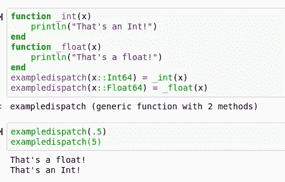
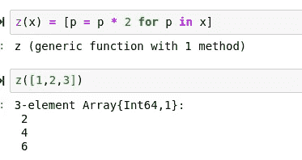
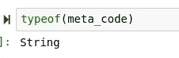
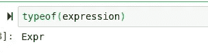
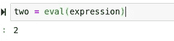

# 朱莉娅最令人敬畏的特征

> 原文：<https://towardsdatascience.com/julias-most-awesome-features-be51f798f140?source=collection_archive---------20----------------------->

## Julia 编程语言中我最喜欢的五个特性。


(茱莉亚 logo src =[http://julialang.org](http://julialang.org)，茱莉亚格普 logo src =[https://github.com/JuliaGPU](https://github.com/JuliaGPU))

编程语言的范围包括编程概念和范例。许多语言利用它们的范例以及有趣的泛型编程概念来创建特性，以区别于其他语言。然而，这些特性通常范围有限，有时使用频率不够高，甚至没有存在的理由。

Julia 编程语言是一个有趣的例子，因为与大多数语言不同，Julia 有一些致命的定义特性，这些特性使它能够做各种你可能想不到的事情。虽然 Julia 语言使用了一大堆奇妙的特性，但这是我认为最有用和最吸引人的五个特性。

# №1:宏


尽管宏对于编程来说肯定不是一个新概念，但它们在 Julia 中的实现是相当独特的，而且在我看来做得相当好。宏是可以用来快速有效地访问函数的“快捷方式”，在处理 Julia 语言的函数应用程序时非常有用。在 Julia 中，只需使用“macro”就可以定义一个宏。

```
macro add(num1,num2)
   num1 + num2 
end
```

我们可以通过在宏名前添加@符号来使用宏。参数可以添加空格，不需要括号或逗号！


# №2:调度

如果您熟悉 Julia 语言，并且相对地使用过它，那么您很可能熟悉 Julia 的高性能调度。使用 Julia 中的语法表达式，我们可以创建不同的函数，这些函数使用参数多态以相同的方法处理不同的类型。为此，我们只需使用等号运算符。

```
exampledispatch(x::Int64) = _int(x)
exampledispatch(x::Float64) = _float(x)
```



关于 Julia 的调度，你可能没有注意到一个惊人的副作用，那就是所有的 Julia 函数都可以在任何类型上通用。考虑这个例子:

> 我想创建一个类型，它使用 push 函数将数据添加到包含在结构中的数组中。

用力！()函数是 Julia 基础的一部分，而在大多数其他语言中，为了避免冲突，我们需要为我们的模块编写一个全新的标识符。使用该语言附带的标准库时尤其如此。但是，在 Julia 中，我们可以只发送 push！()处理我们的类型:

```
push!(data,x::Type{ihavedatainme}) = _pushdata(data,x)
```

# №3:语法表达

甚至一些 Julia 程序员可能没有意识到这一点，但是语法表达式负责我们如何编写 Julia 代码背后的整个方法。本质上，使用语法表达式，我们可以设置任何表达式或变量等于任何表达式或变量。这也是 dispatch 的工作方式，因为我们所做的只是将一个方法的特定参数类型设置为对应的方法。

然而，除了分派之外，我们还可以通过多种方式使用语法表达式。例如，我们可以将一个方法设置为一个表达式:



如果你想学习更多关于语法表达式的知识，并学习一些很酷的方法，我这里有一篇关于它们的文章:

[](/syntactical-expressions-are-awesome-dc9ba5f25911) [## 语法表达超赞！

### 利用朱莉娅语法的力量来断言任何事情。

towardsdatascience.com](/syntactical-expressions-are-awesome-dc9ba5f25911) 

# №4:元编程

Julia 以一种非常有趣的方式处理像元编程这样的概念。元编程和类似概念的包通常是分段的，但仍然包含在 Julia 的库中。这使得 Julia 的 base 在预编译时花费的时间少得多，同时仍然加载了令人敬畏的特性。为了在 Julia 中进行元编程，您应该从 Meta.parse()和 eval()这两个函数开始。Eval 包含在 Julia 核心中，不需要导入，而 Meta 是包含在 Base 中的一个模块。

```
using Base.Meta
```

评估元表达式的第一步是解析它。这将把一个常规字符串转换成 eval()能够处理的表达式类型。

```
meta_code = "1 + 1"
```



```
expression = Meta.parse(meta_code)
```



# №5:并行计算


(src =[https://github.com/JuliaGPU](https://github.com/JuliaGPU)

好的，我明白了…并行计算本身并不一定是一个“特性”，但是 Julia 的并行计算令人印象深刻的是 Julia Computing 在这方面做了多么了不起的工作。与许多其他语言不同，Julia 自带了大量的 GPU 支持。核心的 Julia 语言支持图形数组和处理，这是你在其他地方无法得到的。将并行计算紧密集成到 Julia 中，并使用专门设计的类型和函数来处理它，比在大多数语言中(这是事后才想到的)要强大得多。此外，Julia 拥有各种用于并行计算的优秀包，以及 CUDA 和 OpenCL 等行业标准。

# 结论

Julia 编程语言有一大堆令人难以置信的特性，这些特性绝对让使用这种语言物有所值。有了所有独特的解决问题的方法，很少有时候你不能用这种语言创造性地完成一些事情。除此之外，Julia 还拥有它通常所拥有的所有优势。这些是我最喜欢的，但是我也想知道其他程序员喜欢这种语言的什么。(想分享就留言评论吧！)