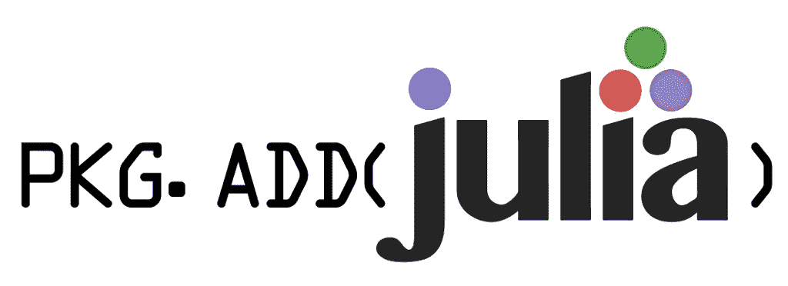

# 朱莉娅的包装经理棒极了

> 原文：<https://towardsdatascience.com/julias-package-manager-is-awesome-23b9c02e3a0b?source=collection_archive---------28----------------------->

## 为什么 Julia 的 Pkg 是我用过的最好的软件包管理器。



(http://julia-lang.org/和达塔沃基)

在过去的中，我对令人惊叹的多范例统计语言 Julia 赞不绝口。这是有充分理由的，因为 Julia 是一种令人难以置信的高级语言，它扩展了我们认为可能来自这种高级语法的限制。此外，就机器学习的理想性而言，从我使用四大的次数来看，Julia 完全能够超越 Python、R 甚至 Scala。我甚至开玩笑说要在我的头上纹一个朱莉娅的纹身，甚至要对那个东西进行半真实的渲染:


> 看起来很棒，不是吗？

但是对于我一直以来最喜欢的编程语言之一的炫耀，我忽略了一个让 Julia 变得更好的特性:

> 包装

Pkg 是 Julia 的包管理器，它不是 Python 或 r 中常见的那种典型的包管理器。事实上，在大多数情况下，我坚信 Julia 的包管理器胜过我用过的所有 Linux 包管理器，包括 Dnf、Apt、Man，可能还有最健壮的:Pacman。有几个关键的好处使得用 Pkg 包管理器管理 Julia 中的包变得轻而易举，你可能会说

> “它能做到吗？”在某个时候。

# REPL 和包裹

Pkg 的一个巨大好处是它有自己的读取评估打印循环，或 REPL。这是有益的，原因有几个，首先我想提到的是，它可以比库等价物更快地添加包。这是因为它可以简单地通过按键完全跳过重新编译陈旧的缓存文件，

```
]
```


此外，这允许非语法的包添加，使得只需一个命令和一个空格就可以超级快速和容易地添加包:

```
add "Lathe"
```

然而，除了有一个 REPL，Julia 的 Pkg 也以 Julia 包本身的形式出现。这很有用，因为这意味着您不仅可以从 REPL 中添加包，还可以添加代码本身。每当我创建 [**TopLoader**](https://github.com/emmettgb/TopLoader) 时，这就特别有用，这是一个 Python 包，允许你创建一个虚拟的 Pkg 环境，然后使用添加到该环境中的包。

# Github 集成


(src = http://github.com/)

Julia 的包管理器完全基于 Github，包被推送到 Registrator.jl 库，你可以在这里看一下[。](https://github.com/JuliaRegistries/Registrator.jl)


(src =[https://github.com/JuliaRegistries/Registrator.jl](https://github.com/JuliaRegistries/Registrator.jl)

这不仅使得通过 Github 推送您的 Julia 包变得非常容易，还允许您添加带有 Git URLs 的未注册包。这使得通常存储在 Git 兼容的存储库中的未发布的软件总是可用的。Julia 的包使用 Github 作为开发的基础，这当然不是一个坏主意，因为即使是非开发人员也很清楚开源开发本质上是围绕 Github 进行的。

# 虚拟环境

生活中有许多问题尚未得到解答，但一个古老的问题是

> “谁的环保做得最好？”

肯定已经有答案了。与 Pip、Package get、Quick Lisp 和数以千计的其他软件包管理器(也称为“Pkg”)相比，Julia 的 Pkg 再次在竞争中脱颖而出。从一开始，您就可以通过 REPL 的两个简单命令或软件包中的一个方法来激活虚拟环境。

```
using Pkg
Pkg.activate("venv")julia> ]
pkg> activate "venv"
```

这使得管理和利用这些虚拟环境变得异常简单。如果不与 Julia 的竞争对手之一 Python 的类似选项进行比较，很难证明这种激活虚拟环境的方法是正确的。Python 的包管理器是 Pip，虽然肯定不如 Pkg 健壮，但我认为 Pip 肯定经得起时间的考验，并在 Python 中完成了工作。但是要为 Pip 激活一个虚拟环境，你需要安装一个全新的包，就是 venv，或者类似的东西(有几个不同的选项。)

```
sudo pip3 install virtualenv
python3 
python3 -m venv venvname
```

这当然并不可怕，但是从另一方面来说:肯定没有 Julia 等价类那么健壮和简单。重申一下我的 Python 包，它用于在虚拟环境中加载 Julia 模块，开发这个包非常容易，因为我能够使用 activate()方法。

# 结论

我喜欢 Julia 的 Pkg，我向那些努力开发它的开发人员致敬，他们只是为了让 Julia 的编程体验变得更好。我认为许多其他的包管理器有很多东西要向 Pkg 学习，因为对我个人来说，它一直感觉像是完美的包管理器。我鼓励您尝试一下，因为它感觉像是充斥着 CLI 软件包管理器的世界中的一股新鲜空气。总的来说，我认为 Pkg.jl 为 Julia 做出了很大的贡献，并且使这种语言变得更加有趣。