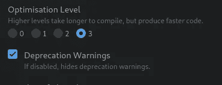

# 朱诺让朱莉娅写作变得很棒

> 原文：<https://towardsdatascience.com/juno-makes-writing-julia-awesome-f3e1baf92ea9?source=collection_archive---------20----------------------->

## 用于 Julia 的基于原子的 IDE


(http://junolab.org)

除非你一直生活在岩石下，或者根本不为计算机编程，否则你很可能听说过 Atom。Atom 是一个简单、可扩展、漂亮的开源文本编辑器，可以在 Linux、Windows 和 MacOS 上使用。应该注意的是，Atom 本身并不是一个集成开发环境，而仅仅是一个文本编辑器。


Atom 对我来说是一个很棒的文本编辑器，因为它很现代，看起来很好，而且高度可扩展和可调整。Atom 提供了为替代语言应用主题、扩展和语法突出显示所需的所有工具，这些工具都内置在它们的 UI 中，并由免费和开源开发人员开发的扩展库提供服务。在方法论上，这与 Linux 的发布方式非常相似，所以这确实是我的拿手好戏。Atom 在没有任何扩展的情况下，对于所有语言都有很高的终端窗口能力，但是通常安装扩展会突出语法。然而，在 Juno 中，我们得到的不仅仅是简单的语法突出显示。


(http://julialang.org/)

J ulia 是一种高级的、多范例的统计语言。Julia 也是开源的，与 r 等其他统计语言相比有很多优势。虽然 Julia 大部分是函数式的，但与 Lisp 一样，它也可以用于通用目的。Julia 是一种拥有如此高级语法的相对快速的语言。速度通常稍慢，但在某些情况下实际上可以超过 C。当然，这是非常罕见的情况，这种观察有许多变量，因为它是在使用 IPython magic timers 的 Jupyter 内核中测试的，但即使接近 C 的速度也使 Julia 比 R 和 Python 更有优势。此外，Julia 拥有出色的浮点精度，这也让 Julia 领先于 Scala。

> Julia 可以成为你的“大数据”语言


(http://junolab.org/

原子+朱丽亚拼图的最后一块是朱诺。Juno 把 Atom 这个简单的文本编辑器改造成了 Julia 的全功能 IDE，真的太牛逼了！Juno 具有许多特性，这些特性使 Julia 成为我在 Atom 内部编写的最令人愉快的语言。

## 取代

Juno 拥有许多其他扩展所没有的东西:

> REPL

您可以通过 Atom 访问 Julia 的 Read Evaluate Print 循环(REPL ),从而方便地包含和编译您的程序。随着朱莉娅 With 的加入，朱莉娅变得非常强大，甚至对于常规软件开发也是如此。

## 远程过程

您不仅可以通过常规的 REPL 处理 Julia，还可以启动与 Julia 交互的远程进程。这是一个非常棒的特性，因为它将 Atom for Julia 变成了一个现代的 IDE，而不仅仅是一个带有输出窗口的简单 IDE。

## 格式化

Juno 还附带了一个完全自动化的格式化工具，该工具完全可以通过 Atom 内部的菜单栏来访问。这很有用，因为它创建了一个一致的代码风格，所有 Julia 用户都可以与之交互和阅读，但仍然允许您最初以自己的风格编写 Julia。

## 运行块

我非常喜欢 Juno 的另一个特性是运行 Julia 块的能力。这可以使体验与 REPL 高度互动，使 Julia 编程体验更像在笔记本内工作。

## 设置

Juno 设置的包容性令人惊讶。从“设置”菜单中，您可以调整路径、线程数和 Julia 引导模式。Julia 引导模式是一个概念，在这个概念中，您可以让您的 ide 根据您使用的是远程 Julia、集成终端还是外部终端来设置单独的运行时，甚至可以设置一个循环模式来保持所有三个 Julia 进程始终运行，以便加快 IDE 内部的运行速度。另一个很酷的特色是优化级别，虽然优化是拼写

> 最佳化

在设置中。



优化允许您选择，无论是永久地还是暂时地，您希望编译有多快，以及您希望您的代码有多快。当然，这也非常有用，尽管我不怎么用它，因为我在 Julia 中工作时一般不会遇到性能问题。Julia 中性能最差的部分是过时的缓存文件重新编译，它:

> 在部署中不是问题。

虽然使用 Genie 确实会使服务器启动时间有点慢，但通常“有点慢”只是大约一分钟。

## 打开包裹

Juno 还允许您在新窗口中立即打开任何安装了 Pkg 的软件包，让您轻松地根据自己的喜好调整软件包。对于该特定功能，我唯一想做的更改是在没有 REPL 的情况下使虚拟环境更易于管理，这可能与该功能有关。但这并不是说首先很难从 REPL 激活虚拟环境。用 Pkg 激活一个环境只需要 3 个命令，包括]和初始化 Julia。


或者，你也可以

```
using Pkg;Pkg.activate("dev")
```

原子底部的 REPL 内部。

## 文档浏览器

Juno 的另一个很酷的特性是能够从 Atom UI 中快速查找文档。这当然不是什么新鲜事，因为 Julia 在处理文档方面做得非常好。对于大多数包，使用？()函数将打印出所述包的文档——使得访问文档网站成为一种不同语言要处理的事情。

# 结论

我真的很喜欢并感谢大家为 Atom 在 Juno 上付出的努力。我每天都使用 Atom 作为我的文本编辑器，还有 Gedit 和 Nano，在我实际使用的文本编辑器中，我最喜欢的语言得到如此多的关注真是太棒了。我也很高兴他们决定在 Atom 上支持 Julia，而不是构建他们自己的 IDE。这不仅需要更多的资源，还需要在热键和设置方面的新的学习体验，需要处理的新的用户界面，以及回收的文本编辑应用程序的额外磁盘空间。总的来说，我对 Juno 的结果非常满意，尤其是它让 Julia 的开发变得如此容易！