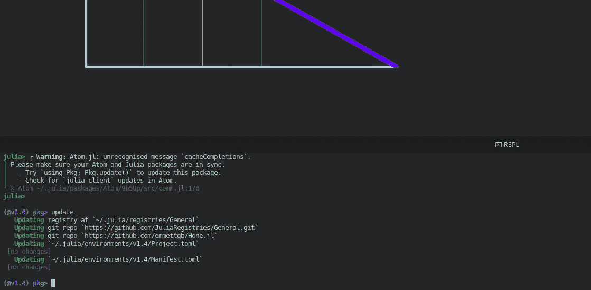
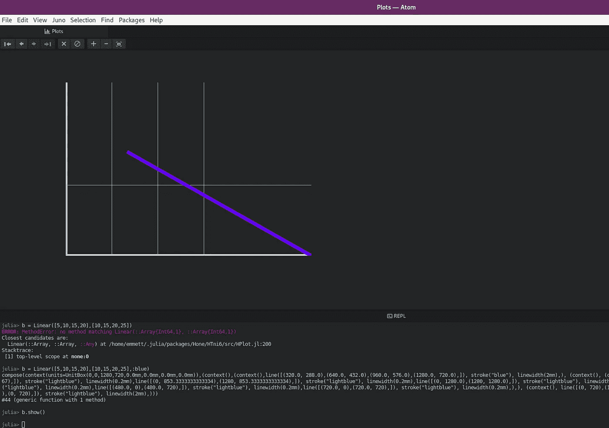
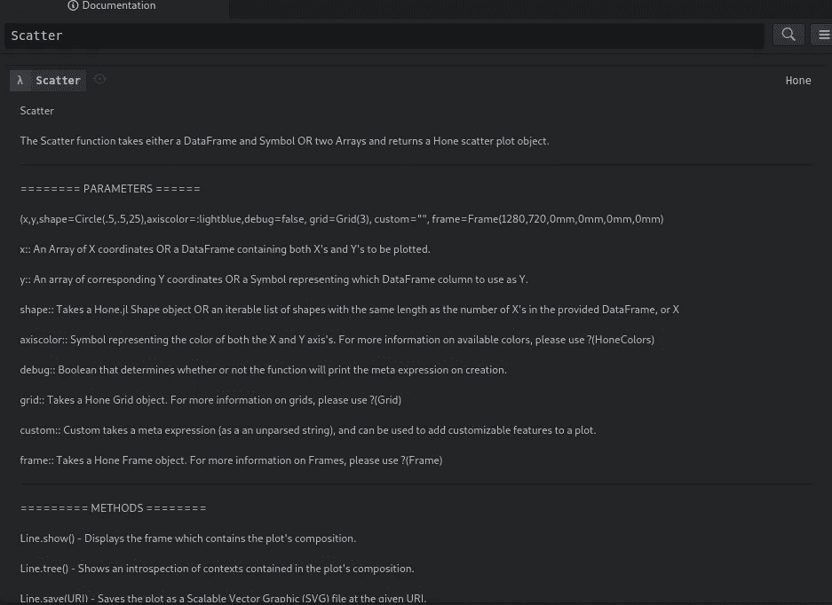

# Juno vs . Jupyter——Julia 的开发环境哪个更好？

> 原文：<https://towardsdatascience.com/juno-vs-jupyter-which-is-the-better-development-environment-for-julia-19e26b36403d?source=collection_archive---------28----------------------->

## 意见

## 比较我在数据科学中最常用的两个 ide。


(I Julia logo src =[https://github.com/JuliaLang/IJulia.jl](https://github.com/JuliaLang/IJulia.jl)，Juno logo src =[https://junolab.org/](https://junolab.org/))

影响编程效率的最重要因素之一是您的开发环境。对于数据科学来说尤其如此，因为数据科学家更经常需要在执行作为应用程序一部分的任何代码之前分析和处理数据。拥有一个适合你的好的设置意味着在一小时或一整天内完成一件事的区别。

通常，在讨论 Julia IDE 的数据科学时，有两个主要选择:

> 伊茱莉亚和朱诺。

# 伊朱丽亚

IJulia 是 Julia 的 Jupyter 内核，可以用 Pkg 添加:

```
Pkg.add("IJulia")
```

## 优势

Jupyter 笔记本电脑具有许多优于 Juno 的优势。首先，细胞水平的执行棒极了。使用单元格，您可以选择何时运行哪个代码，甚至可以避免运行某些单元格来获得某个结果。此外，Jupyter 输出相当方便，易于处理。

使用笔记本的另一个好处是可以使用 IJulia 的“神奇”命令。虽然这些在技术上并不是“神奇的”命令，而是从 IJulia 导出的 Julia 函数，但它们确实是紧急情况下手头上的一个好东西。最重要的是，使用宏来运行 bash 命令要比困在 REPL 中，像在 Juno 中一样打开第二个终端窗口好得多。


然而，在我看来，使用笔记本电脑的最大优势之一可能是

> 再现性。

笔记本是教学和传播信息的好工具。如果能够为带有解释的大块文本添加标记单元格，就更是如此。这就是为什么我通常使用笔记本来演示我在 Medium 上的文章中的想法和代码，尽管主观上我更喜欢使用 Juno。

## 不足之处

在 Jupyter 内核中调试软件包可能非常困难，因为每当需要从 Jupyter 内核中重新加载软件包时，内核都需要重新启动，所有代码都需要重新执行。

与运行一个简单的 Julia 可执行文件相比，内核也是相当费力的。这不仅会导致性能下降，而且在使用 Jupyter 笔记本电脑时，多任务处理也会变得相当困难。最重要的是，杀死一个内核比超时一个 REPL 要容易得多，所以总是有可能遇到不先去 REPL 就无法执行的代码。

使用 Jupyter 的最后一个缺点是你的代码会被保存在笔记本里。虽然这既是一种祝福，也是一种诅咒，但任何不使用笔记本的人都可以感受到这种诅咒。对于任何不从事数据科学的人来说，笔记本可能是一个完全陌生的概念，这意味着您的代码无法到达更多的受众，同时也相当有限，直到它被复制到一个独立的 JL 文件中，或者保存为一个文件。

# 朱诺

Juno 是 Julia 的集成开发环境，可以作为 Atom 文本编辑器的扩展添加。您可以添加 Julia，方法是进入 Atom 菜单栏中的编辑>首选项，然后选择扩展并搜索“Juno”

## 优势

拥有一个朱莉娅·REPL 是一个非常强大的工具。使用朱莉娅·REPL，你还可以访问 Pkg REPL，这比导入 Pkg，预编译 Pkg，然后使用 Pkg 方法要方便得多。此外，由于更加关注本地文件系统，管理虚拟环境和。jl 文件变得容易多了。



Juno 的另一大优势是“Plots”窗格。“Plots”窗格从 Julia 获取任何图像输出，并将其放入 iframe 中。这非常方便，因为您可以实时缩放图形。此外，当前会话中使用的所有图都保存在此窗格中，使浏览数据可视化变得毫不费力。



Juno 的另一个优点是启动新会话非常容易。正如我在使用 IJulia 的缺点中提到的，不断地重启内核是非常乏味和烦人的。使用 Juno，您可以通过按 ctrl+D 快速重启 Julia 会话，并出现中断异常。

在 Juno 中，您还可以使用“Documentation Browser”窗格，它提供了一个灵活的 UI 来搜索所有添加的包的 Julia 文档。



另一个很酷的功能是自动格式化。在 Juno 中，您可以随时通过单击 Juno >格式化代码来突出显示和格式化您的代码。最重要的是，您可以执行单个代码块，这使得利用包含 Julia 代码的文本缓冲区变得非常方便。

锦上添花的是，您还可以从 Juno 内部启动远程 Julia 进程。

## 不足之处

虽然这对我来说肯定不是一个缺点——因为我喜欢 Atom，而且它是我的首选文本编辑器，但那些喜欢 VSCode 或其他替代产品的人可能会觉得使用 Juno 需要 Atom 有点烦人。我可以肯定地看到，对于那些以前没有使用过 Atom 的人来说，Atom 可能需要一些时间来适应。

让我们面对现实吧——在 REPL 中输入函数远不如在文本缓冲区中输入函数方便。虽然把你所有的功能都输入朱莉娅 cell 肯定是可能的，但这肯定比把它们输入一个 Jupyter 单元格要慢。此外，您将失去复制和粘贴的能力。您可以通过将函数放入 Atom 文本缓冲区内的. jl 文件来缓解这个问题，但是每次添加或修改函数时，您都必须包含()或重新运行文件。

# 结论

Jupyter 和 Juno 都是不可思议的工具，在很多方面，他们都有不足和进步。我希望朱诺拥有朱庇特拥有的许多东西，朱庇特拥有的许多东西我也希望朱诺拥有。总的来说，我不认为这是一个“什么”的问题，而是一个“什么时候”的问题。我认为有些情况下 Juno 是更好的选择，有些情况下 Jupyter 是更好的选择。就我个人而言，我更喜欢使用 Juno，因为它具有惊人的多功能性。在 Jupyter 中开发软件包相当困难，但是在 Juno 中进行数据分析却非常有效。然而，这并不是说我不愿意使用 Jupyter 进行数据分析，而相应地使用 Juno 进行软件包分析，事实上，我通常就是这么做的。

显然，Jupyter 在我的信息性文章中对我也非常有用。首先演示，其次分享我的作品会困难得多。jl 文件和 REPL 会议。Jupyter 最大的缺点可能是死内核，Juno 最大的缺点可能是可重复性。总的来说，在很多方面，我认为你使用的工具可能与你想要做的事情密切相关。