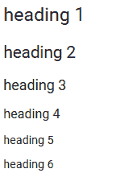
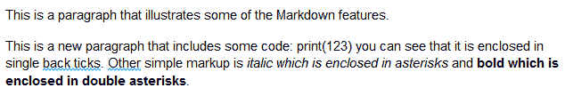
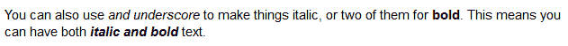
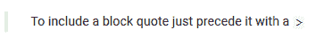
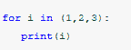
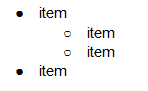
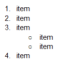
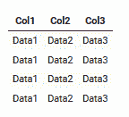
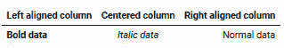

# 朱庇特和马克登

> 原文：<https://towardsdatascience.com/jupyter-and-markdown-cbc1f0ea6406?source=collection_archive---------11----------------------->

## 无论您是与朋友和同事分享您的 Jupyter 笔记本，还是更广泛地发布它们，如果它们布局合理、格式正确，将会更受欢迎。


作者图片

您可以在 Jupyter 笔记本代码中添加注释，以帮助读者了解您在做什么。但是较长的注释最好放在与代码分开的文本单元格中。

Jupyter 中的文本单元格支持 Markdown 语言，我们将看看它提供的功能。Markdown 是一组简单的标记代码，可以很容易地转换成 HTML 以便在浏览器中呈现。Markdown 远没有 HTML 那么复杂，但是对于记录一个笔记本来说已经足够了(尽管如果你需要对外观或布局有更多的控制，也可以嵌入 HTML)。

这篇文章最初是用 Markdown 写的(本文末尾有原文的链接)，第一段和两个标题是这样的:

```
# Jupyter and Markdown
## Making your Notebooks look good
Whether you are sharing your Jupyter Notebooks with friends and colleagues or publishing them more widely, they will be better appreciated if they are well laid out and formatted.
```

很简单。#位于相当于 HTML 中的

# 的标题之前，其中两个表示二级标题

## 。#符号越多，标题越小。

因此，下面的 Markdown 代码将显示一个标题列表，其大小逐渐减小。

```
# heading 1
## heading 2
### heading 3
#### heading 4
##### heading 5
###### heading 6
```



作者图片

Markdown 支持最常见的样式，如粗体和斜体，您可以构造带编号和不带编号的列表。您可以在段落中嵌入代码或显示完整的代码块。包括超链接，你也可以插入图像。表格可以用非常简单的语法用左对齐和右对齐的列来构造。

Markdown 忽略单行分隔符，因此要分隔段落，需要插入两个换行符。

下面我们来看一些降价代码的例子。对于每个示例，我将向您展示 Markdown 代码，然后按照它呈现后的样子进行操作。

# 内嵌标记—代码，粗体和斜体

首先，我们来看看一些简单的内联标记。

下面是代码，下面是渲染版本:

```
This is a paragraph that illustrates some of the Markdown features.
This is a new paragraph that includes some code: `print(123)` you can see that it is enclosed in single back ticks. Other simple markup is *italic which is enclosed in asterisks* and **bold which is enclosed in double asterisks**.
```



作者图片

您可以使用单下划线或双下划线将文本变为斜体或粗体。所以，通过混合下划线和星号，你可以得到既斜体又

```
You can also use an _underscore to make things italic_, or two of them for __bold__. This means you can have both _**italic and bold**_ text.
```



作者图片

# 大宗报价

块引号前面有一个 v 形符号。

```
> To include a block quote you precede it with a `>`
```



作者图片

# 代码块

如果要包含代码块，请使用三个反斜杠或~字符将代码括起来，如下所示:

```
~~~python
for i in (1,2,3):
   print(i)
~~~
```

或者这个

```
```python
for i in (1,2,3):
   print(i)
```
```

你会得到一段代码，可能是彩色编码的:



作者图片

请注意，使用编程语言这个名称是可选的，尽管它不是 Markdown 规范的一部分，但大多数渲染器中都包含了颜色编码。

# 列表

有序列表和无序列表都有。无序列表中的项目前面有一个星号、减号或加号:

```
+ item
- item
* item
```

这看起来像

*   项目
*   项目
*   项目

子列表只是缩进一个空格:

```
+ item
 + item
 + item
+ item
```



作者图片

编号列表以一个数字开始，后面跟着一个点，你猜对了。你可以混合搭配有序列表、无序列表和子列表。

```
1\. item
2\. item
3\. item
 + item
 + item
4\. item
```



作者图片

# 形象

图像通过其路径或 URI 来引用。要包含一个图像，该行以一个感叹号开始，后跟一对方括号，用于放置 alt-text，然后是一对大括号，包含图像路径和一个字符串，当您将鼠标悬停在图像上时会显示该字符串。

```
e[/raw/master/src/common/images/icon48.png](https://colab.research.google.com/drive/11g7y2fa2g0Y2OHJot9_p3OGvv5Q5IgNF#) “Markdown Logo”)
```


图片由亚当·普里查德提供

# 链接

链接看起来与图像相似，只是方括号中的文本是实际的链接文本。

```
Here is a link to [Google’s](https://www.google.com “Google’s Homepage”) home page.
```

其呈现为:

这里有一个到谷歌主页的链接。

# 桌子

在表格中，各列用管道字符(|)分隔，标题后是一行破折号，然后其余的数据逐行排列，如下所示:

```
Col1 |Col2 |Col3
-----|-----|----- 
Data1|Data2|Data3
Data1|Data2|Data3
Data1|Data2|Data3
Data1|Data2|Data3
```



作者图片

您也可以通过在标题下划线中放置冒号来对齐列。右边的冒号表示右对齐，左边的冒号表示左对齐，两边各有一个冒号居中。这里有一个例子:

```
Left aligned column | Centered column | Right aligned column
:-------------------|:---------------:|--------------------:
**Bold data**       | *Italic data*   | Normal data
```



作者图片

正如您所看到的，表格中的条目可以加粗或斜体。

代码的布局不一定要整洁，Markdown 会整理出来。上表的这个乱七八糟的版本被渲染的一模一样。

```
Left aligned column | Centered column | Right aligned column
:-|:-:|-:
**Bold data**|*Italic data*| Normal data
```


作者图片

# 嵌入式 HTML

如果 Markdown 不完全符合您的要求，您可以添加任何您想要的 HTML。

```
Here’s a bit of Markdown text. Can you see the difference between
**Markdown bold** and <b>HTML bold</b>?No, you can’t because it’s the same!
```

这是一小段降价文字。你能看出 **Markdown bold** 和 **HTML bold** 的区别吗？

不，你不能，因为这是一样的！

# 水平线

最后是一条水平线。只需在一行上单独键入三个破折号

```
---
```

(媒体编辑器里没有横线但是我相信你可以想象出一条！)

# 你还想要什么

我认为这足以让你的笔记本成为吸引人的可读文档。

由于 Medium 不支持 Markdown 可以做的所有事情，我在很大程度上依赖于图像。但是，如果你想看这款笔记本的原始版本，你可以查看或下载，点击[这里](https://github.com/alanjones2/Article-code/blob/master/markdownref.ipynb)。

如果您想了解未来的文章，请订阅我的免费 Technofile 简讯[。](https://technofile.substack.com)