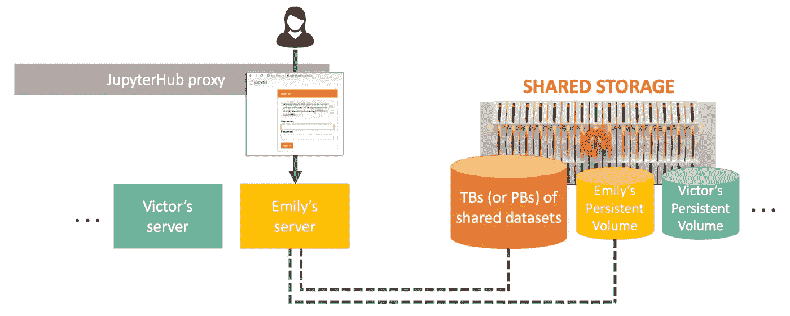
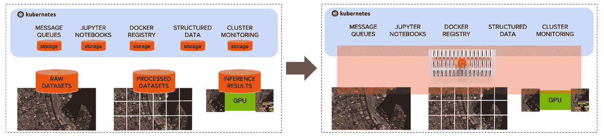
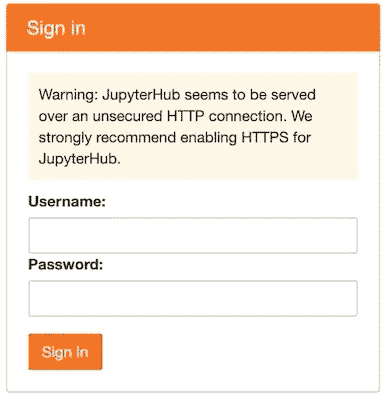
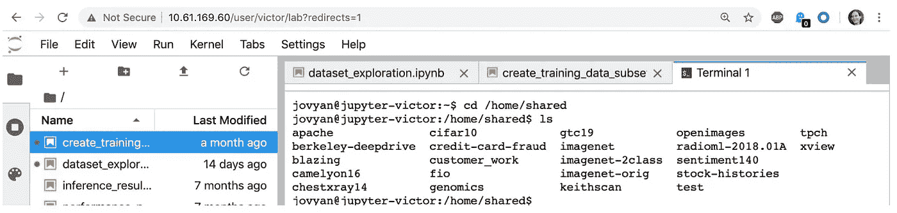

# FlashBlade 上的 Jupyter 服务

> 原文：<https://towardsdatascience.com/jupyter-as-a-service-on-flashblade-3c9ec27f8fcf?source=collection_archive---------42----------------------->

## 如何管理大规模数据科学家的开发环境？


戴维·梅尼德雷在 [Unsplash](https://unsplash.com?utm_source=medium&utm_medium=referral) 上拍摄的照片

Jupyter 笔记本是数据科学家探索数据集和进行模型开发实验的绝佳工具。它们使开发人员能够轻松地用分析和可视化来补充代码。

与让用户管理他们自己的笔记本服务器的传统做法不同， [JupyterHub](https://jupyterhub.readthedocs.io/en/stable/) 可以由一个组织来部署，以提供一个集中的笔记本平台。JupyterHub 还支持基础设施团队为每个用户提供对集中存储的访问:共享数据集、暂存空间和持久 IDE。



这篇博文展示了一个在[纯存储闪存](https://www.purestorage.com/products/flashblade.html)上部署 Jupyter-as-a-Service 的例子。用户可以在 Kubernetes 集群中通过零接触配置动态创建新的笔记本电脑服务器。IT 团队能够跨用户管理计算和存储资源的高效使用。

# 朱庇特枢纽

JupyterHub 用于管理和代理“单用户”Jupyter 笔记本服务器的多个实例。它在您的网络上提供了一个公共 HTTP 代理，因此用户可以从他们的浏览器登录到一个中央登录页面。一旦用户登录，JupyterHub 就会为该用户启动一个服务器(pod)。它会重新连接到该用户的永久存储。因此，用户可以拥有有状态的开发环境，但是计算节点仅在需要时使用。

我们将把 JupyterHub 部署为 Kubernetes 服务，这样它就可以作为集群的一部分轻松管理。

# Kubernetes 环境中的 FlashBlade

出于几个原因，FlashBlade 是 JupyterHub 的优秀存储后端。

首先，它支持就地访问训练数据集，消除了在节点之间复制数据集的需要。数据科学家可以使用共享数据集，通过最少的数据管理来执行模型的训练和测试。

第二，FlashBlade 支持 Pure 的 CSI 驱动，[Pure Service Orchestrator(PSO)](https://www.purestorage.com/pure-folio/showcase.html?item=/type/pdf/subtype/doc/path//content/dam/purestorage/pdf/datasheets/ps_ds_pure-service-orchestrator_01.pdf)。PSO 完全自动化 Kubernetes 集群中应用程序的[持久卷](https://kubernetes.io/docs/concepts/storage/persistent-volumes/) (PV)的创建和管理，通过消除新用户的手动存储管理，为 JupyterHub 部署带来自助服务。

JupyterHub 只是众多应用程序中的一个，它们共同为数据科学家形成了一个完整的人工智能平台。为了简化管理和高效的数据管理，所有这些应用程序都应该由相同的集中式存储提供支持。

移除存储筒仓。



# 装置

## 准备步骤

*   克隆我们的 [AI 平台回购](https://github.com/PureStorage-OpenConnect/ai-platform)
*   在您的本地机器上，确保您的集群配置对于 kubectl 是活动的。
*   在您的本地机器上，安装[舵](https://helm.sh/docs/intro/quickstart/)和用于 PSO 的舵回复[和用于 JupyterHub](https://github.com/purestorage/helm-charts) 的[:](https://github.com/jupyterhub/helm-chart)

```
helm repo add pure [https://purestorage.github.io/helm-charts](https://purestorage.github.io/helm-charts`)helm repo add jupyterhub [https://jupyterhub.github.io/helm-chart/](https://jupyterhub.github.io/helm-chart/`)
```

*   群集中的每个节点都需要能够访问 FlashBlade 上的数据集。在`/datasets`将数据集文件夹直接挂载到每个集群节点。

## 部署 PSO

**定制:**您需要一个描述您的 FlashBlade 阵列的 psovalues.yaml 文件。最简单的方法是复制我们默认的[。/psovalues.yaml](https://github.com/purestorage/helm-charts/blob/master/pure-csi/values.yaml) 并调整“数组”部分。

定制示例:

```
arrays:
  FlashBlades:
    - MgmtEndPoint: "10.61.169.20"                        # CHANGE
      APIToken: "T-c4925090-c9bf-4033-8537-d24ee5669135"  # CHANGE
      NFSEndPoint: "10.61.169.30"                         # CHANGE
```

**安装:**

`helm install pure-storage-driver pure/pure-csi — namespace jhub -f ./psovalues.yaml`

## 为共享数据集部署 PV

**定制:**

的。/datasetpv.yaml 文件用于创建名为“shared-ai-datasets”的[持久卷声明](https://kubernetes.io/docs/concepts/storage/persistent-volumes/#persistentvolumeclaims)。调整 datasetpv.yaml 以使用您的 FlashBlade 数据 VIP 和文件系统名称。

```
nfs:
  server: 10.61.169.100      # CHANGE to your data vip
  path: /datasets            # CHANGE to your filesystem name
```

**安装:**

`kubectl create -f datasetpv.yaml`

## 部署 JupyterHub

**自定义:**

jupvalues.yaml 文件唯一需要的更改是添加一个安全令牌。生成随机十六进制字符串:

`openssl rand -hex 32`

复制输出，在 jupvalues.yaml 文件中，用生成的字符串替换 SECRET_TOKEN 短语:

```
proxy:
  secretToken: 'SECRET_TOKEN'   # CHANGE to 32-digit secret token 
```

**安装:**

`helm install jhub jupyterhub/jupyterhub — namespace jhub — version 0.8.2 -f jupyterhub/values.yaml`

# 用 Jupyter 笔记本！

JupyterHub 现在可以使用了。

安装 JupyterHub 会创建一个代理服务，为最终用户提供流量服务。公共地址(proxy-public)可以通过以下方式找到:

```
> kubectl --namespace=jhub get svc proxy-publicNAME           TYPE           CLUSTER-IP       EXTERNAL-IP                
proxy-public   LoadBalancer   10.43.197.255\.   10.61.169.60 
```

当用户导航到 proxy-public 的外部 IP 地址时，他们将看到 JupyterHub 登录屏幕:



当 Victor 登录时，他可以访问共享数据集(如 cifar10 和 openimages)以及个人笔记本、绘图和文件的主目录。



# 结论

在 Kubernetes 集群内将 JupyterHub 作为服务运行很容易部署和管理。数据科学家不仅拥有支持其个人环境的持久存储，还可以访问所有共享数据集，而无需耗时的数据复制或复杂的数据管理。

我们的代码在 github 上:【https://github.com/PureStorage-OpenConnect/ai-platform 

尝试这些快速安装步骤，并让我们知道进展如何。