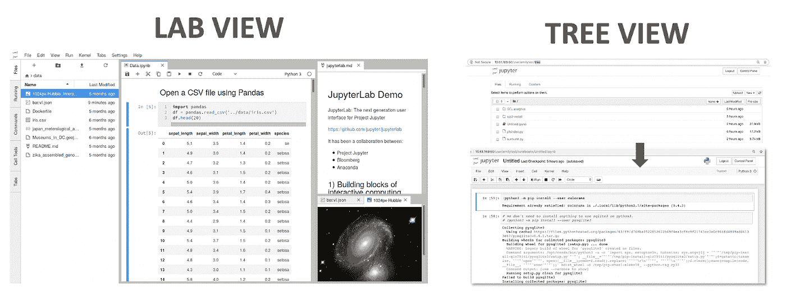
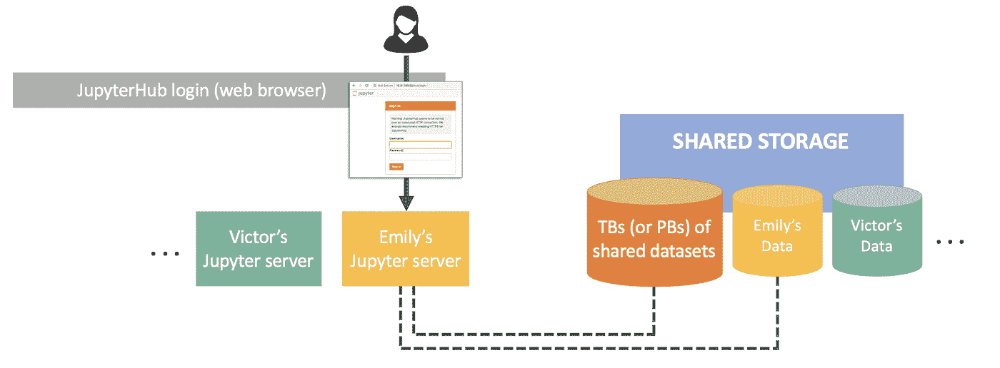

# 从本地到生产的 Jupyter 部署模型

> 原文：<https://towardsdatascience.com/jupyter-deployment-models-from-local-to-production-196da0353dbf?source=collection_archive---------27----------------------->

## 你现在处于哪个阶段？

凯文·杰瑞特在 [Unsplash](https://unsplash.com?utm_source=medium&utm_medium=referral) 上的照片

对于我们这样的书呆子来说，我们的数据分析习惯并不会随着我们合上笔记本电脑而停止。当你坐在数不清的会议上进行无休止的谈话时，你可能已经有了一些认识。对我来说，事实是从我的会议座位上可以看到 90%的开放屏幕显示 Jupyter 笔记本正在运行。

对于我们中的许多人来说，我们的笔记本服务器只是通过`jupyter notebook`或`jupyter notebook --allow-root --no-browser --port=8885`启动的，如果我们喜欢并强行解决我们不想解决的权限和端口问题。

这种方法的科学时间是明确的，但我想快速描绘一些先进的，可扩展的 Jupyter 部署和一些介于`jupyter notebook`和魔法之间的中级水平。

希望你能感觉到什么是可能的。

# 模型 1:在您的笔记本电脑(Mac)上运行 JupyterLab

*(谁在看这个帖子却没有 Mac？)*

如果你只是想增强你的基本 Jupyter 体验，或者你只是想开始，我建议从这里开始。尤其是当你的数据集和实验只存在你的笔记本电脑上的时候。

JupyterLab 是 Jupyter 的一个 web 界面，它允许比传统的“树”视图更广泛的导航和灵活性，如果你启动 vanilla Jupyter，你就会看到它。JupyterLab 让你可以像浏览器一样在多个标签页中工作。

[JupyterLab](https://jupyterlab.readthedocs.io/en/stable/getting_started/overview.html) 提供了比传统的单一窗格“树”视图更丰富的开发体验。

直接从 mac 终端在 JupyterLab 自己的 [conda 环境](https://docs.conda.io/projects/conda/en/latest/user-guide/tasks/manage-environments.html)中运行 JupyterLab:

**先决条件:** [安装康达](https://docs.conda.io/projects/conda/en/latest/user-guide/install/macos.html)。
[Conda](https://docs.conda.io/projects/conda/en/latest/index.html) 使您能够轻松管理软件包和环境，以便您可以在笔记本电脑(或另一台机器)上使用不同的库组合。这是一个非常简单的方法来安装所有你想尝试的有趣的新库。

**从你 Mac 终端运行 JupyterLab:** -
-步骤 1:创建一个新的“JupyterLab”conda 环境
`conda create -n jupyterlab ipython jupyterlab python nodejs` -步骤 2:切换到那个新环境
`source activate jupyterlab` -步骤 3:启动 JupyterLab
`jupyter lab`

该命令将自动启动一个浏览器窗口，但是每次您导航到 http://localhost:8888 时，您将获得您的实验室 UI。

服务器将一直运行，直到您手动关闭它(使用 CTRL-C)或关闭终端窗口。关于开始 JupyterLab 的进一步阅读是[这里](https://jupyterlab.readthedocs.io/en/stable/getting_started/starting.html)。

**看中:** 雅各布·汤姆林森[的这篇](https://twitter.com/_jacobtomlinson)[伟大的文章](https://www.jacobtomlinson.co.uk/posts/2019/how-to-run-jupyter-lab-at-startup-on-macos/)讲述了如何在电脑启动时自动启动 JupyterLab。

# 模型 2:在数据集所在的远程服务器上运行 JupyterLab

也许你听说过“数据科学是导致 Excel 崩溃的任何东西”的说法，接下来的阶段是不适合笔记本电脑的任何东西。随着实验规模的扩大，你可能会遇到这两种情况

*   您的笔记本电脑计算能力不足
*   您的笔记本电脑存储空间不足

无论哪种方式，解决方案都可能是从您的开发运维/IT 团队那里获得一个强大的开发服务器。这个开发服务器将被托管在一个你永远看不到的实验室里。你只要远程访问它。

或者可能仅仅是 Covid 期间的 WFH 让你在通常直接工作的机器上远程工作。

在远程机器上启动 Jupyter 的挑战是访问 UI。

## 场景 A:在你和远程机器之间没有防火墙

将`--ip`参数添加到 jupyter 启动命令中。它设置笔记本服务器监听的 IP 地址(默认值=“localhost”)。

`jupyter notebook --ip=<remote server IP address> --port=8888`

在您的笔记本电脑浏览器中，您可以直接连接到 http:// <remote server="" ip="" address="">:8888/服务器，而不是导航到 http://localhost:8888/。</remote>

**想象一下:** 每次你打开笔记本电脑的时候，你会在你的远程主机上重启你的 Jupyter 吗？

你可以使用一个[终端复用器](https://en.wikipedia.org/wiki/Terminal_multiplexer)，比如 [tmux](https://github.com/tmux/tmux/wiki) 或者 [screen](https://www.gnu.org/software/screen/) 来分离你的远程主机上的会话。这样，会话就不依赖于来自本地主机的连接。

*关于 tmux 和 screen 的比较，可以看看这个* [*StackExchange 帖子*](https://unix.stackexchange.com/questions/549/tmux-vs-gnu-screen) *，但是正如标题警告所说，这是一个基于观点的问题。*

## 场景 B:您的笔记本电脑服务器运行在防火墙后的某个地方，比如公共云中。

说明因云供应商而异(见下文)，但总体步骤如下:

1.  从远程服务器中启动 jupyter
2.  从您的本地机器，配置端口转发。

**端口转发？** 当你启动一个 Jupyter 服务器时，默认情况下，GUI 被托管在****机器上的一个端口**上，在那里服务器被启动**。在这个场景中，[端口转发](https://en.wikipedia.org/wiki/Port_forwarding)告诉您的本地机器接收特定本地端口的任何流量，并将其转发到远程机器上的端口。(*延伸阅读:* [*你 CS 教育的缺失学期*](https://missing.csail.mit.edu/2019/remote-machines/) *)*****

****供应商特定说明:****

**AWS
-官方文档:[为 AWS 深度学习 AMI](https://docs.aws.amazon.com/dlami/latest/devguide/setup-jupyter.html) 设置 Jupyter
-[用户示例](/setting-up-and-using-jupyter-notebooks-on-aws-61a9648db6c5)**

**GCP
-官方文档:[连接到深度学习虚拟机映像的 JupyterLab](https://cloud.google.com/ai-platform/deep-learning-vm/docs/jupyter)
-[用户示例](/running-jupyter-notebook-in-google-cloud-platform-in-15-min-61e16da34d52)(包括更改实例的防火墙设置作为端口转发的替代方案)**

**Azure
-官方文档:[在 Azure 机器学习开发环境](https://docs.microsoft.com/en-us/azure/machine-learning/how-to-configure-environment#jupyter)中配置 Jupyter(使用 [Azure 笔记本](https://notebooks.azure.com/#)作为服务器)**

# **模型 3:在 Kubernetes 集群中运行 JupyterHub，为多个开发人员提供持久的开发环境。**

**这是我的梦想。**

**如果您使用以前的笔记本部署方法之一，**

*   **每次回到电脑前，您需要多长时间才能启动笔记本电脑？**
*   **你能探索多大的数据集？**
*   **你备份你的笔记本吗？**

**如果有人为您提供了一个可靠的开发环境，可以通过浏览器**始终可用**，并且可以访问共享数据集和共享笔记本，会怎么样？(而且，正如 IT 团队可能关心的那样:它是安全的，可跨数十或数百个用户进行管理。)**

**虽然这需要更多的配置——可能由了解您的网络设置的人来执行—[JupyterHub](https://jupyter.org/hub)可能是为整个团队托管自助服务环境的一种很好的方式。**

**JuyterHub 服务持续运行，为用户提供基于浏览器的登录。当用户登录时，会为他们启动一个 Jupyter 服务器，它会自动连接到 a)他们以前登录的个人数据和 b)他们需要试验的任何共享数据集。**

****

**JupyterHub 环境的用户可以快速、持久地访问大型共享数据集和他们自己的私人实验文件夹。**

**这种部署意味着用户不必在服务器之间复制数据，他们可以随时获得高可用性的开发环境，并且他们的实验易于备份和共享。**

**我之前曾[发布过](/jupyter-as-a-service-on-flashblade-3c9ec27f8fcf)关于 IT 团队如何在 Kubernetes 环境中部署 JupyterHub 的详细步骤。我在这里简单总结一下。**

**有 Kubernetes 集群吗？**

****是的，我们今天用 Kubernetes:****

*   **为您的存储服务器安装 [csi 驱动程序](https://kubernetes-csi.github.io/docs/introduction.html)。CSI 驱动程序在后台运行，使 Kubernetes 能够直接使用存储，因此用户可以以完全自动化的自助方式访问数据。**
*   **"[导入](https://github.com/purestorage/helm-charts/blob/master/docs/csi-volume-import.md)"将您的共享数据集 TBs 作为 Kubernetes 卷，这允许您将该数据作为 Kubernetes 集群中的资源进行管理。**
*   **通过头盔部署 [JupyterHub。如果您需要一个示例 JupyterHub values.yaml 文件来进行配置，请随意使用](https://github.com/jupyterhub/helm-chart) [mine](https://github.com/PureStorage-OpenConnect/ai-platform) 。**
*   **您可以将 JupyterHub 与 LDAP 服务器集成，以利用现有的用户帐户。**

**JupyterHub 将在群集外部的 IP 地址上提供登录屏幕，供您网络上的用户使用。当用户登录时，他们可以访问共享数据集以及个人笔记本、绘图和文件的主目录。**

***延伸阅读:* [*Zero to JupyterHub 同 Kubernetes*](https://zero-to-jupyterhub.readthedocs.io/en/latest/) *。***

****我们今天不使用 Kubernetes:** 安装 JupyterHub 更容易！点击查看简单步骤[。](https://tljh.jupyter.org/en/latest/)**

# **结论**

**当你回到电脑前，难道你不想直接跳到你的项目中吗？**

**无论您的实验和数据集位于何处，都有可能消除不断重新部署开发环境的麻烦。用你的时间去做更有用的事情，而不是一遍又一遍地旋转 Jupyter。**