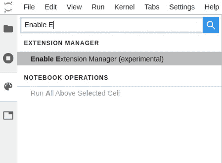
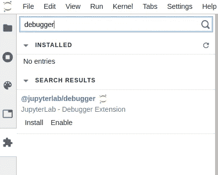
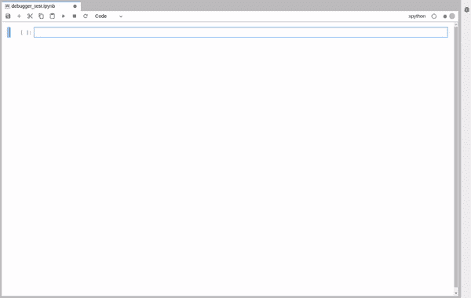
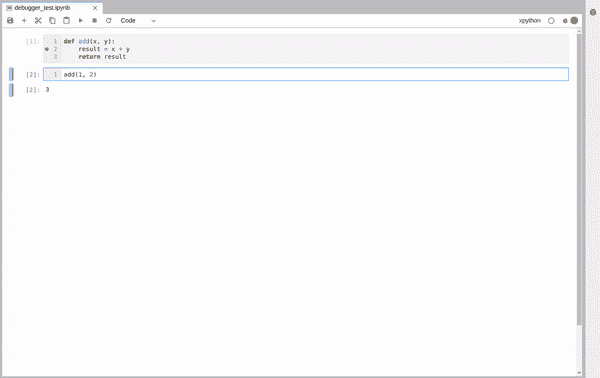

# Jupyter 现在是一个成熟的 IDE

> 原文：<https://towardsdatascience.com/jupyter-is-now-a-full-fledged-ide-c99218d33095?source=collection_archive---------2----------------------->

## 通过 nbdev 和 Jupyter 新的可视化调试器，有文化的编程现在已经成为现实。


在 [Unsplash](https://unsplash.com/s/photos/programming?utm_source=unsplash&utm_medium=referral&utm_content=creditCopyText) 上由 [Max Duzij](https://unsplash.com/@max_duz?utm_source=unsplash&utm_medium=referral&utm_content=creditCopyText) 拍照

笔记本一直是软件思想增量开发的工具。数据科学家使用 Jupyter 来记录他们的工作，探索和实验新的算法，快速勾画新的方法，并立即观察结果。

然而，当时机成熟时，软件开发人员转向经典的 ide(集成开发环境)，如 Visual Studio Code 和 Pycharm，以将想法转换为库和框架。**但是有没有办法将 Jupyter 转变成一个成熟的 IDE，将原始的概念转化成健壮的、可重用的模块？**

为此，来自多个机构的开发者，包括 QuantStack、两个适马、彭博和 fast.ai 开发了两个新颖的工具；Jupyter 的 [nbdev](https://github.com/fastai/nbdev) 和[可视化调试器](https://github.com/jupyterlab/debugger)。

> [学习率](https://www.dimpo.me/newsletter)是我每周给那些对 AI 和 MLOps 世界好奇的人发的简讯。你会在每周五收到我关于最新人工智能新闻、研究、回购和书籍的更新和想法。在这里订阅！

# 识字编程和 nbdev

1983 年，Donald Knuth 提出了一个新的编程范例，叫做[识字编程](http://www.literateprogramming.com/)。用他自己的话说，有文化的编程是一种将编程语言和文档语言结合起来的方法，从而使程序比只用高级语言编写的程序更健壮、更可移植、更容易维护，并且可以说编写起来更有趣。 ***主要思想是把一个程序当作一篇文献，写给人类而不是写给计算机*** *”。*

去年晚些时候，杰瑞米·霍华德和[西尔万·古格](https://github.com/sgugger)被 nbdev 的设计深深吸引。这个框架允许您在熟悉的 Jupyter 笔记本环境中编写代码，在找到给定问题的有效解决方案之前探索和试验不同的方法。然后，使用某些关键字，nbdev 允许您将有用的功能提取到一个成熟的 python 库中。

更具体地说，nbdev 补充了 Jupyter，增加了对以下内容的支持:

*   遵循最佳实践，从笔记本中自动创建 python 模块
*   在标准 IDE 中编辑和导航代码
*   将任何更改同步回笔记本
*   从代码中自动创建可搜索的超链接文档
*   pip 安装程序很容易上传到 PyPI
*   测试
*   持续集成
*   版本控制冲突处理

nbdev 使软件开发人员和数据科学家能够在不脱离 Jupyter 环境的情况下，遵循最佳实践，开发文档完备的 python 库。nbdev 在 PyPI 上，要安装它，只需运行:

```
pip install nbdev
```

对于[可编辑安装](https://stackoverflow.com/questions/35064426/when-would-the-e-editable-option-be-useful-with-pip-install)，使用以下:

```
git clone https://github.com/fastai/nbdev
pip install -e nbdev
```

首先，阅读由开发者撰写的优秀的[博客文章](https://www.fast.ai/2019/12/02/nbdev/)，描述 nbdev 背后的概念，并遵循[文档](http://nbdev.fast.ai/)中的详细教程。

# 缺失的部分

尽管 nbdev 涵盖了 Jupyter 内部 IDE 类开发所需的大部分工具，但仍然缺少一部分；可视化调试器。

因此，来自几个机构的开发人员团队昨天宣布了 Jupyter 可视化调试器的首次公开发布。调试器提供了您对 IDE 调试器的大部分期望:

*   变量资源管理器、断点列表和源代码预览
*   导航调用堆栈的可能性(下一行、进入、退出等。)
*   直观地在感兴趣的行旁边设置断点的能力
*   指示当前执行停止位置的标志

为了利用这个新工具，我们需要一个在后端实现 *Jupyter 调试协议*的内核。因此，第一步是安装这样一个内核。目前唯一实现的是`[xeus-python](https://github.com/jupyter-xeus/xeus-python)`。要安装它，只需运行:

```
conda install xeus-python -c conda-forge
```

然后，运行 Jupyter Lab，在侧边栏搜索`Extension Manager`并启用它，如果你还没有这么做的话。



启用扩展管理器

一个新的按钮将出现在侧边栏上。要安装调试器，只需转到新启用的`Extension Manager`按钮并搜索`debugger`扩展。



启用调试器

安装后，Jupyter 实验室将要求您执行构建，以包括最新的变化。接受它，几秒钟后，你就可以走了。

为了测试调试器，我们创建了一个新的`xpython`笔记本，并编写了一个简单的函数。我们照常运行该函数，并观察结果。要启用调试器，请按窗口右上角的相关按钮。



启用调试器

现在，我们准备再次运行该函数。只有这一次，执行将在我们设置的断点处停止，我们将能够探索程序的状态。



调试代码

我们看到程序在断点处停止了。打开调试器面板，我们可以看到变量、断点列表、调用堆栈导航和源代码。

Jupyter 新的可视化调试器提供了 IDE 调试器所能提供的一切。它仍在开发中，因此，新的功能是预期的。它的开发者计划在 2020 年发布的一些功能有:

*   在变量浏览器中支持丰富的 mime 类型呈现
*   支持用户界面中的条件断点
*   从 JupyterLab Voilà预览扩展启用 [Voilà仪表板](https://github.com/voila-dashboards/voila/)的调试
*   启用尽可能多内核的调试

# 结论

Jupyter 笔记本一直是探索和试验代码的好方法。然而，软件开发人员通常求助于一个成熟的 IDE，复制工作的部分，以产生一个生产就绪的库。

这不仅效率低下，也是 Jupyter 产品的损失；识字编程。此外，笔记本电脑提供了一个更好的文档环境，包括图表、图像和视频，有时还有更好的工具，如自动完成功能。

nbdev 和 visual debugger 是两个旨在缩小笔记本和 ide 之间差距的项目。在这个故事中，我们看到了什么是 nbdev，以及它是如何使识字编程成为现实的。此外，我们发现了一个新项目 Jupyter 的可视化调试器如何提供缺失的部分。

> **我叫 Dimitris Poulopoulos，是希腊比雷埃夫斯大学***[**BigDataStack**](https://bigdatastack.eu/)***的机器学习研究员和博士(c)。我曾为欧洲委员会、欧盟统计局、国际货币基金组织、欧洲中央银行、经合组织和宜家等主要客户设计和实施人工智能和软件解决方案。如果你有兴趣阅读更多关于机器学习、深度学习和数据科学的帖子，请在 twitter 上关注我的*** *[**中**](https://medium.com/@dpoulopoulos) **、**[**LinkedIn**](https://www.linkedin.com/in/dpoulopoulos/)**或**[**@ james2pl**](https://twitter.com/james2pl)**。****