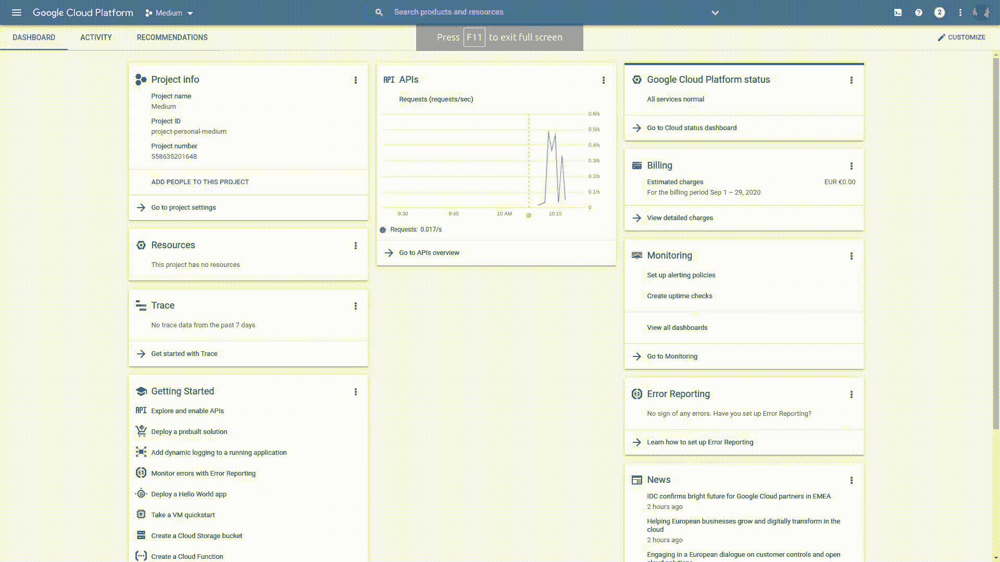
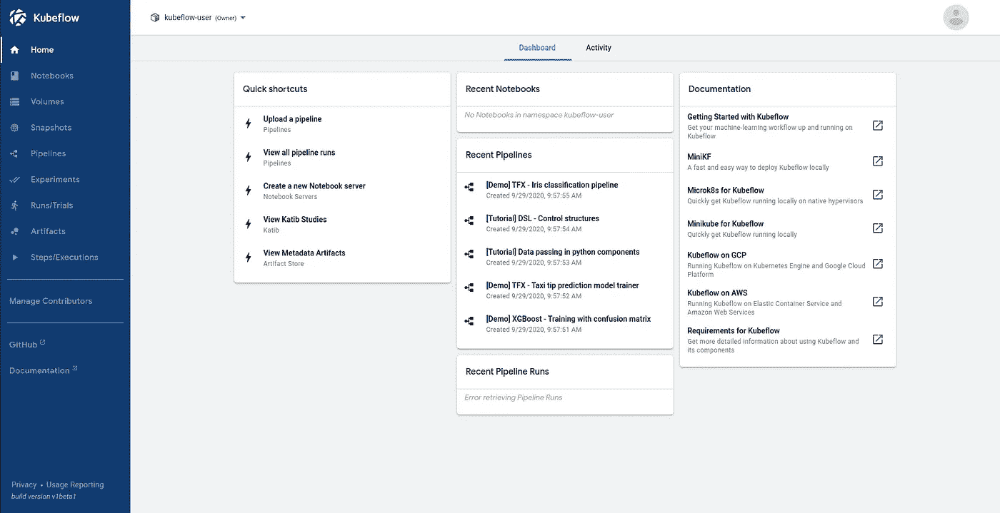
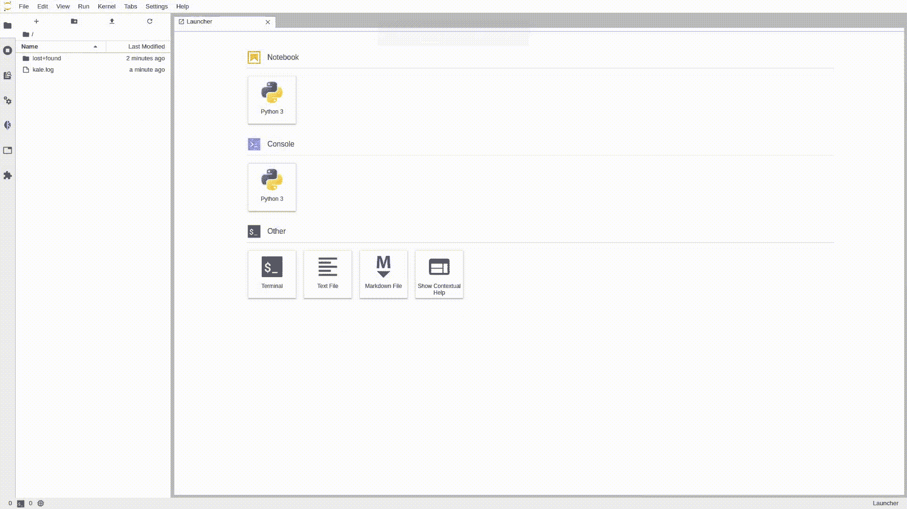
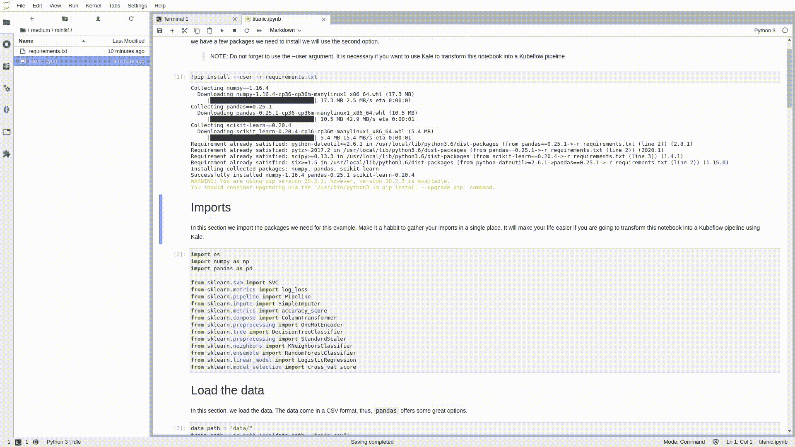
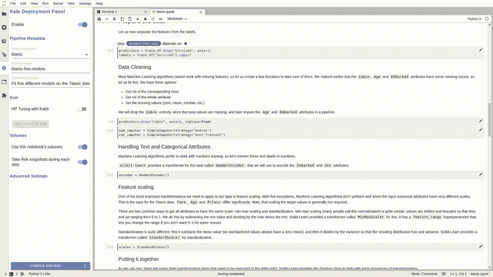

# Jupyter 准备生产；原样

> 原文：<https://towardsdatascience.com/jupyter-is-ready-for-production-as-is-b36f1d1ca8f8?source=collection_archive---------18----------------------->

## 无需编写一行代码，即可将您的笔记本草稿转化为生产就绪的 Kubeflow 管道


图片由 [16853182](https://pixabay.com/users/16853182-16853182/?utm_source=link-attribution&utm_medium=referral&utm_campaign=image&utm_content=5263284) 来自 [Pixabay](https://pixabay.com/?utm_source=link-attribution&utm_medium=referral&utm_campaign=image&utm_content=5263284)

机器学习项目通常由多个相互关联的步骤组成:数据采集、数据处理、数据建模、微调、测试等。这些步骤中的每一步都可以是一个独立的过程，以自己的节奏运行，具有明确定义的输入和输出。因此，数据科学家和 ML 工程师倾向于认为这些项目像管道。

> 数据科学家的理想场景是将 Jupyter 笔记本提供的实验环境转变为生产就绪的 ML 管道。

然而，ML 管道是一种很难编码的东西；连接到数据源，将正确的输入传递到每个步骤，序列化输出，检查点，找出依赖关系……**如果我们能够自动化配置工作流执行所需的样板代码的苦差事，那不是很好吗？**

数据科学家的理想场景是将 Jupyter 笔记本提供的实验环境转变为生产就绪的 ML 管道。嗯，我们今天就可以做。此外，我们无需编写任何代码就能做到这一点。

> [学习率](https://mailchi.mp/d2d2d4a109b5/learning-rate-newsletter)是为那些对 AI 和 MLOps 的世界感到好奇的人准备的时事通讯。你会在每周五收到我关于最新人工智能新闻和文章的更新和想法。在这里订阅！

# KubeFlow 简介

Kubeflow 是一个开源项目，致力于使 ML 项目的部署更加简单、可移植和可伸缩。来自[文档](https://www.kubeflow.org/):

> Kubeflow 项目致力于使在 Kubernetes 上部署机器学习(ML)工作流变得简单、可移植和可扩展。我们的目标不是重新创建其他服务，而是提供一种简单的方法来将 ML 的最佳开源系统部署到不同的基础设施上。无论你在哪里运行 Kubernetes，你都应该能够运行 Kubeflow。

但是我们如何开始呢？我们需要 Kubernetes 集群吗？我们应该自己部署整个系统吗？我的意思是，你看过库伯弗洛的[清单回购](https://github.com/kubeflow/manifests)吗？

> 在 Kubeflow 上运行笔记本所需要的只是一个谷歌云平台(GCP)账户和你的旧笔记本文件！

此外，假设我们已经启动并运行了 Kubeflow 我们如何将我们的笔记本电脑转变为库巴流管道(KFP)？我们必须建立 docker 图像吗？你看过 [KFP DSL](https://kubeflow-pipelines.readthedocs.io/en/latest/source/kfp.dsl.html) 吗？我认为重点是消除样板代码。

嗯，我有好消息；我们所需要的只是一个谷歌云平台(GCP)账户和你的旧笔记本文件！

## 部署 Kubeflow

我将保持简单，不使它变得愚蠢。事实是，只需几分钟就可以轻松运行 Kubeflow 的单节点实例。我们需要的只是一个 GCP 帐户和从市场部署应用程序的能力。我们要用 [MiniKF](https://www.kubeflow.org/docs/started/workstation/getting-started-minikf/) ！



MiniKF 部署—作者图片

1.  去你的 GCP *控制台*
2.  搜索市场然后找到 *MiniKF*
3.  点击它并选择*启动*
4.  设置 VM 配置，(由于我的配额，我通常将数据磁盘更改为标准持久磁盘)并单击 deploy。

就是这样！部署最多需要十分钟，您可以按照屏幕上的说明观看进度；ssh 进入机器，在终端上运行`minikf`,等待直到您准备好端点和凭证。


MiniKF 的提供已完成—图片由作者提供

现在，我们准备访问 Kubeflow 仪表板。点击网址，输入你的凭证，你就可以开始了！



Kubeflow 仪表板—按作者分类的图像

## 运行 Jupyter 服务器

为了运行我们的实验，我们需要一个 Jupyter 笔记本实例。在 Kubeflow 中创建一个 Jupyter 笔记本相对容易。我们首先需要创建一个 Jupyter 服务器并连接到它。让我们这样做:

1.  从左侧面板中选择笔记本
2.  选择`New Server`按钮
3.  填写服务器的名称，并请求您需要的 CPU 和 RAM 数量
4.  让 Jupyter 笔记本图像保持原样——这对本教程至关重要(`jupyter-kale:v0.5.0-47-g2427cc9` —注意图像标签可能不同)


创建 Jupyter 服务器—作者图片

完成这四个步骤后，等待笔记本服务器准备好并连接。你将被转移到你熟悉的 JupyterLab 工作区。

# Jupyter 到 ML 管道

那么，我们为什么要做这些设置呢？我们的目标是将我们的笔记本电脑转变为生产就绪的 ML 管道。我们如何做到这一点？

在这个例子中，我们将使用众所周知的*泰坦尼克号*数据集来演示一个我们可以遵循的简单工作流程。首先，在 JupyterLab 环境中创建一个新的终端，并克隆这个示例。

```
git clone [https://github.com/dpoulopoulos/medium.git](https://github.com/dpoulopoulos/medium.git)
```

如果您以前没有在 JupyterLab 中创建过终端，请注意 JupyterLab 终端提供了对系统 shells(例如 bash、tsch 等)的全面支持。)和 Windows 上的 PowerShell。您可以使用终端在系统 shell 中运行任何东西，包括 vim 或 emacs 之类的程序。所以你也可以用它来克隆来自 [GitHub](https://github.com/dpoulopoulos/medium) 的任何回购。



在 JupyterLab 中克隆泰坦尼克号的例子——图片由作者提供

克隆了回购之后，可以在`medium > minikf > titanic.ipynb`中找到泰坦尼克的例子。您可以花一些时间浏览笔记本，但是有一个关键的步骤您需要首先运行:取消第一个代码单元的注释，并运行它以将必要的依赖项安装到您的环境中。

```
!pip install --user -r requirements.txt
```

运行这个单元后，重启内核，就可以开始了。如果你检查笔记本的左面板，你会看到一个紫色的图标。这是有趣的开始…按下它来启用羽衣甘蓝扩展。你会自动看到每个单元格都被标注了。



启用 Kale 扩展-按作者分类的图像

你可以看到笔记本是分节的；导入、数据加载部分、数据处理、模型训练和评估等。这正是我们用羽衣甘蓝注释的。现在，这个笔记本是预先注释好的，但是你可以随意使用。您可以创建新的管道步骤，但是不要忘记添加它们的依赖项。

在任何情况下，你都可以点击位于 Kale 部署面板底部的`COMPILE AND RUN`按钮。无需编写一行代码，您的笔记本将被转换为 Kubeflow 管道，该管道将作为新实验的一部分执行。



从 Jupyter 笔记本到 Kubeflow 管道——作者图片

按照 Kale 提供的链接观看跑步实验。几分钟后，管道将成功完成其任务。这是图表的最终视图(不要忘记切换左上角的`Simplify Graph`选项):


泰坦尼克号管道——作者图片

恭喜你！您刚刚将您的笔记本变成了一个管道，而没有编写一行代码，最重要的是，没有偏离常规程序。

# 结论

最后，您可以对这个数据集做更多的工作；可以多分析一下，添加交叉特征或者训练不同的分类器。事实上，在未来的故事中，我们将看到如何运行超参数调优，而无需添加任何额外的代码行。但是在数据集上实现最佳的准确性并不是本文的重点。

我们看到了如何在不编写任何样板代码的情况下启动单节点 Kubeflow 实例、创建笔记本服务器并将简单的 Jupyter 笔记本转换为 Kubeflow 管道。所以，去吧；实现自己的想法，一键变成 ML 管道！最后，不要忘记停止你的实例，以避免累积成本！

## 关于作者

我叫[迪米特里斯·波罗普洛斯](https://www.linkedin.com/in/dpoulopoulos/)，我是一名为[阿里克托](https://www.arrikto.com/)工作的机器学习工程师。我曾为欧洲委员会、欧盟统计局、国际货币基金组织、欧洲中央银行、经合组织和宜家等主要客户设计和实施人工智能和软件解决方案。

如果你有兴趣阅读更多关于机器学习、深度学习、数据科学和数据运算的帖子，请在 twitter 上关注我的[媒体](https://medium.com/@dpoulopoulos)、 [LinkedIn](https://www.linkedin.com/in/dpoulopoulos/) 或 [@james2pl](https://twitter.com/james2pl) 。

所表达的观点仅代表我个人，并不代表我的雇主的观点或意见。