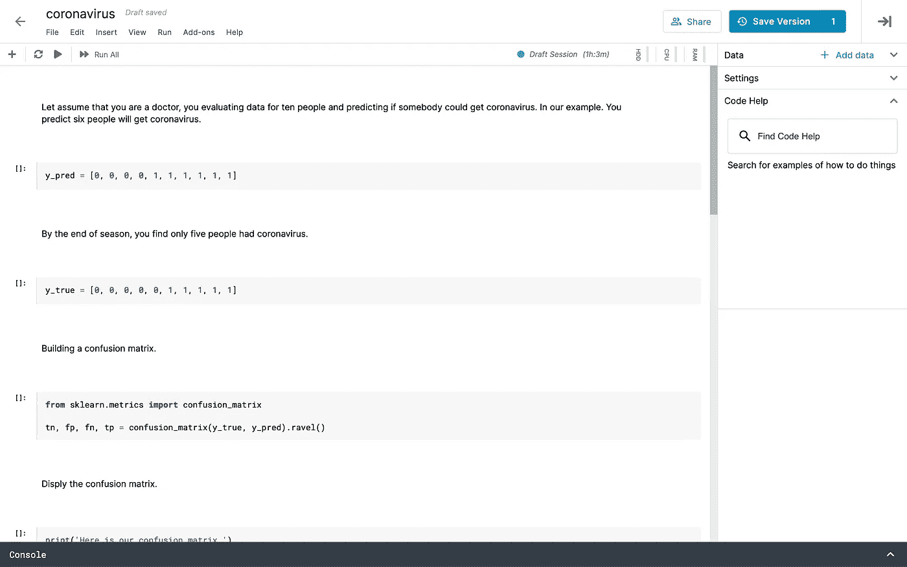
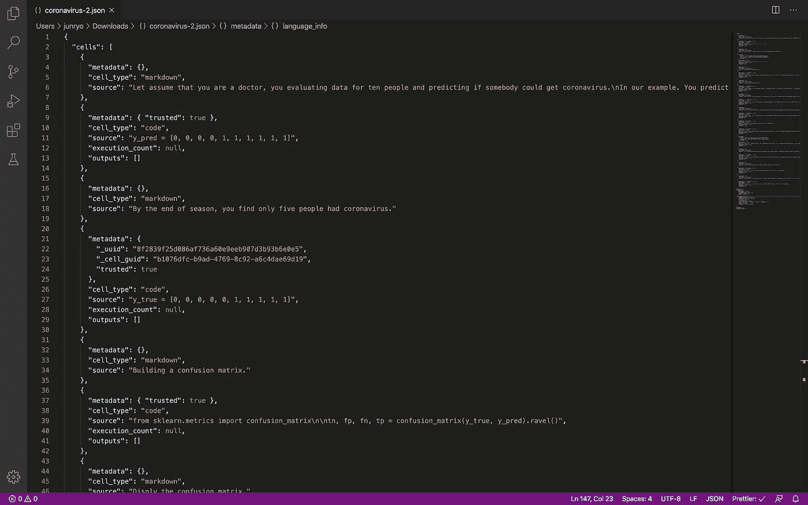
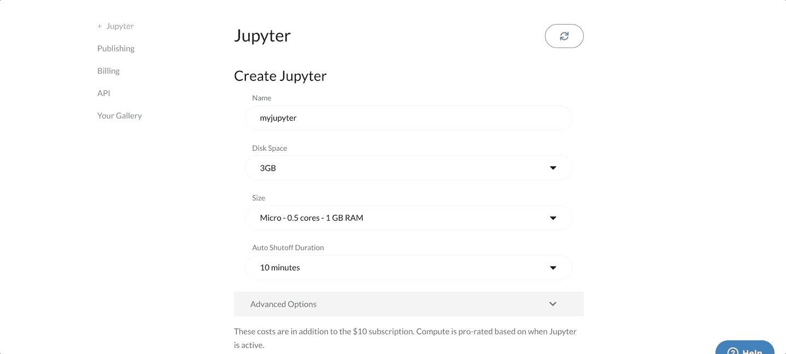
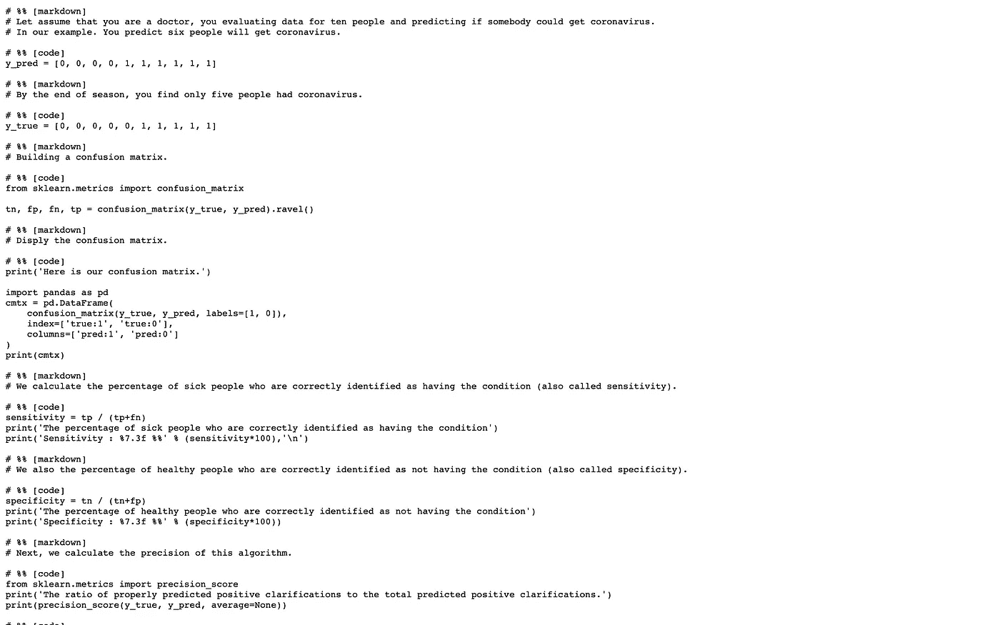

# Jupyter 笔记本:机器学习的简短介绍

> 原文：<https://towardsdatascience.com/jupyter-notebook-a-very-short-introduction-for-machine-learning-f1b9de948c2f?source=collection_archive---------20----------------------->

## Jupyter = Julia + Python + R


马里乌斯·马萨拉尔在 [Unsplash](https://unsplash.com?utm_source=medium&utm_medium=referral) 上的照片

如果你是一名数据科学家，你可能会每天记录完整的分析过程，就像其他科学家使用实验室笔记本记录测试、进度、结果和结论一样。你用什么工具来做同样的事情？我每天都在使用 Jupyter 笔记本，让我给你简单介绍一下。

*   什么是 Jupyter 笔记本？
*   为什么它对数据分析有用。
*   Jupyter 笔记本有什么特点？
*   在机器学习中执行简单的数据分析。

# Jupyter 笔记本简介

## 什么是 Jupyter 笔记本？

Jupyter 项目是 I-Python 项目的一个衍生项目，I-Python 项目最初只为 Python 语言提供了一个接口，并继续为 Jupyter 提供规范的 Python 内核。Jupyter 这个名字本身就来源于 Julia、Python 和 r 的组合。



这是使用 Jupyter 时的示例打开页面

## 为什么有用？

Jupyter 项目的存在是为了开发一个开放源代码平台、开放标准和跨多种编程语言(例如 Python、R 和 MATLAB)的交互式计算服务。
Jupyter 是一个基于云生态系统的网络应用，可以从很多地方获得，比如土星云。它也可以在各种各样的装置上本地使用。其中包含实时代码、等式、图表、交互式应用程序和降价文本。

## Jupyter 笔记本的特点？

Jupyter 笔记本基本上是一个带有大量注释的 JSON 文件。笔记本有以下三个主要部分。

*   **元数据:**定义的数据字典，用于设置和显示笔记本。
*   **笔记本格式:**用于创建笔记本的软件的版本号。版本号用于向后兼容。
*   **单元格列表:**有三种不同类型的单元格——降价(显示)、代码(激励)和输出。



如果在文本编辑器中打开 IPYNB 文件，您将看到 Jupyter 节点的基本内容

## 我们将如何使用 Jupyter 笔记本电脑？

有如下四个步骤。

*   **第一步:**为数据分析创建一个新的笔记本。
*   **第二步:**添加您的分析步骤、编码和输出。
*   **第三步:**围绕你的分析，组织和展示降价，传达整个故事。
*   **最后一步:**其他人可以通过修改参数和数据来使用交互式笔记本，以记录他们所做更改的效果。

# 获得带有土星云的 Jupyter 笔记本

获得 Jupyter 笔记本的最快方法之一是在 Saturn Cloud 上注册一个帐户。它允许您在云中快速启动 Jupyter 笔记本电脑，并根据您的需求进行扩展。

*   它部署在您的云中，因此无需迁移您的数据。通过 Jupyter 使用整个 Python 生态系统。
*   轻松构建环境和导入包(Pandas、NumPy、SciPy 等)。
*   您可以发布笔记本，并在云托管的 Jupyter 上轻松协作。
*   从笔记本电脑到服务器再到集群的可扩展 Dask。



以上是在土星云上创建 Jupyter 笔记本的步骤。

进一步见:[https://www . Saturn cloud . io](https://www.saturncloud.io)

# 我们能把 Jupyter 笔记本转换成 Python 脚本吗？

是的，您可以将 Jupyter 笔记本转换为 Python 脚本。这相当于将每个代码块(单元格)的内容复制并粘贴到单个。py 文件。降价部分也作为注释包含在内。

转换可以在命令行中完成，如下所示。

```
jupyter nbconvert --to=python notebook-name.ipynb
```



从笔记本到脚本的示例

# 使用 Jupyter 笔记本进行 ML 的一个例子

假设你是一名医生，你正在评估一千人的数据，并预测某人是否会感染冠状病毒。

我们将通过计算 TP、TN、FP、FN、TPR、TNR、PPV、NPV、FPR 和 ACC 等指标来逐步评估我们的算法。让我们假设你熟悉这些指标(如果不熟悉，请进一步阅读 here⁴).

在我们尝试评估我们的算法之前，有两件事。

*   我们预测的:`y_pred`。
*   我们得到的结果:`y_true`。

我们创建一个新的木星笔记本文件— `“coronavirus.ipynb”` 如下。

# 结论

我们学习了如何用土星云把 Jupyter 笔记本放到云上。我们也接触了笔记本的结构。我们看到了开发笔记本电脑时使用的典型工作流程。最后，我们在 ML 中做了一些简单的数据分析。

# 参考

[1] Jupyter 主页:[https://jupyter.org](https://jupyter.org)

【2】土星云:[https://www . Saturn Cloud . io](https://www.saturncloud.io)

[3]Github 上的笔记本:

[https://github . com/house cricket/notebooks/blob/master/coronavirus . ipyn](https://github.com/housecricket/notebooks/blob/master/coronavirus.ipynb)

[4]测试机器学习算法准确性的度量标准[https://medium . com/datadriveninvestor/Metrics-to-Test-the-Accuracy of-Machine-Learning-Algorithms-67 ADF 367 f 60](https://medium.com/datadriveninvestor/metrics-to-test-the-accuracy-of-machine-learning-algorithms-67adf367f60)