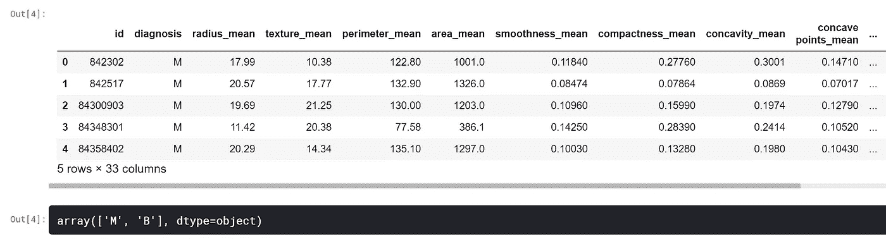
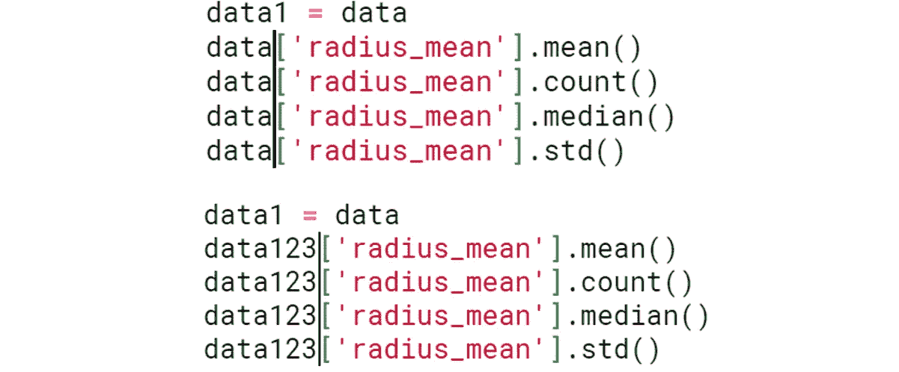
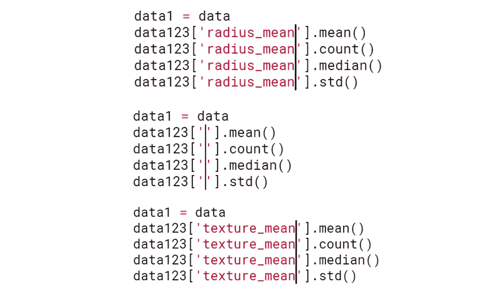
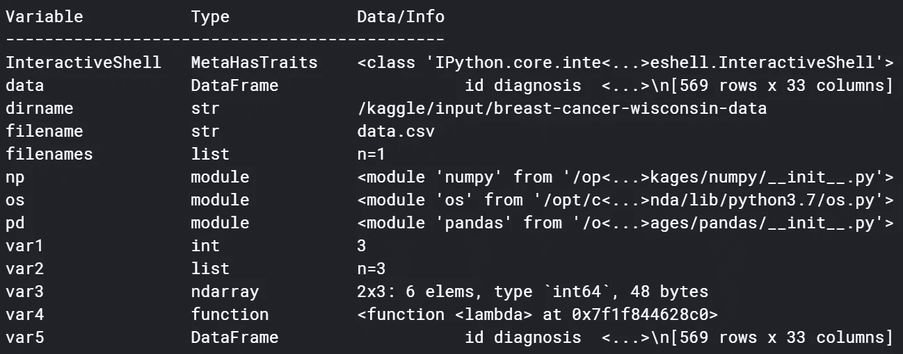
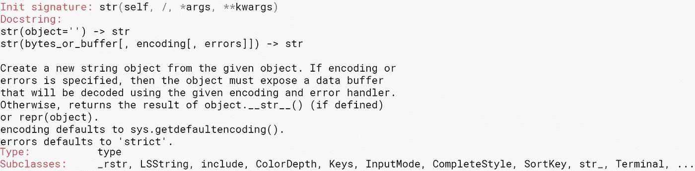
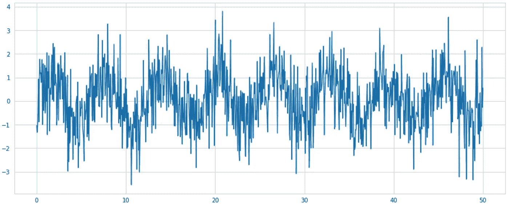
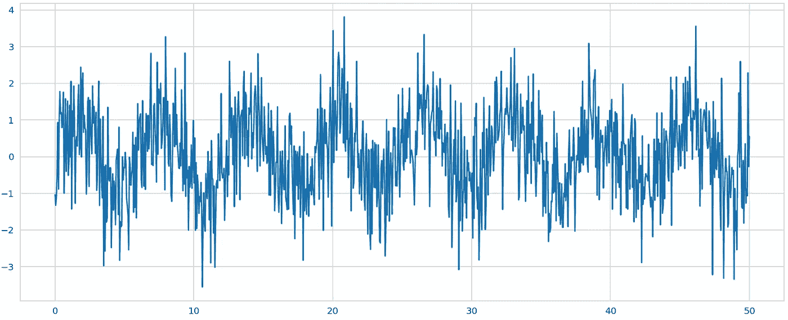

# Jupyter 笔记本基本生产力黑客

> 原文：<https://towardsdatascience.com/jupyter-notebook-essential-productivity-hacks-9b7d69073769?source=collection_archive---------53----------------------->

[来源](https://pixabay.com/photos/computer-laptop-work-place-mouse-2982270/)。图片免费分享。

## 更高效地创建和编码

Jupyter 笔记本是一个动态的流行工具，帮助用户创建可读的分析，同时以一种有组织的方式组合代码、图像、注释、公式和图表。Jupyter 笔记本的前身是 IPython 笔记本，它是为 Ju lia、Python 和 R thon 设计的，已经席卷了编码界。在本文中，您将了解到一些使用 Jupyter 时最有用的生产力技巧。

# 多单元输出

Jupyter notebooks 用户不需要调用`print()`，只需调用单元格末尾的一个函数就可以得到结果。不幸的是，默认情况下，Jupyter 笔记本不能在同一个单元中输出两个输出。为了输出多个单元，需要从`IPython`重新配置外壳。

# 多光标

使用 Ctrl+单击创建多光标。无论在哪里

或者，例如，考虑更改列的名称。

# 列出所有变量

因为 Jupyter 笔记本是基于单元格的，所以很容易忘记变量和它们保存的值。然而，您可以通过调用`%whos`来跟踪所有变量——它们的名称、数据类型以及它们存储的数据。它存储你加载的所有东西——模块、数据帧、数组、函数，所有的东西。这在数据分析中非常方便，因为许多错误通常是由于忘记变量名和值造成的。

# 乳液

您可以在减价单元格中键入 LaTeX，方法是将 LaTeX 括在美元(`$`)符号中。这在交流公式和变量之间的关系时特别有用。

您可以在此了解如何在 LaTeX 中构建更多数学结构:

 [## 面向数据科学家的乳胶，不到 6 分钟

### 任何数据科学简历的必备技能

towardsdatascience.com](/latex-for-data-scientists-in-under-6-minutes-3815d973c05c) 

# 轻松链接到功能文档

如果你对任何函数的作用有疑问，只需输入`?name_of_function`就可以启动该函数的文档和用法。

# 高分辨率绘图

在`matplotlib`和`seaborn`中创建的标准图可以以更高的分辨率变得更加清晰。为了演示，让我们首先创建一个具有正常随机性的标准正弦波图。

为了创造更清晰的思路，加上`%config InlineBackend.figure_format =’retina’`。

线条、数字、注释和其他情节元素将变得更加清晰。

# 更改单元格语言

要更改单元格的语言，请在单元格顶部键入以下命令之一:

*   `%%bash`
*   `%%HTML`
*   `%%python2`
*   `%%python3`
*   `%%ruby`
*   `%%perl`

您还可以使用 HTML 来嵌入视频、图像或显示其他内容。

# 如果你喜欢这个，

你可能会喜欢我的其他一些文章。

 [## 设计熊猫数据框架:不仅仅是数字

### 数据帧是 Python 中操作和存储数据的最标准的方法——但是您知道您可以存储一个…

medium.com](https://medium.com/analytics-vidhya/styling-pandas-dataframes-more-than-just-numbers-4bbb790fb919)  [## 真正的人工智能:理解外推 vs 概括

### 机器学习模型不需要智能，它们的大多数应用都需要执行任务，如…

medium.com](https://medium.com/swlh/real-artificial-intelligence-understanding-extrapolation-vs-generalization-b8e8dcf5fd4b)