# 使用 Docker 映像的 AWS EC2 实例中的 Jupyter 笔记本

> 原文：<https://towardsdatascience.com/jupyter-notebook-in-a-docker-container-on-aws-ec2-instance-7efc51459d6f?source=collection_archive---------38----------------------->

## 数据科学和机器学习专业人员的最佳可能世界


在 [Unsplash](https://unsplash.com?utm_source=medium&utm_medium=referral) 上由 [Zeshalyn Capindo](https://unsplash.com/@zeshalynkristine?utm_source=medium&utm_medium=referral) 拍摄的照片

大多数数据科学和机器学习专业人士都喜欢 Jupyter 笔记本。除了少数异常情况，大多数数据科学和机器学习工作都发生在云中。所以别无选择，只能在云上使用 Jupyter。

在我的上一篇文章中，我解释了如何在 AWS Linux 实例上下载 Jupyter 笔记本，并使用 Xming 和 X11 转发在客户机上访问它。下面是那篇文章的链接

[](/jupyter-notebook-on-aws-ec2-instance-f869f5aa4848) [## AWS EC2 实例上的 Jupyter 笔记本

### 无处不在的云和 Jupyter 可用性的完美结合

towardsdatascience.com](/jupyter-notebook-on-aws-ec2-instance-f869f5aa4848) 

在本文中，我将解释如何通过 Docker 映像直接访问 AWS EC2 实例中的 Jupyter 笔记本。不需要在 AWS EC2 实例中安装 Anaconda 或 Jupyter。

我假设你已经有了一个 AWS EC2 实例，并且知道如何通过 [Putty](https://www.putty.org/) 访问它

**必备工具**

确保您拥有最新版本的默认操作系统包。尤其是检查是否安装和配置了防火墙相关的软件包。我在 AWS EC2 上使用 Redhat Linux 实例。

首先要确认的是 iptables——安装了服务。如果没有，通过 yum 安装

```
sudo yum install iptables-services
```

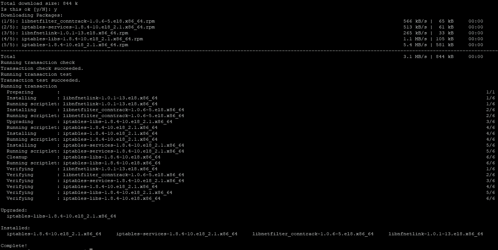

作者图片

## 码头发动机安装

现在您已经准备好安装 Docker 引擎了。我按照下面链接的说明在我的 Red Hat Linux 实例上安装了 Docker 引擎。如果您的实例使用不同的操作系统，请查看下面链接中针对该操作系统的步骤。

[](https://docs.docker.com/engine/install/centos/) [## 在 CentOS 上安装 Docker 引擎

### 要在 CentOS 上开始使用 Docker 引擎，请确保您满足先决条件，然后安装 Docker。要安装…

docs.docker.com](https://docs.docker.com/engine/install/centos/) 

a.先做第一件事；运行以下命令安装所有 yum 实用程序

```
sudo yum install -y yum-utils
```

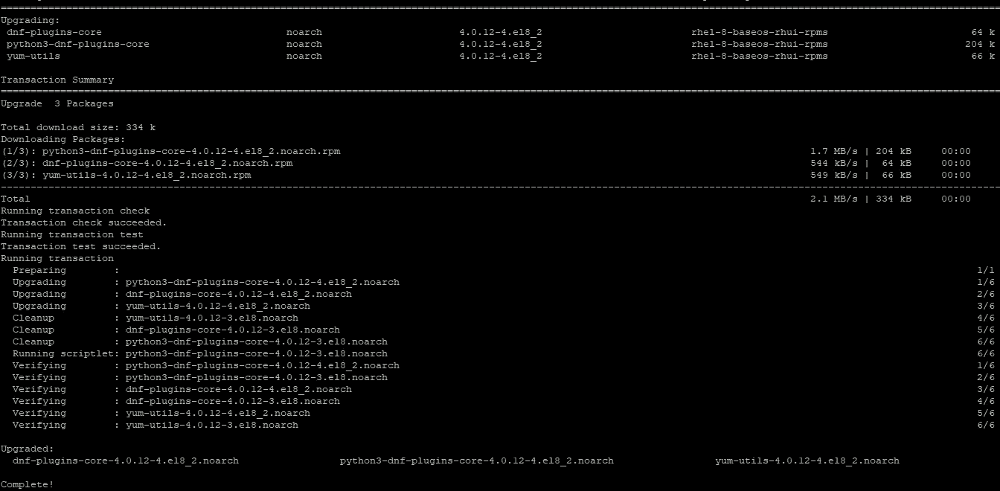

作者图片

b.获取最新的 docker 存储库

```
sudo yum-config-manager --add-repo  [https://download.docker.com/linux/centos/docker-ce.repo](https://download.docker.com/linux/centos/docker-ce.repo)
```

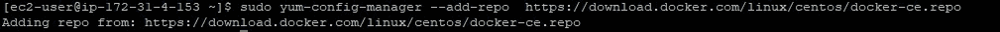

c.现在安装最新版本的 docker 引擎和容器

```
sudo yum install docker-ce docker-ce-cli containerd.io
```

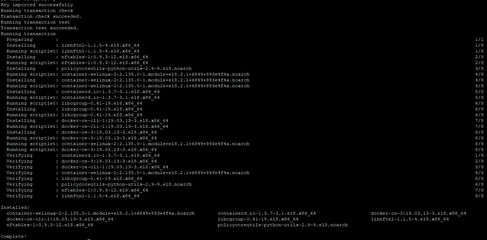

作者图片

d.启动 docker 服务。

```
sudo systemctl start docker.service
```

如果您没有收到任何错误消息，您的 docker 服务已经成功启动。

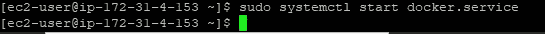

作者图片

e.您还可以检查 docker 服务的状态。

```
sudo systemctl status docker.service
```

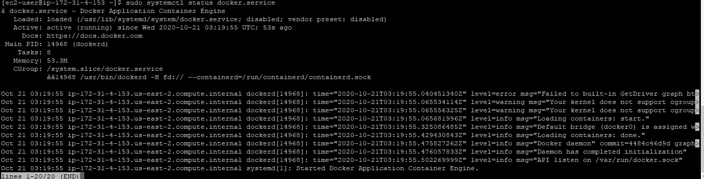

作者图片

恭喜你！！您已经成功安装了 docker 引擎。现在，您已经准备好提取 Jupyter 笔记本图像。

# Jupyter 笔记本

是时候拉 Jupyter 笔记本镜像了。

a.运行下面的命令来提取 docker 映像并启动 Jupyter notebook。

```
sudo docker run -p 8888:8888 jupyter/scipy-notebook
```

等待映像下载和提取完成。

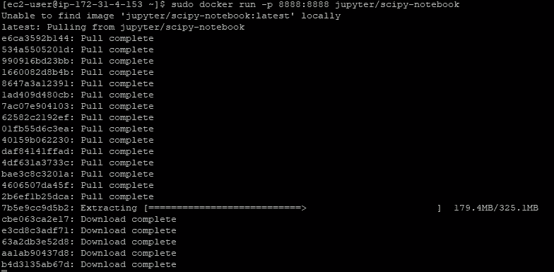

作者图片

您将收到一条消息，表明 Jupyter notebook 正在运行，其中包含一个指向 Jupyter notebook 的链接。

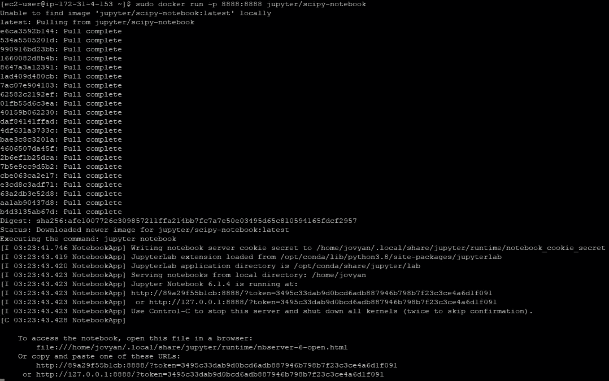

作者图片

b.复制链接并删除 127.0.0.1 和您实例的公共 IP 地址。您可以在 EC2 Instance Connect 选项卡中看到您的实例的公共 IP 地址。

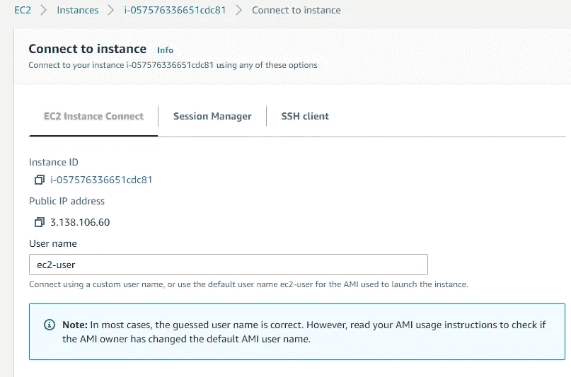

作者图片

c.如果您收到超时消息或站点无法访问消息，您的实例可能不允许在端口 8888 连接。

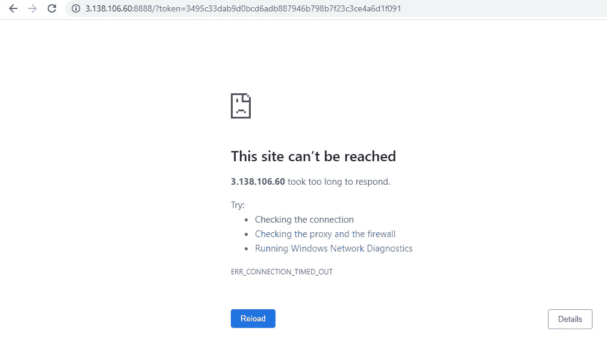

作者图片

d.转到 AWS 实例的 security 选项卡，单击安全组名称。

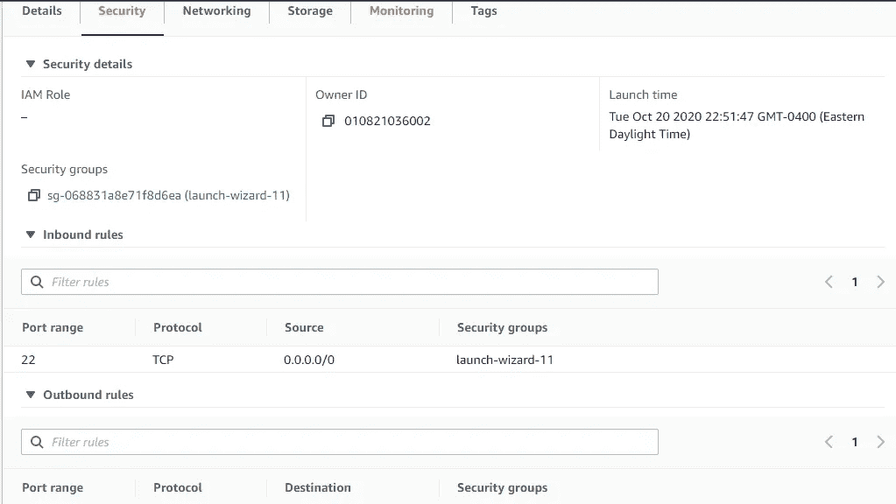

作者图片

e.单击 Edi 入站规则按钮。

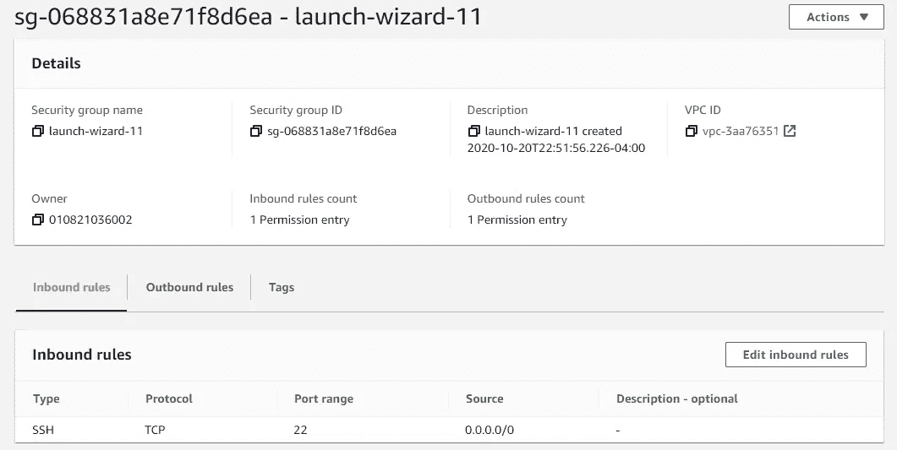

作者图片

e.如下所示，为端口 8888 添加一个规则，并保存该规则。

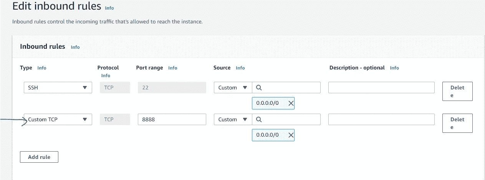

作者图片

f.现在刷新你的浏览器。朱庇特笔记本会出现。

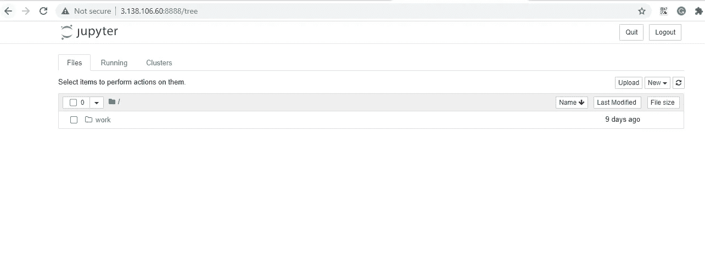

作者图片

恭喜你！！您的 Jupyter 笔记本正在等待您的下一次数据科学或机器学习冒险！

## 结论

云和 Docker 图像正在成为数据科学和机器学习专业人士生活中不可避免的一部分。Docker 图像就像已经为您完成的工作。尽可能地使用它来减少你在项目中的周转时间。