# AWS EC2 实例上的 Jupyter 笔记本

> 原文：<https://towardsdatascience.com/jupyter-notebook-on-aws-ec2-instance-f869f5aa4848?source=collection_archive---------18----------------------->

## 无处不在的云和 Jupyter 可用性的完美结合


罗伯特·科林斯在 [Unsplash](https://unsplash.com?utm_source=medium&utm_medium=referral) 上拍摄的照片

Jupyter 是数据科学和机器学习专业人员使用最多的开发工具。考虑到大多数数据科学和机器学习项目都涉及到在云上处理数据，所以在云上使用 Jupyter 笔记本是有意义的。Jupyter 在无处不在的云实例上的灵活性是一个双赢的组合。

在本文中，我将向您介绍在 AWS EC2 实例上从 Linux 实例安装和运行 Jupyter 笔记本的步骤。

**必备工具**

我假设您已经有了一个 AWS EC2 实例，并且知道如何通过 [Putty](https://www.putty.org/) 访问它。

确保您已经在 Putty 中配置了 X11 转发。


作者图片

为了在 AWS 实例上启动 Jupyter notebook 并在您的计算机上访问它，您还需要 Xming 工具。Xming 可以从下面的链接下载

[](http://sourceforge.net/project/downloading.php?group_id=156984&filename=Xming-6-9-0-31-setup.exe) [## Xming X Server for Windows

### 免费下载 Xming X Server for Windows。系统服务器。Xming 是领先的 X 窗口系统…

sourceforge.net](http://sourceforge.net/project/downloading.php?group_id=156984&filename=Xming-6-9-0-31-setup.exe) 

下载并安装 Xming 后，你应该会在电脑上看到两个图标 **Xming** 和 **XLaunch** 。点击 Xming，它将启动 Xming 服务器。

点击 XLaunch，进入下面的屏幕。

这是您将看到的第一个屏幕。不需要任何操作，请单击“下一步”。

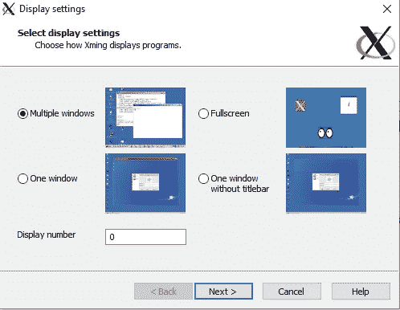

作者图片

此屏幕上不需要任何更改。点击下一步按钮。

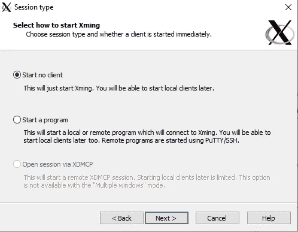

作者图片

此屏幕上不需要任何更改。点击下一步按钮。

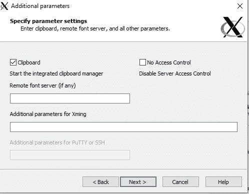

作者图片

此屏幕上不需要任何更改。单击完成按钮。

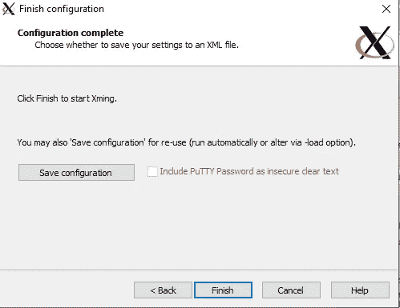

作者图片

圣诞节可以开始了。

**Anaconda:** 与其在 AWS 实例中分别安装 Python 和 Jupyter，我建议安装 Anaconda。我在 AWS EC2 上使用 Redhat Linux 机器。默认情况下，它不附带 Anaconda 存储库。所以，第一步是通过 **wget** 命令获取 Anaconda。

a.首先，检查您的实例中是否安装了 **wget** 。如果没有，通过如下所示的 **yum** install 运行安装。

```
sudo yum install wget
```

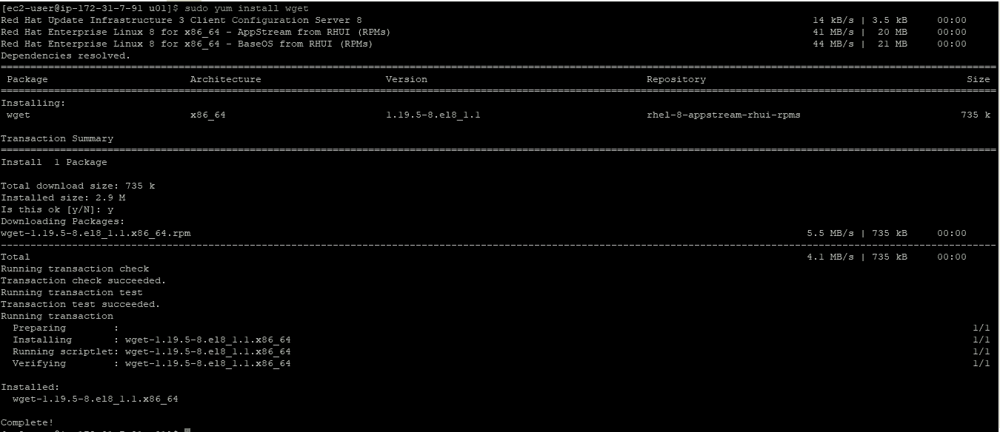

作者图片

b.检查是否安装了 **bzip2** 。如果没有，通过 yum 安装

```
sudo yum install bzip2
```

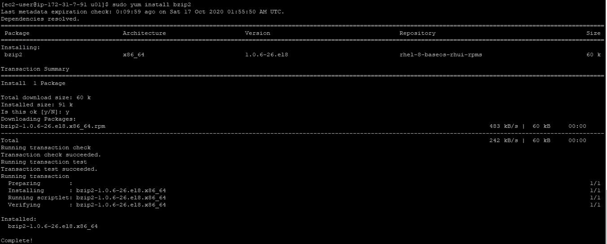

作者图片

c.检查是否安装了 **firefox** 。如果没有，通过 yum 安装

```
sudo yum install firefox
```

d.检查是否安装了 xorg-x11 驱动程序。如果没有，通过 yum 安装

```
sudo yum install xorg-x11*
```

e.打开/etc/ssh/ssh_config 文件，并确保 ForwardX11 选项已取消注释并设置为 yes。

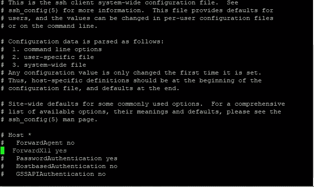

f.通过 wget 下载 Anaconda3

```
sudo wget [http://repo.continuum.io/archive/Anaconda3-4.3.0-Linux-x86_64.sh](http://repo.continuum.io/archive/Anaconda3-4.3.0-Linux-x86_64.sh)
```

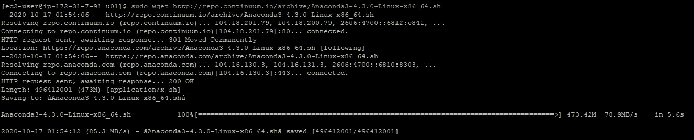

作者图片

这将在目录中创建文件 anaconda 3–4 . 3 . 0-Linux-x86 _ 64 . sh。

g.运行下面的命令来安装 Anaconda 3。

```
bash Anaconda3-4.3.0-Linux-x86_64.sh
```

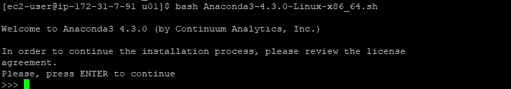

作者图片

点击进入并浏览条款和条件。一旦你得到下面的信息，写是。

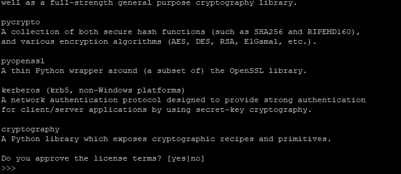

作者图片

提及您想要安装 anaconda3 的位置

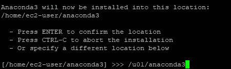

作者图片

等待 Anaconda3 安装完成。

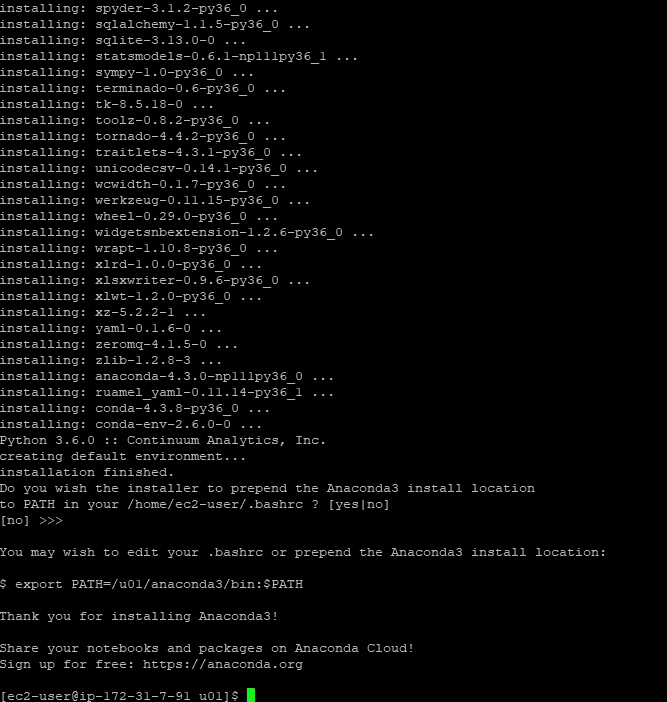

作者图片

h.添加 Anacond3 二进制文件并在 bashrc 文件中显示变量。我用的是 vi 编辑器，你可以用 nano 或者别的。

```
sudo vi ~/.bashrc
```

在此文件中添加以下内容

```
export PATH=/u01/anaconda3/bin:$PATH
export DISPLAY=localhost:10.0
```

I .关闭实例并通过 Putty 重新登录。

j.确保 Xming 和 XLaunch 已打开。任务视图中应显示 Xming 图标。

k.让我们确认它已成功安装。检查 Anaconda、Python 和 Jupyter 的版本。

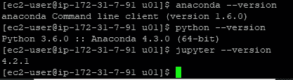

作者图片

恭喜你！您已经完成了所需的设置，并准备启动 Jupyter 笔记本电脑。

## 推出 Jupyter 笔记本

运行以下命令启动 jupyter 笔记本

```
jupyter notebook
```


作者图片

Jupyter 笔记本将在 Mozilla 浏览器的 X11 窗口中打开。

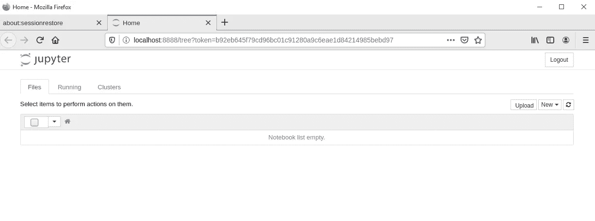

作者图片

恭喜你！现在您知道如何在 AWS EC2 实例上启动 Jupyter 笔记本了！

我和我的学生已经多次经历过这些步骤，并且已经能够在 AWS 实例上成功运行 Jupyter 笔记本。然而，如果您在任何步骤遇到任何问题，请随时写信给我，我会及时回复。

期待您的反馈。