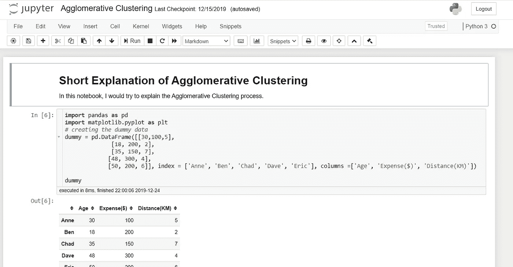
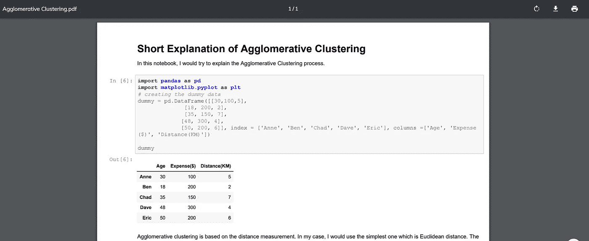

# Jupyter 笔记本到 PDF 的几行

> 原文：<https://towardsdatascience.com/jupyter-notebook-to-pdf-in-a-few-lines-3c48d68a7a63?source=collection_archive---------0----------------------->

## 轻松将您的 Jupyter 笔记本转换为 PDF 文件


作者创建的图像

在我们的 Jupyter 笔记本上工作时，有时我们希望以可读的形式共享我们处理过的数据集，包括创建的图和我们已经创建的降价解释。有一种简单的方法可以将我们的 Jupyer 笔记本转换成 PDF 文件。只需一个简单的设置，您就可以访问 PDF 格式的笔记本。

例如，我会使用我在文章[这里](/breaking-down-the-agglomerative-clustering-process-1c367f74c7c2)中提供的笔记本来转换成 PDF 表单。下面是我的 Jupyter 笔记本。



下面是 PDF 格式的笔记本。



如你所见，它显示了所有的代码和你的解释。有多花哨？

现在让我告诉你怎么做。

# Jupyter 到 PDF

我们需要做的第一件事是安装必要的软件包。在这里，我们将使用名为 notebook-as-pdf 的软件包来帮助我们将 Jupyter 笔记本转换为 pdf 文件。您需要在命令提示符下运行以下代码。

```
pip install -U notebook-as-pdf
```

我们还需要一个额外的铬设置。它用于执行 HTML 到 PDF 的转换。只需在代码提示符下运行以下代码。

```
pyppeteer-install
```

就这样，我们已经做好了准备。现在，让我们打开您打算转换为 PDF 的笔记本。在您的笔记本中，单击文件菜单栏，然后选择下载为，然后选择 PDF via HTML 来转换笔记本。


就这样，你已经有了一个 PDF 格式的笔记本。如果您喜欢使用命令提示符来转换笔记本，您可以使用下面的代码来完成。

```
jupyter-nbconvert --to PDFviaHTML example.ipynb
```

结果将被称为 example.ipynb，因为我们的 Jupyter 笔记本被称为 example.ipynb

# **结论**

这里我向你展示了一个将你的 Jupyter 笔记本转换成 PDF 文件的技巧。这可能很简单，但从长远来看是有用的。

如果你想了解更多关于这个包的信息，你可以访问网站[这里](https://pypi.org/project/notebook-as-pdf/)。

在我的 [**社交媒体**](https://bio.link/cornelli) **上访问我。**

> 如果您没有订阅为中等会员，请考虑通过[我的推荐](https://cornelliusyudhawijaya.medium.com/membership)订阅。