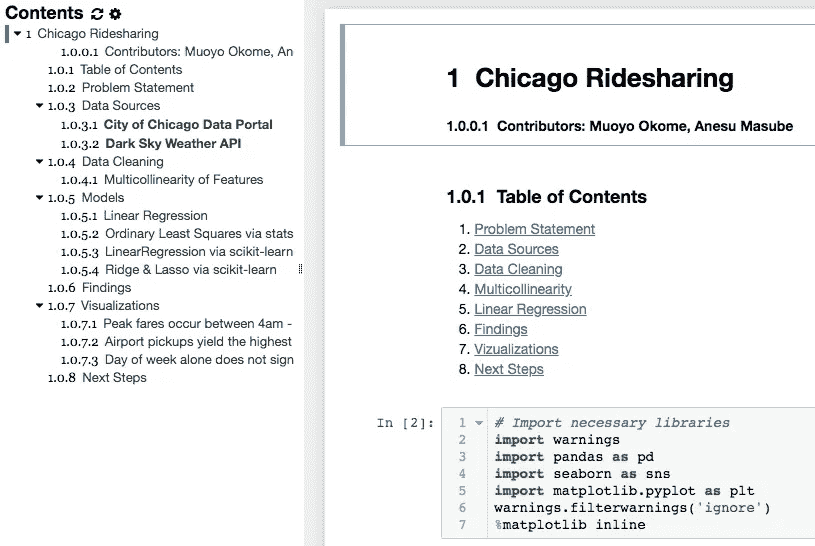
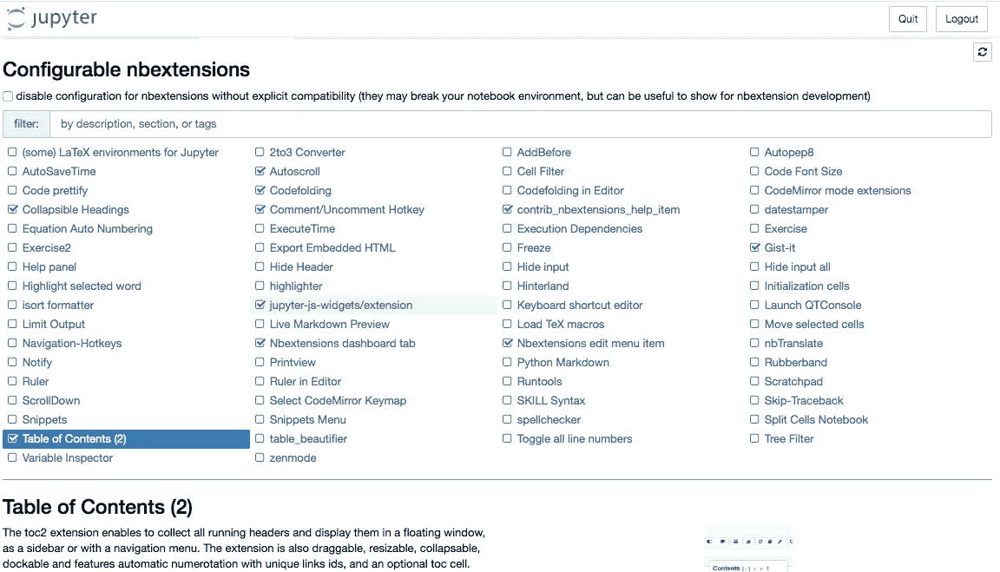

# Jupyter 笔记本调整使 python 项目对非技术人员可读

> 原文：<https://towardsdatascience.com/jupyter-notebook-tweaks-to-make-python-projects-readable-for-non-technicals-86000e9aff01?source=collection_archive---------30----------------------->

## 让数据科学项目更具可读性和可展示性

“这看起来像希腊语！”，我的妻子说，每次她看着我的 Jupyter 笔记本或很少命令行，当我试图 git bash，pool 和其他一切数据科学家和用户这样的工具，如 Jupyter 笔记本，命令行，python，然后一切。嗯，实际上有相当多的希腊人，尤其是在这个严重依赖大量统计和数学的行业。我自己一直很难接受大量的新术语提醒，Josh 解释道，他管理着我的一个了解希腊语的 youtube 账户，Josh 的 Statsquest。

来自 giphy.com 的史蒂文·A 对 T2 的数据和数学着迷

虽然她确实了解数据科学的一些基础知识，包括收集、处理、设计、建模和可视化发现。事实是，我有时希望能够以最简单易懂的方式解释我们所做的一些项目的过程和最终产品。虽然侧边演示文稿是开始这种简单的数据科学项目总结的绝佳场所，但 Jupyter 笔记本仍然可以让那些愿意进一步探索这一过程的人更容易阅读。

下面我列出了一些你可以在笔记本上做的基本事情，让它看起来更像样，最重要的是更容易理解。

1.  **总结你的优秀工作-** 清晰的问题定义，包括流程和方法的总结以及发现和后续步骤。
2.  **目录** -包括一个清晰的目录，包括标题和副标题。让您的技术笔记本易于浏览。检查目录扩展的[n 扩展](https://jupyter-contrib-nbextensions.readthedocs.io/en/latest/install.html)。下面的例子展示了我和我的同事 Muoyo Okome 最近完成的一个项目的目录。[该项目的目标是尝试发现数据是否可以帮助芝加哥市的拼车司机赚更多的钱](https://github.com/muoyo/chicago-ridesharing)。

[芝加哥 rideshare 项目目录](https://github.com/muoyo/chicago-ridesharing)

3.**使代码折叠和标题可折叠-** 除了目录之外，您希望允许查看您代码的人能够只选择他们感兴趣的主题，由于某种原因，您的技术笔记本仍然包含复杂的代码或太多的代码单元，您可以使用扩展折叠部分代码。您也可以使用隐藏所有输入。再次[nbextensions](https://jupyter-contrib-nbextensions.readthedocs.io/en/latest/install.html)是这方面的一个关键。

4.**简洁的可视化效果**——包括易于理解且外观简洁的可视化效果，可以很容易地给出正在发生的事情的清晰画面，并突出一些关键的发现。

[显示芝加哥优步拼车高峰票价时间的图表](https://github.com/muoyo/chicago-ridesharing)

总之，让你的非技术性笔记本干净、整洁、易于浏览是很重要的。这将帮助大多数人容易理解我们作为数据科学家所做的一些工作。我真的找到了[nbextensions](https://jupyter-contrib-nbextensions.readthedocs.io/en/latest/install.html)工具，它拥有上面大部分突出显示的扩展以及更多。正确安装后，您可以通过 jupyter 笔记本电脑的以下界面启用这些功能:

[n 扩展](https://jupyter-contrib-nbextensions.readthedocs.io/en/latest/install.html)接口

要安装 NBextentions，请使用下面的代码

> ！pip 安装 jupyter _ contrib _ nb extensions
> ！pip 安装[https://github . com/ipython-contrib/jupyter _ contrib _ nb extensions/tarball/master](https://github.com/ipython-contrib/jupyter_contrib_nbextensions/tarball/master)
> ！jupyter contrib nbextension 安装—用户

希望这将有助于您向技术人员和非技术人员发布和分享您的辛勤工作成果。