# IDE 中的 Jupyter 笔记本

> 原文：<https://towardsdatascience.com/jupyter-notebooks-in-the-ide-visual-studio-code-versus-pycharm-5e72218eb3e8?source=collection_archive---------0----------------------->

## Visual Studio 代码与 PyCharm

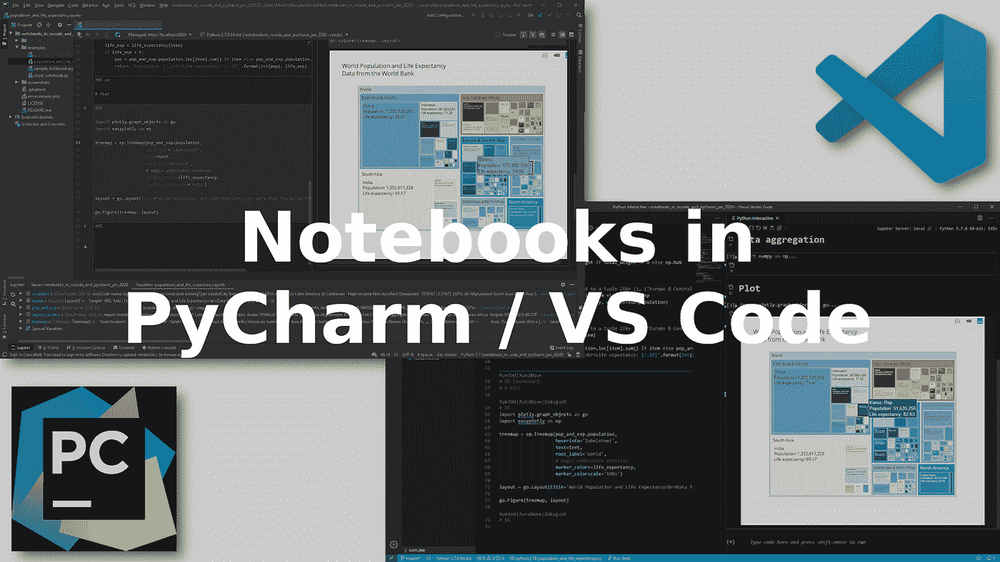

我每天都用 Jupyter 笔记本工作。每天我都在使用和编辑 Python 库。两者都是我作品中的关键元素。笔记本是记录和解释你的发现的好方法。从长远来看，库是一项安全的投资，因为它们使您的代码可重用。现在，你有没有想过……除了用 Jupyter 做笔记本，用 ide 做图书馆，我们还能做别的吗？

如果你知道我是 Jupytext 的作者，你就已经知道我认为能够在你最喜欢的 IDE 中编辑你的 Jupyter 笔记本有很多附加价值。

如果你没有听说过 Jupytext，那么让我提一下 Jupytext 是 Jupyter 的一个插件，它可以让你将传统的笔记本与一个或多个文本文件配对。配对的文本文件，例如 Python 脚本，可以*编辑*(使用任何文本编辑器或 IDE)，然后当您重新加载笔记本时，您可以在 Jupyter 中获得更改。

Jupytext 提供了一种从 IDE 访问笔记本的方法。但这不是唯一的方法。Spyder 在为脚本提供双百分比单元格标记的交互模式方面有着悠久的历史。Hydrogen 是 Atom 编辑器的一个插件，可以让你交互式地运行这些脚本。而我最常用的两个编辑器，PyCharm 和 Visual Studio Code，现在让你直接在 IDE 里打开你的`.ipynb`笔记本！

我很好奇，想看看这有多有效。那些 ide 的笔记本使用体验比 Jupyter 好吗？我会掉包吗？在本文中，我描述了我目前使用笔记本的工作流程，然后将它与 PyCharm 和 Visual Studio 代码现在可能实现的工作流程进行了比较。

# 我的 Jupytext 工作流程

我将以典型的一天工作为例。今天，我要回答一个关于我们的数据和算法的新问题。原来我以前已经回答过类似的问题了。所以，首先，我*搜索*我现有的笔记本中哪一个最接近今天问题的答案。

由于我使用 Jupytext，我所有的`.ipynb`笔记本都有配对的`.py`表示。所以我打开 PyCharm，使用*在路径中查找*搜索窗口，在我收集的`.py`笔记本中找出能够让我开始今天问题的:

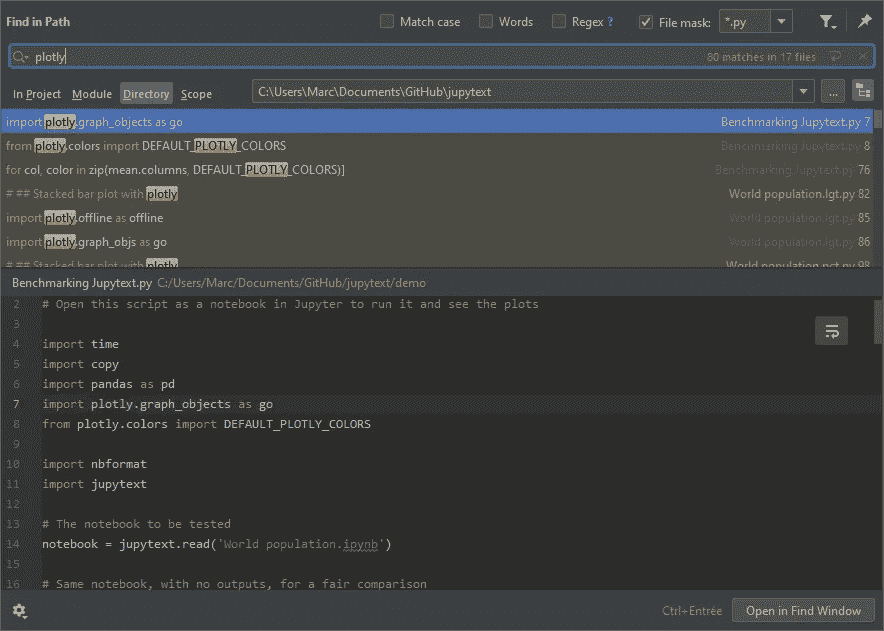

让我补充一下

*   当您将搜索限制在`*.py`文件，并将`.ipynb_checkpoints`添加到 PyCharm 设置/编辑器/文件类型中的*忽略文件和文件夹*时，搜索体验会大大改善
*   并且，如果您想将当前目录中的所有笔记本与`percent`脚本配对，您可以简单地运行`jupytext --set-formats ipynb,py:percent *.ipynb`。

现在我打开现有的笔记本，它将作为*模板*。我将它的内容摘录——我想开始的部分——复制到一个新的`.py`文件中。我负责包含 YAML 头，因为它是定义 Jupytext 配对信息和笔记本内核的地方。然后我把新的`.py`笔记本调到今天的问题。在一个减价单元格中(用`# %% [markdown]`分隔)，我写下一些我今天想做的事情。然后我调整代码以更好地解决当前的问题。在 IDE 中这样做比在笔记本中更舒服。它也更加安全和快速，因为我受益于 IDE 语法检查和突出显示。

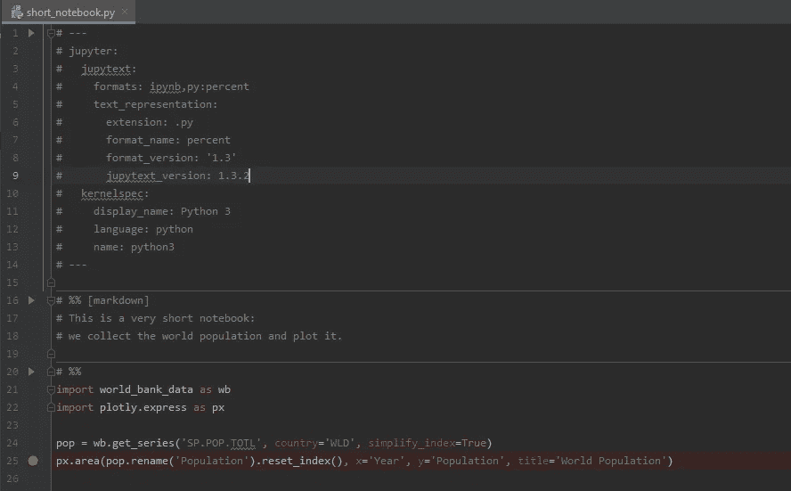

当我的草稿足够好的时候，我在 Jupyter *中打开`.py`文件作为笔记本*(在 Jupyter 笔记本中单击；在 JupyterLab 中，右击该文件，并选择*用/Notebook* 编辑。在这个阶段，它没有输出，所以我运行它。当然，新笔记本在第一次运行时可能不会很好，所以我继续在 Jupyter 中编辑笔记本，直到它正常运行。

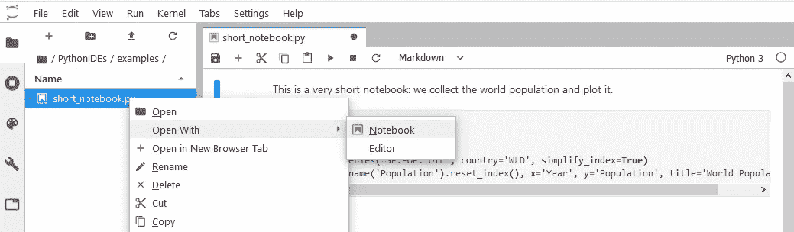

当我在 Jupyter 中保存笔记本时，`.py`文件会更新以匹配最新的内容。此外，还创建了一个包含输出的`.ipynb`文件，因为 Jupytext 头在这一行有`ipynb`:`formats:ipynb,py:percent`。如果我忘记复制标题，我可以使用 Jupyter 中的 Jupytext 菜单，选择:*将笔记本与。ipynb 文档*激活与`.ipynb`笔记本的配对。

现在我完成了。通常，我会共享`.ipynb`文件(例如，使用 Jupyter nbviewer)，并对`.py`文件进行版本控制。

我最喜欢这个工作流程的什么？

*   在笔记本中搜索非常容易——它们只是文本文件。
*   起草一个新的笔记本太舒服了。我以前从未能够如此轻松地从不同的笔记本中复制粘贴多个单元格。
*   当我在 PyCharm 中编辑`.py`笔记本时，我受益于 IDE 的高级功能:语法检查、补全、重新格式化、文档提示...
*   我也可以在 Jupyter 中自由编辑笔记本。
*   Jupytext 解决了版本控制的问题。通常，我不想将笔记本输出保存在`git`中，所以我只对`.py`文件进行版本化，它有一个干净的差异历史。

注意，这里我使用 PyCharm Professional，但这只是因为它是我最喜欢的 IDE。您可以使用任何其他编辑器，工作流程将是相同的。

我不太喜欢的是:

*   每个笔记本都有一个双重表示(`.ipynb` / `.py`)。这可能会让不止一个用户感到惊讶。
*   在两个编辑器(这里是 PyCharm 和 Jupyter)中同时处理同一个文档需要格外小心。在切换到另一个编辑器之前，我必须注意在当前编辑器中保存文档(并且可能会禁用自动保存)。我需要在我切换到的编辑器中*刷新*笔记本。
*   PyCharm 可以执行和调试我的脚本，但是，输出在终端中显示为文本，所以实际上，我更喜欢在 Jupyter 中执行笔记本。

# PyCharm 的 Jupyter 笔记本

PyCharm 是我最喜欢的代码编辑器。请不要问我为什么，因为我不确定有一个单一的原因…但是我可以肯定的是，在那里编辑脚本和库是非常棒的！此外，我喜欢 PyCharm 的测试和调试工具套件(看看附录，了解如何配置 PyCharm)。并且版本控制被很好地集成…

PyCharm 有两个版本:社区版和专业版。你已经可以用社区版做很多事情了。然而，Jupyter 笔记本只有专业版。

我准备了一个测试笔记本

*   减价牢房
*   一个代码单元，输出一个熊猫数据帧
*   Matplotlib 图
*   Jupyter 小部件
*   和一个阴谋。

现在我在 PyCharm Professional 2019.3.1 中打开笔记本，我得到了这个:

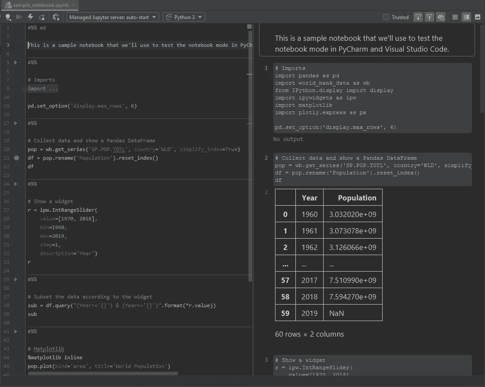

这是超级令人印象深刻的，不是吗？

我最喜欢什么？

*   笔记本里的所有输出都工作！甚至是小部件，或者 Plotly 图。干得好，皮查姆！
*   我可以把笔记本编辑成 Python 脚本。就像用 Jupytext 一样，复制粘贴多个单元格是超级容易的！仅用`#%%`创建一个新的代码单元。使用`#%% md`创建降价单元格。
*   执行单元格的快捷键与 Jupyter 中的相同(Ctrl+Enter，Shift+Enter 执行并将光标移动到下一个单元格)。并且预览窗口与输入窗口很好地同步。当您单击一个输入单元格时，视图窗格会自动滚动到相应的输出，反之亦然。
*   当您键入或检查代码时，您可以利用 PyCharm(例如，ctrl+click 将您带到函数或对象的定义)。代码补全、文档提示等都可以在笔记本上找到。
*   您可以在笔记本或底层库上设置*断点*。
*   记事本变量出现在变量资源管理器中:

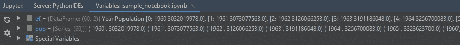

如果有我不喜欢的东西，也许这就是笔记本的展示方式。它与 Jupyter 明显不同，因为输出显示在预览窗格中。我不习惯那样。这也减少了我的地块或表格的可用空间。我想我更喜欢输出在输入之下，比如 Code、Hydrogen 甚至 RStudio。此外，在工作中，我可能会写很长的笔记本，对于这种笔记本,*目录*扩展非常有用，因为它让我可以轻松地在笔记本的不同部分之间导航——我可能会错过 PyCharm 的笔记本编辑器中的这一功能。

如果你是 PyCharm 开发团队的一员，让我告诉你，作为一个笔记本用户，我很高兴看到你在这方面的工作！你做了令人印象深刻的工作！现在我有一些额外的观察给你:

*   你会考虑在代码单元后显示输入吗？你能做到这一点并让我们轻松地选择/复制/粘贴多个单元格吗？
*   减价单元格标记不标准。按照 Spyder 的约定，`# %% md`是一个标题为 `md`的单元格。你可以用`# %% [md]`或`# %% [markdown]`来代替吗，比如 Code，Hydrogen 或 Jupytext？
*   搜索窗口(*在路径*中查找)不能很好地用于笔记本——它显示他们的 JSON 内容的摘录。展示他们的`.py`形象本可以更加用户友好。
*   在笔记本的上下文中，重新格式化代码(Ctrl+Alt+L)是无效的。
*   执行笔记本增加了一些单元格元数据(`{"pycharm": {"is_executing": false}}`)。
*   最后，也许`.py`格式并不适合所有的笔记本。我的一些教程包含大量文本，对于这些，我更喜欢使用 Jupytext 的 Markdown 格式。PyCharm 可以很好地处理 Markdown 文件，但是它不允许我在那里运行代码...在 IDE 中把这些文档渲染成笔记本，你会怎么想？

干得好，皮查姆！现在让我们看看 VS 代码提供了什么。

# Visual Studio 代码中的 Jupyter 笔记本

Visual Studio Code 是由微软开发和维护的免费开源编辑器。它不是专门针对 Python 的，并且有许多语言的插件。在这里，我们将测试 1.41.1 版本的代码，由微软于 2020 年 1 月 13 日发布的最新 [Python 扩展。](https://marketplace.visualstudio.com/items?itemName=ms-python.python)

每当我想编辑 Markdown 文件，或者用 Python 之外的任何语言编写的脚本，比如 Javascript 或 Typescript，我都会使用代码。但是直到最近，我都不怎么使用 Python 代码。回想起来，我认为原因是我不知道如何设置代码来与我的 conda 环境一起工作。这个问题现在已经解决了，并记录在附录中，我要感谢来自 [Python Visual Studio 代码](https://twitter.com/pythonvscode)团队的[露丝安娜](https://twitter.com/luumelo14)帮助我解决了这个问题。

现在让我用代码打开我们刚刚在 PyCharm 中打开的同一笔记本。结果是这样的:


我喜欢什么？

*   有用！所有的输出都显示得很好(小部件还不被支持，但是我被告知它们会在下一个版本中被支持)。
*   在这里，执行一个单元格的快捷键与 Jupyter 中的相同(Ctrl+Enter，Shift+Enter 执行并将光标移动到下一个单元格，Esc-A 创建上面的单元格，等等)。
*   我喜欢把输出放在 Jupyter 代码下面。
*   由于自动完成，输入代码很舒服。
*   我们可以在变量资源管理器中检查笔记本变量。

但也许我想要更多。我想一次选择/复制/粘贴多个单元格。我想导航到一个函数的定义，就像我们在脚本中用 ctrl-click 一样。为什么我们没有和`.py`脚本一样的上下文菜单？我想在我的笔记本上设置断点...但是我已经说过了，我希望有一个*目录*来帮助我在长笔记本中找到方向。

我的故事结束了吗……没有！还有最后一件事我想试试。在 Code 的文档中:[在 Visual Studio Code 中使用 Jupyter 笔记本](https://code.visualstudio.com/docs/python/jupyter-support)据说一旦*将笔记本转换成 Python 脚本*就可以设置断点！让我们试试那个。

# Visual Studio 代码中的交互式脚本

现在我们点击*将笔记本转换成 Python 脚本*。我们得到一个看起来像皮查姆的笔记本的脚本:

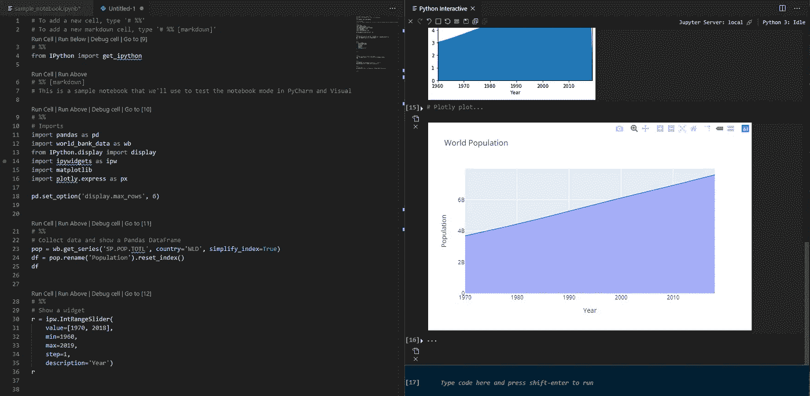

我喜欢这里的什么？

*   我可以利用 Code 的高级功能来编辑文件。Ctrl+click 起作用，让我导航到定义。我可以轻松地一次选择/复制/粘贴多个单元格。
*   表格、图和交互式图在交互式预览中工作。
*   我可以在终端中键入和执行 Python 代码，而不必创建新的单元。这太棒了！有多少次，我创建了一个新的单元格，只是因为我需要检查一个变量，然后我忘了从笔记本上删除那个单元格…
*   该脚本使用与 Jupytext 相同的单元格标记。这意味着我可以依靠 Jupytext 在笔记本和脚本之间进行转换和同步。在 Jupyter 中，我会使用 percent 脚本访问 Jupytext/Pair，并保存/重新加载笔记本以更新两个文件。在终端中，我会使用`jupytext notebook.ipynb --set-formats ipynb,py:percent`然后使用`jupytext notebook.ipynb --sync`来保持两个文件同步。

我更喜欢的是*断点*。在脚本上放一个断点，就可以*调试单元格*看变量了！

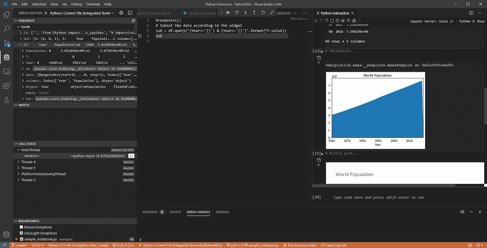

我很喜欢那种互动模式！此时，在编辑器中编辑笔记本是我最喜欢的方式之一。

现在我有几个问题要问 Visual Studio 代码 Python 扩展的开发人员:

*   我知道我可以将 VS 代码连接到本地或远程 Jupyter 内核。现在，我可以在 Jupyter 和 Code 之间共享同一个会话吗，比如使用`%connect_info`魔法命令？这将使我能够在 Jupyter 中执行我的笔记本的大部分内容，并且只调试代码中的特定单元，而不必重新运行笔记本的全部代码。
*   Jupytext 允许我将笔记本编辑成脚本或减价文件。我发现 Markdown 格式更适合包含文本多于代码的笔记本，比如教程或文档。你想为笔记本提供降价模式，还是相反，让降价文件以笔记本的形式在代码中交互执行？

# 结论

Visual Studio 代码和 PyCharm 是两个很棒的代码编辑器。它们使得设计、编辑或重构 Python 代码变得如此容易。所以我真的很欣赏能够在这些 ide 中打开笔记本的想法。

笔记本在 IDE 中应该如何表现？我喜欢 PyCharm 的类似脚本的笔记本模式和代码的交互式脚本模式，因为它们允许在笔记本上以与使用脚本完全相同的方式工作(复制/粘贴、在代码中导航、设置断点……)。

我会将笔记本电脑切换到 IDE 吗？我想我会继续在 IDE 和 Jupyter 之间切换，当我想在我的笔记本中搜索，起草新的笔记本，重构现有的笔记本，或者设置断点时，当我想使用目录在笔记本中导航，分析情节，评论我的发现，或者展示笔记本时。

# 感谢

我要感谢 [Python Tools for VS](https://twitter.com/PT4VS) 、 [Python Visual Studio Code](https://twitter.com/pythonvscode) 和 [JetBrains PyCharm](https://twitter.com/pycharm) 开发人员所做的工作。根据经验，我知道在 IDE 中处理笔记本有很大的潜力，但这并不是一个简单的挑战。所以我喜欢看到更多的人致力于此。

让我也感谢帮助我改进这篇文章的早期读者:[弗朗索瓦·沃茨](https://github.com/fwouts)，以及 [CFM](https://www.cfm.fr) 、[埃里克·奥·莱比戈](https://github.com/lebigot)、[弗洛伦特·扎拉](https://github.com/flzara)和[文森特·阮](https://www.linkedin.com/in/vincent-nguyen-31533672/)。

# 附录——如何重现该研究

在这一部分，我分享了我关于如何正确安装 Python 以及配置 PyCharm 和代码的笔记。我的笔记是针对 Windows 10 的，但我希望它们适用于任何平台。

## 获取示例文件

请从我的 [GitHub 仓库](https://github.com/mwouts/notebooks_in_vscode_and_pycharm_jan_2020)中克隆环境和示例文件:

```
git clone https://github.com/mwouts/notebooks_in_vscode_and_pycharm_jan_2020.git
```

## 用 conda 创建 Python 环境

请安装一个[迷你巨蟒](https://docs.conda.io/en/latest/miniconda.html)或[巨蟒](https://www.anaconda.com/distribution/)。如果不知道区别，就拿 Miniconda，比较轻。

然后进入开始菜单，键入 *Miniconda* 然后点击 *Anaconda Powershell 提示符(Miniconda3)* 。在终端中，将目录更改为此项目，然后创建示例 Python 环境，例如

```
cd Documents\Github\notebooks_in_vscode_and_pycharm_jan_2020 conda env create --file environment.yml
```

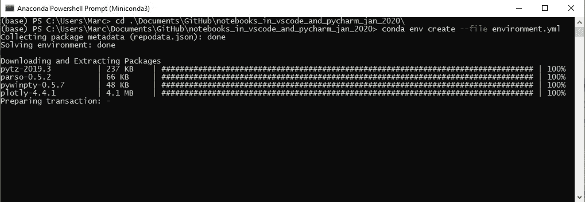

现在，我们用以下方式激活环境

```
conda activate notebooks_in_vscode_and_pycharm_jan_2020
```

## 发射 Jupyter

我们刚刚创建的环境包括 Jupyter 和 Jupytext。用...发射 Jupyter

```
cd Documents\Github\notebooks_in_vscode_and_pycharm_jan_2020
conda env create --file environment.yml
```

您将能够探索我们的示例脚本和笔记本，并了解 Jupytext 是如何工作的。

## 配置 PyCharm

假设您已经安装了 PyCharm Community 或 PyCharm Professional，并且已经在 PyCharm 中打开了我们的`notebooks_in_vscode_and_pycharm_jan_2020`项目。

下一步是告诉 PyCharm 我们想要使用哪种 Python。为此，在使用`conda activate notebooks_in_vscode_and_pycharm_jan_2020`激活环境后，我们在 Windows 上执行`where.exe python`,或者在 Linux 或 Mac OSX 上执行`which python`:

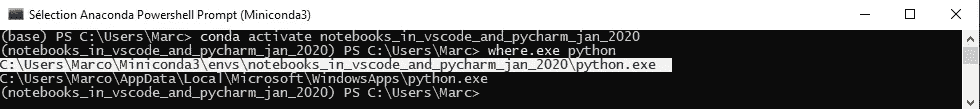

现在我们转到 File\Settings，搜索*项目解释器*，点击 gear/Add，选择*现有环境*，粘贴 Python 解释器的完整路径——在我的例子中是:`C:\Users\Marc\Miniconda3\envs\notebooks_in_vscode_and_pycharm_jan_2020\python.exe`。

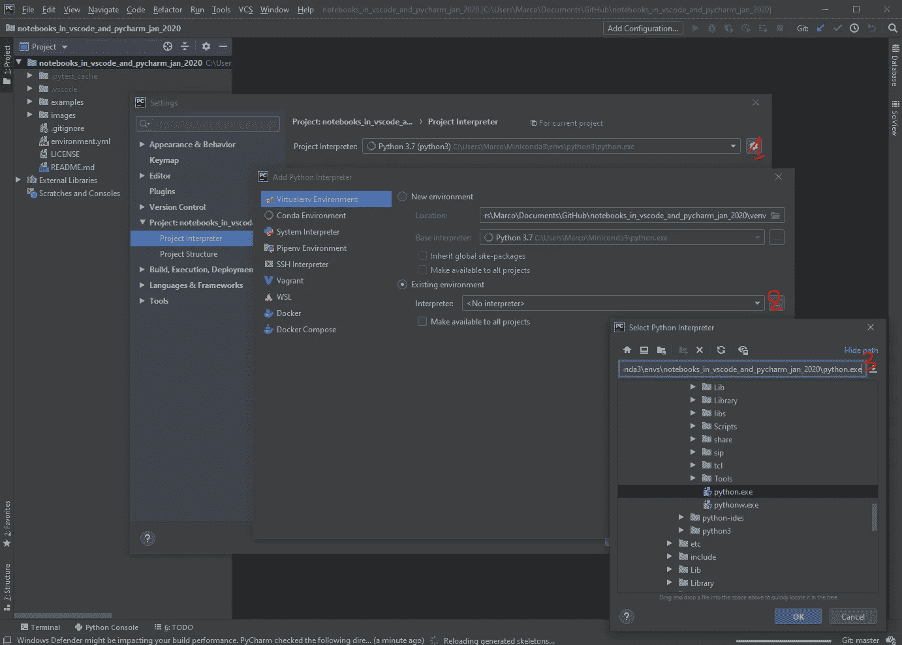

## 配置 Visual Studio 代码

Visual Studio 代码的[文档](https://code.visualstudio.com/docs/python/environments)详细解释了如何用虚拟 Python 环境配置 Visual Studio 代码。

如果您想使用 conda，您必须从 Conda 中的*启动代码。所以我们进入 *Anaconda PowerShell 提示符*，通过键入`code`启动 VS 代码:*

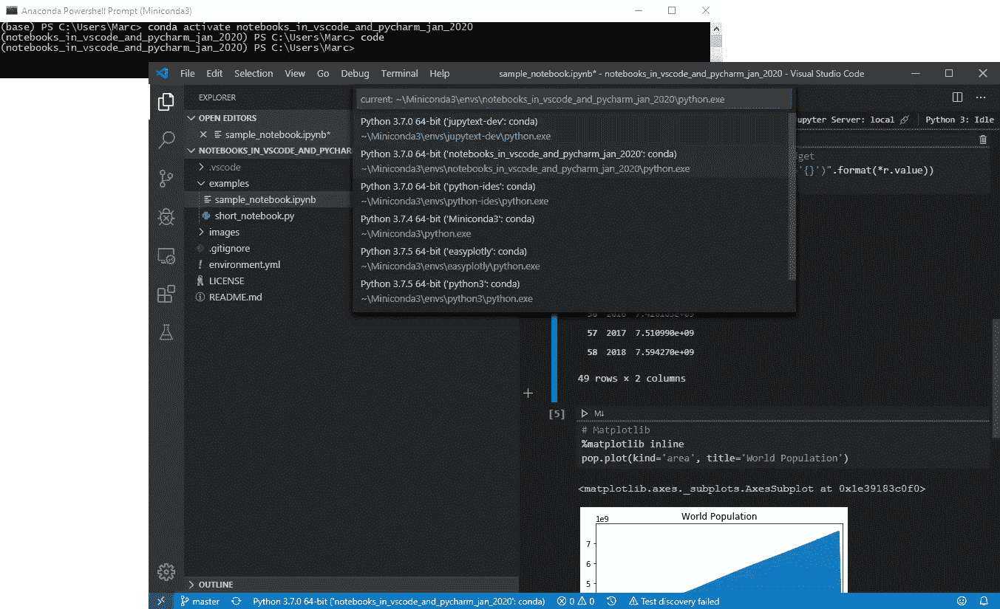

现在你可以关闭外壳了。作为从 conda 环境继承的代码，您将能够从该环境中使用 Python 和 Jupyter。

让我强调一下，如果您不在 conda 中启动 Visual Studio 代码*，您将会得到各种类型的错误，包括:*

1.  `conda is not recognized as internal or external command.`
2.  我知道，你把康达加到了你的道路上...但这还不够)
3.  或者甚至，`"Import Error: Unable to import required dependencies: numpy:"`。