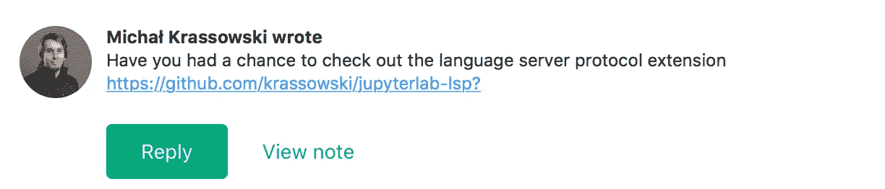
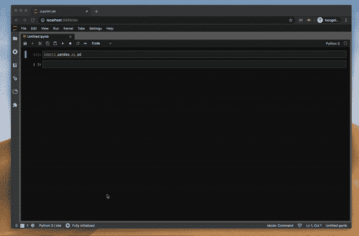
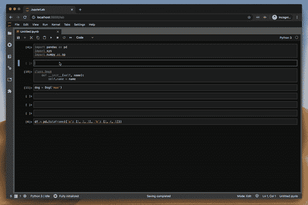
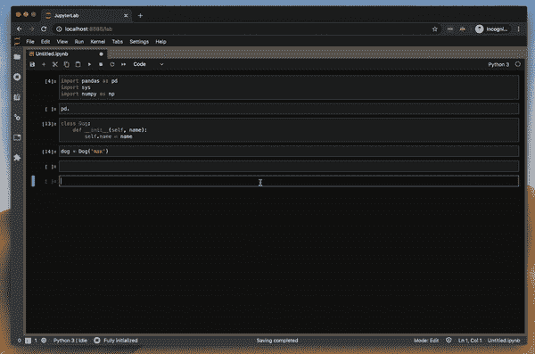
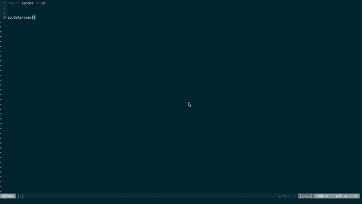
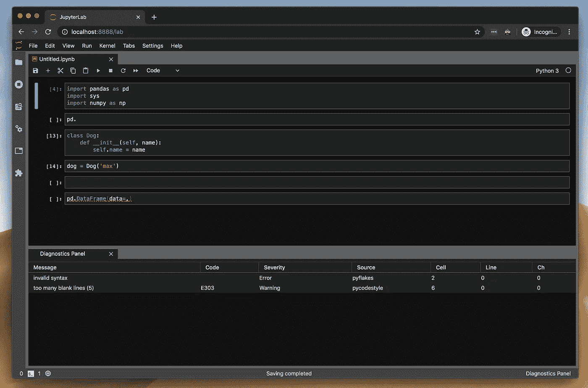
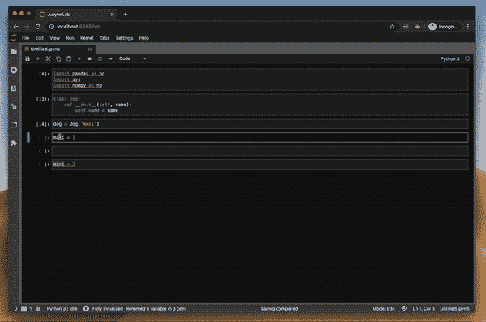

# JupyterLab 2.0

> 原文：<https://towardsdatascience.com/jupyterlab-2-0-edd4155ab897?source=collection_archive---------6----------------------->

## 让我们来一窥 Jupyter 笔记本编辑的未来。像编码辅助和更多☀️这样的特性让未来看起来很光明


照片由[德鲁·比默](https://unsplash.com/@drew_beamer?utm_source=medium&utm_medium=referral)在 [Unsplash](https://unsplash.com?utm_source=medium&utm_medium=referral) 上拍摄

前几天，我写了一个故事[你还在用 JupyterLab 吗？我得到了惊人的回应。读者向我推荐了各种为数据科学开发的新 ide，但其中有一个非常突出。](/are-you-still-using-jupyterlab-ce1a4339c0a9)

Michal Krassowski 给我留了一张纸条，上面写着他和其他贡献者正在做的一个项目。JupyterLab-LSP 是 JupyterLab 的一个语言服务器协议集成。简而言之，它为 JupyterLab 增加了新的超能力，比如代码导航、悬停建议、linters、自动完成和重命名。我真的很兴奋，因为它解决了大多数问题，PyCharm 优于 JupyterLab。



米哈尔·克拉索夫斯基的笔记

> 让我们试驾一下吧

**这里有几个你可能会感兴趣的链接:**

```
- [Labeling and Data Engineering for Conversational AI and Analytics](https://www.humanfirst.ai/)- [Data Science for Business Leaders](https://imp.i115008.net/c/2402645/880006/11298) [Course]- [Intro to Machine Learning with PyTorch](https://imp.i115008.net/c/2402645/788201/11298) [Course]- [Become a Growth Product Manager](https://imp.i115008.net/c/2402645/803127/11298) [Course]- [Deep Learning (Adaptive Computation and ML series)](https://amzn.to/3ncTG7D) [Ebook]- [Free skill tests for Data Scientists & Machine Learning Engineers](https://aigents.co/skills)
```

*上面的一些链接是附属链接，如果你通过它们购买，我会赚取佣金。请记住，我链接课程是因为它们的质量，而不是因为我从你的购买中获得的佣金。*

# 编码林挺和吸尘建议

安装 JupyterLab-LSP 后，您会在状态栏中看到“完全初始化”图标。这意味着 JupyterLab-LSP 正在工作。

代码林挺工作很好。在下面的示例中，它显示“由未使用的导入”警告。



用 JupyterLab-LSP 在 JupyterLab 中编码林挺

# 代码完成

这是我最期待的功能之一。我们来测试一下。

从下面的视频中可以看出，代码完成(CC)对 pandas 或 numpy 不起作用。我还用 pandas DataFrame 中的列尝试了 CC，但没有任何不同。CC 在系统库和我定义的类上工作得很好。



使用 JupyterLab-LSP 在 JupyterLab 中完成代码

# 功能签名建议

一些熊猫函数有很多参数，其中一些我很少使用。每次我使用这样的功能时，我都必须去谷歌搜索文档来更新我的记忆。

JupyterLab-LSP 增加了函数签名建议(FSS)，效果很好。你得到一个漂亮的弹出窗口——不太打扰，刚刚好。



JupyterLab 中的函数签名建议

FSS 可以通过突出你正在编辑的当前论点来进一步改进，就像 NeoVim 中的[deo complete-Jedi](https://github.com/deoplete-plugins/deoplete-jedi)插件。



在 NeoVim 与 deo complete-Jedi 的功能签名建议

> 函数签名建议非常有效，但仍有改进的空间

# 诊断面板

JupyterLab-LSP 还有一个漂亮的诊断面板，列出了所有的警告和错误。这非常有用，因为红色下划线可能会被忽略。



带有 JupyterLab-LSP 的 JupyterLab 中的诊断面板

# 重命名变量

我对这个有点失望，因为我以为它会进行重构，但它是一个关键字替换。我试图重构一个变量名，但它也重命名了一个字符串，如下面的视频所示。



使用 JupyterLab-LSP 重命名 JupyterLab 中的变量

# **其他特色**

JupyterLab-LSP 包含了许多有用的功能，比如“转到定义”——你想看看熊猫数据帧在幕后是如何工作的吗——只需使用“转到定义”。

代码格式化在某些时候也会成为 LSP 扩展的一部分！

> W 你想看看熊猫数据框架是如何在幕后工作的吗——只要使用 Go to Definition

# 你自己试试

确保您安装了最新的 JupyterLab 在撰写本文时是 2.1.0。您还需要在 JupyterLab 中启用扩展管理器。

```
pip install -U jupyterlab
```

安装 LSP 服务器扩展:

```
pip install jupyter-lsp
```

安装节点(该命令适用于 macOS):

```
brew install nodejs
```

安装前端扩展:

```
jupyter labextension install @krassowski/jupyterlab-lsp
```

为编程语言安装 LSP 服务器:

```
pip install 'python-language-server[all]'
```

启动 jupyterlab，您应该会在状态栏中看到“完全初始化”图标。

# 判决


比尔·牛津在 [Unsplash](https://unsplash.com/s/photos/verdict?utm_source=unsplash&utm_medium=referral&utm_content=creditCopyText) 上的照片

根据我所做的正面评论，你可能会认为我会每天使用 JuypterLab 2.0 和 LSP。你会惊讶地发现，在我写完这篇文章后，我已经安装了旧版本。这是为什么呢？

虽然新功能运行良好，但我使用的其他扩展还不支持 JupyterLab 2.0。这些是用于 Vi 键绑定的 [jupyterlab-vim](https://github.com/jwkvam/jupyterlab-vim) 和用于代码格式化的[jupyterlab _ code _ formatter](https://github.com/ryantam626/jupyterlab_code_formatter)。这两个扩展目前对我来说比 LSP 支持更重要。也许我们可以两全其美，因为 JupyterLab-LSP 似乎也支持 JupyterLab 1.x，但我还没有试过。

```
# for JupyterLab 1.x
jupyter labextension install @krassowski/jupyterlab-lsp@0.8.0
```

> 简而言之，JupyterLab-LSP 是一个巨大的改进，我可以说我将来肯定会使用它

# 在你走之前

在 [Twitter](https://twitter.com/romanorac) 上关注我，在那里我定期[发布关于数据科学和机器学习的](https://twitter.com/romanorac/status/1328952374447267843)。


由[考特尼·海杰](https://unsplash.com/@cmhedger?utm_source=medium&utm_medium=referral)在 [Unsplash](https://unsplash.com/?utm_source=medium&utm_medium=referral) 拍摄的照片