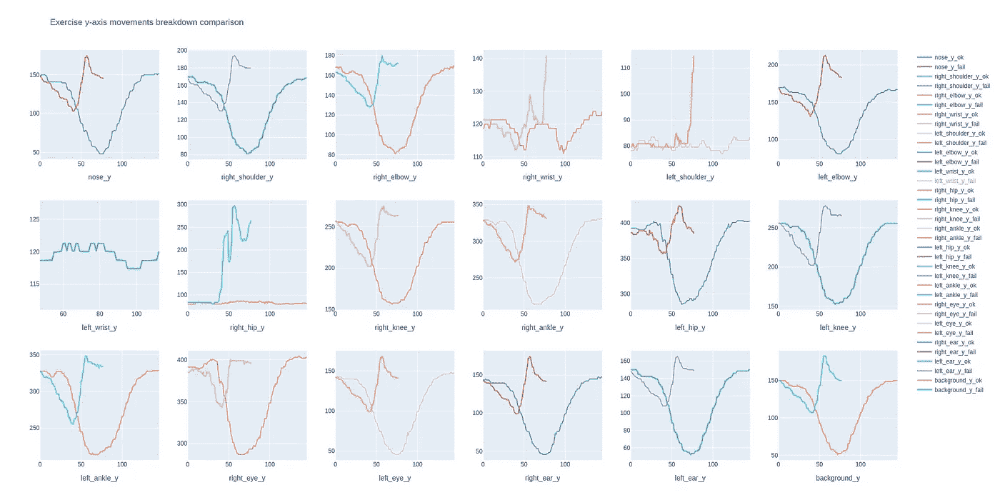
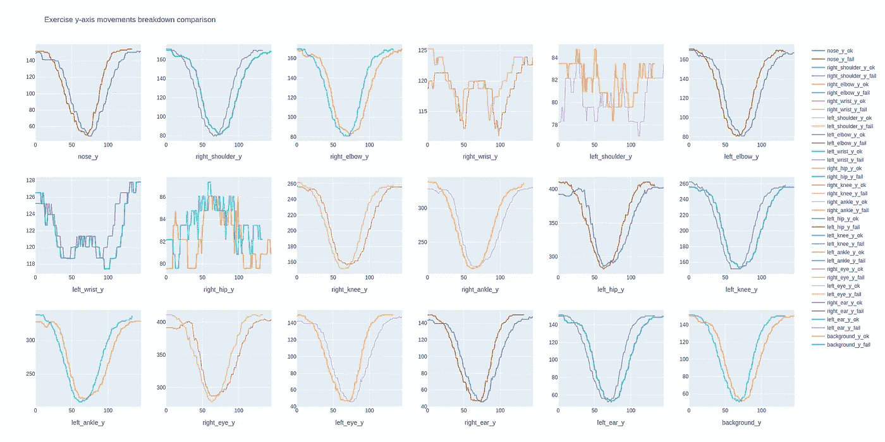

# 刚刚在我的锻炼中使用了机器学习！

> 原文：<https://towardsdatascience.com/just-used-machine-learning-in-my-workout-ff079b8e1939?source=collection_archive---------10----------------------->

## 计算机视觉在健身中的应用演示

我是体重法的忠实粉丝，通常也是锻炼的忠实粉丝，但我不太喜欢去健身房。

此外，在这个由于冠状病毒而被迫封锁的时期，尝试不同的方式来进行健身和训练可能是有用的。

于是我问自己:有没有办法把机器学习用在这方面？我能把两种激情结合起来做点有用的东西吗？

一个主要的问题是有一种方法来验证一个练习的正确性，所以我做了一些实验并尝试了一种方法，发现…

好了，不想剧透什么，就继续看下去了解一下吧！

# 框定问题

和往常一样，让我们从框定问题开始。我们想要实现的是使用视频作为输入，有一种方法来评估练习的正确性。

最佳方案应该是使用实时流，但是现在让我们简单地使用一个文件，因为毕竟我们想在构建之前验证一种方法。

因此，第一步应该是有一个(希望)正确执行的视频，因为它可以用作比较其他视频的基线。

这是第一个视频，在我的地下疲劳室拍摄的:)

基线 ok 执行

我的第一个想法是使用 CNN 来建立一个分类器，但是，除了所需的例子数量之外，我不确定图像序列像素是否有助于训练一个关于练习执行中什么是错什么是对的模型。

所以，我做了一些研究，看看是否有可能使用视频作为输入来获得不同的特征，并找到了一个很棒的库， [OpenPose](https://github.com/CMU-Perceptual-Computing-Lab/openpose) ，一个“用于身体、面部、手和脚估计的实时多人关键点检测库”。

看到演示视频，我明白这可能非常有用，所以我试图将它应用到我的问题中，并有了这个…

使用 OpenPose

(我将在后面的附录中写下所有必要的设置步骤)

正如你在视频中看到的，该库可以很好地跟踪不同的身体部位(使用带有 18 个关键点的 COCO 配置)

很酷的一点是，也可以输出一个 json 文件，一帧一帧地显示所有的位置，所以应该可以用数字来表示一个练习。

因此，做一些辅助功能，并使用 Plotly，这是这个练习看起来如何考虑 y 轴移动-跳过 x 轴，因为给定相机位置不太有用。

姑且称之为**“ok1”**


好习题 ok1 的分解分析

很好，下一步是找到一种方法来比较两个不同的执行，看看是否有显著的差异。

让我们首先基于这些指标进行一个视觉比较，我们称这个执行为**“失败 1”**

故障 1

让我们比较一下运动的图表



ok1 和 fail1 的比较

存在明显的差异。

让我们尝试另一个失败的表现(**“fail 2”**)

故障 2

让我们与基线正确执行 ok1 进行比较


ok1 和 fail2 之间的比较

现在让我们来比较两个好的表现(让我们称之为第二个**“ok 2”**)

ok2



ok1 和 ok2 的比较

曲线看起来非常相似，所以我们根据经验测试了这种方法。

现在的问题是:考虑到可能有不同的时间尺度，有没有办法评估这些单变量时间序列曲线之间的相似性？

原来有一种叫做**动态时间扭曲**的东西可以用来“测量两个时间序列之间的相似性”。更多[此处](https://en.wikipedia.org/wiki/Dynamic_time_warping)

Python 中有实现吗？当然，使用 *tslearn.metrics*

所以让我们分析一些数字

首先比较“ok1”和它自己

```
dtw_value for feature nose_y is 0.0 
dtw_value for feature right_shoulder_y is 0.0 
dtw_value for feature right_elbow_y is 0.0 
dtw_value for feature right_wrist_y is 0.0 
dtw_value for feature left_shoulder_y is 0.0 
dtw_value for feature left_elbow_y is 0.0 
dtw_value for feature left_wrist_y is 0.0 
dtw_value for feature right_hip_y is 0.0 
dtw_value for feature right_knee_y is 0.0 
dtw_value for feature right_ankle_y is 0.0 
dtw_value for feature left_hip_y is 0.0 
dtw_value for feature left_knee_y is 0.0 
dtw_value for feature left_ankle_y is 0.0 
dtw_value for feature right_eye_y is 0.0 
dtw_value for feature left_eye_y is 0.0 
dtw_value for feature right_ear_y is 0.0 
dtw_value for feature left_ear_y is 0.0 
dtw_value for feature background_y is 0.0
```

所以 0 值是最大相似度，分数越低表示相似度越高

让我们现在尝试测量 ok1 和 fail1

```
dtw_value for feature nose_y is 188.00378744123748
dtw_value for feature right_shoulder_y is 155.97642562435527
dtw_value for feature right_elbow_y is 156.39925059973916
dtw_value for feature right_wrist_y is 17.982641407757672
dtw_value for feature left_shoulder_y is 13.5329438534267
dtw_value for feature left_elbow_y is 158.0005797757085
dtw_value for feature left_wrist_y is 27.544745106825722
dtw_value for feature right_hip_y is 12.151614599714703
dtw_value for feature right_knee_y is 191.94638493339747
dtw_value for feature right_ankle_y is 223.23781654997444
dtw_value for feature left_hip_y is 263.0165952996121
dtw_value for feature left_knee_y is 195.8379463587177
dtw_value for feature left_ankle_y is 227.95958454954243
dtw_value for feature right_eye_y is 288.64055642788685
dtw_value for feature left_eye_y is 192.9321060365538
dtw_value for feature right_ear_y is 192.15753964939807
dtw_value for feature left_ear_y is 190.20149442225735
dtw_value for feature background_y is 189.09276308989186
```

我发现采用一个整体值来获得更简洁的信息很有用，比如中位值

```
dtw_median : 189.6471287560746
```

ok1 和 fail2 之间的比较

```
dtw_value for feature nose_y is 65.28319682858675
dtw_value for feature right_shoulder_y is 38.87442004120449
dtw_value for feature right_elbow_y is 37.75683113715981
dtw_value for feature right_wrist_y is 18.907807197028447
dtw_value for feature left_shoulder_y is 19.50736795264806
dtw_value for feature left_elbow_y is 45.031636992674414
dtw_value for feature left_wrist_y is 36.101698713495466
dtw_value for feature right_hip_y is 13.248353503737741
dtw_value for feature right_knee_y is 39.45295418596681
dtw_value for feature right_ankle_y is 49.27277845829276
dtw_value for feature left_hip_y is 65.78598402395453
dtw_value for feature left_knee_y is 38.59586190254078
dtw_value for feature left_ankle_y is 44.54850474482842
dtw_value for feature right_eye_y is 64.17832564035923
dtw_value for feature left_eye_y is 50.02819053653649
dtw_value for feature right_ear_y is 50.233695101993064
dtw_value for feature left_ear_y is 45.21480605000976
dtw_value for feature background_y is 42.15576012017812dtw_median : 43.35213243250327
```

ok1 和 ok2 的比较

```
dtw_value for feature nose_y is 16.023831603583467
dtw_value for feature right_shoulder_y is 11.24889546622242
dtw_value for feature right_elbow_y is 11.94796246520719
dtw_value for feature right_wrist_y is 20.509653605070962
dtw_value for feature left_shoulder_y is 19.65007578484111
dtw_value for feature left_elbow_y is 14.486468134089847
dtw_value for feature left_wrist_y is 7.208783392501132
dtw_value for feature right_hip_y is 14.17544715061928
dtw_value for feature right_knee_y is 25.759515076957445
dtw_value for feature right_ankle_y is 43.123581089700735
dtw_value for feature left_hip_y is 83.91171946754521
dtw_value for feature left_knee_y is 23.860467116131673
dtw_value for feature left_ankle_y is 44.80603683656928
dtw_value for feature right_eye_y is 91.27560108813313
dtw_value for feature left_eye_y is 31.263050533657154
dtw_value for feature right_ear_y is 25.735729785455852
dtw_value for feature left_ear_y is 12.39151408383979
dtw_value for feature background_y is 11.887661376402017dtw_median : 20.079864694956036
```

因此，该值似乎可以用作一个指标，根据要找到的阈值来比较两次执行的正确性。

作为一个经验性的反检验，让我们从这个值开始尝试其他例子

ok1 和 check1 ->中位值 82。46860 . 66666666666

ok2 和 check 2-->中位值 19660 . 666666666616

确定并检查 3 ->中位值 25。48860 . 88888888861

似乎低于 30 的中位值可能是起始阈值

让我们在视频上看到他们

不允许跳跃！

不完全的

好的。

# 结论

这只是这个实验的开始:假设这是正确的方法，有很多开放点，例如:

*   不同身高的人怎么样？他们也需要一个个人基线，或者可以概括？
*   不同的相机位置怎么样？
*   如何推断阈值？
*   如何对执行中的错误给出更详细的建议？
*   如何在连续视频流中处理练习的相关部分？
*   可以跟踪使用哑铃等工具进行的练习吗？(提示:是的，但是也有特定的对象检测库)

我有一些想法要检查，我会在未来做，即使因为可能性是美妙的。

更新:我从这开始增加了其他功能。在这里[查看](/used-again-machine-learning-in-my-workout-this-time-building-a-personal-trainer-3dfae9730c2b)

想象一个带有摄像头的工作站

*   当您用面部识别输入时，识别您
*   加载您的“wod”(当天锻炼)
*   检查给出提示的练习的正确性
*   向在场或可能与几十人一起参加远程课程的培训师发出执行不当的信号，允许他/她采取纠正措施。

甚至培训也可以根据之前的课程和个人的整体情况进行定制。

一如既往，我对这些技术可能实现的目标和想象感到惊讶，使用它们非常有趣。

同时，祝你锻炼愉快，注意安全。

# 附录

## Docker+OpenPose

我没有直接安装 OpenPose 和所有必要的依赖项，而是选择了 Docker 方法。你可以在这里找到图片:[https://hub.docker.com/r/garyfeng/docker-openpose/](https://hub.docker.com/r/garyfeng/docker-openpose/)

请记住，对于实时方法来说，使用容器可能不是正确的解决方案，因为有很多延迟，但我没有尝试过其他解决方案，所以我不能肯定地说。

但是在运行之前，需要使用 GPU 运行容器，否则 OpenPose 不会启动。这里是所有做这件事的指令(用 Invidia GPU):【https://github.com/NVIDIA/nvidia-docker

您将在命令中看到“privileged”和-e DISPLAY = $ DISPLAY-v/tmp/. X11-UNIX:/tmp/. X11-UNIX 部分，如果需要的话，它们用于访问容器内的摄像机。

在启动 docker 命令之前，请确保执行:

```
xhost +
```

所以容器可以连接。

然后，就发射

```
docker run --privileged --gpus all -v <host path to share>:/**data**  -e DISPLAY=$DISPLAY -v /tmp/.X11-unix:/tmp/.X11-unix -it garyfeng/docker-openpose:latest
```

过一会儿，您将进入容器内的 bash shell

如果你查看 [OpenPose 文档](https://github.com/CMU-Perceptual-Computing-Lab/openpose)，有很多参数，但是让我们看几个例子

```
build/examples/openpose/openpose.bin --face
```

它应该打开相机，并开始检测你脸上的关键点。

我之前用来创建数据的命令是:

```
build/examples/openpose/openpose.bin --video /**data**/<input file>  --write_video /**data**/<ouptut file> --no_display --write_keypoint_json /**data**/<folder with json output files>
```

注意启动容器时挂载的“data”文件夹。如果您更改了它，请确保根据命令进行相应的调整。

## Python 代码

现在让我们看一些 Python 代码来处理本文中使用的数据

```
import pandas as pd
import os
import numpy as npdef read_pose_values(path, file_name):
    try:
        path, dirs, files = next(os.walk(path))
        df_output = pd.DataFrame()
        for i in range(len(files)):
            if i <=9:
                pose_sample = pd.read_json(path_or_buf=path+'/' +  file_name + '_00000000000' + str(i) + '_keypoints.json', typ='series')
            elif i <= 99:
                pose_sample = pd.read_json(path_or_buf=path+'/' + file_name + '_0000000000' + str(i) + '_keypoints.json', typ='series')
            else:
                pose_sample = pd.read_json(path_or_buf=path+'/' + file_name + '_000000000' + str(i) + '_keypoints.json', typ='series')    
            df_output = df_output.append(pose_sample, ignore_index = True)
        return df_output
    except Exception as e:
        print(e)
```

这用于返回一个 DataFrame，其中包含在 OpenPose json 输出路径中找到的所有 json(注意，如果有 1000 个以上的文件，它会中断——肯定要修复:)

```
'''
Nose – 0, Neck – 1, Right Shoulder – 2, Right Elbow – 3, Right Wrist – 4,
Left Shoulder – 5, Left Elbow – 6, Left Wrist – 7, Right Hip – 8,
Right Knee – 9, Right Ankle – 10, Left Hip – 11, Left Knee – 12,
LAnkle – 13, Right Eye – 14, Left Eye – 15, Right Ear – 16,
Left Ear – 17, Background – 18
'''
from sklearn.preprocessing import MinMaxScalerdef transform_and_transpose(pose_data, label):
    output = pd.DataFrame()
    for i in range(pose_data.shape[0] -1):
        if len(pose_data.people[i]) > 0: 
            output = output.append(pd.DataFrame(pose_data.people[i][0]['pose_keypoints']).T)# drop confidence detection
    for y in range(2,output.shape[1] ,3):
        output.drop(columns=[y], inplace=True# rename columns
    output.columns = ['nose_x', 'nose_y', 'right_shoulder_x', 'right_shoulder_y', 'right_elbow_x', 'right_elbow_y',
                      'right_wrist_x', 'right_wrist_y', 'left_shoulder_x', 'left_shoulder_y', 'left_elbow_x', 'left_elbow_y',
                      'left_wrist_x', 'left_wrist_y', 'right_hip_x', 'right_hip_y', 'right_knee_x', 'right_knee_y',
                      'right_ankle_x', 'right_ankle_y', 'left_hip_x', 'left_hip_y', 'left_knee_x', 'left_knee_y',
                      'left_ankle_x', 'left_ankle_y', 'right_eye_x', 'right_eye_y', 'left_eye_x', 'left_eye_y',
                      'right_ear_x', 'right_ear_y', 'left_ear_x','left_ear_y','background_x', 'background_y']

    # interpolate 0 values
    output.replace(0, np.nan, inplace=True)
    output.interpolate(method ='linear', limit_direction ='forward', inplace=True)return output
```

这里，我们基于 COCO 设置和基本插值对列进行重命名，如果值为 0(例如，当鼻子在引体向上栏后面时):

```
def model_exercise(json,name,label):
    df_raw = read_pose_values(json,name)
    return transform_and_transpose(df_raw,label)df_exercise_1 = model_exercise('<path to json>','<file_name>','<label>')
```

将所有这些放在一起，使用函数得到最终的数据帧。

现在让我们看一些图表:

```
import plotly.graph_objects as go
from plotly.subplots import make_subplots
def plot_y_features(df):
    fig = make_subplots(rows=3, cols=6, start_cell="top-left")
    r = 1
    c = 1
    X = pd.Series(range(df.shape[0]))
    for feature in df.columns:
        if '_y' in feature:
            fig.add_trace(go.Scatter(x=X, y=df[feature], name=feature),
            row=r, col=c)
            fig.update_xaxes(title_text=feature, row=r, col=c)
            if c < 6:
                c = c + 1
            else:
                c = 1
                r = r + 1
    fig.update_layout(title_text="Exercise y-axis movements breakdown", width=2000, height=1000)
    fig.show()plot_y_features(df_exercise_1)
```

画出所有位置的支线剧情。

现在比较两个练习:

```
def plot_comparison_y_features(df1,df2):
    fig = make_subplots(rows=3, cols=6, start_cell="top-left")
    r = 1
    c = 1
    X1 = pd.Series(range(df1.shape[0]))
    X2 = pd.Series(range(df2.shape[0]))
    for feature in df1.columns:
        if '_y' in feature:
            fig.add_trace(go.Scatter(x=X1, y=df1[feature], name=feature + '_ok'),row=r, col=c)
            fig.add_trace(go.Scatter(x=X2, y=df2[feature], name=feature + '_fail'),row=r, col=c)
            fig.update_xaxes(title_text=feature, row=r, col=c)
            if c < 6:
                c = c + 1
            else:
                c = 1
                r = r + 1
    fig.update_layout(title_text="Exercise y-axis movements breakdown comparison", width=2000, height=1000)
    fig.show()plot_comparison_y_features(df_exercise_1, df_ok2)
```

最后是动态时间弯曲部分:

```
def evaluate_dtw(df1,df2,feature, plot=False):
    x1 = range(df1.shape[0])
    y1 = df1[feature].values x2 = range(df2.shape[0])
    y2 = df2[feature].values

    dtw_value = evaluate_dtw(df1[feature],df2[feature])
      print("dtw_value for feature {} is {}".format(feature,     dtw_value))
    return dtw_valuedef evaluate_dtw_values(df1,df2,plot = False):
    dtw_values = []
    for feature in df1.columns:
        if '_y' in feature:
            dtw_values.append(dtw(df1,df2,feature,plot))
    return pd.DataFrame(dtw_values)
```

仅此而已！谢谢你。