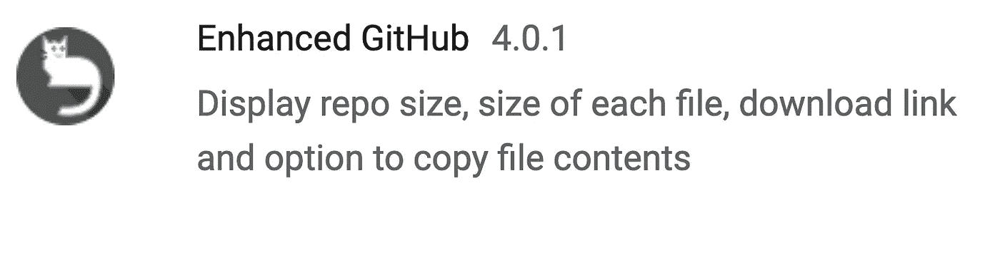
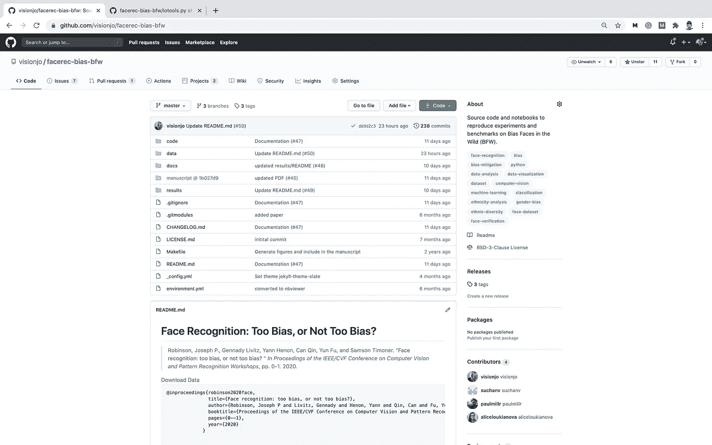
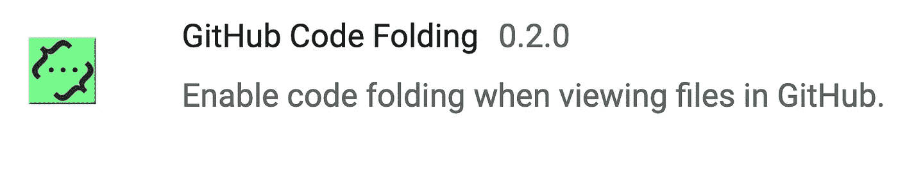
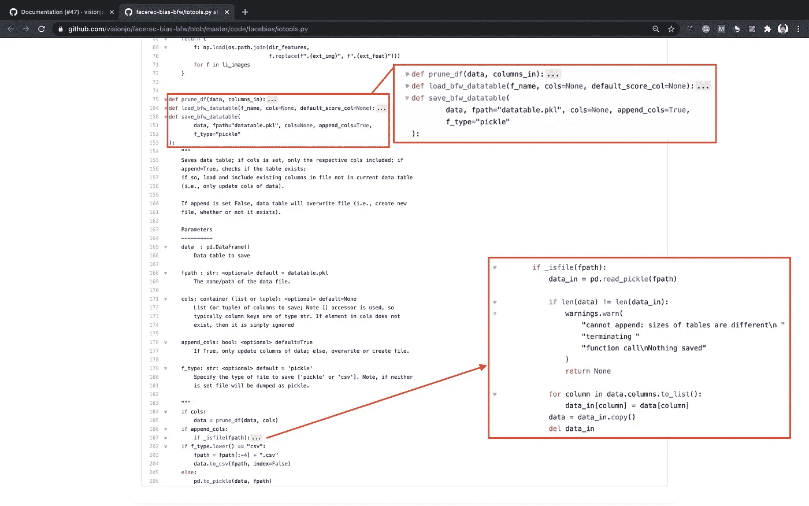
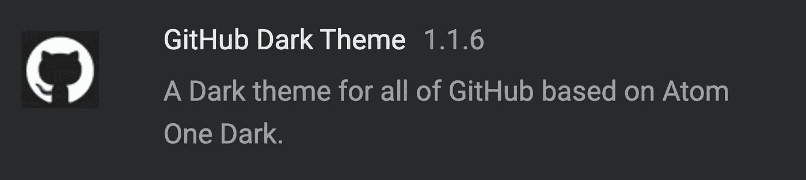
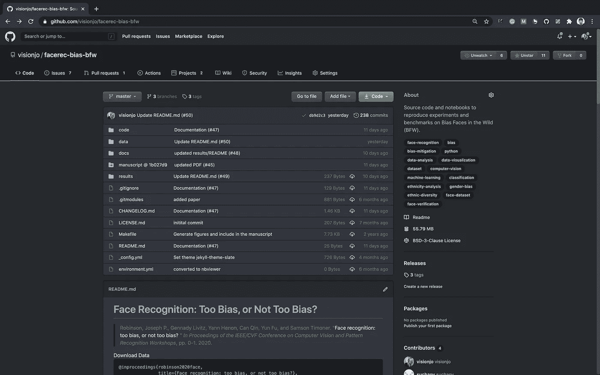
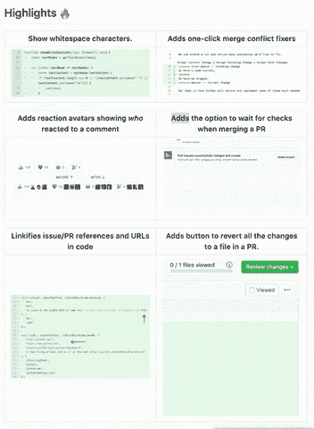
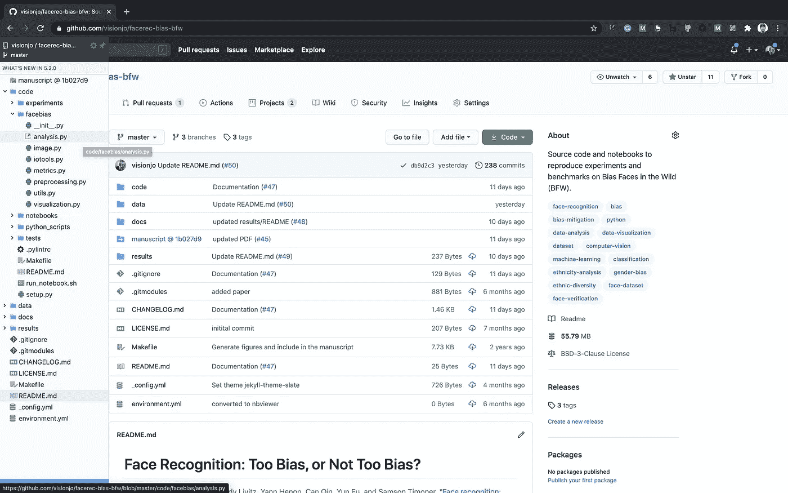

# Chrome 上的 GitHub 面向专业人士的 Git 设置！

> 原文：<https://towardsdatascience.com/jvisions-top-5-chrome-extensions-for-github-a356c7800069?source=collection_archive---------41----------------------->

## Github 的 5 个 Chrome 扩展可以提高您的工作效率！

图片通过 [Pixabay](https://pixabay.com/vectors/processor-bar-machine-strong-41295/)

对于那些尚未探索 [Chrome 扩展](https://support.google.com/chrome_webstore/answer/2664769?hl=en)(根据 [Chrome 网上商店](https://chrome.google.com/webstore/category/extensions))的人来说，如今有大量的扩展可以添加——每一个都旨在增强界面、进步的潜力(即生产力)，以及各种意图的可用功能。最近，我正在建立一个系统，作为我研究的一部分——应用机器学习，通常以图像作为输入/输出信号。因此，让我分享一下我觉得有用的 Chrome 专用设置。换句话说，让我分享一下我在准备 SW 开发和使用 Git、Github 和 Google 的 Chrome 的版本控制源代码时设置浏览器的方式。

不管您的具体关注点是什么，以下扩展都与任何使用 Github 的人相关。现在，除了本地设置之外，对于 mac 用户来说，可以通过关注我以前的媒体博客像专业人士一样进行 git 设置，我们可以通过添加基于 Github 的扩展来扩展我们的功能。

其余部分的组织如下。前面的五个子部分涵盖了五个扩展(即每个部分一个)。注意，顺序是不明确的(即前者不一定比后者评级高，反之亦然)。接下来，我们得出结论，其中包括一个列表，列出了所有相关项目的*荣誉提名*和*参考文献*。这里列出了包括的扩展:

1.  增强型 Github
2.  Github 代码折叠
3.  Github 黑暗主题
4.  精制 Github
5.  八叉树

每个扩展的呈现是相同的:子部分以 Chrome 网络商店中列出的扩展的名称、URL、视图(即，预告图像)开始。此外，还显示了描述每个扩展在使用时的截图——通常快照跨越了前的*和*后的*视图。*

当然，首先必须安装基于 Chromium 的浏览器。几个选项是[谷歌的 Chrome](https://www.google.com/chrome/?brand=CHBF&ds_kid=43700052784036214&utm_source=bing&utm_medium=cpc&utm_campaign=1008138%20%7C%20Chrome%20Win10%20%7C%20DR%20%7C%20ESS01%20%7C%20NA%20%7C%20US%20%7C%20en%20%7C%20Desk%20%7C%20BING%20SEM%20%7C%20BKWS%20~%20Top%20KWDS%20-%20Exact%20-%20NEW&utm_term=google%20chrome&utm_content=Desk%20%7C%20BING%20SEM%20%7C%20BKWS%20%7C%20Exact%20~%20Google%20Chrome%20~%20Top%20KWDS&gclid=COLug8C94uoCFcnwswod5tsEbA&gclsrc=ds) 、 [Mozilla Firefox](https://www.mozilla.org/en-US/exp/firefox/new/) 和[微软 Edge](https://www.microsoft.com/en-us/edge) (2020 年或更晚)——这些，以及其他几个基于 Chrome 的浏览器，允许安装 Chrome 扩展。

注意，对于谷歌以外的浏览器，允许安装 Chrome 扩展的选项必须是设置中上的*(例如，这里是 Edge [ [link](https://www.onmsft.com/how-to/how-to-install-extensions-from-the-chrome-store-on-edge-insider#:~:text=Here%20are%20the%20steps%20required%20to%20add%20extensions,ability%20to%20allow%20extensions%20from%20other%20stores.%20) ]的步骤)。*

## 增强型 Github

chrome://extensions/？id = anlikcnbgdeidpacdbdljnabclhahhmd

**图 1。预告图像。**增强版 Github，如 Chrome 网上商店所见。

如预告图(图 1)中所述，列出了每个文件的文件大小，并允许从文件查看器下载单个文件(即，通常必须打开单个文件才能下载专有内容)。尽管可能很简单，但这个扩展经常会派上用场。图 2 和图 3 分别示出了前视图和后视图。

**图二。在*增强 Github 之前。*** *注意视图是默认的 Github 界面。*

**图 3。激活*后增强 Github。*** *红色边界框显示差异(即图 2)。注意文件大小，以及下载单个文件的图标(绿色边框)。*

## Github 代码折叠

chrome://extensions/？id = lefcpjbffalgdcdgidjnmabfenecjdf

**图 4。预告图像。** Github 代码折叠，在 Chrome 网上商店看到的。

顾名思义(图 4)，这个扩展支持直接在浏览器中进行代码折叠！图 5 中描绘的是与 Python 源代码一起激活和使用的扩展。然而，该工具是复杂的，因为它根据软件语言自动适应(即，自动设置)，用于通用样式指南和文档语法(例如， [docstring](https://www.pythonforbeginners.com/basics/python-docstrings/) ， [Pep 8](https://pep8.org/) ， [Doxygen](https://www.doxygen.nl/index.html) )。

**图 5。通过 Chrome 扩展进行代码折叠。**注意代码折叠设置为 on(顶部)的函数定义的放大视图。此外，靠近底部折叠的代码显示了条件体也可以是可折叠的。切换按钮是箭头形状的，可以在左边看到(即，通过行号)。

## Github 黑暗主题

chrome://extensions/？id = odkdlljoangmamjilkamahebpkpgpeacp

**图 8。预告图像。** Github 黑暗主题，如 Chrome 网上商店所见。

简而言之，通过使背景颜色变暗来减轻视图——将 Github 的主题设置为暗色(图 8 和图 9)。

**图 9。Github 黑暗主题扩展。** Github 的外观和感觉现在是黑暗模式——一种许多人更喜欢的模式。

## 精制 GitHub

chrome://extensions/？id = hlepfoohegkhhmjioechaddaejaokhf

**图 8。预告图像。**精制的 GitHub，如 Chrome 网上商店所见。

这个扩展带来了一系列功能增强(图 8)！项目报告([链接](https://github.com/sindresorhus/refined-github/blob/master/readme.md))中包含的自述文件中有一个详尽的列表，该列表列出了功能的目标级别(即，存储库、文件管理、基于代码、评论(管理和审阅)、对话、PR 和提交(查看和编辑)、配置文件、新闻订阅等)。此外，还允许定制(例如，基于 Javascript 的定制 CSS)。图 9 是示出所包括的几个特征的多个视图的 GIF 图像。尽管如此，还是有将近一百个特性。此外，该扩展集成的简单性使其成为一个重要的工具(即，没有学习曲线，如果不喜欢某个特性，就不要使用它，因为该扩展对界面的整体外观影响很小)。

**图 9。插图显示了作为改进的 Github 扩展的一部分的特性。Github 的外观和感觉现在是黑暗模式——一种许多人更喜欢的模式。(图片来自项目的 Github，[https://github.com/sindresorhus/refined-github](https://github.com/sindresorhus/refined-github))。)**

## 八叉树

chrome://extensions/？id = bkhaagjahfmjljalopjnoealnfndnagc

**图 10。预告图像。** Octotree，见于 Chrome 网上商店。

Octotree(图 10)是通过 GitHub 浏览项目时增强文件可访问性的一种简单方法。正如许多人可能同意的那样，传统的文件查看器对于观察项目的整体结构或快速打开嵌套在本地目录中的文件是最佳的(图 11)。

**图 11。八棵树的景色。**该扩展允许快速浏览文件。

图 12 示出了增强型观察器的剪辑。

**图 12。八叉树的增强视图。**可以快速查看和打开文件。

# 结论

因此，它总结了五个对 GitHub 有用的 Chrome 扩展。新的扩展会定期出现；仅 GitHub 就有几十个扩展可以通过 Chrome 网上商店下载。除此之外，还有许多扩展 to 和 [themes](https://chrome.google.com/webstore/category/themes) 来增强最流行的网站(例如 [Medium Code Highlighter](https://chrome.google.com/webstore/detail/medium-code-highlighter/apdaagmhepellbjjbnaljaocodjjjjfd) ，这对于我过去的许多帖子来说是必不可少的)。如果你还没有去过的话，肯定值得去逛逛这家商店！

最后，这里是荣誉提名和相关参考。

## 荣誉提名

以下是其他基于 Github 的扩展，可能会有用。

*   [Git 历史浏览器扩展](https://chrome.google.com/webstore/detail/git-history-browser-exten/laghnmifffncfonaoffcndocllegejnf)
*   [GitHub 的头像](https://chrome.google.com/webstore/detail/avatars-for-github/pgjmdbklnfklcjfbonjfkdhaonlfogbb)
*   [Git Cheatsheet](https://chrome.google.com/webstore/detail/git-cheat-sheet/mjdmgoiobnbkfcfjcceaodlcodhpokgn)
*   [GitHub 等距投稿](https://chrome.google.com/webstore/detail/github-isometric-contribu/mjoedlfflcchnleknnceiplgaeoegien)
*   GitHub Hovercard
*   [GitHub 强大的自动完成功能](https://chrome.google.com/webstore/detail/awesome-autocomplete-for/djkfdjpoelphhdclfjhnffmnlnoknfnd)
*   [GitHub 存储库大小](https://chrome.google.com/webstore/detail/github-repository-size/apnjnioapinblneaedefcnopcjepgkci)
*   [ZenHub for GitHub](https://chrome.google.com/webstore/detail/zenhub-for-github/ogcgkffhplmphkaahpmffcafajaocjbd)
*   [还有更多](https://chrome.google.com/webstore/search/github?_category=extensions)

如果你有最喜欢的扩展，不管是不是这个博客的一部分，请在下面评论中分享。

## 相关参考文献

像现在的大多数话题一样，网上有大量的资源，大体上涵盖了 Chrome 扩展。这里有一些精选的。

*   [Alexander Isora 为极客设计的 14 款热铬扩展](https://medium.com/hackernoon/14-hot-chrome-extensions-for-geeks-c815a3883f9e)🦄
*   [25 个扩展、应用程序、&让您的工作效率提高两倍](https://medium.com/hackernoon/25-chrome-extensions-apps-and-hacks-to-2x-your-productivity-dd4b13e95443)，作者 [Brian Tan](https://medium.com/u/51d08cbd58a1?source=post_page-----a356c7800069--------------------------------)
*   [杰克·普林斯](https://medium.com/better-programming/how-to-create-and-publish-a-chrome-extension-in-20-minutes-6dc8395d7153)在 20 分钟内创建并发布 Chrome 扩展
*   [想要 GitHub 通知。所以我做了一个 Chrome 扩展](https://medium.com/free-code-camp/i-wanted-real-time-github-push-notifications-so-i-built-a-chrome-extension-7e6be0611e4)，作者是 [Stacy Goh](https://medium.com/u/51819d0a98cc?source=post_page-----a356c7800069--------------------------------)
*   同样，还有更多！

评论是其他读者和我最喜欢的资源！

这篇文章是我的非正式博客系列*Git Like Pro*、*、*的第二篇。另一篇涵盖了在 Mac 计算机上正确设置 Git 的步骤！检查一下， [Git 像专业人士一样设置](https://medium.com/better-programming/git-setup-like-a-pro-67bc3fe86fd1)！

现在，我不知道你，但我准备写一些代码！:) :) :)