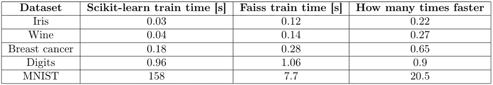
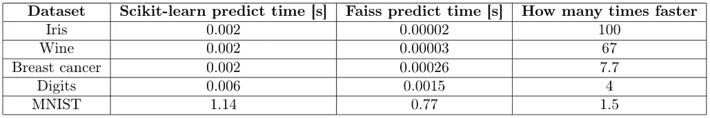
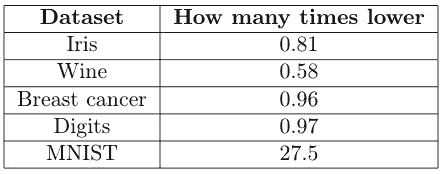

# k-意味着比 Scikit-learn 的 25 行代码快 8 倍，错误低 27 倍

> 原文：<https://towardsdatascience.com/k-means-8x-faster-27x-lower-error-than-scikit-learns-in-25-lines-eaedc7a3a0c8?source=collection_archive---------8----------------------->

## 脸书·费斯图书馆又罢工了

k-均值迭代([来源](https://en.wikipedia.org/wiki/K-means_clustering#/media/File:K-means_convergence.gif))

## 介绍

在我上一篇关于 faiss 库的文章[中，我用 20 行代码展示了如何使用](/make-knn-300-times-faster-than-scikit-learns-in-20-lines-5e29d74e76bb)[脸书的 faiss 库](https://github.com/facebookresearch/faiss)让 kNN 比 Scikit-learn 快 300 倍。但是我们可以用它做更多的事情，包括更快更准确的 K-Means 聚类，只用了 25 行代码！

K-Means 是一种迭代算法，它将数据点聚类成 k 个聚类，每个聚类用一个均值/中心点(质心)表示。训练从一些最初的猜测开始，然后在两个步骤之间交替:分配和更新。

在分配阶段，我们将每个点分配给最近的聚类(使用点和质心之间的欧几里德距离)，在更新步骤中，我们重新计算每个质心，从当前步骤中分配给该聚类的所有点计算平均点。

聚类的最终质量被计算为聚类内距离的总和，其中对于每个聚类，我们计算该聚类中的点与其质心之间的欧几里德距离的总和。这也叫惯性。

对于预测，我们在新点和质心之间执行 1 最近邻搜索(k=1 的 kNN)。

**Scikit-learn vs faiss**

在这两个库中，我们必须指定算法超参数:聚类数、重启次数(每次都从其他初始猜测开始)和最大迭代次数。

正如我们从例子中看到的，算法的核心是搜索最近的邻居，特别是最近的质心，用于训练和预测。这就是 faiss 比 Scikit 快几个数量级的地方——学习！它利用了优秀的 C++实现、尽可能的并发性，甚至 GPU，如果你愿意的话。

**用 faiss 实现 K-Means 聚类**

下面的 Github 要点也可以在我的定期 Github(链接)上找到。

faiss 的一个很大的特点是它既有安装和构建说明(安装文档)，又有一个优秀的文档和示例(入门文档)。安装完成后，我们可以编写实际的集群。代码非常简单，因为我们只是模仿了 Scikit-learn API。

重要元素:

*   faiss 专门为这个任务内置了`Kmeans`类，但是它的参数名称与 Scikit-learn 中的不同(参见[文档](https://github.com/facebookresearch/faiss/wiki/Faiss-building-blocks:-clustering,-PCA,-quantization)
*   我们必须确保使用`np.float32`类型，因为 faiss 只使用这种类型
*   `kmeans.obj`通过训练返回错误列表，为了得到像 Scikit-learn 中那样的最终错误，我们使用`[-1]`索引
*   使用`Index`数据结构进行预测，这是 faiss 的基本构建块，用于所有最近邻搜索
*   在预测中，我们使用 k = 1 执行 kNN 搜索，从`self.cluster_centers_`返回最近质心的索引(索引`[1]`，因为`index.search()`返回距离和索引)

## 时间和准确度比较

我选择了 Scikit-learn 中的一些流行数据集进行比较。比较列车时刻和预测时刻。为了便于阅读，我明确地写了基于 faiss 的集群比 Scikit-learn 的集群快多少倍。为了进行误差比较，我刚刚写了基于 faiss 的聚类实现了多少倍的低误差(因为数字很大并且不太能提供信息)。

所有这些时间都是用`time.process_time()`函数测量的，该函数测量进程时间而不是挂钟时间，以获得更准确的结果。结果是 100 次运行的平均值，除了 MNIST，在那里 Scikit-learn 花费了太长时间，我不得不运行 5 次。

火车时间(图片由作者提供)

预测时间(图片由作者提供)

训练错误(图片由作者提供)

正如我们所看到的，对于小数据集(前 4 个数据集)的 K-Means 聚类，基于 faiss 的版本对于训练来说更慢，并且具有更大的误差。对于预测来说，它的工作速度普遍更快。

对于更大的 MNIST 数据集，faiss 显然是赢家。训练速度提高 20.5 倍是巨大的，特别是因为它将时间从几乎 3 分钟减少到不到 8 秒钟！1.5 倍的预测速度也不错。然而，真正的成就是误差降低了惊人的 27.5 倍。这意味着对于更大的真实世界数据集，基于 faiss 的版本要精确得多。而这只需要 25 行代码！

因此，基于这一点:如果你有大型(至少几千个样本)真实世界数据集，基于 faiss 的版本显然更好。对于小型玩具数据集，Scikit-learn 是更好的选择；然而，如果你有一个 GPU，GPU 加速的 faiss 版本可能会更快(我没有检查它以进行公平的 CPU 比较)。

## 摘要

通过 25 行代码，我们可以利用 faiss 库为合理规模的数据集进行 K-Means 聚类，从而获得巨大的速度和准确性提升。如果你需要，你可以通过 GPU、多个 GPU 等获得更好的性能，这在 faiss 文档中有很好的解释。