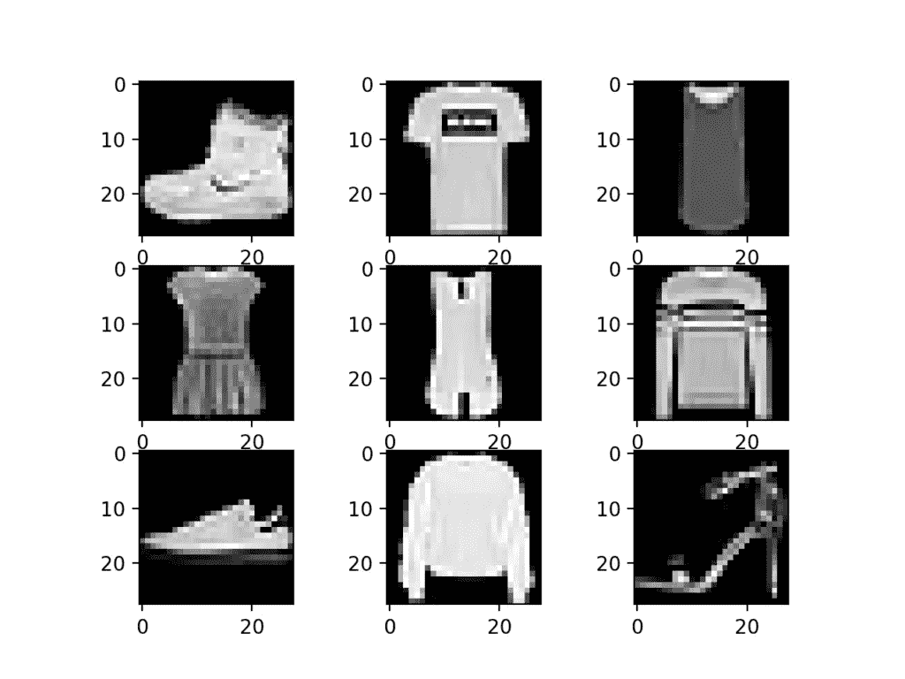

# K-means 和 PCA 在图像聚类中的可视化分析

> 原文：<https://towardsdatascience.com/k-means-and-pca-for-image-clustering-a-visual-analysis-8e10d4abba40?source=collection_archive---------9----------------------->

## 我们可以使用 K-means 和主成分分析(PCA)对时尚 MNIST 数据集上的图像进行聚类。我们还将使用 [matplotlib](https://matplotlib.org/) 和 [plotly](https://plotly.com/) 对结果进行可视化分析。


时尚 MNIST 数据集。图片来自 researchgate.net

我们在这里要做的是在 f-MNIST 数据上训练一个 K-means 聚类模型，以便它能够相对准确地对数据集的图像进行聚类，并且这些聚类具有一些我们可以理解和解释的逻辑。然后，我们将参考实际标签(y)使用 matplotlib 和 plotly 直观地分析聚类的结果，并得出关于 k-means 聚类如何在图像数据集上执行的粗略结论。最后的代码可以在最后的链接中找到。

在本文中，*功能*和*组件*可互换使用。

[***直奔 Github 上的代码。***](https://github.com/sunman91/Data-Science-stuff/blob/master/k-means-and-pca-on-f-mnist-dataset.ipynb)

# 介绍

**聚类**是一种无监督的机器学习算法，它识别没有特定标签的模式，并根据特征对数据进行聚类。在我们的例子中，我们将看到一个聚类算法(k-means)是否可以在没有标签(y)的情况下在 f-MNIST 中找到不同服装图像之间的模式。


说明 K-means 如何工作的 gif。每个红点是一个质心，每种不同的颜色代表一个不同的集群。每一帧都是质心被重新定位的迭代。(来源: [gyfcat](https://gfycat.com/softenragedhypsilophodon) )

**K-means** 聚类的工作原理是根据给定的聚类数分配多个质心。每个数据点被分配给质心最接近它的聚类。该算法旨在最小化观测值与其所属聚类质心之间的平方欧氏距离。

**主成分分析或 PCA** 是一种减少给定数据集的维度，同时仍然保留其大部分方差的方法。维基百科将其定义为，“ *PCA 被定义为一种正交线性变换，它将数据变换到一个新的坐标系，使得数据的一些标量投影的最大方差位于第一个坐标上(称为第一主分量)，第二个最大方差位于第二个坐标上，以此类推。”*


PCA 可视化。最好的 PC(黑色移动线)是那些红线的总长度最小的时候。它将被用来代替水平和垂直分量(来源: [giphy](https://giphy.com/gifs/pca-Lyejb62QjQepG)

基本上，PCA 降低了数据集的维度，同时保留了大部分信息。例如，如果一个数据集有 500 个特征，根据保留的特定方差量，它会减少到 200 个特征。保留的方差越大，保存的信息就越多，但是得到的维数也就越多。

维度越少，训练和测试模型的时间就越少。在某些情况下，使用数据集和 PCA 的模型比原始数据集表现更好。PCA 的概念以及它通过改变保留方差而在图像上引起的变化在这里[处](/pca-using-python-scikit-learn-e653f8989e60)得到了很好的展示。

# 这个计划

因此，计划是在数据集上执行 k-means，但只是在对其应用 PCA 之后。

1.  从 keras 加载数据集
2.  预处理数据，展平数据(从 60000 x 28 x 28 数组到 60000 x 784 数组)
3.  对其应用 PCA 以减少维度(使用 0.98 方差从 784 到 420)
4.  在 PC 数据集上应用 K 均值聚类(10 个聚类)
5.  使用 matplotlib 和 plotly 观察和分析结果

# 数据集

与 MNIST 数字数据集相比，f-MNIST 数据集是一个稍微高级的数据集，它由不同种类服装的 28 x 28 像素图像组成，数字代表以下服装类型。

```
#Loading required libraries **import keras
from keras.datasets import fashion_mnist 
import numpy as np
import matplotlib.pyplot as plt
from sklearn.preprocessing import StandardScaler
from sklearn.cluster import KMeans** **#Loading the dataset
(X_train,y_train), (X_test,y_test) = fashion_mnist.load_data()**
```


时尚 MNIST 数据集



每张图片都是 28×28 像素，上面有各种各样的衣服、鞋子和包包

# **数据预处理**

我们通过将特征展平成一维来将数据从 3D 阵列重新成形为 2D 阵列。28×28 阵列的每个图像现在是 784 个特征的单个阵列。所以我们的数据集从之前的 60000，28，28 变成了 60000，784 数组。

```
#Reshaping X to a 2D array for PCA and then k-means
**X = X_train.reshape(-1,X_train.shape[1]*X_train.shape[2])** #We will only be using X for clustering. No need of y.**print ("The shape of X is " + str(X.shape))
print ("The shape of y is " + str(y.shape))** #We will be using y only to check our clustering **Output:**
The shape of X is (60000, 784)
The shape of y is (60000,)
```

# 主成分分析

我们现在将在数据集上使用 PCA 来降低维数。我们将选择保留方差 0.98(通过反复试验选择的值)，并将其用于我们的数据集。

```
**from sklearn.decomposition import PCA**
# Make an instance of the Model**variance = 0.98** #The higher the explained variance the more accurate the model will remain, but more dimensions will be present**pca = PCA(variance)** 
**pca.fit(Clus_dataSet)** #fit the data according to our PCA instance**print("Number of components before PCA  = " + str(X.shape[1]))
print("Number of components after PCA 0.98 = " + str(pca.n_components_))** 
#dimension reduced from 784**Output:**
Number of components before PCA  = 784
Number of components after PCA 0.98 = 420
```

我们现在根据 PCA 实例转换数据

```
**Clus_dataSet = pca.transform(Clus_dataSet)****print(“Dimension of our data after PCA = “ + str(Clus_dataSet.shape))****Output:**
Dimension of our data after PCA  = (60000, 420)
```

我们还可以对数据进行逆变换，以查看数据因 PCA 而发生的变化。

```
**approximation = pca.inverse_transform(Clus_dataSet)**#image reconstruction using the less dimensioned data
**plt.figure(figsize=(8,4));**n = 500 #index value, change to view different data# Original Image
**plt.subplot(1, 2, 1);
plt.imshow(X[n].reshape(X_train.shape[1], X_train.shape[2]),
 cmap = plt.cm.gray,);
plt.xlabel(str(X.shape[1])+’ components’, fontsize = 14)
plt.title(‘Original Image’, fontsize = 20);**# 196 principal components
**plt.subplot(1, 2, 2);
plt.imshow(approximation[n].reshape(X_train.shape[1], X_train.shape[2]),
 cmap = plt.cm.gray,);
plt.xlabel(str(Clus_dataSet.shape[1]) +’ components’, fontsize = 14)
plt.title(str(variance * 100) + ‘% of Variance Retained’, fontsize = 20);**
```


左边的数据是原始数据(784 个分量)，右边的数据是从 PCA 逆变换而来的(420 个分量)。两者都有 28 x 28 的尺寸。

# k 均值聚类

构建 k 均值模型时，我们需要以下参数的值。

**init** :质心的初始化方法。值将为:“k-means++”。k-means++以一种智能的方式为 k-mean 聚类选择初始聚类中心，以加速收敛。

**n_clusters** :要形成的簇的数量以及要生成的质心的数量。值将是:10(根据索引，我们有 10 个类，可能不是最好的，但对我们的上下文足够好)

**n_init** :使用不同质心种子运行 k-means 算法的次数。就惯性而言，最终结果将是 n_init 次连续运行的最佳输出。基于我们的惯性结果，值将是:35(可能不是最好的，但对我们的环境来说足够好了)

现在我们有了自己的模型，并使它适合我们的数据集。首先尝试使用提到的参数来检查本文的结果。您可以稍后更改它们，并看到不同的结果。

```
**k_means = KMeans(init = “k-means++”, n_clusters = 10, n_init = 35)
k_means.fit(Clus_dataSet)**
```

现在，该模型已经适合我们的图像数据集，我们已经执行了主成分分析。数据现在被分成 10 个簇。现在，我们必须检查哪种类型的图像出现在每个集群中，并查看是否有任何模式。请记住，分布是相似的，但是在执行此操作时，集群的数量(标签)可能会有所不同。

# 可视化和分析

拟合之后，我们使用下面的代码来可视化我们的集群。

```
**G = len(np.unique(k_means_labels))** #Number of labels#2D matrix  for an array of indexes of the given label
**cluster_index= [[] for i in range(G)]
for i, label in enumerate(k_means_labels,0):
    for n in range(G):
        if label == n:
            cluster_index[n].append(i)
        else:
            continue**#Visualisation for clusters = clust**plt.figure(figsize=(20,20));
clust = 3 #**enter label number to visualise **num = 100** #num of data to visualize from the cluster **for i in range(1,num): 
    plt.subplot(10, 10, i);** #(Number of rows, Number of column per row, item number) **plt.imshow(X[cluster_index[clust][i+500]].reshape(X_train.shape[1], X_train.shape[2]), cmap = plt.cm.binary);

plt.show()**
```

正如你在下面看到的，这个特殊的集群(在我的例子中是 3 个)在集群踝靴方面做得很好。


第三组似乎有短靴(略短)、运动鞋和一些凉鞋

下面的条形图可视化代码可以在最后的链接中找到。这使用来自数据集的 *y_train* 的类别标签，并检查给定聚类中某个类别的数量。该图将是相同的(如果您使用相同的参数),而当您执行它时，集群的数量(标签)可能会有所不同。*例如，在我的示例中，标记为 0 的聚类似乎是凉鞋聚类，而在你的示例中，该聚类可能标记为 4。*

*注:簇名为条形图上方****。***

****

**簇 0~ 3 的条形图**

****集群 0** 好像以凉鞋居多。**

****集群 1** 看似随机但大多只有上身衣服。 *(T 恤、套头衫、连衣裙、外套和衬衫)***

****集群 2** 也有上身衣服但是种类较少。*(套头衫、衬衫和外套)***

**集群 3 似乎大多是短靴，很少有运动鞋和凉鞋。基本上都是鞋子。**

****

**簇 4 ~ 7 的条形图。集群 6 和 7 似乎都有包。**

**同样，我们可以观察到星团 4 ~7。在群集 6 和 7(在我的情况下)中，似乎有大多数的包。但是在使用上述集群的可视化(如下所示)时，我们看到了一个合理的模式。一个集群的提手被提起(以及其他)，另一个没有。**

****

**第六组似乎有提手的袋子。**

****

**第 7 组似乎有把手朝下的包。**

****

**看起来有鞋子的分类 8 和分类 9 的条形图。**

**下面显示的群集 8 和 9 似乎是鞋。聚类 8 有一些凉鞋，大部分是运动鞋，聚类 9 似乎有一些凉鞋，大部分是短靴。**

****

**第八组好像有运动鞋和凉鞋。两个都是鞋。**

****

**集群 9 似乎主要是踝靴和几双凉鞋。两个都是鞋。**

# **集群的 3D 可视化**

**我们将使用 [plotly 在 3D 中可视化星团。](https://plotly.com/) Plotly 是 python 的高级可视化库。使用以下代码获得聚类数据的 3D 散点图。我们将仅使用数据集中 420 个要素中的 3 个要素。这种可视化有助于了解集群的形成情况，以及单个集群扩散到其他集群的程度。**

```
#install these if you haven’t
**!pip install chart_studio 
!pip install plotly****import plotly as py
import plotly.graph_objs as go
import plotly.express as px**#3D Plotly Visualization of Clusters using go**layout = go.Layout(
    title='<b>Cluster Visualisation</b>',
    yaxis=dict(
        title='<i>Y</i>'
    ),
    xaxis=dict(
        title='<i>X</i>'
    )
)****colors = ['red','green' ,'blue','purple','magenta','yellow','cyan','maroon','teal','black']
trace = [ go.Scatter3d() for _ in range(11)]
for i in range(0,10):
    my_members = (k_means_labels == i)
    index = [h for h, g in enumerate(my_members) if g]
    trace[i] = go.Scatter3d(
            x=Clus_dataSet[my_members, 0],**# 0 is a component among the 420 components. Feel free to change it **y=Clus_dataSet[my_members, 1],**# 1 is a component among the 420 components. Feel free to change it **z=Clus_dataSet[my_members, 2],**# 2 is a component among the 420 components. Feel free to change it **mode='markers',
            marker = dict(size = 2,color = colors[i]),
            hovertext=index,
            name='Cluster'+str(i),

            )****fig = go.Figure(data=[trace[0],trace[1],trace[2],trace[3],trace[4],trace[5],trace[6],trace[7],trace[8],trace[9]], layout=layout)

py.offline.iplot(fig)**
```

*****输出:*****

****

**使用 PCA 对 k 均值聚类的 f-MNIST 数据集进行 3D plotly 散点图可视化。每种颜色代表一个不同的集群。**

**由于数据集(具有 PCA)实际上具有 420 个维度，因此该可视化仅在散点图中显示了这些特征中的 3 个。要绘制的组件可以在代码中更改，以了解不同组件的情况。**

***(可进行进一步的主成分分析，将所有 784 个分量减少到 3 个分量，以在 3D 图中完全表示，但这样做会丢失大量信息)***

# ****结论****

**聚类似乎将相似的项目分组在一起。一个集群或者包含上身衣服 *(T 恤/上衣、套衫、连衣裙、外套、衬衫)*或者鞋子*(凉鞋/运动鞋/短靴)*或者包。然而，该聚类在裤子上表现不佳，并且似乎将其与连衣裙归为一组。**

****

**一群穿着裤子和裙子的人**

****

**前述集群中的服装和裤子的数据可视化**

**但它很好地区分了这两种包。这种模式可以由我们来解释。一组是提手凸起的包，另一组是提手未凸起的包。**

****

**两个集群都有包。但是该算法能够区分手柄被提起和未被提起**

**类似地，在下面显示的两个集群中，两个集群都以短靴为主。但是短靴看起来大小不一，小一点的看起来和同一组的运动鞋很相似。**

****

**两个集群都有最大的踝靴。左边的比右边的短**

**观察上面的结果，我们可以看到 k -means 算法基于一个合理的模式来区分它的聚类。因此，我们可以得出一个粗略的结论，K-means 聚类方法在进行主成分分析后可以得到一个不错的分类结果。**

**[***点击此处链接到***](https://github.com/sunman91/Data-Science-stuff/blob/master/k-means-and-pca-on-f-mnist-dataset.ipynb)**

***参考文献***

**[1] A. Ng，斯坦福大学的机器学习。(未注明)。从 https://www.coursera.org/learn/machine-learning[取回](https://www.coursera.org/learn/machine-learning)**

**[2] [S Joel Franklin](https://medium.com/@joel_34096?source=post_page-----a648f28bdc47----------------------) ， [K-Means 聚类用于图像分类](https://medium.com/@joel_34096/k-means-clustering-for-image-classification-a648f28bdc47) (2020)，[中](https://medium.com)**

**[3] [迈克尔·加拉内克](https://github.com/mGalarnyk)， [PCA + Logistic 回归(MNIST)](https://github.com/mGalarnyk/Python_Tutorials/blob/master/Sklearn/PCA/PCA_Image_Reconstruction_and_such.ipynb)(2018)[github](https://github.com)**