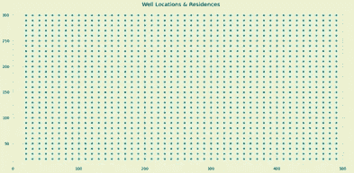
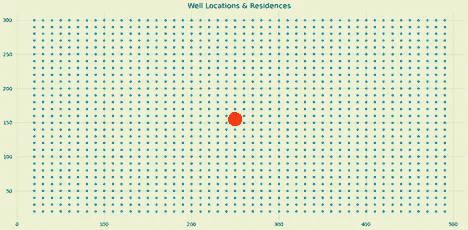
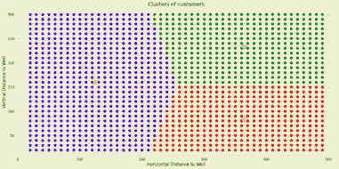
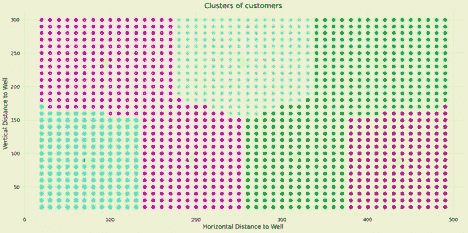
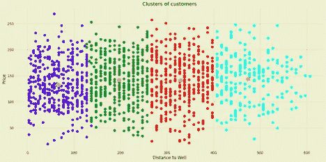
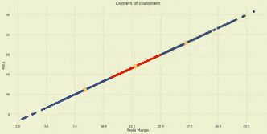
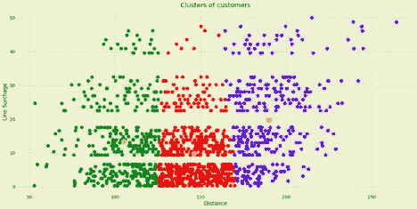

# k-均值聚类算法

> 原文：<https://towardsdatascience.com/k-means-clustering-algorithm-e845e2b25784?source=collection_archive---------32----------------------->

## 在 k-means 的引擎盖下，以便一个 7 年级学生能够理解

我选择为这个项目实现的算法是 *K 均值聚类*。生成的数据试图根据每个点离拟定水井的距离来模拟配水场景。本质上，该算法对于客户细分场景是理想的，这种场景基于客户的位置和井的数量将客户聚集在特定的水井周围。

在这个假想的场景中，几个地方自治市多年来一直在与老化的水利基础设施作斗争。水的供应、储存和从一个地方到另一个地方的运输是一个挑战。一位数据科学家被请来建立一些关于客户将如何受到影响的模型，并为改善供水提供一些启示。

目标是理解算法；然而，当变量有真正的意义时，它有助于我们深入了解它是如何工作的，以及背后的数学原理。

***例题:*** 客户将如何根据他们的位置进行聚类？创建一个放置 3 口和 7 口水井的可视化模型，每口井作为质心。

客户的位置是固定的等距点，使用内置的范围函数生成。一共 1392 分。

作者图片

在绘制了每个客户的固定位置后，我找到了我认为是数据集地理中心的地方。我认为这是第一口水井的理想地点。

作者图片

对于以每口井为质心的 3 口水井的布局，客户将被分为以下几类。用于预测新井位置的特征是每个点距质心的距离。

作者图片

对于 7 个水井的位置，每个水井都有一个质心，客户将按以下方式聚集。

作者图片

假设所有单个点的距离彼此等距，则在这种情况下应用 k-means 聚类算法是有意义的。应用距离公式计算每个点和所选质心之间的欧几里德距离。

接下来，我决定给这个问题添加一些上下文，并包含一些特征工程，以查看当应用 k-means 算法时，客户将如何聚类。

我添加了一些随机点，每个点代表一个特定的负责分配水的供水公司。显然，在这个假想的数据集上做了一些假设，但总体目标是看到 k-means 聚类算法在运行。

假设每个自来水公司都有一个单独的定价结构，根据水从每口井流出的距离来生产和向客户分配水，我想看看在考虑其他特征时，k-means 聚类算法将如何运行。

在这个场景中，根据一家供水公司的定价结构和水到达每个客户的距离创建了四个分类。

作者图片

k-means 聚类算法用于计算如何根据利润率(生产价格和销售价格之间的差额)对客户进行细分。

作者图片

我对这个虚拟数据集应用的 k-means 聚类算法的最后一个应用程序将客户分为 3 个部分。它使用了一种称为线附加费的功能，这是一种基于距离应用于数据集的功能。

作者图片

我花了大约两周的时间尝试了解 k-means 聚类算法。当应用于现实生活的概念场景时，理解算法如何工作是最好的证明。

虽然这目前超出了 k-means 聚类算法的范围，但逻辑上的下一步将包括探索每个自来水公司的一些分类算法模型以及对该场景的更多假设，例如:

想象一下，在公共供水公司突然被私有化为七家公司后，每个客户被随机分配到一口井，而不考虑距离。每个公司根据水的运输距离有不同的线路附加费，根据客户的选择有不同的送货时间表和用水量。创建一个应用程序，准确地将各自的资金分配给每个自来水公司，并创建一个模型，以便有效和高效地将水分配给所有客户。