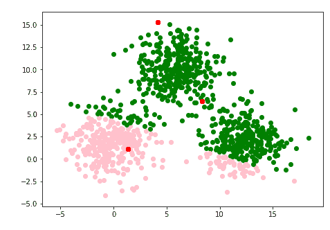
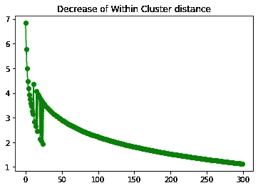
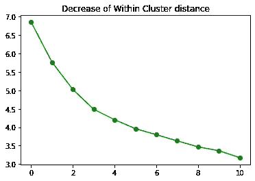
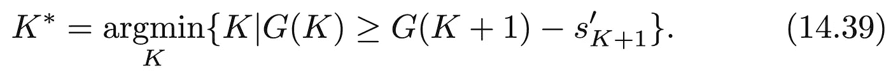
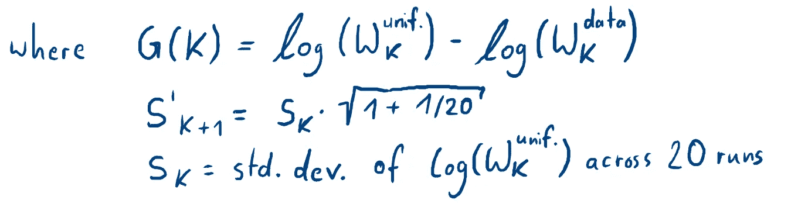
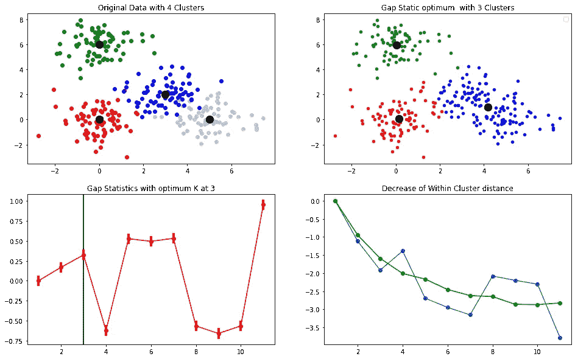
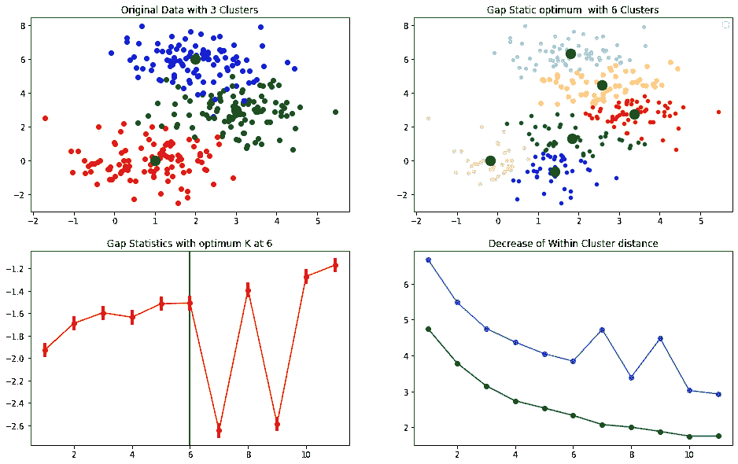

# k-均值聚类和间隙统计

> 原文：<https://towardsdatascience.com/k-means-clustering-and-the-gap-statistics-4c5d414acd29?source=collection_archive---------0----------------------->

## 用差距统计弥合知识差距

照片由[suser ll just me](https://www.freeimages.com/photographer/Suserl-44212)在 [Freeimages](https://www.freeimages.com/) 上拍摄并由我编辑

> 在引擎盖下有许多代码在运行。这就是为什么我在这篇文章的最后提供了我的 Github 库，并且我只展示了 K-Means 的一小段代码。

# 介绍

聚类是模式分析中识别数据中不同组的一种重要技术。由于数据大多是三维以上的，所以在应用聚类技术之前，我们执行像 PCA 或拉普拉斯特征映射这样的降维方法。然后，这些数据可以在 2D 或 3D 中使用，这使得我们可以很好地将发现的星团可视化。
尽管这是一个基本的工作流程，但情况并非总是如此。

数据通常也是无标签的。这意味着你没有明确的定义你想在这些数据中找到什么。这就是为什么聚类也是一种很好的数据探索技术，而不需要事先降维。

常见的聚类算法是 K-Means 和 Meanshift 算法。在这篇文章中，我将重点介绍 K-Means 算法，因为这是最简单和最直接的聚类技术。此外，我们将假设数据要么直接提供有两个特征(因此 2D)，要么有人对数据执行 2D 降维，然后将其提供给我们。因此，我们直接深入应用 K-Means。

K-Means 算法需要一个超参数，即你想要寻找的聚类数 **K** 。但是，如果我们想找到集群，我们怎么知道我们需要多少集群？

> **示例**:如果我们想要在数据中为我们的营销团队找到人物角色，我们可以假设我们想要找到三到四类人。

在这种情况下，K 的数量是固定的。但是如果**不是**呢？

超参数的选择称为模型选择。在
K-Means 的情况下，这只是我已经说过的 **K、**的数量。在这篇博文中，我将重点讲述我们如何通过对 K-Means 执行 Tibshirani 的 Gap-Statistics，从统计上找出 K 的最佳值。

> Gap-Statistics 是由 Robert Tibshirani 于 2000 年在斯坦福引入的。

# 目标

我想用这个帖子来回答这三个问题:

*   1)如何在 K-Means 中找到 K 的最佳值？
*   2)我们如何衡量差距统计的性能？
*   3)在什么条件下差距统计可能会失败？

# **K-Means——非常简短的介绍**

K-Means 执行三个步骤。但是首先你需要预先定义 k 的数量。这些聚类点通常被称为**质心**。

*   1)通过计算所有点到所有质心之间的欧几里德距离，将每个数据点(重新)分配到其最近的质心。
*   2)基于所有相应的数据点计算每个质心的平均值，并将质心移动到所有指定数据点的中间。
*   3)转到 1)直到满足收敛标准。在我的例子中，我计算所有点到重新分配的质心平均值之间的类内距离。在新的迭代之后，如果所有的质心一起移动小于 0.01，那么基本上不再发生什么，执行收敛标准。

代码 1)K-表示由我从头开始编写

在上面的代码 1 中可以看到，第 9 行使用列表理解为每个数据点计算到每个中心点的欧几里德距离(第 3 行中 K = 3)。Numpy.argmin 然后为每个点选择最近的距离，并将其分配给该质心。第 13 行计算第三步，并对总的簇内距离求和。如果小于 0.01，则 while 循环中断。

图 1) K=3 gif |我做的

我们可以看到在循环中每个*点的分配是如何变化的。总共需要五次循环直到收敛。*

> 通知:质心的初始化对 K-Means 的执行有很大的影响。想象两个质心从最左边和最低的位置开始。每个数据点将被分配给质心一号，聚类是无用的。
> 
> **注意** : K-Means 只是局部最优，并不能保证全局最小

## 进一步的调查

图 1 显示了 300 个数据点的 3 个质心。我还没有展示数据的代码，它只是从带有 *make_blobs* 的 *sklearn* 中生成的。

当然，在有三个全局最优质心的情况下，这种簇内距离不会进一步减小。但是当我们给 K 加上越来越多的值时会发生什么呢？簇内距离将几乎单调地缩小。想象一下，如果我们用一个额外的质心将图 1 的三个集群中的一个分成两个。簇内距离会缩小，因为所有点现在都更靠近另一个质心，即使这显然是一个错误的**簇分裂。**

图 2) K=300 |我做的

当我们选择 K 的数量等于质心的数量时，总的簇内距离将是 0。从最小化问题的角度来看，这是理想的，但对我们来说不是。

图 3) K=11 |我做的

当我们选择 K 的数目等于 11 时，我们可以看到，我们将永远不会达到小于 3 的总簇内距离。

> 由于图 2 和图 3 中的起点为 1，所以图 2 的实际簇内距离为零，而图 3 的实际簇内距离为二。

那么我们如何防止 K 被选择为等于数据点的数量呢？

## 我们如何通过初始化来强制我们的集群拥有 K 个非空组件？

*   1)在样本点的位置初始化每个聚类中心
*   2)针对局部最小值制定对策

# 1)如何在 K-Means 中找到 K 的最优值？

答案当然是**缺口统计**，但它是什么呢？

它是由罗伯特·提布拉尼在 20 年前发明的。基本的最小化问题如下所示:

公式 1)估计 K*的形式规则由 **HTF** 统计学习的要素第 **519 页** | 14.3.11 实际问题

看起来怪怪的？没问题！K*是我们想要找到的 K 的最优值。我们需要定义不同的数据矩阵 W_data 和 W_uniform。其中 W_data 是上图 1 中的 300 个数据点，W_uniform 基本上是群集内距离的模拟平均分布，如**进一步调查**部分所述。W_uniform 基本看起来像图 3。

公式 2)缩减差距统计公式

我们在 ***中可以看到，其中*** 上面的*，*表示 S’(S 素数)等于前面的 S 乘以一个小值(1.024695)。这意味着它在每个时间步长不断变大。

第一个时间步长的初始 S 等于所有均匀绘制的数据点的标准偏差，例如 20 次运行。可能更多，但是 Tibshirani 写道 20 次模拟已经足够了。

## 这是什么意思呢？

好吧。正如我们已经指出的，我们需要一种方法，使得 K 的最佳数目不被选为数据点的数目。为此，引入模拟平均值**W _ uniform from**和标准差 S’(K+1)。

通过检查公式 1 中每个时间步长的图中的最小化问题，我们取 K 的数目，这通过引入新的质心而使最大跳跃进入减少的总簇内距离。

如果你仔细观察图 3，你会发现距离减少的跳跃对于前几个质心来说特别大。这具有直观的意义，因为如果你回头看一下图 1，很明显你引入的质心越多，簇内距离的变化就越小。

因此，差距统计的基本思想是根据均匀抽取的样本的总体行为，选择 K 的数量，即类内距离发生最大跳跃的地方。可能的情况是簇内距离仅发生非常轻微的减小。出于这个原因，S'(K+1)充当阈值，以挑选出太微小的变化，并从数据中去除采样噪声。只有当变化大到阈值 S′(K+1)不再起作用时，才会选择 K 的最佳值。

让我为你想象一下:

图 4)差距统计|我做的

> **注意**:类内距离曲线的值已经被最大类间距离归一化。

我故意选择了图 4 左上角的数据，下面的两个簇非常接近。K-means 几乎不可能分辨出这些是不同的聚类。

在左下方的图像中，我们可以看到差距统计数据。选择 K=3 的最佳值，因为我们在值再次收缩之前选择第一个峰值点。红线的计算方法是从右下图的 W_data(蓝色)中减去 W_uniform(绿色)。

> **退一步**:右下图像显示 W_data(蓝色)和 W_uniform(绿色)分布。通过查看 G(K)上的公式 2，我们看到需要用 W_data to 的对数减去 W_uniform 的对数。

对于 W_data 和模拟的 W_uniform，总的簇内距离如预期的那样收缩。但是在 K=4 时，间隙统计检测到 W_data 的总距离的变化不像模拟的那样。这意味着它没有像预期的那样减少。

即使当从 W_uniform 中减去标准偏差 S’(K+1)时，间隙统计也将选择 K 的最佳值作为 **3** 。

> **注意**:如果我们假设 K=4 处的间隙不存在，则低于其前一个点的下一个点在 K=6 处。但由于我将标准偏差标记为垂直的粗红线，我们看到，减去标准偏差后，距离的变化太小，因此 K 将被选择为 K=6。将被选择的下一个 K 是 K=7，因为在 K=8 时出现下一个大间隙。

# 2)我们如何衡量差距统计的性能？

正如我已经提到的，质心的初始化高度影响 K 均值的优化。我们需要考虑不同的数据分布。在计算 K-Means 算法的第二步时，我们需要记住两种基本情况:

*   1)总体聚类距离**大** - >我们取平均值
*   2)总体聚类距离**小** - >我们取最小值

如果我们在计算差距统计之前考虑这两种差异，那么差距统计将更加稳健。

对于我的例子，总的聚类距离很小，所以我计算了平均值，如代码 1 的第 12 行所示，这里我使用 Numpy.mean。

# 3)在什么条件下差距统计可能会失败？

可能会出现三种情况:

*   低估集群
*   高估集群
*   通常

## 低估

如果两个或三个集群非常接近，而其他集群相距甚远，它往往会低估。这正是我之前向您展示的示例中所发生的情况。其中两个星系团靠得太近，所以间隙统计低估了 K*。

## 高估

如果所有的星团都很接近，那就高估了而不是低估了。我真的不能解释为什么，但这是我计算了几次后发生的事情。

图 5)差距统计高估|我做的

## 通常

低估和高估都主要取决于随机初始化的质心。当它们中的一些由于随机的不顺利而被忽略时，类内距离的中断迫使间隙统计更早地产生最佳的类。

# 结论

即使间隙统计是找到合适的 K 的好方法，它仍然不是完美的。例如，我们需要引入一个新的超参数，即模拟 W_uniform 的 K 的个数。我们不能确定这个的理想值是多少。此外，质心的随机初始化会导致高估或低估 K*。

但是通过了解差距统计的所有方面，最好的方法是应用它，然后运行几次差距统计图。取差距统计的平均值可以是一个增加的评估标准。

希望你喜欢这篇文章，它给了你一些差距统计的见解。

# 密码

你可以在我的 Github 页面 [**这里**](https://github.com/Mavengence/Pattern_Analysis_SS20_FAU/blob/master/Exercise_6.ipynb) 找到这个项目的完整代码。如果您对代码有任何疑问，可以给我发电子邮件。你可以在我的[网站](https://timloehr.me/)上找到我的邮箱地址。

# 参考

[1] Trevor Hastie，Robert Tibshirani 和 Jerome Friedman，[统计学习的要素:数据挖掘、推理和预测](https://web.stanford.edu/~hastie/ElemStatLearn/) (2009)，Springer
[2] Trevor Hastie，Robert Tibshirani 和 Guenther Walther，[通过差距统计估计数据集中的聚类数](https://statweb.stanford.edu/~gwalther/gap) (2000)

这篇博文基于从弗里德里希·亚历山大大学埃尔兰根-纽伦堡的课程模式分析中获得的知识。我使用了 Christian Riess 博士演讲的部分内容来说明这篇文章的例子。所以所有权利归克里斯汀·里斯博士所有。