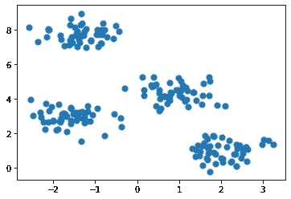
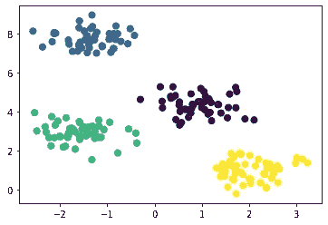
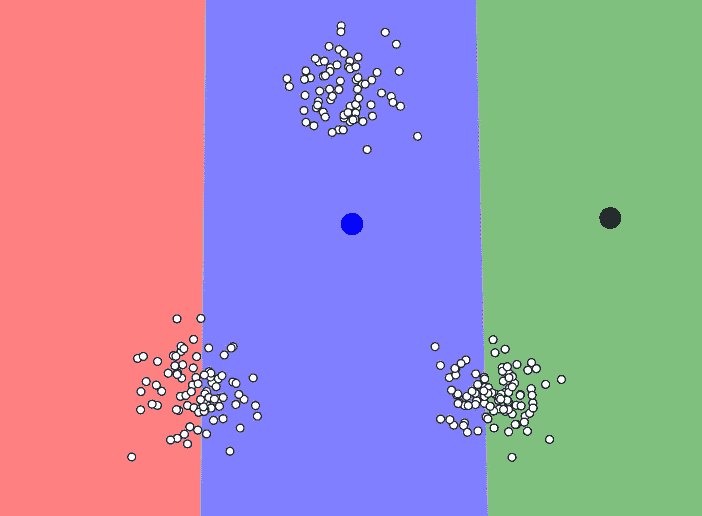
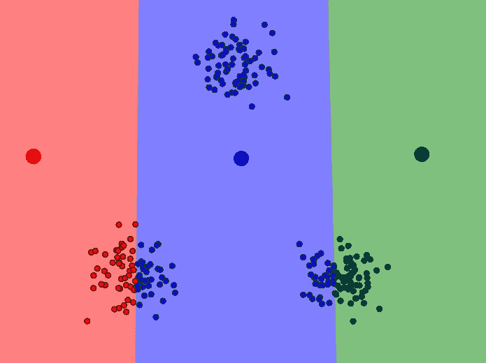
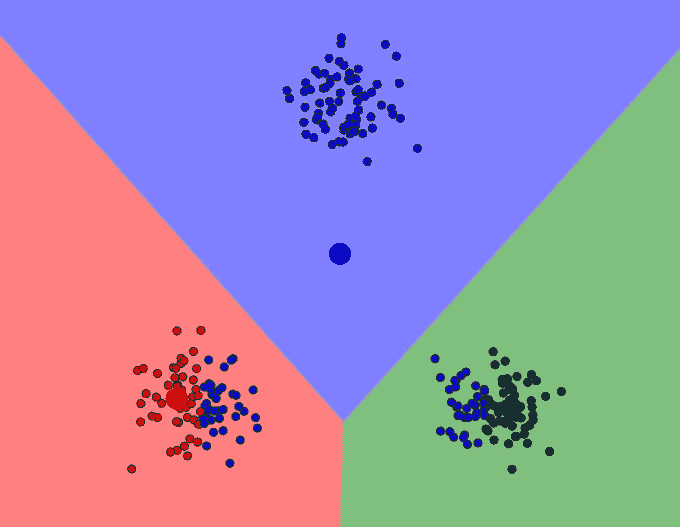
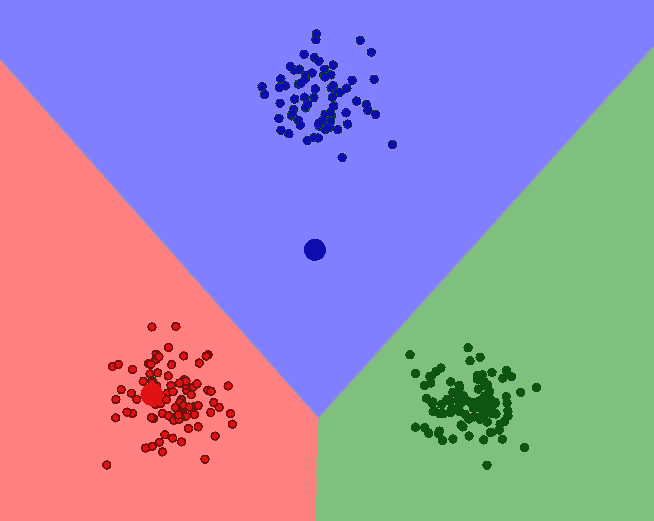
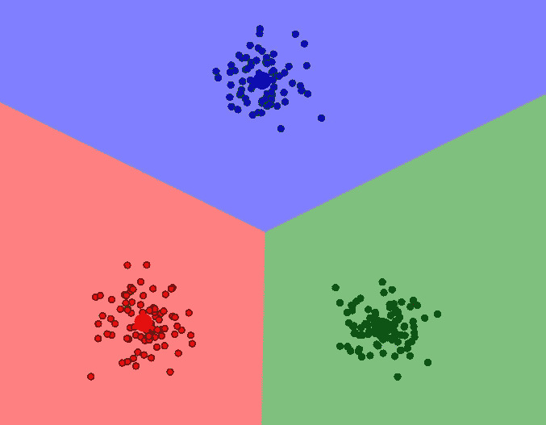

# k-均值聚类—已解释

> 原文：<https://towardsdatascience.com/k-means-clustering-explained-4528df86a120?source=collection_archive---------3----------------------->

## 详细的理论解释和 scikit-learn 实现


[图源](https://aeroleads.com/blog/10-best-practices-customer-segmentation/)

假设我们开始做生意，向人们出售一些服务。业务进展顺利，几个月内我们的数据库中就有了大约一万名客户。我们希望留住我们的客户，同时增加每位客户的收入。所以我们计划向数据库中的客户提供一笔交易。我们有两个选择:

*   向所有客户提供相同的交易
*   准备客户特定的交易

第一种选择很简单。“所有服务打九折”的交易就可以了。然而，与针对客户的交易相比，这种方式效率较低，利润也较低。此外，针对客户的交易可能对客户更有吸引力。一些顾客喜欢某一件商品打折，而另一些顾客喜欢买一送一的交易。一些客户在周末购买服务 A，而另一些客户在周一上午购买。根据企业规模和客户数量，我们可以列出更多不同的选项。

我们决定准备客户特定的交易。下一步是决定提供什么样的交易。我们不能只为每个客户创建不同的交易。这根本无法管理。一个明智的选择可能是发现具有相似兴趣或购买行为的客户，并将他们分组。分组的标准可以是客户偏好、品味、兴趣、客户服务组合等等。假设客户数据库中有每个客户的以下信息:

*   客户年龄、地址
*   平均采购金额
*   平均购买数量
*   购买频率
*   购买的时间和类型

这个列表很容易扩展。手动对客户进行分组极其困难。然后我们向**机器学习**寻求帮助。将相似客户分组的任务称为**聚类**。维基百科上更正式的定义:

> **聚类分析**或**聚类**是对一组对象进行分组的任务，使同一组中的对象(称为**聚类**)比其他组(聚类)中的对象彼此更相似(在某种意义上)。

在我们的例子中，对象是客户。

聚类是无监督的，这意味着没有样本(或数据点)的标签。聚类在很多行业都有应用。以下是集群的一些示例:

*   客户细分
*   图象分割法
*   图像/颜色压缩
*   检测异常或异常值

有许多不同的聚类算法。在这篇文章中，我将介绍一种最常见的聚类算法: **K-Means 聚类。**

# **聚类 vs 分类**

在开始讨论 k-means 聚类之前，我想指出聚类和分类之间的区别。

*   分类任务中的样本有标签。每个数据点根据一些测量结果进行分类。分类算法试图对样本的测量值(特征)和它们的指定类别之间的关系进行建模。然后模型预测新样本的类别。
*   聚类分析中的样本没有标签。我们希望该模型能够在数据集中找到结构，以便相似的样本能够被分组到聚类中。我们基本上是让模特给样品贴标签。

# **K-均值聚类**

k-均值聚类旨在将数据划分为 k 个聚类，使得同一聚类中的数据点相似，而不同聚类中的数据点相距较远。

> 两点的相似性由它们之间的距离决定。

测量距离的方法有很多。[欧氏距离](https://en.wikipedia.org/wiki/Euclidean_distance)(p = 2 的闵可夫斯基距离)是最常用的距离度量之一。下图显示了如何计算二维空间中两点之间的欧几里德距离。它是使用点的 x 和 y 坐标之差的平方来计算的。


在上面的例子中，欧几里德距离是(16 + 9)的平方根，也就是 5。二维中的欧几里得距离让我们想起了著名的[勾股定理](https://en.wikipedia.org/wiki/Pythagorean_theorem)。

还有其他方法来衡量距离如余弦相似度，平均距离等等。相似性度量是 k-means 聚类的核心。最佳方法取决于问题的类型。因此，为了选择最佳的测量类型，拥有良好的领域知识是很重要的。

> K-means 聚类试图最小化一个类内的距离，最大化不同类之间的距离。

让我们从一个简单的例子开始理解这个概念。像往常一样，我们首先导入依赖项:

```
# Importing necessary libraries
import numpy as np
import pandas as pdimport matplotlib.pyplot as pltfrom sklearn.datasets import make_blobs
from sklearn.cluster import KMeans
```

> Scikit-learn 提供了许多有用的功能来创建合成数据集，这对练习机器学习算法非常有帮助。我将使用 **make_blobs** 函数。

```
X, y = make_blobs(n_samples = 200, centers=4, cluster_std = 0.5, random_state = 0)plt.scatter(X[:, 0], X[:, 1], s=50)
```



然后我们创建一个 KMeans 对象并拟合数据:

```
kmeans = KMeans(n_clusters = 4)
kmeans.fit(X)
```

现在，我们可以将数据集划分为多个集群:

```
y_pred = kmeans.predict(X)
plt.scatter(X[:, 0], X[:, 1], c = y_pred, s=50)
```



现实生活中的数据集要复杂得多，其中的聚类没有明显的区分。但是，算法的工作方式是一样的。

> K-means 算法不能确定聚类数。我们需要在创建 KMeans 对象时定义它，这可能是一项具有挑战性的任务。

K-means 是一个迭代过程。它基于[期望最大化](https://en.wikipedia.org/wiki/Expectation%E2%80%93maximization_algorithm)算法。确定集群数量后，它通过执行以下步骤来工作:

1.  为每个簇随机选择质心(簇的中心)。
2.  计算所有数据点到质心的距离。
3.  将数据点分配给最近的聚类。
4.  通过取聚类中所有数据点的平均值，找到每个聚类的新质心。
5.  重复步骤 2、3 和 4，直到所有点收敛并且聚类中心停止移动。

> **注意**:初始质心是随机选择的，这可能会导致最终的聚类有些不同。为了克服这个问题，scikit learn 提供了 **n_init** 参数。k-means 算法以不同的初始质心运行“n_init”次，并且最终结果将根据 n_init 次连续运行来确定。

你可以使用 Naftali Harris 在他的博客上准备的这个工具来可视化每个步骤。我从这个互动工具中截取了截图，这样上面的步骤就更容易理解了。我强烈建议花点时间使用这个工具。



随机选择质心



计算所有数据点到质心的距离，并将数据点分配给最近的聚类



通过取平均值来计算每个聚类的新质心



将数据点重新分配到最近的聚类中心



当聚类中心(质心)不再移动时，模型收敛

# **利弊**

**优点:**

*   容易理解
*   相对较快
*   可扩展用于大型数据集
*   能够以一种聪明的方式选择初始质心的位置，从而加速收敛
*   保证收敛

**缺点:**

*   集群的数量必须预先确定。K-means 算法无法猜测数据中存在多少个聚类。确定集群的数量可能是一项具有挑战性的任务。
*   只能画线性边界。如果数据中存在非线性结构来分隔组，k-means 将不是一个好的选择。
*   随着样本数量的增加而变慢，因为在每一步，k-means 算法都会访问所有数据点并计算距离。另一种方法是使用数据点的子集来更新质心的位置(即 sk learn . cluster . minibatchkmeans)
*   对异常值敏感

感谢您的阅读。如果您有任何反馈，请告诉我。

# 我关于机器学习算法的其他帖子

*   [朴素贝叶斯分类器—解释](/naive-bayes-classifier-explained-50f9723571ed)
*   [逻辑回归—已解释](/logistic-regression-explained-593e9ddb7c6c)
*   [K-最近邻(kNN)-解释](/k-nearest-neighbors-knn-explained-cbc31849a7e3)
*   [支持向量机—解释](/support-vector-machine-explained-8d75fe8738fd)
*   [决策树和随机森林——解释](/decision-tree-and-random-forest-explained-8d20ddabc9dd)
*   [梯度增强决策树—解释](/gradient-boosted-decision-trees-explained-9259bd8205af)
*   [主成分分析—已解释](/principal-component-analysis-explained-d404c34d76e7)
*   [用机器学习预测二手车价格](/predicting-used-car-prices-with-machine-learning-fea53811b1ab)