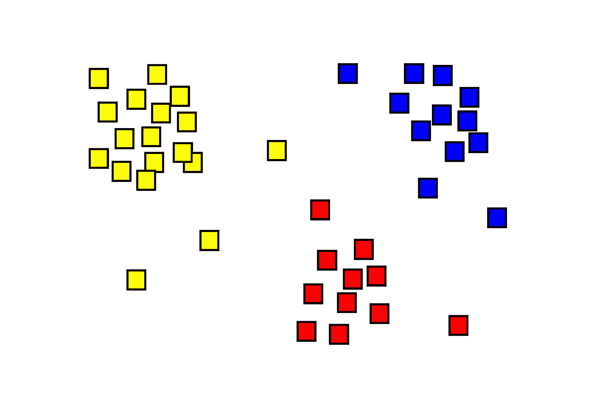

# K-Means 聚类讲解:算法和 Sklearn 实现

> 原文：<https://towardsdatascience.com/k-means-clustering-explained-algorithm-and-sklearn-implementation-1fe8e104e822?source=collection_archive---------57----------------------->

## *聚类和 k-means 聚类简介。详细概述和 sklearn 实现。*

**K-Means** 聚类是数据科学和机器学习领域中最强大的聚类算法之一。它非常简单，但却能产生非常好的效果。因为聚类是理解数据集的一个非常重要的步骤，所以在本文中，我们将讨论什么是聚类，我们为什么需要它，以及 k-means 聚类在数据科学中对我们有什么帮助。

# 文章概述:

*   什么是集群
*   什么是无监督机器学习
*   集群应用
*   k-均值聚类解释
*   k-均值聚类算法
*   使用 Scikit-Learn 和 Python 实现 K-Means 聚类

# 什么是集群

**聚类**的任务是根据数据的属性，更确切地说是根据数据中或多或少明显的某些模式，将数据分组为两个或多个组。我们的目标是找到数据中的那些模式，帮助我们确定，给定数据集中的某个项目，我们将能够正确地将该项目放在正确的组中，以便它与该组中的其他项目相似，但与其他组中的项目不同。

这意味着聚类实际上由两部分组成:一部分是识别组，另一部分是尽可能将每个项目放在正确的组中。

聚类分析算法的理想结果是同一组中的两个项目尽可能相似，而不同组中的两个项目尽可能不同。



聚类示例—来源:[维基百科](https://en.wikipedia.org/wiki/Cluster_analysis)

一个真实的例子是**客户细分**。作为一家销售各种产品/服务的企业，很难为每个客户找到完美的商业策略。但我们可以明智地将我们的客户分成几个小组，了解这些客户的共同点，并针对每个小组调整我们的业务策略。向客户提出错误的商业策略可能意味着失去该客户，因此我们实现了良好的市场聚类非常重要。

# 什么是无监督机器学习

无监督机器学习是一种机器学习算法，它试图在没有任何先验知识的情况下推断数据中的模式。与之相反的是监督机器学习，我们有一个训练集，算法将通过将输入与预定义的输出进行匹配来试图找到数据中的模式。

我写这个的原因是因为**聚类一个无监督的机器学习任务**。当应用聚类算法时，我们事先不知道类别(尽管我们可以设置想要被识别的类别的数量)。

分类将从分析数据的算法中产生。正因为如此，我们可以称聚类为探索性的机器学习任务，因为我们只知道类别的数量，而不知道它们的属性。然后，我们可以尝试使用不同数量的类别，看看我们的数据是否有更好的聚类。

然后，我们必须了解我们的集群，这实际上可能是最不同的任务。让我们重新使用客户细分的例子。假设我们运行了一个聚类算法，将我们的客户分为 3 组。但是那些群体是什么呢？为什么算法决定这些客户适合这个组，而那些客户适合那个组？这是你需要非常熟练的数据科学家以及非常了解你的业务的人的部分。他们会查看数据，尝试分析每个类别中的一些项目，并尝试猜测一些标准。一旦他们找到一个有效的模式，他们就会从那里进行推断。

当我们得到一个新客户时会发生什么？我们必须将该客户放入我们已经拥有的一个聚类中，这样我们就可以通过我们的算法运行关于该客户的数据，并且该算法将使我们的客户适合我们的一个聚类。此外，在未来，在我们获得大量新客户后，我们可能需要重建我们的集群——可能新的集群会出现，也可能旧的集群会消失。

# 集群应用

**有哪些常见的集群应用？**在我们爱上聚类算法之前，我们需要了解什么时候可以使用它们，什么时候不可以。

最常见的用例是我们已经讨论过的:**客户/市场细分**。公司无时无刻不在进行这种类型的分析，以便了解他们的客户和市场，并调整他们的商业策略、服务和产品，使之更适合他们。

另一个常见的用例由**信息提取任务**表示。在信息抽取任务中，我们经常需要发现实体、单词、文档等之间的关系。现在，如果你的直觉告诉你，我们有更大的机会找到彼此更相似的项目之间的关系，那么你是对的，因为对我们的数据点进行聚类可能会帮助我们找出在哪里寻找关系。(注:如果想了解更多关于信息抽取的内容，也可以试试这篇文章: [Python NLP 教程:信息抽取和知识图](https://programmerbackpack.com/python-nlp-tutorial-information-extraction-and-knowledge-graphs/))。

另一个非常流行的用例是使用聚类进行**图像分割**。图像分割是观察图像并试图识别图像中不同项目的任务。我们可以使用聚类来分析图像的像素，并识别图像中的哪个项目包含哪个像素。

# k-均值聚类解释

**K-Means 聚类算法**是一种迭代聚类算法，它试图将数据点准确地分配到我们预定义的 *K* 个聚类中的一个聚类。

与任何其他聚类算法一样，它试图使一个聚类中的项目尽可能相似，同时也使这些聚类尽可能互不相同。这是通过确保一个聚类中的数据点与该聚类的**质心**之间的平方距离之和最小来实现的。聚类的质心是聚类中所有值的平均值**。你也可以从这一段了解到**K-的意思是**的来源。**

**用更专业的术语来说，我们试图将数据放入一个尽可能*同质*的集群，同时尽可能*异质*的集群。K 数是我们试图获得的集群数。我们可以摆弄 K，直到我们对结果满意为止。**

# **k-均值聚类算法**

**K-Means 聚类算法只需要几个简单的步骤。**

1.  **分配 *K* 组数**
2.  **混洗数据并将每个数据点随机分配到 *K* 个簇中的一个，并分配初始随机质心。**
3.  **计算每个数据点和所有质心之间的平方和。**
4.  **根据步骤 3 的计算，将每个数据点重新分配到最近的质心。**
5.  **通过计算每个聚类的平均值来重新分配质心**
6.  **重复步骤 3、4、5，直到我们不再需要更改集群中的任何内容**

**运行 K 均值聚类算法所需的时间取决于数据集的大小、我们定义的 K 数以及数据中的模式。**

# **使用 Scikit-Learn 和 Python 实现 K-Means 聚类**

**我们将使用 **Sckikit-Learn Python** 库在一个小数据集上运行 K-Means 聚类算法。**

# **K 均值聚类算法的数据集**

**该数据由关于伦敦、巴黎和柏林的 3 个文本组成。我们将提取维基百科中关于这三个城市的文章的摘要部分，并通过我们的聚类算法来运行它们。**

**然后，我们将提供 3 个我们自己的新句子，并检查它们是否被正确地分配到各个组。如果发生这种情况，我们就知道我们的聚类算法起作用了。**

# **k-均值聚类实现**

**首先让我们安装我们的依赖项。**

```
# Sklearn library for our cluster
pip3 install scikit-learn
# We will use nltk(Natural Language Toolkit) to remove stopwords from the text
pip3 install nltk
# We will use the wikipedia library to download our texts from the Wikipedia pages
pip3 install wikipedia
```

**现在让我们定义一个小类来帮助我们从维基百科页面收集文本。我们将文本存储到本地的 3 个文件中，这样我们就不会在每次运行算法时再次下载文本。第一次运行算法时使用 class，第二次运行时可以注释第 8-12 行，取消第 13-15 行的注释。**

```
import wikipedia

class TextFetcher:

    def __init__(self, title):
        self.title = title
        page = wikipedia.page(title) # 8
        f = open(title + ".txt", "w") # 9
        f.write(page.summary) # 10
        f.close() # 11
        self.text = page.summary # 12
        #f = open(title + ".txt", "r")
        #self.text = f.read()
        #f.close()

    def getText(self):
        return self.text 
```

**现在让我们构建数据集。我们将获取关于每个城市的文本，并删除**停用词**。停用词是我们通常在每次文本处理任务之前过滤掉的词。它们是英语中非常常见的单词，不会给文本带来任何价值和意义。因为它们中的大多数在任何地方都被使用，它们将阻止我们正确地对我们的文本进行聚类。**

```
from text_fetcher import TextFetcher
from nltk.corpus import stopwords
from nltk.tokenize import word_tokenize
from sklearn.feature_extraction.text import TfidfVectorizer
from sklearn.cluster import KMeans
import nltk

def preprocessor(text):
    nltk.download('stopwords')
    tokens = word_tokenize(text)
    return (" ").join([word for word in tokens if word not in stopwords.words()])

if __name__ == "__main__":
    textFetcher = TextFetcher("London")
    text1 = preprocessor(textFetcher.getText())
    textFetcher = TextFetcher("Paris")
    text2 = preprocessor(textFetcher.getText())
    textFetcher = TextFetcher("Berlin")
    text3 = preprocessor(textFetcher.getText())

    docs = [text1, text2, text3]
```

# **单词矢量化技术**

**众所周知，计算机非常不擅长理解文本，但它们在处理数字方面表现得更好。因为我们的数据集是由单词组成的，所以我们需要将单词转换成数字。**

****单词嵌入或单词矢量化**代表一组用于将单词分配给实数向量的技术，这些技术可由机器学习用于某些目的，其中之一是文本聚类。**

**Scikit-Learn 库包含一些单词矢量器，但是对于本文，我们将选择*tfidfvector。***

```
tfidf_vectorizer = TfidfVectorizer()
tfidf = tfidf_vectorizer.fit_transform(docs)
```

**现在是时候应用我们的 K 均值聚类算法了。幸运的是，Scikit-Learn 有一个非常好的 K-Means 算法实现，我们将使用它。因为我们知道要将文本分为 3 类(每个城市一类),所以我们将定义 K 值为 3。**

```
kmeans = KMeans(n_clusters=3).fit(tfidf)
print (kmeans)

# Output: [0 1 2]
```

**我知道，就这么简单！现在我们的产量意味着什么？简单地说，这 3 个值就是我们的 3 个集群。**

**为了测试它们，我们现在可以提供 3 个文本，我们确定它们应该在不同的簇中，看看它们是否被正确分配。我们必须确保不要忘记对这 3 个文本进行矢量化，以便我们的算法能够理解它们。**

```
 test = ["This is one is about London.", "London is a beautiful city", "I love London"]
    results = kmeans.predict(tfidf_vectorizer.transform(test))
    print (results)

    # Prints [0, 0, 0]

    test = ["This is one is about Paris.", "Paris is a beautiful city", "I love Paris"]
    results = kmeans.predict(tfidf_vectorizer.transform(test))
    print (results)

    # Prints [2, 2, 2]

    test = ["This is one is about Berlin.", "Berlin is a beautiful city", "I love Berlin"]
    results = kmeans.predict(tfidf_vectorizer.transform(test))
    print(results)

    # Prints [1, 1, 1]

    test = ["This is about London", "This is about Paris", "This is about Vienna"]
    results = kmeans.predict(tfidf_vectorizer.transform(test))
    print (results)

    # Prints [0, 2, 1]
```

**看起来我们的集群成功了！现在让我们假设我们会得到另一个我们一无所知的文本。我们可以将该文本通过我们的分类器，看看它属于哪个类别。我认为这是一个非常好和有效的文本分类器。**

# **结论**

**今天我们讨论了 K 均值聚类算法。我们首先对聚类算法和无监督机器学习技术进行了概述，然后讨论了 K-Means 算法，并使用 Scikit-Learn Python 库实现了它。**

***本文原载于* [*程序员背包博客*](https://programmerbackpack.com/k-means-clustering-explained/) *。如果你想阅读更多这类的故事，一定要访问这个博客。***

**非常感谢你阅读这篇文章！对更多这样的故事感兴趣？在 Twitter 上关注我，在[*@ b _ dmarius*](https://twitter.com/b_dmarius)*我会在那里发布每一篇新文章。***