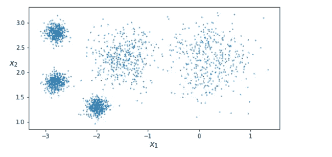
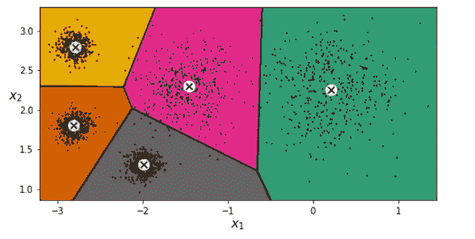
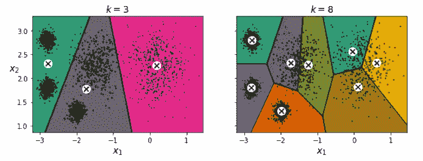
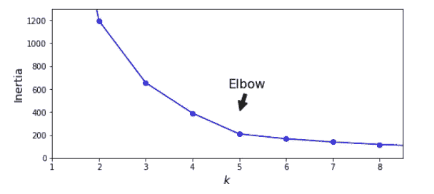
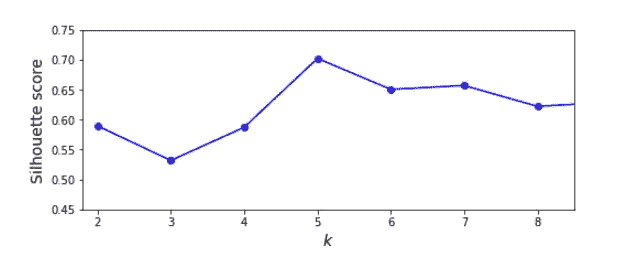
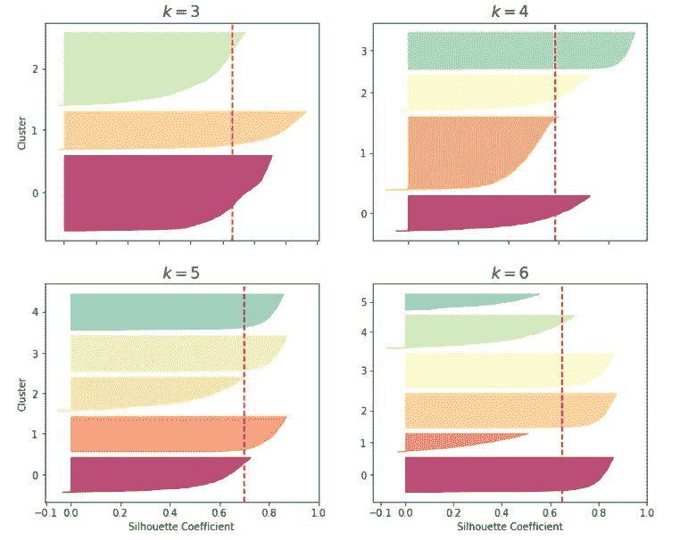

# k 均值聚类

> 原文：<https://towardsdatascience.com/k-means-clustering-fa4df5990fff?source=collection_archive---------22----------------------->

## **概述**

今天机器学习的大多数应用都是基于监督学习的。然而，大部分数据是没有标签的:我们有输入 **X** ，但没有标签**y**计算机科学家扬·勒库恩的名言

> 如果智能是一块蛋糕，无监督学习就是蛋糕，有监督学习就是糖衣，强化学习就是上面的樱桃。

换句话说，无监督学习有巨大的潜力。

无监督学习的一种形式是将相似的实例分组到*簇中。*聚类是数据分析、客户细分、推荐系统、搜索引擎、半监督学习、降维等等的一个很好的工具。

如果你每天在一个公园里散步，你可能会无意中发现一棵你从未见过的树。如果你环顾四周，注意到更多的一些，它们并不完全相同，但看起来非常相似，你知道它们属于同一个属。你可能需要一个树木学家来告诉你这是哪一个物种，但是你不需要专家来给你的树分类。这就是*集群*的本质:识别相似实例，并将它们分配到*集群*或相似实例组中的任务。

# k 均值

最常用的聚类技术之一是 K-means。K-means 算法是由 Stuart Lloyd 和 Bell Labs 在 1957 年作为一种脉冲编码调制技术提出的，但直到 1982 年才在公司外部发表。Edward Forgy 在 1965 年发表了几乎相同的算法，因此它被称为 Lloyd-Forgy。以下内容生成了我们将进行聚类的数据:

```
from sklearn.datasets import make_blobsblob_centers = np.array([[ 0.2,  2.3],[-1.5 ,  2.3],[-2.8,  1.8],[-2.8,  2.8],[-2.8,  1.3]])blob_std = np.array([0.4, 0.3, 0.1, 0.1, 0.1])X, y = make_blobs(n_samples=2000, centers=blob_centers,
cluster_std=blob_std, random_state=7)plt.figure(figsize=(8, 4))
plot_clusters(X)
save_fig("blobs_plot")
plt.show()
```



未标记的数据集

K-Means 在聚类上面的数据时非常有效，通常只需要很少的迭代。它将试图找到每个集群的中心，并将每个实例分配给最近的集群。让我们训练一个 K 均值聚类器:

```
from sklearn.cluster import KMeans
k = 5
kmeans = KMeans(n_clusters = k)
y_pred = kmeans.fit_predict(X)
```

每个实例被分配到五个集群中的一个。它接收一个标签*作为它被分配到的集群的索引。*

我们可以看到这些标签:

```
y_pred
array([4, 0, 1, ..., 2, 1, 0], dtype=int32)y_pred is kmeans.labels_
True
```

我们还可以看到算法找到的五个质心(聚类中心):

```
kmeans.cluster_centers_
array([[ 0.20876306,  2.25551336],
       [-2.80580621,  1.80056812],
       [-1.46046922,  2.30278886],
       [-2.79290307,  2.79641063],
       [-1.99213367,  1.3131094 ]])
```

对于新数据，我们也可以很容易地做到这一点，通过查看任何新数据点最接近哪个质心。我们也可以可视化决策边界，每个质心用 x 表示。



k 意味着判定边界和质心

最初，随机放置质心，标记实例，并更新质心。这个过程反复进行，直到质心停止移动，并且已经定义了聚类。

# 加速 K-均值算法

加速 K-Means 是 Sklearn 的默认设置。它通过跟踪实例和质心之间的距离的下限和上限，大大加速了该算法。你可以强迫 Sklearn 使用原来的算法，尽管不太可能需要。

# 小批量 K 均值

代替在每次迭代中使用完整的数据集，该算法能够使用小批量，在每次迭代中稍微移动质心。这通常会将算法速度提高 3 到 4 倍。尤其重要的是，它使得对不适合内存的大型数据集进行聚类成为可能。一个限制是它的惯性通常稍差，尤其是当集群增加时，但是对于许多集群，使用小批量的速度要快得多。

# 寻找最佳的聚类数

在这个数据集中，我们可以清楚地看到有 5 个我们想要彼此分割的聚类。然而，情况并不总是如此，我们的数据通常没有像这样明显地分段。如果我们不采取预防措施来计算最佳集群数量，我们的结果可能会很差:



K 值过低

第一个想法是选择最小化惯性的 k，但是我们不能这样做，因为惯性总是随着 k 的增大而减小。事实上，集群越多，每个实例越接近其最近的质心，因此惯性越低。正如我们在 k=8 的情况下所看到的，我们正在毫无理由地分割集群。



惯性作为 k 的函数

惯性很快下降到 5，但之后下降很慢。任何低于 5 的 k 值，增益都是巨大的，任何高于 5 的 k 值，我们都不会得到更多的信息。这是一种相当粗糙的，主观的分配 k 的方法，但是它通常工作得很好。这样做时，我们也可以考虑业务问题的特定需求。

然而，在这种情况下，我们可以看到有 5 个集群我们想要细分。4 个集群可能足够了，但是我们应该研究 k=4 和 k=5 之间的差异

# 剪影分数

另一种更精确的方法是对每个实例使用轮廓分数，并对不同数量的聚类绘制它们，然而这种方法计算量更大，它将给出更清晰的最佳 k:

```
from sklearn.metrics import silhouette_scoresilhouette_score(X, kmeans.labels_)silhouette_scores = [silhouette_score(X, model.labels_) for model in kmeans_per_k[1:]]
```



聚类数和轮廓分数

正如我们所看到的，使用 k 的每个级别的轮廓分数，哪一个 k 是最优的就更加明显了。

更有用的是绘制每个实例的轮廓系数，按它们所在的聚类和系数的值排序。这是一张剪影图。形状的高度表示聚类包含的实例数量，其宽度表示聚类中实例的排序轮廓系数(越宽越好)。虚线表示平均轮廓系数。



分析各种 K 的轮廓图

垂直虚线表示每个聚类数的轮廓分数。如果许多实例在虚线的短边(左边)停止，那么这个集群就相当糟糕，因为这意味着这些实例彼此靠得太近。在 k=3 和 k=6 时，我们得到的是坏簇，但在 k=4 和 k=5 时，它们相当好。大多数情况下会超出虚线。然而，当 k=4 时，橙色集群相当大，而在 k=5 时，它们都是相似的大小，所以看起来应该使用 5 来获得相似大小的集群。

执行这一过程显示了肘方法的明显局限性，定期执行它可以增强您选择 k 的稳健性。

# **K-意味着限制**

作为一名优秀的数据科学家，了解你所使用的方法背后的假设是很重要的，这样你才能对它们的优缺点有所了解。这将帮助您决定何时以及在什么情况下使用每种方法:

*   我们经常会得到次优解和局部极小值(由于质心的随机初始化)，因此需要多次运行算法来避免这种情况。
*   除此之外，我们还需要指定 k，这可能是主观的，有时相当麻烦，取决于数据集。
*   最大的问题是，当聚类具有不同的大小、密度或非球形形状时，K-Means 的性能不是特别好。根据数据的不同，另一种聚类算法可能会更好。(通常，在执行 K-Means 之前缩放输入要素会有所帮助，但这并不能保证所有聚类都是完美的球形)
*   K-Means 也给予较大的聚类比较小的聚类更多的权重。换句话说，较小聚类中的数据点可以远离质心，以便更多地集中在较大的聚类上。这可能仅仅因为不平衡的数据而导致较小的集群分配不当。
*   最后，因为 K-Means 将每个实例分配到一个非重叠的聚类中，所以对于位于边界线附近的点没有不确定性的度量

在本文中，我讨论了最著名的聚类算法之一——K-Means。我们研究了在使用 K-Means 时可能面临的挑战。

我们实现了 k-means 并查看了肘形曲线，这有助于在 K-Means 算法中找到最佳的聚类数，同时也展示了它的局限性。

如果你有任何疑问或反馈，欢迎在下面的评论区分享

**参考文献**

Aurelien Geron (2019) *用 Scikit-Learn、Keras 和 TensorFlow 进行动手机器学习:构建智能系统的概念、工具和技术图书*，第 2 版。，:奥赖利。

所有可视化的代码都可以在我的 GitHub [这里](https://github.com/Carterbouley/kmeans)找到