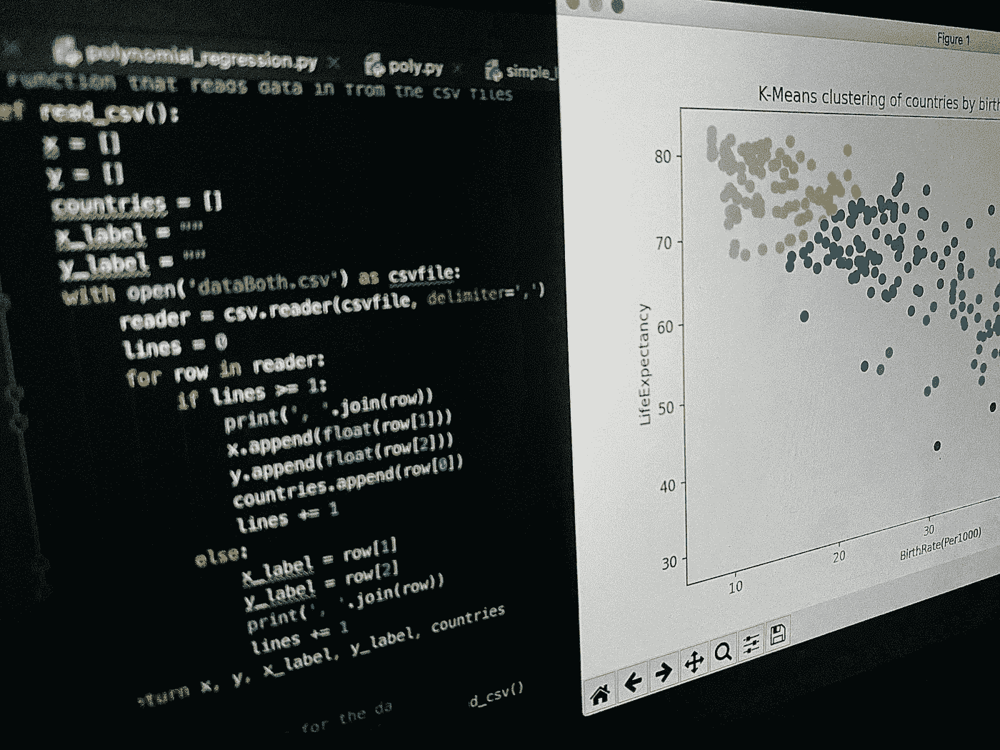
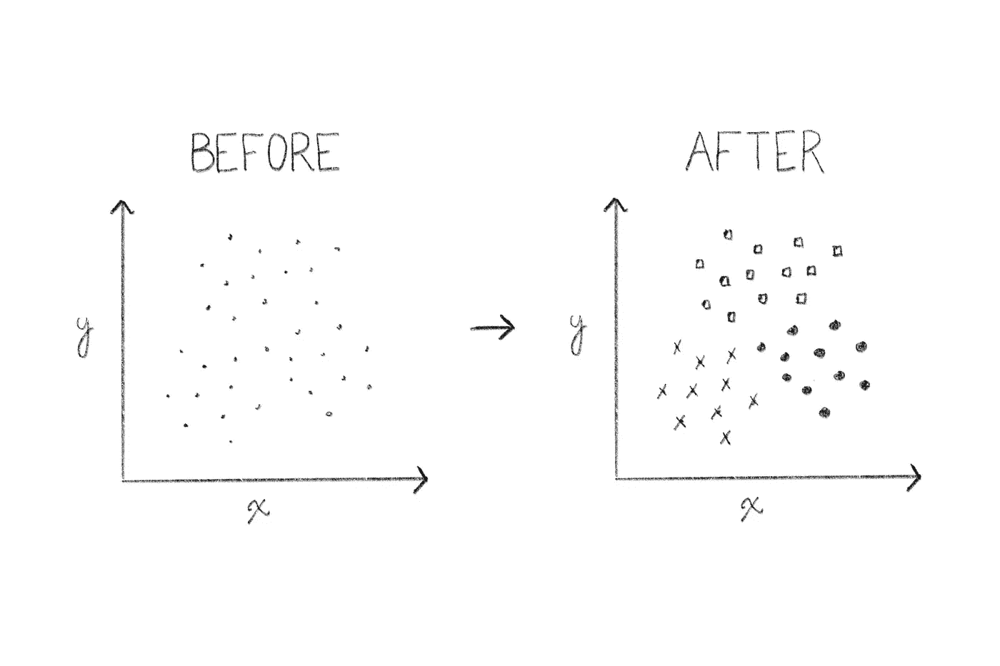
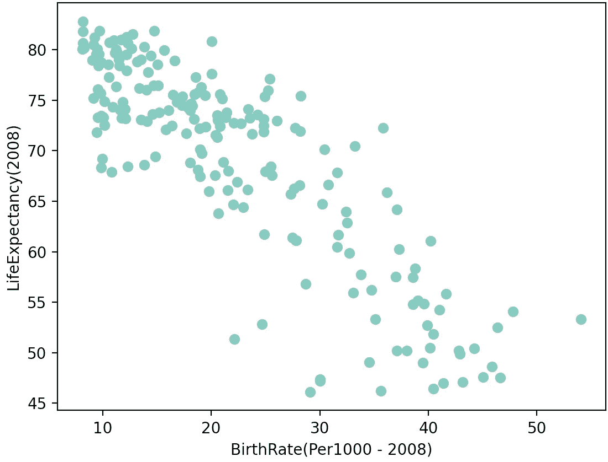
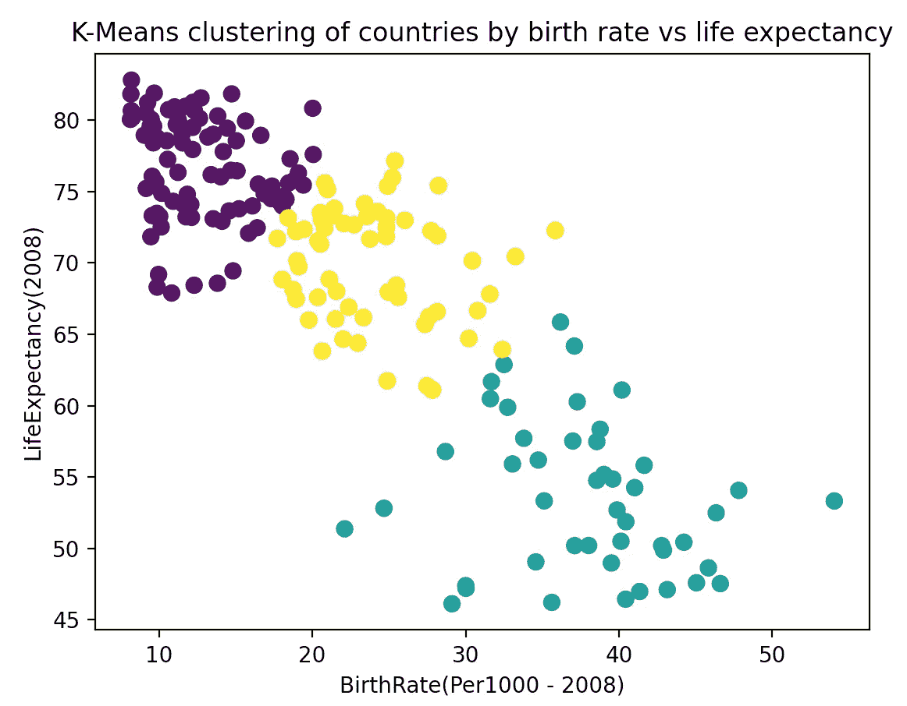

# 适用于初学者的 k-均值聚类

> 原文：<https://towardsdatascience.com/k-means-clustering-for-beginners-ea2256154109?source=collection_archive---------16----------------------->

## 一个学生用 Python 对这个有趣而有用的机器学习算法进行了深入的解释和逐步的指导



Python K-Means 聚类(所有照片按作者分类)

# 介绍

K-意思是聚类是我在进入机器学习时学习的第一批算法之一，就在线性和多项式回归之后。

但是 K-Means 从根本上背离了后两者。回归分析是一种*监督的* ML 算法，而 K-Means 是*非监督的。*

**这是什么意思？**

监督学习和非监督学习是机器学习算法的两大类别:

## 监督学习

你输入标有数据的程序。换句话说，你在提供正确答案的数据上训练算法，然后将学习到的规则应用于新数据，以预测它们的答案。

这对回归和分类很有用。

## 无监督学习

您不需要为数据提供标签，而是由程序来发现它们。

这对于聚类和发现数据中的隐藏模式非常有用。

# 重要提示:

如果你是初学者，我建议你先阅读这些关于线性和多项式回归的文章，我在下面链接了这些文章。在其中，我涵盖了一些基本的机器学习知识和术语，我将在整篇文章中以此为基础。

[](/linear-regression-the-actually-complete-introduction-67152323fcf2) [## 线性回归:(实际上)完全介绍

### 一位同学用 Python 对这个简单的机器学习算法进行了全面、深入的解释

towardsdatascience.com](/linear-regression-the-actually-complete-introduction-67152323fcf2) [](/polynomial-regression-the-only-introduction-youll-need-49a6fb2b86de) [## 多项式回归:你需要的唯一介绍

### 一名学生对 Python 中机器学习算法背后的理论和应用的深入探究

towardsdatascience.com](/polynomial-regression-the-only-introduction-youll-need-49a6fb2b86de) 

# 该算法

我想象一个有大量数据点的数据集。我们的目标是将每个点分配给一个集群或组。要做到这一点，我们需要找出集群在哪里，以及哪些点应该属于每一个。在我们的例子中，我们将有两个变量:不同国家的出生率和预期寿命。我们可以创建这个数据的散点图来可视化我们的组。



K-均值聚类的一个例子

*为什么我们要对这些数据执行 K-Means 聚类？*

这里有一个实际的例子:假设联合国希望根据这两个指标将国家分为三类，这样它们就可以根据各自的需求提供相应的援助。

除了目测，我们可以使用 K-Means 来自动化这个过程(其中 *K* 表示我们想要创建的集群的数量，而 *Mean* 表示平均值)。

**K 均值背后有两个关键假设:**

1.  每个聚类的中心是属于该聚类的所有数据点的平均值。
2.  每个数据点属于具有最近中心点的聚类。

这两个简单的假设描述了整个算法。我们的程序所做的就是迭代几个步骤，每个步骤都试图满足上述条件。

## 距离

在继续之前，我们必须讨论距离的概念。我们可以在 ML 中使用许多距离度量，例如*曼哈顿*和*切比雪夫*，但今天我们将坚持使用更熟悉的*欧几里德、*，你可能会记得高中数学中的这些。

在二维空间中，两点之间的欧几里德距离是

```
*√((xⱼ — xᵢ)² + (yⱼ — yᵢ)²)*
```

## 步伐

这是算法的概要:

1.  通过从数据集中随机选取点并使用这些点作为平均值的初始值，初始化每个聚类的平均值。
2.  将每个点分配给最近的聚类。
3.  计算每个聚类的平均值，作为属于它的所有点的平均值。
4.  重复 2 和 3 预定的次数，或者直到收敛。

# 这个例子

像往常一样，我们从进口开始:

1.  matplotlib(py plot & RC params)——创建我们的数据可视化
2.  sci kit-Learn(pairwise _ distances _ arg min)-执行机器学习
3.  NumPy——做科学计算
4.  csv —读取 csv 文件
5.  集合(计数器和默认值)—用于计数

```
import matplotlib.pyplot as plt
import numpy as np
import csv
from sklearn.metrics import pairwise_distances_argmin
from collections import Counter, defaultdict
```

我有一个 csv 文件，其中包含如下所示的数据:

```
Countries,BirthRate(Per1000 - 2008),LifeExpectancy(2008)
Afghanistan,46.613,47.532
Albania,14.69,76.492
Algeria,20.804,72.44
...
```

为了处理这些数据，我们需要一些变量来保存我们的 *x 值、y 值、标签*和*国家名称，在这个 csv 文件中是*。我们可以用一个函数从文件中提取所有这些信息:

```
x, y, x_label, y_label, countries = read_csv()
```

我对 *read_csv()* 函数的定义如下。当然，您应该调整它以适合您的 csv 文件。

```
def read_csv():
    x = []
    y = []
    countries = []
    x_label = ""
    y_label = ""
    with open('dataBoth.csv') as csvfile:
        reader = csv.reader(csvfile, delimiter=',')
        lines = 0
        for row in reader:
            if lines >= 1:
                print(', '.join(row))
                x.append(float(row[1]))
                y.append(float(row[2]))
                countries.append(row[0])
                lines += 1
            else:
                x_label = row[1]
                y_label = row[2]
                print(', '.join(row))
                lines += 1
    return x, y, x_label, y_label, countries
```

现在我们已经处理了数据，我们需要将 x 和 y 组合成(x，y)对的 2D 列表，我们可以这样做:

```
X = np.vstack((x, y)).T
```

现在我们有了一个 2D 列表(实际上是一个 numpy 数组),如下所示:

```
[[46.613, 47.532]
 [14.69, 76.492]
 [20.804, 72.44]
 ...]
```

让我们绘制这些数据点的散点图，看看我们在这里处理的是什么:

```
plt.xlabel(x_label)
plt.ylabel(y_label)
plt.scatter(x, y, color='#76c2b4')
plt.show()
```



(出生率、预期寿命)对列表的散点图

正如你所看到的，出生率和预期寿命之间的负相关是显而易见的。然而，3 个不同的组不会立即出现。这就是 K-Means 的用武之地。

接下来，我们将编写迭代创建集群的函数。该函数的逐行解释作为注释包含在下面的代码片段中，但是我也将在这里提供一些说明。

我们可以使用*NP . random . random state(rseed)*选择随机中心，调用*。在那上面排列*找到一个 *i* ，然后选择 X 的第个元素*，这就是我们的 *(x，y)* 对的 2D 列表，记住。我们有一个循环，其中我们使用*pairwise _ distance _ arg min*来计算点和中心之间的距离，然后从这些点的平均值中找到新的中心，然后检查聚类是否已经收敛(如果不能选择新的中心，则平均值变小)。当群集收敛时，此循环终止:*

```
def find_clusters(X, n_clusters, rseed=2):
    # 1\. Randomly choose clusters
    rng = np.random.RandomState(rseed)
    i = rng.permutation(X.shape[0])[:n_clusters]
    centers = X[i]

    # The main loop
    # This loop continues until convergence.
    # You could make it run a set number of times by changing
    # it to say while x > 5, for example, and removing the break
    print("\nConverging centres:")
    while True:
        # 2a. Assign labels based on closest center
        # I am using the pairwise_distances_argmin method to
        # calculate distances between points to centres
        labels = pairwise_distances_argmin(X, centers)

        # 2b. Find new centers from means of points
        new_centers = np.array([X[labels == i].mean(0) for i in
        range(n_clusters)])

        # 2c. Check for convergence
        if np.all(centers == new_centers):
            break
        centers = new_centers

        # Print converging centres
        print(centers)
        print()

    return centers, labels
```

让我们将集群的数量设置为 3:

```
clust_num = 3
```

剩下要做的就是将我们的 K-Means 算法应用于数据的结果可视化:

```
centers, labels = find_clusters(X, clust_num)
plt.scatter(X[:, 0], X[:, 1], c=labels, s=50, cmap='viridis')
plt.title('K-Means clustering of countries by birth rate vs life expectancy')
plt.xlabel(x_label)
plt.ylabel(y_label)
plt.show()
```



数据被分成 3 组

那就是成功实现的算法！

但是如果我们想要更多的信息呢？

毕竟，联合国希望看到每个集群中的国家名称。

我们可以提取所有这些信息，并将其打印到终端:

```
print("\nNumber of countries in each cluster:")
print(Counter(labels))

# Get cluster indices
clusters_indices = defaultdict(list)
for index, c in enumerate(labels):
    clusters_indices[c].append(index)

# Print countries in each cluster and means
x = 0
while x < clust_num:
    print("\nCluster " + str(x + 1))
    print("----------")
    for i in clusters_indices[x]:
        print(countries[i])
    print("----------")
    print("Mean birth rate:")
    print(centers[x][0])
    print("Mean life expectancy:")
    print(centers[x][1])
    x+=1
```

这将打印每个集群中的国家以及该集群的平均出生率和预期寿命。

# 结论

至少应该清楚，K-Means 聚类是一种非常有用的算法，有许多实际应用。希望您已经学到了足够的知识，可以对一些有趣的数据执行自己的实现，并发现一些隐藏的聚类。

**内容概述:**

1.  监督与非监督机器学习的简单比较。
2.  该技术应用的一个例子。
3.  算法的概要。
4.  实现的例子。

如果您觉得这篇文章有帮助，我很乐意与您合作！在 Instagram 上关注我，了解更多机器学习和软件工程内容。

编码快乐！

[**订阅**](https://medium.com/subscribe/@adenhaus) 📚为了不错过我的一篇新文章，如果你还不是中等会员，请加入[](https://medium.com/@adenhaus/membership)**🚀去读我所有的，还有成千上万的其他故事！**

# **资源**

****ski kit Learn***sk Learn . cluster . k means*[https://sci kit-Learn . org/stable/modules/generated/sk Learn . cluster . k means . html](https://scikit-learn.org/stable/modules/generated/sklearn.cluster.KMeans.html)**

****Python 文档** *收藏*[https://docs.python.org/2/library/collections.html](https://docs.python.org/2/library/collections.html)**

****SciPy***numpy . random . random state*https://docs . SciPy . org/doc/numpy-1 . 15 . 0/reference/generated/numpy . random . random state . html**

****sci kit Learn***sk Learn . metrics . pairwise _ distance _ arg min*[https://sci kit-Learn . org/stable/modules/generated/sk Learn . metrics . pairwise _ distance _ arg min . html](https://scikit-learn.org/stable/modules/generated/sklearn.metrics.pairwise_distances_argmin.html)**

****Numpy.org**numpy . v stackhttps://numpy . org/doc/stable/reference/generated/numpy . v stack . html**