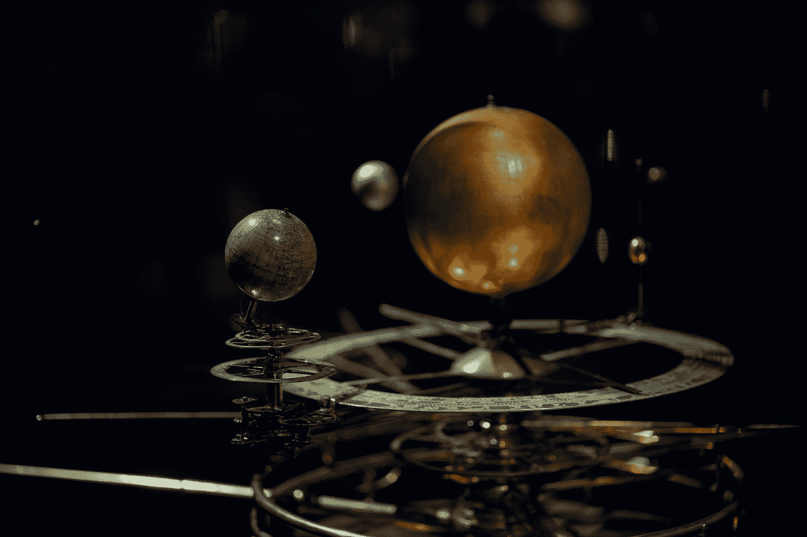
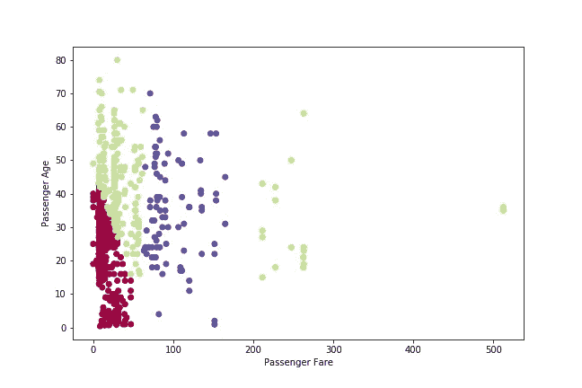

# k-均值聚类从零开始

> 原文：<https://towardsdatascience.com/k-means-clustering-from-scratch-6a9d19cafc25?source=collection_archive---------7----------------------->


梅尔·普尔在 [Unsplash](https://unsplash.com?utm_source=medium&utm_medium=referral) 上的照片

## 我们学习 K-Means 聚类是如何工作的，并一点一点地对它进行编码

K -means 聚类(本文简称 k-means)是一种流行的无监督机器学习算法(无监督是指不需要目标变量，也就是 Y 变量来训练算法)。当我们面对数据时，尤其是具有大量特征的数据，将它们分类是很有帮助的。通过将相似的观察结果分类到一个桶中(也称为集群)，我们可以比较和对比这些桶。理解驱动跨存储桶差异的特征为我们提供了关键的线索，让我们知道在创建分析或构建模型时应该关注什么特征(我们甚至可能希望将我们的分类直接用作模型特征)。

简而言之，这就是集群。现在让我们看看 k-means 是如何将我们的观察结果分成有意义的聚类的。

# 入门指南

如果你想看完整的代码，你可以从 GitHub 这里下载。

我已经为之前的帖子下载了它，所以我们今天将再次使用泰坦尼克号数据集:

```
import numpy as np
import pandas as pd
import numpy.matlib
import matplotlib.pyplot as plt
import seaborn as snstitanic = pd.read_csv('train.csv')
```

由于我们的主要重点是构建 k-means 并探索它是如何工作的，所以我们将只处理数据集中的两列:票价(为机票支付的价格)和乘客的年龄。我们也将删除空值。我先按票价然后按年龄对数据进行分类，因为我最终会选择前 k 个观察值作为聚类中心(质心)。排序确保了我将挑选 k 个彼此非常相似的观测值作为我的初始质心。这样，起始质心将是次优的，我们可以更清楚地看到算法如何能够收敛到更好的质心(和聚类)。

```
cluster_data = titanic[['Fare','Age']].copy(deep=True)
cluster_data.dropna(axis=0, inplace=True)
cluster_data.sort_values(by=['Fare','Age'], inplace=True)
cluster_array = np.array(cluster_data)
```

我们将要聚类的数据存储在数组 **cluster_array** 中。它看起来如下(第一列是票价，第二列是年龄):

```
#  Fare   Age
[[ 0\.     19\.    ]
 [ 0\.     25\.    ]
 [ 0\.     36\.    ]
 [ 0\.     38\.    ]
 [ 0\.     39\.    ]
 [ 0\.     40\.    ]
 [ 0\.     49\.    ]
 [ 4.0125 20\.    ]
 [ 5\.     33\.    ]
 [ 6.2375 61\.    ]]
```



罗斯·斯奈登在 [Unsplash](https://unsplash.com?utm_source=medium&utm_medium=referral) 上的照片

# K-均值算法

在我们编写代码之前，让我们先从概念上理解 k-means 算法是如何工作的。K-means 把每个星团想象成一个太阳系。**星团中的一切(所有观测)围绕的恒星被称为星团的质心。**


簇及其质心

所以给定一组质心和它们的坐标(其中 X 坐标是 fare，Y 坐标是 age)，我们可以通过计算每个观察值最接近哪个质心(根据欧几里德距离)来轻松地计算出每个观察值属于哪个簇。

但是我们如何决定质心在哪里呢？这就是 k 均值算法的用武之地。首先，我们选择一个 k 值，即质心的数量(这是一个我们必须调整的超参数)。假设我们选择 k 为 4。然后我们可以随机选择 4 个点，并将它们指定为我们的起始质心。使用我们随机选择的起始质心，我们可以创建 4 个集群。听起来有点傻，对吧？选择随机质心并创建随机簇有什么意义？

这里有一个窍门:**我们聚类的平均值成为我们新的质心**(对于每个聚类，我们计算平均费用和平均年龄，这是我们新质心的坐标)。只要我们开始随机挑选的质心彼此稍有不同，新的质心(聚类平均值)将比我们最初的聚类更优；其中**最优性被定义为最大化集群内的相似性和集群间的差异**。

一旦我们有了新的质心，我们就可以根据它最接近的新质心来重新分配每个观测值的聚类。由于质心变得更加优化，我们的聚类也应该改进(在聚类内的同质性和跨聚类的方差方面)。现在，我们可以根据重新分配的簇的坐标的平均值，再次计算新的质心。这些质心将再次改进它们的前身，我们可以不断清洗和重复这个过程，直到算法收敛。收敛被定义为当我们不再能够减少所有聚类的偏离质心的平方和(也称为聚类平均值)时。与平均值的方差之和是一种衡量聚类成员之间相似程度的方法，该值越低，越相似越好。

一个例子可能会帮助你更好地理解这个算法的工作原理。想象一个房间里挤满了不同身高的人(下图)。我们想根据唯一可观察的参数，高度，将它们分成两类。所以我们随机选择两个人(穿灰色衣服的)，并告诉其他人站在他们身高最接近的人旁边(抛硬币以打破平局)。一旦他们这样做了，这个组的平均值(或者身高等于平均值的人)就成为新的质心(绿色)。注意这是如何将质心推开的——绿色质心比灰色质心离得更远。这种推开所有质心(实际上我们会有不止 1 个特征和 2 个质心)是我们重复取平均值和重新聚类(假设我们没有取最大值和彼此相反的极值点作为初始质心)时往往会发生的情况。


新聚类的均值如何变得更优的示例

# 编码 K-均值-辅助函数

在我们开始编写代码之前，让我们回顾一下步骤:

1.  随机分配质心来启动事物。
2.  基于这些质心(以及一个观测到质心的距离)，将每个观测分配给一个簇。
3.  计算每个簇的平均坐标；这些是我们新的质心。
4.  基于新的质心重新分配簇。
5.  不断重复步骤 3 和 4，直到收敛。

为了让生活更简单，让我们定义几个助手函数。首先让我们写一个来计算两点之间的欧几里德距离(又名两点之间的直线距离):

```
def calc_distance(X1, X2):
    return (sum((X1 - X2)**2))**0.5
```

接下来，我们需要一个给定一组质心的函数，它可以告诉我们每个观察值属于哪个簇。下面的函数使用嵌套的 for 循环(我知道效率不高)来计算每个观察值和每个质心之间的距离(使用我们的 **calc_distance** 函数)。然后，它根据最接近的质心将观察值分配给一个聚类。输出是每个观察的分类标签的列表。

```
# Assign cluster clusters based on closest centroid
def assign_clusters(centroids, cluster_array):
    clusters = []
    for i in range(cluster_array.shape[0]):
        distances = []
        for centroid in centroids:
            distances.append(calc_distance(centroid, 
                                           cluster_array[i]))
        cluster = [z for z, val in enumerate(distances) if val==min(distances)]
        clusters.append(cluster[0])
    return clusters
```

现在我们需要一个更新步骤的函数，在这里我们分配新的质心。以下函数将数据(每次观察的费用和年龄)、 **cluster_array** 及其所属的当前聚类、 **clusters** 连接在一起，形成一个数据帧、 **cluster_df** 。然后，我们可以按簇过滤 **cluster_df** ，以获得属于特定簇的观察值，并计算这些观察值的平均值。这些计算的平均值就是我们新的质心。

```
# Calculate new centroids based on each cluster's mean
def calc_centroids(clusters, cluster_array):
    new_centroids = []
    cluster_df = pd.concat([pd.DataFrame(cluster_array),
                            pd.DataFrame(clusters, 
                                         columns=['cluster'])], 
                           axis=1)
    for c in set(cluster_df['cluster']):
        current_cluster = cluster_df[cluster_df['cluster']\
                                     ==c][cluster_df.columns[:-1]]
        cluster_mean = current_cluster.mean(axis=0)
        new_centroids.append(cluster_mean)
    return new_centroids
```

**calc_centroids** 的返回值是一个数组，其中第一列是每个分类的平均费用，第二列是每个分类的平均年龄:

```
# Example Output of calc_centroids # Mean       Mean
    # Fare       Age
            0          1
0   34.835711  18.394295
1   13.119311  32.090217
2  285.381483  31.166667
3   96.662211  36.114023
```

我们需要的最后一个助手函数更多的是用于报告目的。我们想知道聚类内的方差是多少，或者换句话说，一个聚类内的观测值彼此之间有多相似或不相似。因此，让我们构建一个函数来计算每个聚类相对于质心的偏差平方和。该函数按聚类过滤 **cluster_df** ，计算平均值，然后从聚类内的每个观察值中减去聚类平均值。函数 **repmat** 获取一个给定的数组并复制它——在我们的例子中，我们希望复制我们观察到的所有次数的平均值，这样我们就可以直接减去这两个数组。

```
# Calculate variance within each cluster
def calc_centroid_variance(clusters, cluster_array):
    sum_squares = []
    cluster_df = pd.concat([pd.DataFrame(cluster_array),
                            pd.DataFrame(clusters, 
                                         columns=['cluster'])], 
                           axis=1)
    for c in set(cluster_df['cluster']):
        current_cluster = cluster_df[cluster_df['cluster']\
                                     ==c][cluster_df.columns[:-1]]
        cluster_mean = current_cluster.mean(axis=0)
        mean_repmat = np.matlib.repmat(cluster_mean, 
                                       current_cluster.shape[0],1)
        sum_squares.append(np.sum(np.sum((current_cluster - mean_repmat)**2)))
    return sum_squares
```

酷，我们现在准备运行 k-means。

# 运行 K 均值

让我们仍然使用 4 个集群(k=4)。就像我之前所说的，我们将有目的地选择糟糕的起始质心，这样我们就可以看到算法所做的改进(我使用观察 2、3、4 和 5，因为它们产生了非常糟糕的起始簇)——*实际上，我们不想这样做，因为它会减慢速度*。然后，我们使用我们的助手函数 **assign_clusters** ，根据最接近的质心将每个观察值分配给一个集群。

接下来，我们运行 for 循环 20 次(在这种情况下，20 次就足够收敛了)，其中我们重复计算新的质心(使用 **calc_centroids** )和新的聚类(使用 **assign_clusters** )，以便我们可以获得最佳的聚类。回想一下，通过重复计算聚类平均值(也称为新质心)和基于这些新质心分配新聚类的过程，该算法如何收敛到最终的聚类。

```
k = 4
cluster_vars = []centroids = [cluster_array[i+2] for i in range(k)]
clusters = assign_clusters(centroids, cluster_array)
initial_clusters = clusters
print(0, round(np.mean(calc_centroid_variance(clusters, cluster_array))))for i in range(20):
    centroids = calc_centroids(clusters, cluster_array)
    clusters = assign_clusters(centroids, cluster_array)
    cluster_var = np.mean(calc_centroid_variance(clusters, 
                                                 cluster_array))
    cluster_vars.append(cluster_var)
    print(i+1, round(cluster_var))
```

对于我的循环中的每一次迭代，我都在列表 **cluster_vars** 中存储了聚类与其质心的偏差平方和的平均值。此平均值是每个分类(对于所有分类)内方差水平的近似度量。因为我们希望集群成员尽可能相似，所以我们希望这个平均值尽可能低。让我们看看这个平均值是如何随着我们的迭代而演变的。开始时急剧下降，然后趋于平稳。到我们循环的第六次迭代时，它差不多收敛了。


所有聚类的平均方差和与循环迭代次数的关系

让我们看看我们的集群是否变得更好了。回想一下，我们从任意选择的质心开始。以下是基于这些初始质心的聚类(每种颜色都是一个聚类)。看起来我们很幸运有一些基于年龄的分离，但仅此而已。


初始聚类

这是聚合集群。这些集群的区分似乎更有意义:

1.  有年纪较大的低价位乘客(绿色)。
2.  年轻的低票价人群(深红色)。
3.  买得起高价票的人(蓝色)。
4.  还有那些买得起超贵门票的(讽刺的是黄金)。



聚合集群

另一种检验我们做得如何的方法是通过观察我们的集群的生存概率是否不同。记住 k-means 聚类是无监督的；因此，我们没有明确地训练模型来预测乘客是否幸存。相反，我们希望通过产生有意义的差异化集群，我们可以发现在我们关心的事情(在这种情况下是生存)方面也恰好表现不同的群体。相对于我们最初的集群，我们的聚合集群似乎在预测存活率方面做得更好。


该算法找到了具有更高生存概率的聚类

# 结论

显然，我们还可以做更多的事情，包括添加更多的功能(而不是只有 2 个)，调整 k(集群的数量)，并尝试更好地理解每个集群的身份和关键特征。但那是以后的事了。我希望通过阅读这篇文章，你对聚类是如何工作的，以及 k-means 是如何使用一个非常简单的算法来产生一些非常酷的结果有了一些了解。干杯，大家注意安全！