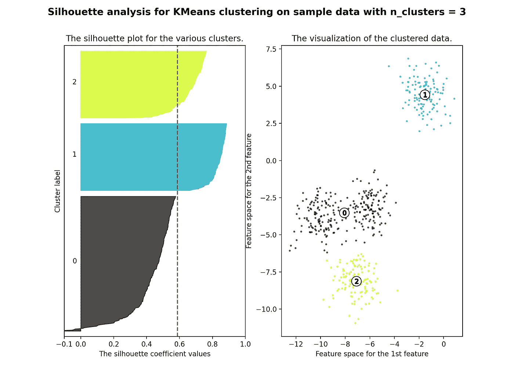
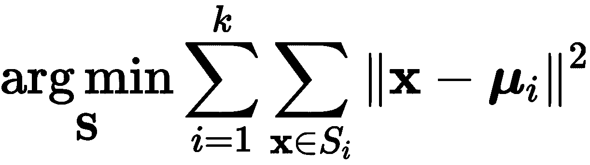
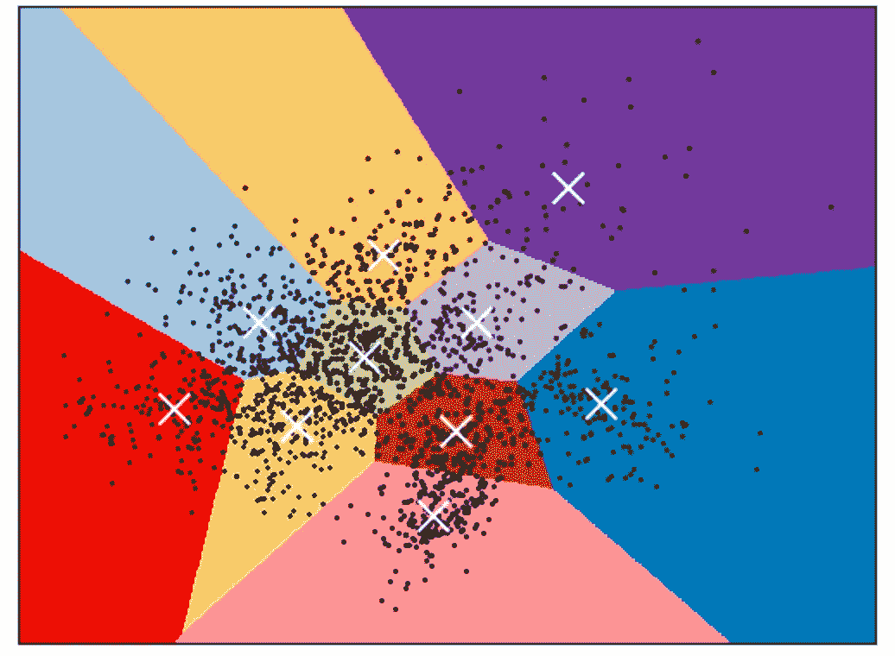
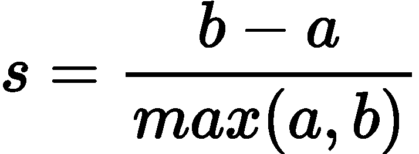
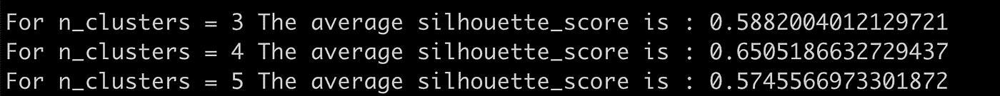
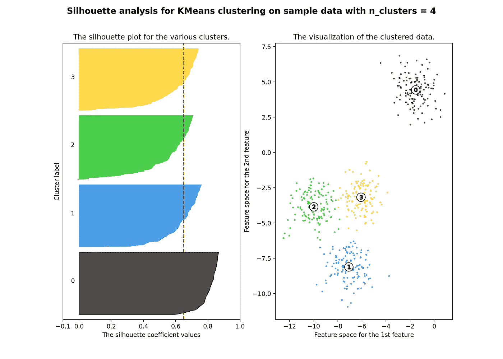
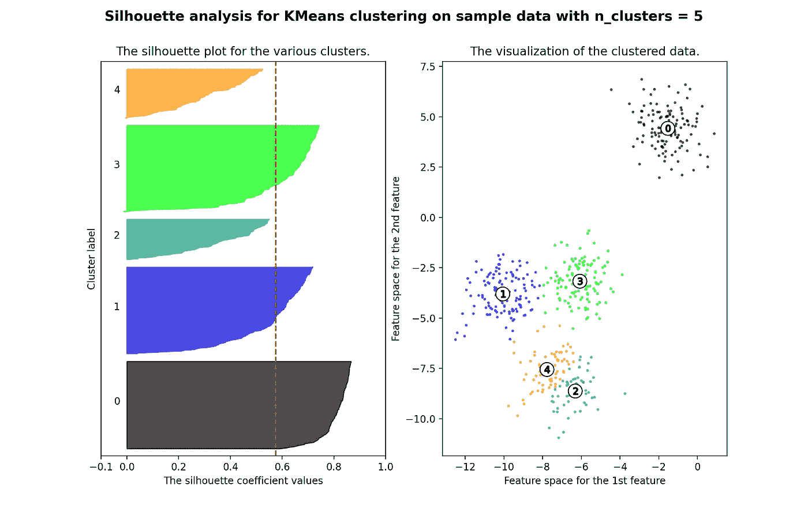

# K-Means 聚类:工作原理&在数据中寻找最优的聚类数

> 原文：<https://towardsdatascience.com/k-means-clustering-how-it-works-finding-the-optimum-number-of-clusters-in-the-data-13d18739255c?source=collection_archive---------8----------------------->

## 数学公式，寻找最佳聚类数和 Python 中的工作示例



作者创造的形象

# 介绍

> K-means 是应用最广泛的无监督聚类方法之一。

**K-means** 算法通过尝试将样本分成等方差的 **K** 组来对手头的数据进行聚类，从而最小化被称为 ***惯性*** 或**组内平方和**的标准。**该算法要求指定聚类数**。它适用于大量样品，并已在许多不同领域的大范围应用中使用。

k-means 算法将一组 **N** 个样本(存储在数据矩阵 **X** 中)分成 **K** 个不相交的聚类 **C** ，每个聚类由聚类中样本的均值 ***μj*** 来描述。这个星团通常被称为“T28 质心”。

**K-means** 算法属于**无监督**机器 学习算法/方法的家族。对于这一系列模型，研究需要手头有一个带有一些观察值的数据集**，而不需要观察值的**标签** / **类别**。无监督学习研究系统如何从未标记的数据中推断出描述隐藏结构的函数。**

现在让我们来发现算法的数学基础。

# 数学公式

给定一组观察值( **x** 1、 **x** 2、…、 **x** *n* )，其中每个观察值是一个*d*-维实向量，*k*-意味着聚类旨在将 *n* 个观察值划分为 *k* (≤ *n* )个集合**形式上，目标定义如下:**



作者创作的乳胶图像。

其中***μ***I 是组/簇 *Si* 中的点的平均值。

如果你想在交互式路线图和活跃的学习社区的支持下自学数据科学，看看这个资源:[https://aigents.co/learn](https://aigents.co/learn)

# 理解背后的算法



部分 Voronoi 图示例(来源:[https://sci kit-learn . org/stable/auto _ examples/cluster/plot _ k means _ digits . html # sphx-glr-auto-examples-cluster-plot-k means-digits-py](https://scikit-learn.org/stable/auto_examples/cluster/plot_kmeans_digits.html#sphx-glr-auto-examples-cluster-plot-kmeans-digits-py))。

该算法也可以通过 Voronoi 图的概念来理解。

首先，使用当前质心计算点的 Voronoi 图。最初，质心是随机选择的*通常是*，但这取决于底层使用的包/库/软件。

Voronoi 图中的每个线段成为一个单独的簇。

其次，质心被更新到每个线段的平均值。然后，该算法重复这一过程，直到满足停止标准。

当迭代之间**目标** **函数**中的相对**减少**小于给定的**容差** (ε)值**或**质心** **移动**(在空间中)**小于**容差**时**算法**停止**。**

# 寻找最佳聚类数

如介绍中所述，**K-Means 算法需要预先指定聚类的数量。如果没有关于数据中潜在聚类数的有效假设，这项任务可能很难完成。**

幸运的是，有一些方法可以估计我们数据中的最佳聚类数，如**轮廓系数或肘方法。**如果地面真实标签未知，必须使用模型本身进行评估。在本文中，我们将只使用**轮廓系数**，而不是简单得多的肘法。简而言之，[肘方法](https://en.wikipedia.org/wiki/Elbow_method_(clustering))将方差百分比解释为聚类数的函数:应该选择多个聚类，以便添加另一个聚类不会提供更好的数据建模。

**较高的轮廓系数分数与具有更好定义的聚类的模型相关**。轮廓系数是为每个样本定义的，由两个分数组成:

*   **a** :一个样本到同一类中所有其他点的平均距离。
*   **b** :样本与下一个最近簇*中所有其他点之间的平均距离*。

单个样本的轮廓系数 ***s*** **定义为:**



作者创作的乳胶图像。

**最后，一组*样本的总轮廓系数*作为每个样本轮廓系数的平均值给出。**

> 最好的值是 1，最差的值是-1。接近 0 的值表示重叠的簇。负值通常表示样本被分配到错误的聚类，因为不同的聚类更相似。

# Python 工作示例

对于本例，我们将创建人工数据，即人工聚类。这样**我们将提前**知道**地** **到**即**我们数据集**中簇的确切数目。

让我们从导入所需的 python 库开始:

```
from sklearn.datasets import [make_blobs](https://scikit-learn.org/stable/modules/generated/sklearn.datasets.make_blobs.html#sklearn.datasets.make_blobs)
from sklearn.cluster import [KMeans](https://scikit-learn.org/stable/modules/generated/sklearn.cluster.KMeans.html#sklearn.cluster.KMeans)
from sklearn.metrics import [silhouette_samples](https://scikit-learn.org/stable/modules/generated/sklearn.metrics.silhouette_samples.html#sklearn.metrics.silhouette_samples), [silhouette_score](https://scikit-learn.org/stable/modules/generated/sklearn.metrics.silhouette_score.html#sklearn.metrics.silhouette_score)

import matplotlib.pyplot as plt
import matplotlib.cm as cm
import numpy as np
```

接下来，让我们创建一些包含 **500 个样本**、 **2 个特征/变量**和 **K=4 个聚类**的人工数据。

```
# Generating the data
# This particular setting has one distinct cluster and 3 clusters placed close together.
X, y = [make_blobs](https://scikit-learn.org/stable/modules/generated/sklearn.datasets.make_blobs.html#sklearn.datasets.make_blobs)(n_samples=500,
                  n_features=2,
                  centers=4,
                  cluster_std=1,
                  center_box=(-10.0, 10.0),
                  shuffle=True,
                  random_state=1)
```

我们知道数据中有 K=4 个聚类，但是，为了了解剪影评分如何工作**，我们将使用一系列不同数量的聚类来拟合模型。**

每一次，我们将估计**轮廓分数**，并且也用最终(**收敛** ) **质心**绘制数据。所有这些都是由下面的代码完成的:

```
range_n_clusters = [3, 4, 5]for n_clusters in range_n_clusters:
    # Create a subplot with 1 row and 2 columns
    fig, (ax1, ax2) = [plt.subplots](https://matplotlib.org/api/_as_gen/matplotlib.pyplot.subplots.html#matplotlib.pyplot.subplots)(1, 2)
    fig.set_size_inches(18, 7)

    # The 1st subplot is the silhouette plot
    # The silhouette coefficient can range from -1, 1 but in this example all
    # lie within [-0.1, 1]
    ax1.set_xlim([-0.1, 1])
    # The (n_clusters+1)*10 is for inserting blank space between silhouette
    # plots of individual clusters, to demarcate them clearly.
    ax1.set_ylim([0, len(X) + (n_clusters + 1) * 10])

    # Initialize the clusterer with n_clusters value and a random generator
    # seed of 10 for reproducibility.
    clusterer = [KMeans](https://scikit-learn.org/stable/modules/generated/sklearn.cluster.KMeans.html#sklearn.cluster.KMeans)(n_clusters=n_clusters, random_state=10)
    cluster_labels = clusterer.fit_predict(X)

    # The silhouette_score gives the average value for all the samples.
    # This gives a perspective into the density and separation of the formed
    # clusters
    silhouette_avg = [silhouette_score](https://scikit-learn.org/stable/modules/generated/sklearn.metrics.silhouette_score.html#sklearn.metrics.silhouette_score)(X, cluster_labels)
    print("For n_clusters =", n_clusters,
          "The average silhouette_score is :", silhouette_avg)

    # Compute the silhouette scores for each sample
    sample_silhouette_values = [silhouette_samples](https://scikit-learn.org/stable/modules/generated/sklearn.metrics.silhouette_samples.html#sklearn.metrics.silhouette_samples)(X, cluster_labels)

    y_lower = 10
    for i in range(n_clusters):
        # Aggregate the silhouette scores for samples belonging to
        # cluster i, and sort them
        ith_cluster_silhouette_values = \
            sample_silhouette_values[cluster_labels == i]

        ith_cluster_silhouette_values.sort()

        size_cluster_i = ith_cluster_silhouette_values.shape[0]
        y_upper = y_lower + size_cluster_i

        color = cm.nipy_spectral(float(i) / n_clusters)
        ax1.fill_betweenx([np.arange](https://numpy.org/doc/stable/reference/generated/numpy.arange.html#numpy.arange)(y_lower, y_upper),
                          0, ith_cluster_silhouette_values,
                          facecolor=color, edgecolor=color, alpha=0.7)

        # Label the silhouette plots with their cluster numbers at the middle
        ax1.text(-0.05, y_lower + 0.5 * size_cluster_i, str(i))

        # Compute the new y_lower for next plot
        y_lower = y_upper + 10  # 10 for the 0 samples

    ax1.set_title("The silhouette plot for the various clusters.")
    ax1.set_xlabel("The silhouette coefficient values")
    ax1.set_ylabel("Cluster label")

    # The vertical line for average silhouette score of all the values
    ax1.axvline(x=silhouette_avg, color="red", linestyle="--")

    ax1.set_yticks([])  # Clear the yaxis labels / ticks
    ax1.set_xticks([-0.1, 0, 0.2, 0.4, 0.6, 0.8, 1])

    # 2nd Plot showing the actual clusters formed
    colors = cm.nipy_spectral(cluster_labels.astype(float) / n_clusters)
    ax2.scatter(X[:, 0], X[:, 1], marker='.', s=30, lw=0, alpha=0.7,
                c=colors, edgecolor='k')

    # Labeling the clusters
    centers = clusterer.cluster_centers_
    # Draw white circles at cluster centers
    ax2.scatter(centers[:, 0], centers[:, 1], marker='o',
                c="white", alpha=1, s=200, edgecolor='k')

    for i, c in enumerate(centers):
        ax2.scatter(c[0], c[1], marker='$%d$' % i, alpha=1,
                    s=50, edgecolor='k')

    ax2.set_title("The visualization of the clustered data.")
    ax2.set_xlabel("Feature space for the 1st feature")
    ax2.set_ylabel("Feature space for the 2nd feature")

    [plt.suptitle](https://matplotlib.org/api/_as_gen/matplotlib.pyplot.suptitle.html#matplotlib.pyplot.suptitle)(("Silhouette analysis for KMeans clustering on sample data "
                  "with n_clusters = %d" % n_clusters),
                 fontsize=14, fontweight='bold')

[plt.show](https://matplotlib.org/api/_as_gen/matplotlib.pyplot.show.html#matplotlib.pyplot.show)()
```



控制台中的代码输出(图片由作者创建)

> 我们观察到，在 K=4 个聚类的情况下，平均/均值**轮廓得分最高。**

**这验证了轮廓分数是 K-均值拟合优度的良好度量。**

我们还制作了这些图:


剪影分数&最终(**收敛** ) **质心**的数据(图片由作者创建)



剪影分数&最终(**收敛** ) **质心**的数据(图片由作者创建)



剪影分数&最终(**收敛** ) **质心**的数据(图片由作者创建)

**垂直线是所有值的平均轮廓得分。**

**同样，我们还可以直观地验证轮廓得分是特定示例的 K 均值拟合优度的良好度量。**

# **结论**

**K-means** 是应用最广泛的无监督聚类方法之一。该算法通过尝试将样本分成等方差的 **K** 组来对手头的数据进行聚类，从而最小化被称为惯性或类内平方和的标准。该算法要求指定聚类数。

但是，如果地面实况标签未知，则必须使用模型本身进行评估。

在本文中，我们使用了**轮廓系数。从工作示例中，我们可以验证轮廓分数是 K-means 拟合优度的良好度量。**

仅此而已！希望您喜欢这篇新文章——更多内容即将发布！

# 参考

[1]彼得·j·鲁瑟夫(1987 年)。“轮廓:聚类分析的解释和验证的图形辅助”。计算与应用数学 20:53–65。[doi:10.1016/0377–0427(87)90125–7](https://doi.org/10.1016/0377-0427(87)90125-7)。

[2][https://en . Wikipedia . org/wiki/Silhouette _(集群)](https://en.wikipedia.org/wiki/Silhouette_(clustering))

## 您可能还喜欢:

[](/lstm-time-series-forecasting-predicting-stock-prices-using-an-lstm-model-6223e9644a2f) [## LSTM 时间序列预测:使用 LSTM 模型预测股票价格

### 在这篇文章中，我将向你展示如何使用预测 LSTM 模型来预测股票价格

towardsdatascience.com](/lstm-time-series-forecasting-predicting-stock-prices-using-an-lstm-model-6223e9644a2f) [](/time-series-forecasting-predicting-stock-prices-using-an-arima-model-2e3b3080bd70) [## 时间序列预测:使用 ARIMA 模型预测股票价格

### 在这篇文章中，我将向你展示如何使用预测 ARIMA 模型来预测特斯拉的股票价格

towardsdatascience.com](/time-series-forecasting-predicting-stock-prices-using-an-arima-model-2e3b3080bd70) 

# 敬请关注并支持这一努力

如果你喜欢这篇文章并觉得它有用，请关注我，这样你就可以看到我所有的新帖子。

有问题吗？把它们作为评论贴出来，我会尽快回复。

# 最新帖子

[](https://medium.com/@seralouk/the-best-free-data-science-resources-free-books-online-courses-9c4a2df194e5) [## 最佳免费数据科学资源:免费书籍和在线课程

### 最有用的免费书籍和在线课程，适合想了解更多数据科学知识的人。

medium.com](https://medium.com/@seralouk/the-best-free-data-science-resources-free-books-online-courses-9c4a2df194e5) [](/roc-curve-explained-using-a-covid-19-hypothetical-example-binary-multi-class-classification-bab188ea869c) [## 用新冠肺炎假设的例子解释 ROC 曲线:二分类和多分类…

### 在这篇文章中，我清楚地解释了什么是 ROC 曲线以及如何阅读它。我用一个新冠肺炎的例子来说明我的观点，我…

towardsdatascience.com](/roc-curve-explained-using-a-covid-19-hypothetical-example-binary-multi-class-classification-bab188ea869c) [](/support-vector-machines-svm-clearly-explained-a-python-tutorial-for-classification-problems-29c539f3ad8) [## 支持向量机(SVM)解释清楚:分类问题的 python 教程…

### 在这篇文章中，我解释了支持向量机的核心，为什么以及如何使用它们。此外，我还展示了如何绘制支持…

towardsdatascience.com](/support-vector-machines-svm-clearly-explained-a-python-tutorial-for-classification-problems-29c539f3ad8) [](/pca-clearly-explained-how-when-why-to-use-it-and-feature-importance-a-guide-in-python-7c274582c37e) [## PCA 清楚地解释了——如何、何时、为什么使用它以及特性的重要性:Python 指南

### 在这篇文章中，我解释了什么是 PCA，何时以及为什么使用它，以及如何使用 scikit-learn 在 Python 中实现它。还有…

towardsdatascience.com](/pca-clearly-explained-how-when-why-to-use-it-and-feature-importance-a-guide-in-python-7c274582c37e) [](/everything-you-need-to-know-about-min-max-normalization-in-python-b79592732b79) [## 关于 Python 中的最小-最大规范化，您需要知道的一切

### 在这篇文章中，我将解释什么是最小-最大缩放，什么时候使用它，以及如何使用 scikit 在 Python 中实现它

towardsdatascience.com](/everything-you-need-to-know-about-min-max-normalization-in-python-b79592732b79) [](/how-and-why-to-standardize-your-data-996926c2c832) [## Scikit-Learn 的标准定标器如何工作

### 在这篇文章中，我将解释为什么以及如何使用 scikit-learn 应用标准化

towardsdatascience.com](/how-and-why-to-standardize-your-data-996926c2c832) 

# 和我联系

*   **LinkedIn**:【https://www.linkedin.com/in/serafeim-loukas/ 
*   https://www.researchgate.net/profile/Serafeim_Loukas**研究之门**:[](https://www.researchgate.net/profile/Serafeim_Loukas)