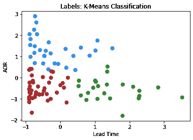
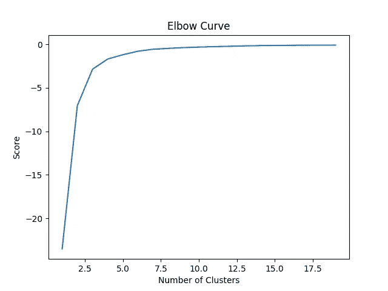
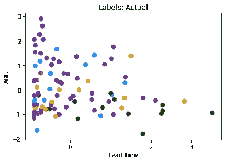
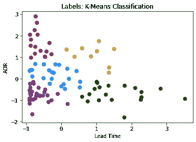

# k-均值聚类:识别有利可图的酒店客户

> 原文：<https://towardsdatascience.com/k-means-clustering-identifying-profitable-hotel-customers-87a1ed8630c9?source=collection_archive---------40----------------------->

## K-Means 聚类算法允许我们对接近平均值的观察值进行分组。这使我们能够更高效地将数据分类到特定的部分。

在本例中，K-Means 用于分析葡萄牙一家酒店的市场细分聚类。

该分析基于下面参考文献部分引用的由 **Antonio、Almeida 和 Nunes** 进行的原始研究。



来源:Jupyter 笔记本输出

给定**提前期**(从客户预订到他们实际入住酒店的时间)，以及 **ADR** (每位客户的平均每日房价)，k-means 聚类算法用于直观地识别哪些细分市场对酒店最有利可图。

具有高 ADR 和低交付周期的客户是理想的，因为这意味着 1)客户支付高每日价格，这意味着酒店的利润率更高，而低交付周期意味着客户更快支付预订费用，这增加了酒店的现金流。

# 数据操作

加载数据并随机选择 100 个样本:

```
df = pd.read_csv('H1full.csv')
df = df.sample(n = 100)
```

间隔(或连续随机变量)为**提前期**和 **ADR** 定义如下:

```
leadtime = df['LeadTime']
adr = df['ADR']
```

使用'''分类代码' ' '定义具有分类成分的变量，在本例中为**细分市场**。

```
marketsegmentcat=df.MarketSegment.astype("category").cat.codes
marketsegmentcat=pd.Series(marketsegmentcat)
```

这样做的目的是为每个细分市场分配分类代码。例如，以下是数据集中一些市场细分条目的片段:

```
10871        Online TA
7752         Online TA
35566    Offline TA/TO
1353         Online TA
17532        Online TA
             ...      
1312         Online TA
10364           Groups
16113           Direct
23633        Online TA
23406           Direct
```

应用`cat.codes`后，这里有相应的类别。

```
10871    4
7752     4
35566    3
1353     4
17532    4
        ..
1312     4
10364    2
16113    1
23633    4
23406    1
```

细分市场标签如下:

*   0 =公司
*   1 =直接
*   **2** =组
*   **3** =离线 TA/TO
*   **4** =在线 TA

使用 sklearn 对提前期和 ADR 特性进行缩放:

```
from sklearn.preprocessing import scale
X = scale(x1)
```

下面是 X 的一个例子:

```
array([[ 1.07577693, -1.01441847],
       [-0.75329711,  2.25432473],
       [-0.60321924, -0.80994917],
       [-0.20926483,  0.26328418],
       [ 0.53174465, -0.40967609],
       [-0.82833604,  0.40156369],
       [-0.89399511, -1.01810593],
       [ 0.59740372,  1.40823851],
       [-0.89399511, -1.16560407],
```

# k 均值聚类

当谈到选择集群数量时，一个可能的解决方案是使用所谓的**肘方法**。以下是肘部曲线的一个示例:



来源:Jupyter 笔记本输出

这是一种计算每个分类的分类内方差的技术，方差越低，分类越紧密。

在这方面，随着分数开始变平，这意味着随着我们增加聚类的数量，方差的减少越来越少，这允许我们确定 **k** 的理想值。

但是，这种技术不一定适合较小的集群。此外，我们已经知道我们想要定义的集群的数量(k=5 ),因为我们已经知道我们想要分析的细分市场的数量。

此外，虽然 k-means 聚类方法也可以使用 PCA(或主降维)来减少特征的数量，但这在这种情况下是不合适的，因为使用的唯一两个特征(除了细分市场)是 **ADR** 和**提前期**。

因此，k-means 算法定义如下:

```
>>> km = KMeans(n_clusters = 5, n_jobs = None, random_state = None)
>>> km.fit(X)KMeans(algorithm='auto', copy_x=True, init='k-means++', max_iter=300,
       n_clusters=5, n_init=10, n_jobs=None, precompute_distances='auto',
       random_state=None, tol=0.0001, verbose=0)
```

为每个细分市场标签定义颜色主题:

```
# Market Segment Labels: 0 (Complementary) = firebrick, 1 (Corporate) = dodgerblue, 2 (Direct) = forestgreen, 3 (Groups) = goldenrod, 4 (Offline TA/TO) = rebeccapurplecolor_theme = np.array(['firebrick', 'dodgerblue', 'forestgreen', 'goldenrod', 'rebeccapurple'])
```

以下是实际标签的图表:



来源:Jupyter 笔记本输出

下面是 k-means 算法生成的聚类图:



来源:Jupyter 笔记本输出

如前所述，具有最短交付时间和最高 ADR 的客户被视为利润最高。

但是，好像有问题！许多细分市场类别都被贴错了标签。

这是使用 k-means 聚类时的一个常见问题，并不一定表示应该抛弃该模型！相反，它只是建议我们需要以不同的方式思考我们的数据。

例如，我们已经知道哪些客户属于哪个细分市场。在这点上，生成 k-means 聚类算法来再次预测这一点并没有多大用处。相反，运行这种算法的目的是快速了解哪种类型的客户最有利可图。

此外，我们只考虑了提前期和 ADR 这两个特征。可能还有我们没有考虑到的其他特征，这些特征可以更好地表明客户可能属于哪个细分市场，并且从我们目前看到的情况来看，没有直观的证据表明某些细分市场比其他细分市场更有利可图。

对此，我们稍微简化一下分析。如果我们使用三个集群呢？


来源:Jupyter 笔记本输出

我们看到，蓝色类别具有最高的 ADR 和最低的提前期(利润最高)，而绿色类别显示最低的 ADR 和最高的提前期(利润最低)。

从这个角度来看，k-means 聚类算法提供了一种快速对酒店最赚钱的客户进行分类的有效方法，并且可以进行进一步的分析，以分析每组客户共有的某些属性。

当谈到无监督学习时——重要的是要记住这在很大程度上是一种**探索性**分析方法——目标不一定是预测，而是揭示以前可能没有考虑过的关于数据的见解。例如，为什么某些客户的交付周期比其他客户短？来自某些国家的客户更有可能符合这一特征吗？不同的客户类型呢？

这些都是 k-means 聚类算法可能无法直接回答我们的问题——但是将数据减少到单独的聚类中为能够提出这样的问题提供了一个强大的基线。

# 结论

在本例中，我们看到:

*   如何使用 Python 进行 k-means 聚类
*   k-均值聚类在按盈利能力细分酒店客户中的应用
*   有效使用 k 均值模型的数据配置

非常感谢您的参与，这个例子的相关 GitHub 库可以在[这里](https://github.com/MGCodesandStats/hotel-modelling)找到。

*免责声明:本文是在“原样”的基础上编写的，没有担保。本文旨在提供数据科学概念的概述，不应以任何方式解释为专业建议。*

# 参考

*   [Antonio、Almeida 和 Nunes:使用数据科学预测酒店预订取消](https://www.researchgate.net/publication/309379684_Using_Data_Science_to_Predict_Hotel_Booking_Cancellations)
*   [OpenClassrooms:执行 K-Means 聚类](https://openclassrooms.com/en/courses/5869986-perform-an-exploratory-data-analysis/6177851-carry-out-a-k-means-clustering)
*   [中:用 PYTHON 中的 K-MEANS 聚类预测鸢尾花的种类](https://medium.com/@belen.sanchez27/predicting-iris-flower-species-with-k-means-clustering-in-python-f6e46806aaee)
*   [走向数据科学:当集群没有意义的时候](/when-clustering-doesnt-make-sense-c6ed9a89e9e6)
*   [方差解释:K 均值聚类不是免费的午餐](http://varianceexplained.org/r/kmeans-free-lunch/)