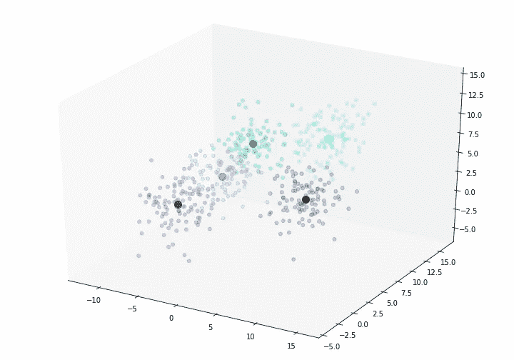
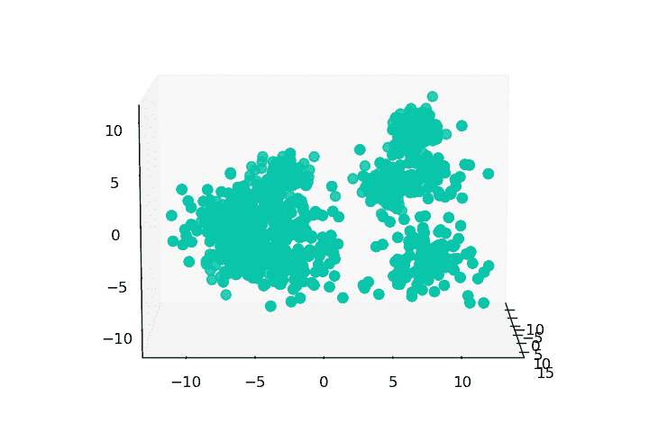
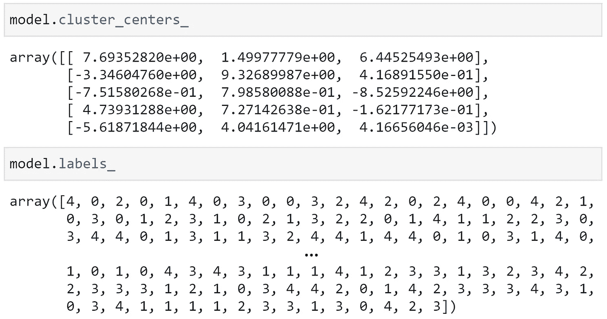
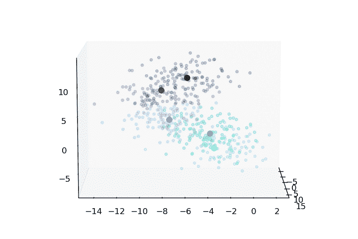
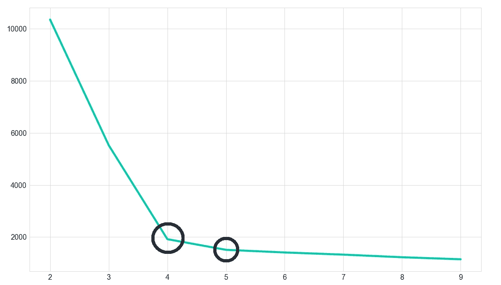

# Python 中的 K-Means 聚类

> 原文：<https://towardsdatascience.com/k-means-clustering-in-python-4061510145cc?source=collection_archive---------8----------------------->

## 用 K-Means 直观地介绍数据科学


照片由 [NASA](https://unsplash.com/@nasa?utm_source=medium&utm_medium=referral) 在 [Unsplash](https://unsplash.com?utm_source=medium&utm_medium=referral) 上拍摄

意味着聚类是一种无监督的最大似然算法，我们可以用它来将我们的数据集分成逻辑分组——称为聚类。因为它是无监督的，所以我们不需要依赖已标记的数据来进行训练。



用 K-均值识别的五个聚类。

这些分类是通过将数据分成明显不同的组来创建的，其中组成每个组的值是相似的，而不同组之间的值是不同的。

K-means 中的 ***K*** 是指聚类的个数。聚类机制本身的工作方式是将数据集中的每个数据点标记为一个随机的聚类。然后，我们循环执行以下过程:

1.  取每个聚类中所有数据点的平均值
2.  将该平均值设置为新的聚类中心(质心)
3.  将每个数据点重新标记到其最近的聚类质心。

我们继续这个过程，直到质心停止移动，这意味着我们已经成功地对数据集进行了聚类！

这种算法的应用范围很广，一些最常见也最有趣的应用包括:

*   文档聚类(例如，政策、法规、技术规范)
*   市场分割
*   欺诈检测[1]
*   识别犯罪热点[2]

在本文中，我们将使用一个简单的数据集。然而，K-Means 可以有效地用于极其丰富多样的数据集-有些数据集有几十个特征和数百万个样本。

# 实现算法

我们将使用 Sci-kit Learn 实现 K-means。但在此之前，我们需要数据。这里我们可以使用 Sci-kit Learn 的`make_blobs`函数来生成给定数量的人工生成的集群:

```
from sklearn.datasets import make_blobs
X, y = make_blobs(n_samples=500, n_features=3, centers=5,
                  cluster_std=2)
```



在这个玩具示例中，我们可以分辨出我们的聚类——然而，当处理数百万个数据点和数十个特征/维度时，就变得困难多了。

这样，在变量`X`中，我们现在有了包含`500`数据点的人工数据，每个数据点由`3`特征/尺寸组成，并且每个数据点属于`5`斑点中的一个。变量`y`告诉我们每个数据点属于哪个集群——通常，我们不知道这一点。

## k 均值

现在我们有了数据。我们可以运行 K-Means 对其进行聚类！我们再次使用 sci-kit learn:

```
from sklearn.cluster import KMeans
model = KMeans(n_clusters=5)
```

这里我们已经用`5`聚类质心初始化了 K 均值模型。然后，我们可以使用`fit`方法用我们的数据`X`运行我们的模型:

```
model.fit(X)
```

现在我们可以分别使用`labels_`和`cluster_centers_`方法访问我们的数据分类和质心坐标。



我们分别用 **model.cluster_centers_** 和 **model.labels_** 访问 **X** 数据聚类中心和标签。

当绘制质心和标记的数据点时，我们可以看到该算法已经识别了五个聚类:



# 用肘法选择 K

我们对 K-Means 的理解中缺少的一部分是如何选择 K？

到目前为止，最流行的方法是*肘法*。幸运的是，这也非常简单。

首先，我们需要用 K 的某个值运行我们的算法—一旦完成，我们可以从`intertia_`属性中提取 X 值的误差平方和(SSE ):

```
sse = model.inertia_
```

SSE 计算为每个数据点与其分配的聚类质心之间的平方距离之和。如果所有数据点都紧紧聚集在分配给它们的质心周围，那么 SSE 将会很低，否则就会很高。

重要的是，我们要有足够的聚类来匹配我们数据集中的聚类，但不要有太多的聚类，通过简单地为每个数据点分配它自己的聚类，SSE 就会最小化。

```
sse = []for K in range(1, 10):
    model = KMeans(n_clusters=K)
    model.fit(X)
    sse.append(model.inertia_)
```



我们需要找到一个神奇的地方，在那里我们可以正确地确定最合理的集群数量。可以通过计算 K 值范围的 SSE 并识别上图中的“弯头”来识别该点。

这就是对 K-Means 算法聚类的介绍！我们涵盖了:

*   K 的意思是
*   用在哪里
*   我们如何使用它
*   用肘法选择 K

我希望你喜欢这篇文章——如果你有任何问题或想法，请通过 [Twitter](https://twitter.com/jamescalam) 或在下面的评论中告诉我。

感谢阅读！

# 参考

[1] A. Ghorbani，S. Farzai，[使用基于数据挖掘方法的汽车保险欺诈检测](http://www.aeuso.org/includes/files/articles/Vol8_Iss27_3764-3771_Fraud_Detection_in_Automobile_Insur.pdf) (2018)，IJMEC

[2] M. Zulfadhilah 等人，[使用日志分析和 K-Means 聚类的网络分析](https://thesai.org/Downloads/Volume7No7/Paper_59-Cyber_Profiling_Using_Log_Analysis_And_K_Means_Clustering.pdf) (2016)，IJACSA

**除非另有说明，所有图片均出自作者之手*