# 大学数据的 k-均值聚类

> 原文：<https://towardsdatascience.com/k-means-clustering-of-university-data-9e8491068778?source=collection_archive---------29----------------------->

## 我们能仅仅根据大学的特点把它们分为公立和私立吗？


瓦迪姆·谢尔巴科夫在 [Unsplash](https://unsplash.com/photos/d6ebY-faOO0) 拍摄的照片。

大家好！对于这个项目，我想介绍一下 **K 均值聚类**，这是机器学习中最常见的聚类算法之一。在此过程中，我们将进行一些探索性的数据分析，以了解更多关于大学的数据集。

# 背景

对于那些可能是机器学习新手的人来说，**聚类**是**无监督学习模型**的一个例子，当我们将未分类的训练数据输入模型，并让我们的模型尝试根据数据的特征以某种方式对数据进行分类。

另一种方法是**监督学习模型**，我们预先为我们的训练数据分配标签，指示每个数据点属于哪个类别，该模型试图预测新数据点属于哪个类别。

我在中国从事教育工作近 4 年，我的工作涉及使用数据分析来估计学生被他们学校名单上的大学录取的可能性。为了好玩，我将用 Python 创建一个模型，使用 K-means 聚类将大学分为两组:私立和公立。事实上，一个在大学网站上至少做了粗略研究的学生可以在不到一分钟的时间内找到一所学校是私立还是公立的，但我们将看看一个模型是否能够根据似乎非常相关的特征(州外学费、毕业率)和似乎完全不相关的特征(捐赠校友的百分比)正确地对学校进行分类。

**注意:我们实际上有这个数据集的标签，但是我们不会将它们用于 K-means 聚类算法，因为这是一个无监督的学习算法。最后，我将比较 K-means 和监督学习算法，以比较这两种模型的性能。**

# 数据

以下是[该数据集](https://github.com/ChrisWoodard43/KMeans-Universities)中的特征—随意浏览它们，并思考它们预测一所学校是公立还是私立的好坏程度:

*   **申请**:收到的申请数量
*   **受理**:受理的申请数量
*   **招生**:招生人数
*   前 10%的学生:来自高中班级前 10%的新生的百分比
*   高中班级排名前 25%的新生比例
*   **F .本科生**:全日制本科生人数
*   **P .本科生**:非全日制本科生人数
*   **州外**:州外学费
*   **房间。食宿**:食宿费用
*   **图书**:预计图书成本
*   **个人**:预计个人支出
*   博士:拥有博士学位的教师比例
*   **终端**:拥有终端学位(博士/法学博士/医学博士/工商管理硕士等)的教师比例
*   **学生/教师比率**:学生/教师比率
*   **校友百分比**:捐赠的校友百分比
*   **expense**:每个学生的教学支出
*   毕业生。比率:毕业率

# 探索性数据分析

开始任何分析的一个好方法是使用熊猫。DataFrame.describe()来获得关于数据的一些基本统计信息。

```
import numpy as np
import pandas as pd
import matplotlib.pyplot as plt
import seaborn as snscolleges = pd.read_csv(‘College_Data’,index_col=0)
colleges.describe()
```

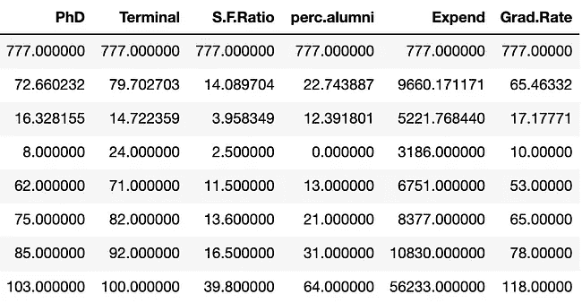

DataFrame.describe()的输出，关于数据集特征的一些基本统计数据。图片作者。

仅通过查看这些列的最大值，就可以发现一些问题:

1.  众所周知，顶级私立学校每年收费高达 6 万美元，但这里的州外学费最高只有 21，700 美元，所以我们可以假设这笔学费是按学期而不是按年列出的。
2.  有一所学校 100%以上的教师都是博士！这似乎有些可疑，但这或许可以用一小撮成绩优异的教师来解释，他们可能有一个被重复计算的双博士学位。
3.  同样，我们也有一所毕业率为 118%的学校！我们稍后会探讨这种异常现象…

请随意查看平均值、中间值和其他统计数据，看看有什么让你印象深刻！这就是*探索性*数据分析的原因。

让我们来看看哪所大学的申请人数最多。

```
colleges.loc[colleges[‘Apps’]==np.max(colleges[‘Apps’])]
```

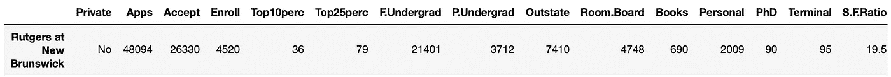

输出。图片作者。

结果是罗格斯大学的申请人数和录取人数最多，但注册人数却不是最多的。高中和大学的另一个值得夸耀的地方是他们的师生比:越低越好。

```
colleges.loc[colleges[‘S.F.Ratio’]==np.min(colleges[‘S.F.Ratio’])]
```

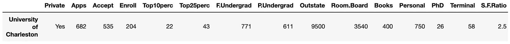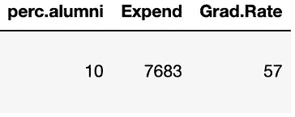

输出。图片作者。

这里的赢家是查尔斯顿大学，其 ***非常低*** 的比率为 2.5，这实际上是一个与家庭学校或私人辅导一样亲密的教学环境。考虑到学生与教师比率的第 25 百分位是 11.5，C 的 U 是一个主要的异常值。

现在来说说钱:哪个大学的校友捐赠率最高？

```
colleges.loc[colleges[‘perc.alumni’]==np.max(colleges[‘perc.alumni’])]
```

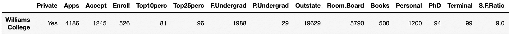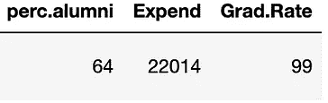

输出。图片作者。

威廉姆斯获奖不足为奇，因为这是一所小型文理学院(总共约 2000 名学生)，主要面向拥有强大人脉的富裕家庭。之前打电话告诉我们，捐款比例的中位数只有区区 21%，因此作为学生打电话者，校园里有大量的工作机会。

现在有趣的事情来了:让我们通过观察学校在每个学生身上的支出与州外学费的比率，来看看谁真正从大学教育中获得了他们的美元价值。

```
colleges[‘expense ratio’] = colleges[‘Expend’]/(colleges[‘Outstate’])colleges.describe()[‘expense ratio’]
```

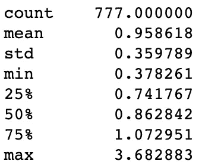

输出。图片作者。

WOAH！平均值小于 1 的事实告诉我，当把学费作为唯一的收入来源时，普通学校在学生身上是赔钱的。事实上， **~69%** 的大学在学生身上的投资超过了他们收取的费用，这对大多数大学的未来来说不是一个好兆头。比例最高的学校大概是一些常春藤盟校吧？

```
colleges.loc[colleges[‘expense ratio’]==np.max(colleges[‘expense ratio’])]
```

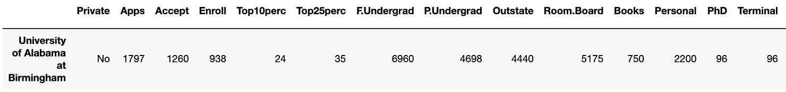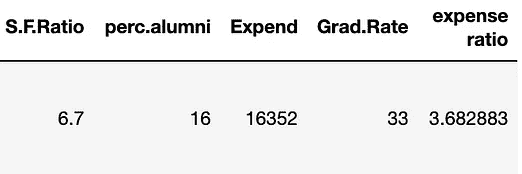

输出。图片作者。

不对！最佳“物有所值”奖授予…****鼓乐****…伯明翰阿拉巴马大学，费用比率为 **3.68** ！然而，一种更愤世嫉俗的观点是，如果 UAB 在每个学生身上的花费是州外学费的近 4 倍，那么它可能不会在商业上持续太久…所以如果你是 2021 年的 HS 班，在他们还在运营的时候就进去，但要握紧你的钱包，因为那些打电话的学生会加班加点地抢你的捐款！

对于任何想知道的人来说，最大的小偷(费用比率最低的大学)是林登伍德学院，比率为 **0.378。哎呀！**

# 形象化

是时候创建一些数据可视化了！

让我们调查一下学费是如何随着学生人数以及学校是公立还是私立而变化的。我怀疑私立学校的学费更高，因为它们不像公立学校那样接受政府资助。全日制学生的数量可能会对这两种情况产生不利影响，因为更多的学生意味着更多的员工和更多的建筑，但一所大学可能会从针对如此大量学生的建筑项目的规模经济中受益。

```
plt.figure(figsize=(8,6))
sns.scatterplot(data=colleges,x='Outstate',y='F.Undergrad',hue='Private')
```

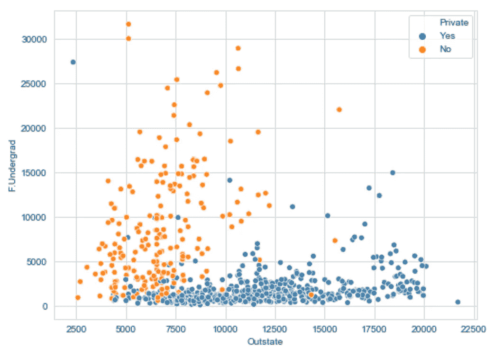

全日制本科生与州外学费的数量，按私立/公立区分。图片作者。

嗯… ***非常*** 有趣的是，这所学校的本科生人数几乎完全与学费无关，这就引出了一个问题:这些钱去了哪里？让我们放大一下州外学费，看看毕业率。

```
sns.set_style('darkgrid')
g = sns.FacetGrid(colleges,hue='Private',palette='coolwarm',height=6,aspect=1.5)
g = g.map(plt.hist,'Outstate',bins=20,alpha=0.7)
plt.legend(labels=['Private','Public'])
```

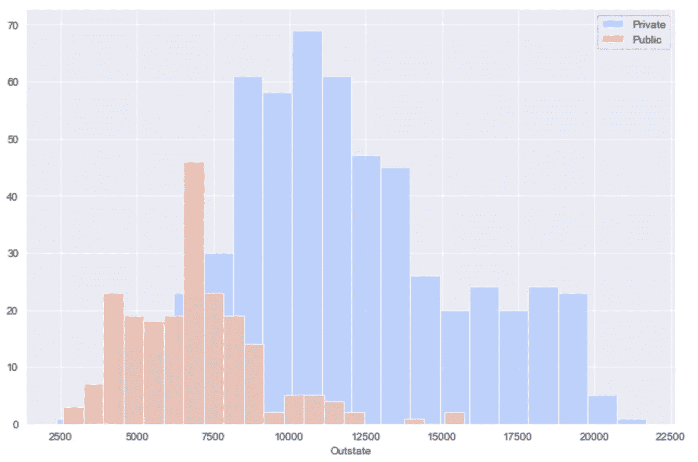

私立和公立学校的州外学费。图片作者。

```
grid = sns.FacetGrid(colleges,hue='Private',palette='coolwarm',height=6,aspect=1.5)
grid = grid.map(plt.hist,'Grad.Rate',bins=20,alpha=0.7)
plt.legend(labels=['Private','Public'])
```

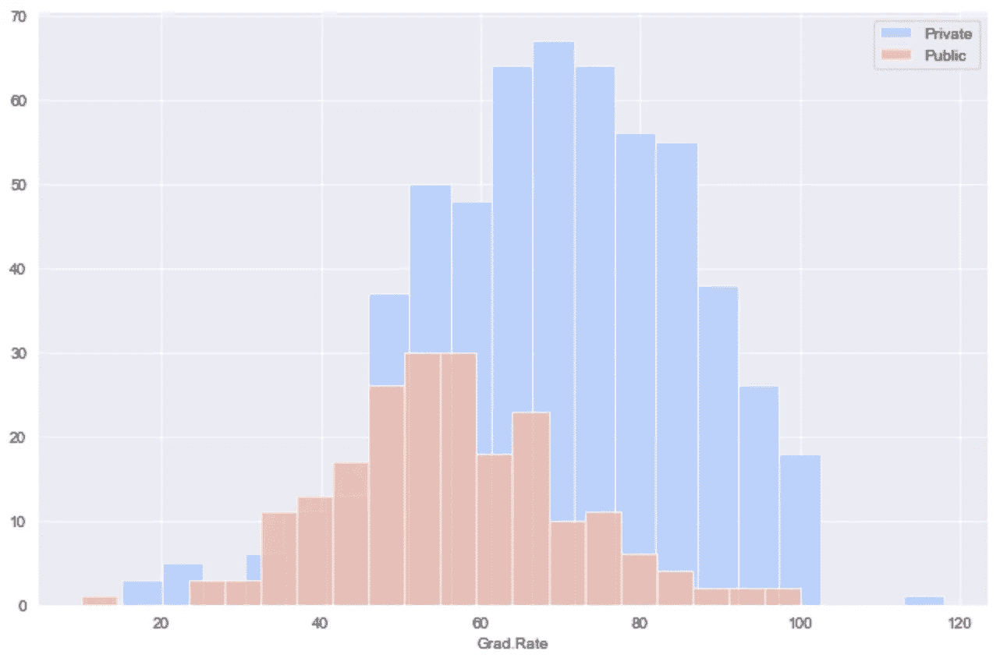

私立和公立学校的毕业率。图片作者。

不出所料，**私立学校的州外学费更高，毕业率也更高**——也许是因为如果一个学生在教育上投入那么多钱，他们的父母会想，“你最好完成学业…否则！”

现在回到那个毕业率高于 100%的学校……原来罪魁祸首是**卡泽诺维亚学院。**也许这个学校作弊，把双专业算作两次毕业？现实中这是没有意义的，所以**我准备把这个毕业率改成 100%。**

现在到了你们期待已久的时刻:**K-均值聚类！**

# k-均值聚类创建

首先，我们将从 Scikit-learn 导入 **KMeans** ，Scikit-learn 是 Python 中最流行的机器学习包。K-means 的工作方式如下:

1.  **选择集群的数量**。选择 2、4 还是 10 取决于具体问题的领域。在本例中，我们对公立和私立学校进行分类，因此我们将选择聚类数为 2。如果你正在分析一个群体中的基因变异，并且事先知道有 7 个已知的变异，那么你会选择 7 个。
2.  **将每个数据点随机分配到一个类别。**
3.  **取每个类别中数据点的质心**。对于那些认为质心是某种听起来很酷的小行星的人来说，它是多变量微积分——代表“每个星团中所有数据的平均值”对于 1-D 数据，您已经直观地理解了这一点:食品杂货的平均价格得到一个像 52 美元这样的数字。如果您计算杂货项目的平均价格和平均数量(二维)，您将得到两个数字，如$52 和 2 个项目。在该数据集中，我们有 18 个要素，因此每个质心对应一组 18 维坐标。不，我们不会尝试去想象这个。
4.  **将每个数据点重新分配到最近质心对应的类别。**
5.  **重复第 3 步和第 4 步，直到类别不再发生变化。**

这里有一个很好的图片来帮助说明:

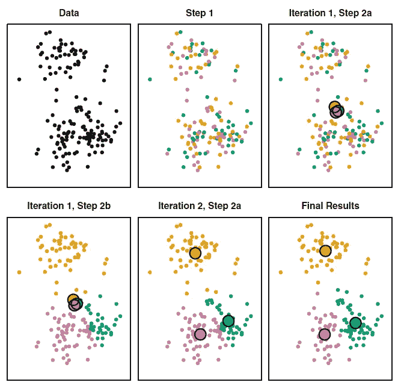

逐步 K-均值聚类，大点代表每个彩色聚类的质心。资料来源:第 389 页，[《统计学习简介](http://faculty.marshall.usc.edu/gareth-james/ISL/index.html)，作者:James，Witten，Hastie 和 Tibshirani。

用 Python 编写 K-means 模型非常简单，如下所示，模型生成的聚类可以用`km.labels_`引用(不要忘了末尾的下划线！).

```
from sklearn.cluster import KMeans
km = KMeans(n_clusters=2)
km.fit(colleges.drop(‘Private’,axis=1))
```

# **评估**

如果没有标签，就没有评估聚类的完美方法。然而，在这种情况下，学院数据集告诉我们每个学校是公立还是私立，因此我们可以使用这些标签交叉验证我们的 K-means 模型，以**比较监督和非监督模型的总体性能**。

评估机器学习模型性能的两个快速方法是查看一个 [**混淆矩阵**](https://en.wikipedia.org/wiki/Confusion_matrix) 和一个 [**分类报告**](https://muthu.co/understanding-the-classification-report-in-sklearn/) 。

```
def convertToCluster(cluster):
    if cluster=='Yes':
        return 1
    else:
        return 0
colleges['Cluster'] = colleges['Private'].apply(convertToCluster)from sklearn.metrics import classification_report,confusion_matrixprint(confusion_matrix(colleges['Cluster'],km.labels_))
print(classification_report(colleges['Cluster'],km.labels_))
```

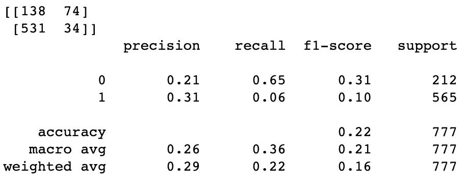

来自 Scikit-learn 的无监督 K-means 模型的混淆矩阵和分类报告。图片作者。

如果你习惯于监督学习算法，你可能会看着这些结果想，“ ***22%的准确率？！*** 这款就是垃圾！无监督模型到底有什么用？”但是请记住**无监督**的定义:该模型旨在从我们给它的混乱的 18 个特征中找出意义，没有标签。这并不是一件容易的事情，所以让我们把功劳归于 K-means 该归功的地方。

# ~奖金部分~比较无监督和有监督学习算法

让我们实际上比较我们刚刚得到的结果和监督学习模型的结果，以评估它们的性能(或者至少，将我们的期望设置为无监督学习的适当低水平😉).让我们来做一个经典的逻辑回归。

```
from sklearn.model_selection import train_test_split
from sklearn.linear_model import LogisticRegressionunis = colleges
X = unis.drop('Cluster',axis=1)
y = unis['Cluster']
X_train, X_test, y_train, y_test = train_test_split(X, y, test_size=0.3)logmodel = LogisticRegression()
logmodel.fit(X_train,y_train)preds = logmodel.predict(X_test)print("Using K means clustering (unsupervised):\n")
print(confusion_matrix(colleges['Cluster'],km.labels_))
print(classification_report(colleges['Cluster'],km.labels_))print("Using logistic regression (supervised):\n")
print(confusion_matrix(y_test,preds))
print(classification_report(y_test,preds))
```

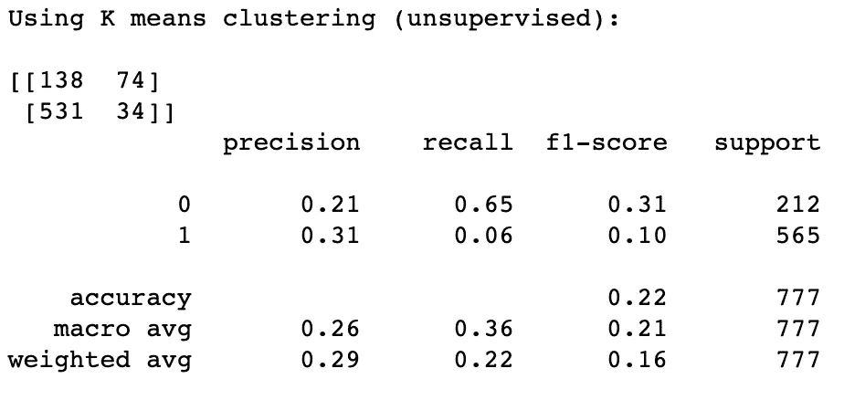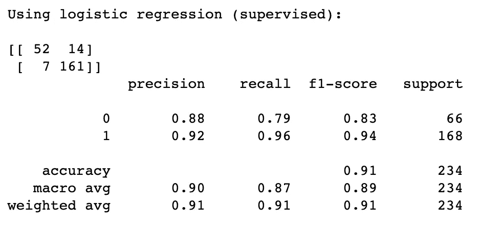

比较无监督和有监督学习模型的性能(在这种情况下是逻辑回归)。作者图片。

伙计们，看看标签的力量。使用一个简单的逻辑回归，一个监督学习模型，准确率从 **22%飙升到 91%** ，这可能可以通过选择另一个模型来提高。

希望你能开始明白 K 的意思是如何从混乱的数据中理出头绪的！使用探索性数据分析随意探索其他领域，看看您会发现什么！