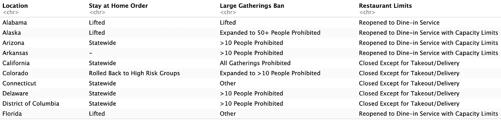
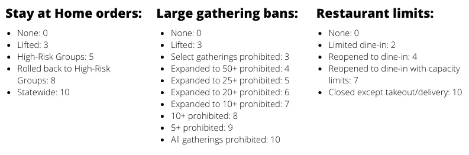
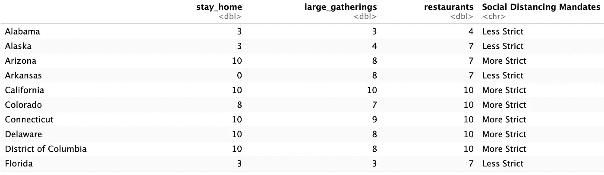
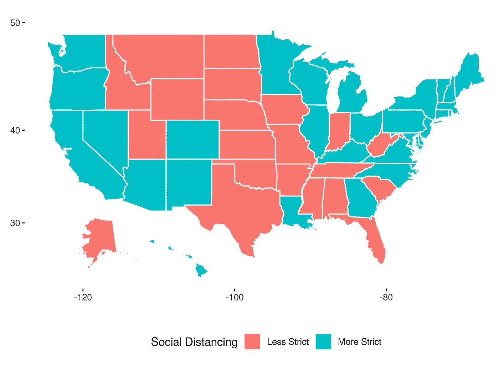

# 有序数据的 k-均值聚类

> 原文：<https://towardsdatascience.com/k-means-clustering-on-ordinal-data-7222b5ee1693?source=collection_archive---------37----------------------->

## 使用映射来揭示数据中类似数字的行为

图片由来自 [Pixabay](https://pixabay.com/?utm_source=link-attribution&amp;utm_medium=referral&amp;utm_campaign=image&amp;utm_content=259458) 的 [Reimund Bertrams](https://pixabay.com/users/8385-8385/?utm_source=link-attribution&amp;utm_medium=referral&amp;utm_campaign=image&amp;utm_content=259458) 拍摄

K——意思是聚类。这是无监督学习的圣杯。老实说。我明白为什么…当然，决定你应该计算的集群的数量*有一点艺术形式，但是总的来说，坐下来让算法做它的事情是不可思议的。尽管如此，有一个非常重要的警告: **k-means 聚类只对数值数据有效** … *对吗？！**

# 嗯…也许吧

一般来说，试图扩大 k-means 到分类应用是不稳定的。k-means 聚类最重要的部分是寻找它们之间具有最小*距离*的点。我们如何定义分类变量之间的距离？苹果离橘子有多远？那些更接近蓝莓还是西瓜？在无序的上下文中，问这些问题是没有意义的。

## 但是如果我的分类数据是有序的呢？

哇，我很高兴你问了。正如你敏锐地指出的，在某些情况下，似乎应该有一种方法来回答这些问题。

最近，我在看一些来自 KFF 的数据，这些数据是关于美国为应对新冠肺炎病毒而实施的全州范围的社会距离指令。经过一番争论，下面是最初几行的样子:

(注:如果想看我扯皮分析这个数据集的全过程，可以在 [Github](https://github.com/ariel-j-w/social-distancing-effectiveness) 上查看我的 R 代码。)

例如，考虑留在家中订单属性。此属性描述了一个州是否有留在家中的命令，以及该命令会影响哪些人群。显然，没有秩序不同于全州秩序，全州秩序不同于仅适用于高风险人群的秩序。这里是重要的部分:*一个全州范围的命令似乎“更接近”一个只影响高风险人群的命令，而不是根本没有命令*。

似乎我们**应该**能够回答 k-means 聚类所需的问题。我们数据的自然排序有助于进一步分析。当然，它实际上不是数字数据，但它以一种大致数字的方式表现，那么是什么阻碍了我们将它视为数字数据呢？用 Hannah Montana 无处不在的话说，生活是由你创造的，所以让我们对有序数据执行 k-means 聚类成为可能！(没有？那不是她的原话吗？开枪吧。)

要点如下:为了使 k-means 在有序数据集上成为可能，我们将定义一个从有序数据到数值的映射。本质上，我们为每个因素级别分配权重，并使用这些权重来执行我们的分析。

(提醒:如果你的分类数据没有自然排序，这是一个坏主意。我们基本上是在*创造*数量级和数量级的概念，并把它们强加给我们的数据集。如果这对您的数据没有意义，您可能会对 [k-modes 集群](https://www.youtube.com/watch?v=b39_vipRkUo)感兴趣。)

对于我的数据，我有 3 个想要转换的属性。为了确保属性在聚类过程中同等重要，我确保每个属性的可能权重范围从 0 到 10。0 和 10 的精确选择并不像**确保所有属性具有相似数量级的想法那么重要。在定义映射时，这可能是需要记住的最重要的事情。**

> 为所有属性创建相似量级的标度是转换 k-means 分析的有序数据时要考虑的最重要的方面。

最后，我将我的映射定义如下:

将有序社会距离变量映射为数值

一旦定义了映射，我就对现在的数字变量进行了完整的 k-means 聚类分析。下面是我转换后的数据的一瞥:

转换后的序数数据，以及由 k-means 识别的聚类

这看起来效果很好:我的聚类均值彼此截然不同，三个变量的每个组合的散点图恰当地说明了聚类之间的界限。(查看 [Github](https://github.com/ariel-j-w/social-distancing-effectiveness) 上的代码了解全部细节。)说了这么多，做了这么多，我最终得到了以下的集群标识。

通过有序数据的 k-均值聚类确定的全州社会距离任务的分类

# 这是一种艺术形式，不是科学。

定义从序号到数值的映射是一个非常主观的过程。这在很大程度上取决于数据的细节，我认为除了关于如何选择映射的一般建议之外，不可能给出任何其他的建议。

在某些数据集中，有序数据的简单排序可能是最合适的。在其他情况下，比如我们的案例研究，可能需要一个更灵活的尺度。这种方法没有放之四海而皆准的方法，但我仍然相信它有潜力产生非常有价值的见解。