# K-Means 聚类——一个将它们全部分组的规则

> 原文：<https://towardsdatascience.com/k-means-clustering-one-rule-to-group-them-all-f47e00720ee7?source=collection_archive---------13----------------------->

*图片由* [Ellen Qin](https://unsplash.com/@ellenqin?utm_source=unsplash&utm_medium=referral&utm_content=creditCopyText) *上* [Unsplash](https://unsplash.com/s/photos/balls?utm_source=unsplash&utm_medium=referral&utm_content=creditCopyText)

**本文将尝试:**

*   用图形解释 K-Means 聚类的基础，这是一种无监督的机器学习算法
*   讨论寻找 **K** 的最佳值和团簇质心位置的方法

**你应该已经知道的:**

基础数学和欧几里德几何

在机器学习中，经常遇到的问题之一是将相似的数据分组在一起。你知道人们的收入水平，现在你想把收入水平相似的人分组在一起。你想知道谁是低收入人群，谁是高收入或非常高收入人群，你认为这有助于设计一个完美的营销策略。您有客户的购物数据，现在您想要将具有相似购物偏好的客户分组在一起，或者您是生物专业的学生，想要根据您手头的细胞数据了解哪些细胞具有相似的属性。

所有上述问题都属于称为聚类的无监督机器学习方法的范畴。虽然有许多聚类算法，但当谈到最简单的一个，奖项将授予 K-Means 聚类。为了理解该算法，让我们假设我们有以下数据:

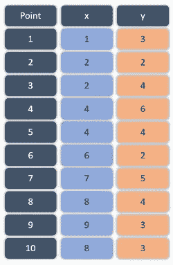

我们有十个数据点，给出了它们的 **x** 和 **y** 坐标。这里我们有表示为 **x** 和 **y** 的变量，但在实际情况中，它们可以是不同的，比如在市场细分情况下的**月收入**或**日支出**。让我们从两个集群开始，首先将上述数据可视化，以便对其有所了解:

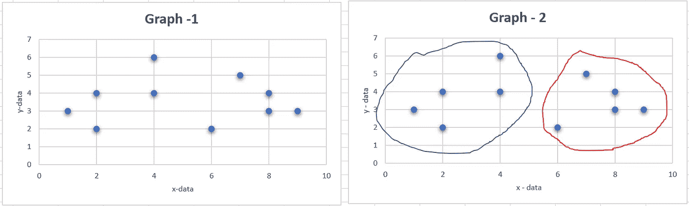

上图显示了我们手头的数据(图 1)和我们可以从中得出的两个可能的聚类(图 2)。请注意，在任何数据中查找集群数量(本例中为 2)的决定完全是任意的&基于随机猜测。稍后，您将发现这种随机猜测最初是如何引导我们找到数据中可能的最佳聚类数的。现在的问题是如何计算和分析找出这两个集群。

**方法背后的逻辑**

1.  首先，假设数据附近的任意两个随机点&将它们视为两个集群的中心(质心)
2.  找出每个数据点到两个中心的距离
3.  将每个数据点分配到离其最近的质心，从而形成两个聚类
4.  计算形成的两个簇的中心，并在那里移动质心。
5.  转到步骤 1，重复该过程，直到形成的簇没有变化。

让我们将上述逻辑应用于给定的数据。我们知道在笛卡尔坐标系中，两点(x1，y1)和(x2，y2)之间的距离由下式给出:

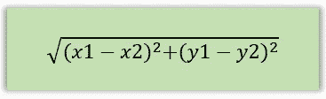

使用上面的公式，我们可以计算每个点与假设中心之间的距离。让我们假设我们的质心在 C1 = (4，1)和 C2 = (6，1)，从图形上来说，如下图所示:

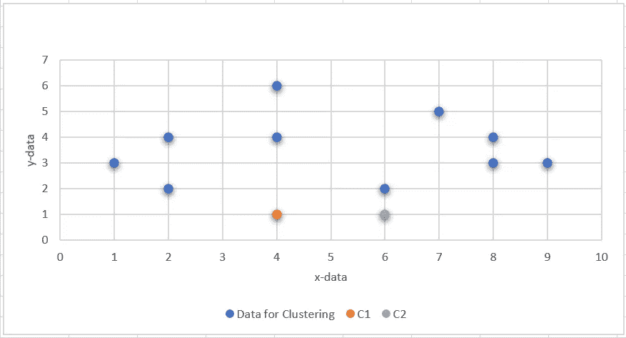

如果我们计算每个点到两个质心的距离，结果如下表所示:

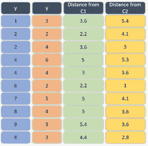

基于上述距离值，每个点将被分配到其距离最小或最近的质心，例如考虑第一个数据点，其距离 **C1** 为 3.6，距离 **C2** 为 5.4。由于它更靠近 C1，它将被分配到这个特定的质心。对每个点做同样的操作，分配如下所示:

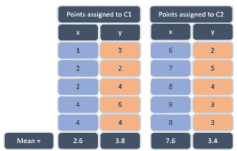

从上表可以看出，每个点都根据其与假定质心的距离被分配给一个质心。分配后，通过计算分配给每个簇的点的中心来计算质心的新位置，如表中所示，计算每个坐标的平均距离。因此，质心的新位置将是 C1 = (2.6，3.8)和 C2 = (7.6，3.4)，如下图所示:

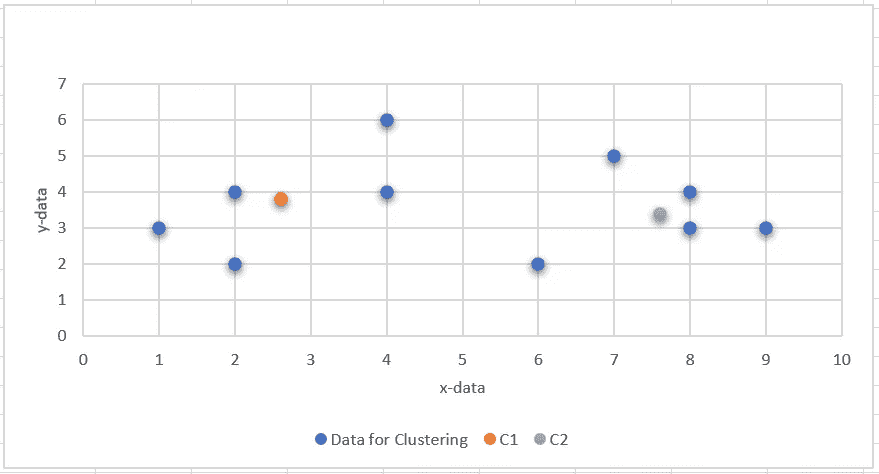

上图显示了单个计算循环是如何使两个质心更接近数据的。如果您运行另一个计算循环，您可以看到质心不再移动，并且没有数据点将其质心从 C1 改变到 C2，反之亦然。这是计算循环或递归停止的地方。

将数据分配给质心以使其成为聚类的上述过程被称为 K 均值聚类，并且 **K** 的值是所形成的聚类的数量，例如在当前情况下 **K** 的值将是 2。

最后两个集群如下所示:

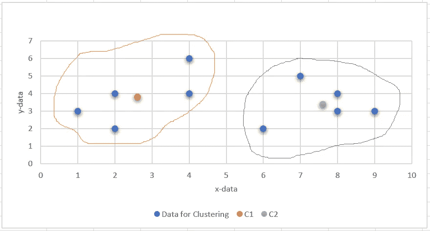

**如何决定 K 的值？**

我们从 K=2 的随机坐标开始，也就是说，我们给质心的数量和位置都分配了随机值。虽然我们最终找到了计算质心最终位置的方法，但仍然存在的问题是以最佳方式拟合给定数据的 **K** 的值是多少。我们也试图找到这个问题的答案，但首先让我们了解什么是成本函数。

**成本函数**

它是一个函数，给出了相对于每一个 **K** 值的模型缺陷的度量。理想情况下，聚类中的每个点应该尽可能靠近其质心，或者特定聚类中的每个点与其质心之间的距离应该为零。我们将计算这个距离&，将距离的平方和视为缺陷的成本或度量。我们将对每个集群重复同样的操作&将找到使该成本最小化的 **K** 的值。

参考表-1 和表-2，我们将每个点分类到一个簇中，并将这些点与它们各自质心的距离总结如下:

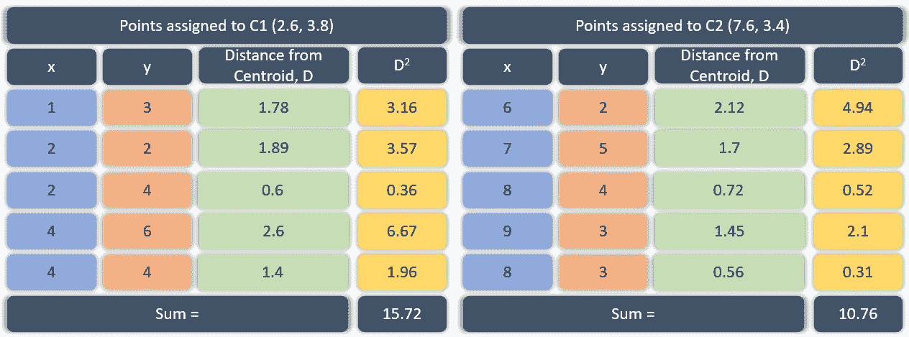

每个距离的平方相加，两个聚类的总和为 15.72 + 10.76 = 26.84。这个数字是我们设 K = 2 时模型的成本。同样，可以针对不同的 **K** 值计算成本，当成本值相对于 **K** 值绘制时，我们将得到如下所示的图表:

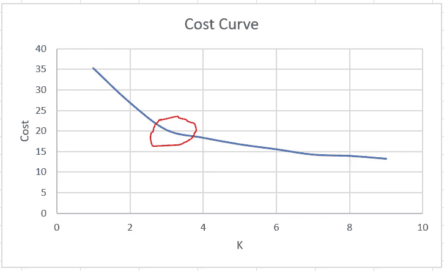

根据上图， **K** 的最佳值将是显示最大偏差(用红色标记)或成本曲线形成弯头的值。虽然较高的 K 值进一步降低了成本，但会导致过拟合。这种找出最佳值 **K** 的方法称为肘法。

到目前为止，我们所做的任何事情的 Python 代码如下所示:

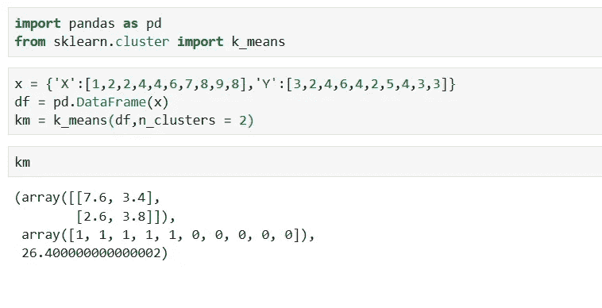

这都是关于 K-均值聚类&如何找出 K 的最佳值和质心的位置。希望你喜欢。请发表您的评论

**延伸阅读:**

*   [主成分分析](https://en.wikipedia.org/wiki/Principal_component_analysis)
*   DBSCAN

谢谢，

过得愉快😊

如果你对这篇文章有任何疑问，你可以通过 LinkedIn 联系我

*原载于 2020 年 4 月 10 日 https://wildregressor.com***。**