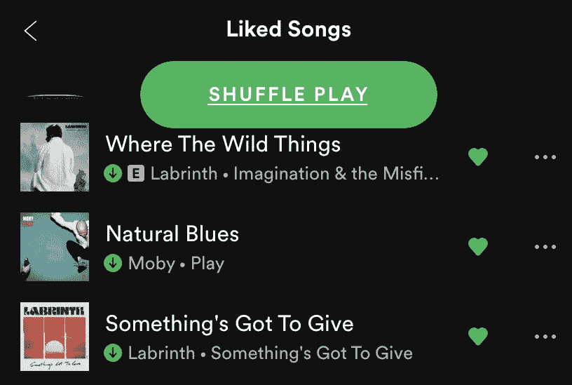
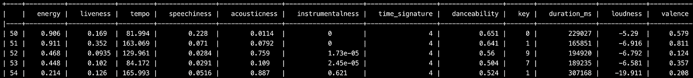
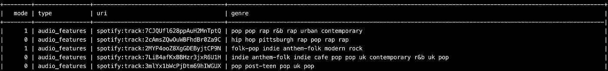
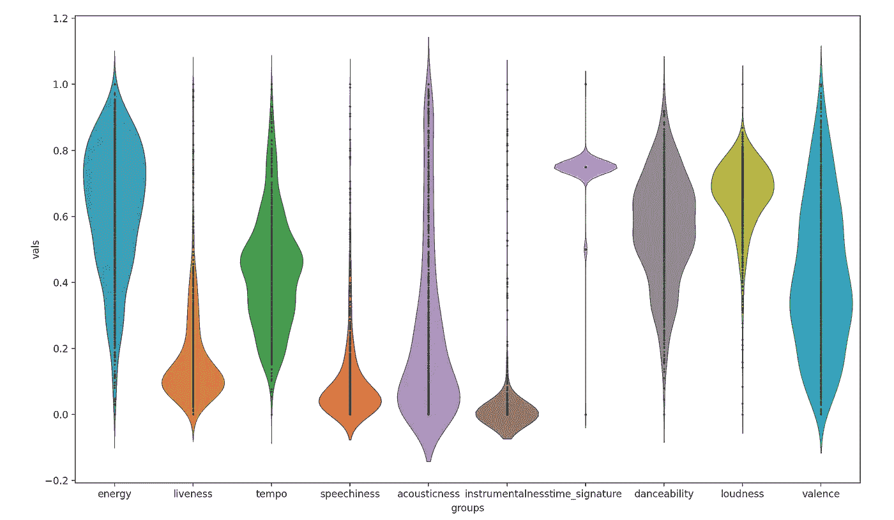
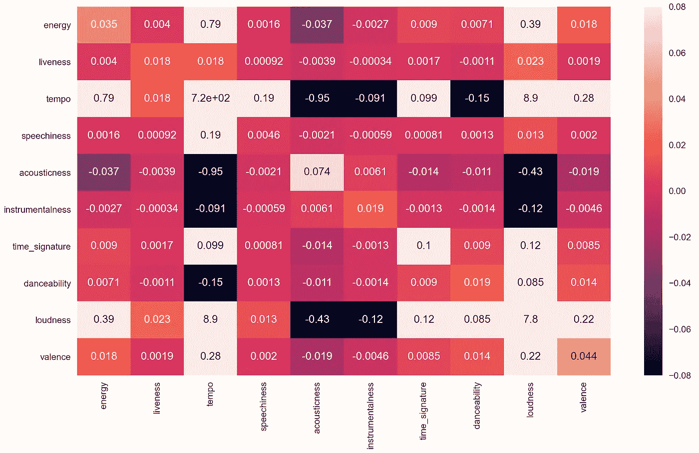
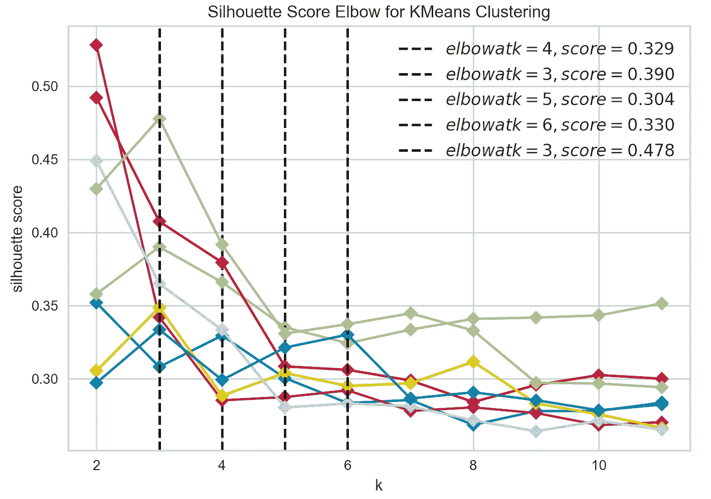
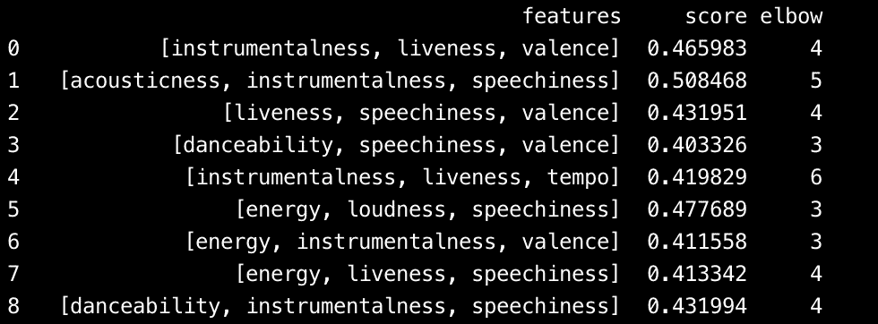
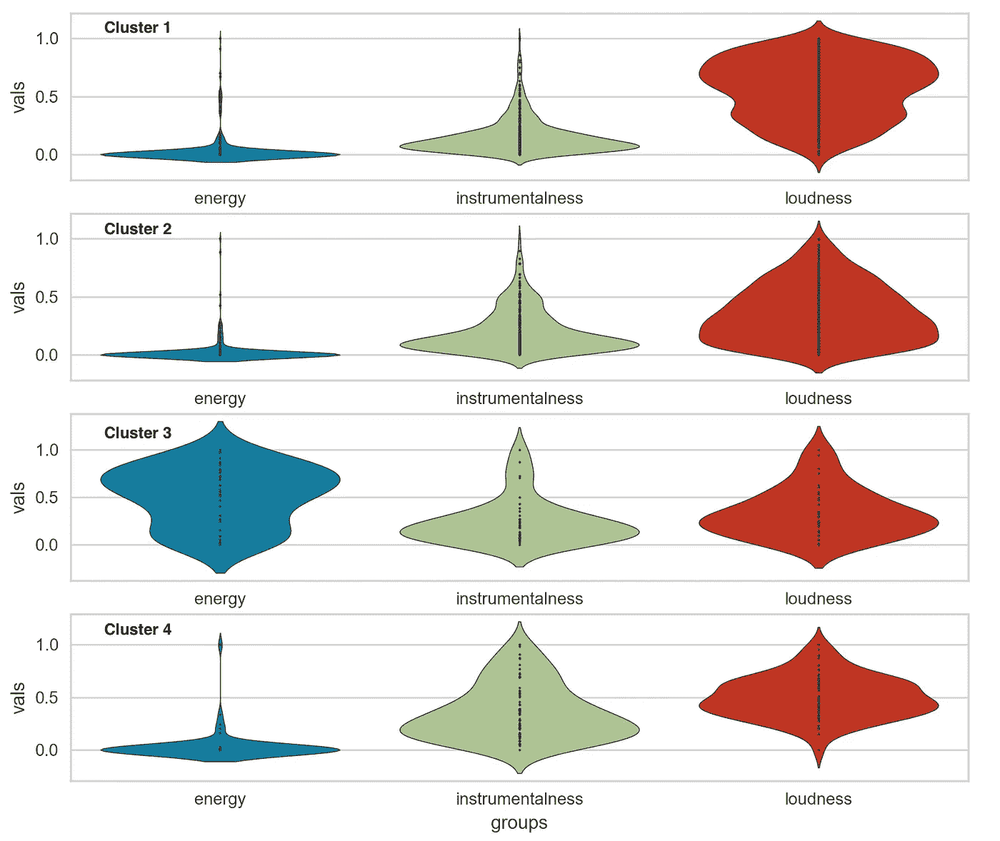
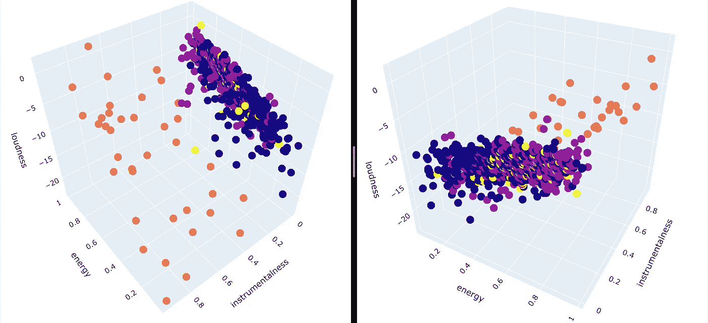

# 使用 Spotify 歌曲特征的 K-means 聚类

> 原文：<https://towardsdatascience.com/k-means-clustering-using-spotify-song-features-9eb7d53d105c?source=collection_archive---------16----------------------->

## *使用高维数据聚类自动创建播放列表*


由[马尔特·温根](https://unsplash.com/@maltewingen?utm_source=unsplash&utm_medium=referral&utm_content=creditCopyText)在 [Unsplash](https://unsplash.com/s/photos/music?utm_source=unsplash&utm_medium=referral&utm_content=creditCopyText) 上拍摄的照片

spotify API 允许我们创建一个简单的服务器端应用程序，从 spotify 应用程序中访问用户相关数据。它还可以让你获得应用程序上没有的信息，如艺术家受欢迎程度、歌曲指标、专辑封面图片等。它允许你创建、删除和修改用户帐户中的现有播放列表。

> 这个项目的目标是使用聚类算法将一个大的播放列表分解成更小的播放列表。为此，使用了歌曲度量标准，如“可跳性”、“效价”、“速度”、“活跃度”、“语速”。

## 在这篇文章中，你会发现:

*   使用 Spotify API 收集数据
*   寻找理想的集群数量
*   肘方法和轮廓分析
*   特征选择
*   聚类算法
*   播放列表创建和性能分析

如果您还不是会员，请在此获得您的中级会员资格[！](https://medium.com/@alejandra.vlerick/membership)

# 数据收集

```
import spotipy
from spotipy.oauth2 import SpotifyOAuth
from spotipy.oauth2 import SpotifyClientCredentials
```

连接 spotify API 非常简单，内容也有很好的文档记录。这个[链接](https://spotipy.readthedocs.io/en/latest/)将为您提供连接所需的所有信息，而[这个](https://developer.spotify.com/documentation/web-api/)将为您提供 python 示例代码。

前往[https://developer.spotify.com/dashboard/](https://developer.spotify.com/dashboard/)，点击**创建客户端 ID** 或**创建 App** ，获取您的“*客户端 ID* ”和“*客户端密码*”。之后，重定向 URI 必须被更改到你在 Spotify 应用程序的设置中决定的任何页面。

```
scope = "user-library-read playlist-modify-private"
OAuth = SpotifyOAuth(
        scope=scope,         
        redirect_uri='http://localhost:8888/callback',
        client_id = 'client_id',
        client_secret = 'client_secret',
        username= 'username')
```

变量“sp”将作为 spotify 数据的访问键，并允许我们使用所有功能来获取和发布 Spotify 的请求。

```
sp = spotipy.Spotify(auth_manager=OAuth)
```

# 保存的曲目数据收集

下一步是从我的“ ***喜欢的歌曲*** ”播放列表中收集数据。



API 一次只能提取 50 首歌曲，因此我们运行一个 while 循环，以 50 首为一组遍历整个播放列表。用来访问我个人喜欢的歌曲的函数是***current _ user _ saved _ tracks()。***

```
offset = 0songs = []
items = []
ids = []
while True:
    content = sp.current_user_saved_tracks(limit=**50,** offset=offset)
    songs += content['items']
    if content['next'] is not None:
        offset += **100** else:
        break
```

下面的步骤是使用 ***audio_features()*** 函数提取每首歌曲的音频特征:

```
for i in songs:
   ids.append(i['track']['id'])while index < len(ids):
    audio_features += sp.audio_features(ids[index:index + 50])
    index += 50features_list = []
for features in audio_features:
    features_list.append([features['energy']**,** features['liveness']**,** features['tempo']**,**features['speechiness']**,
                          ...** features['mode']**,** features['type']**,** features['uri']])

df = pd.DataFrame(features_list**,** columns=['energy'**,** 'liveness'**,** 'tempo'**,** 'speechiness'**,** ...'mode'**,** 'type'**,**'uri'])
```

结果是一个 pandas 数据帧，它收集了行上的歌曲和列上它们各自的特征。每首歌曲都由它唯一的 ***uri*** 来标识。



数据框的右侧



数据框的左侧

只是为了好玩，我决定查看播放列表中所有歌曲的特征值分布情况:



歌曲特征(标准化后):

我很快得出结论，这些指标之间没有很强的相关性。歌曲并没有根据它们的类型遵循固定的模式。当尝试基于所有 12 个特征执行聚类时，结果并不理想…为此，我决定使用较少数量的指标，并测试所有可能产生最佳聚类的特征组合。



不同指标之间没有真正的相关性…

# 寻找理想的集群数量

在对所有 12 个特征尝试聚类算法之前，我决定精选几个特征进行聚类，希望它能产生更好的聚类质量。

第一步是归一化所有的值，使它们位于[0；1].

```
from sklearn import preprocessingx = df.values 
min_max_scaler = preprocessing.MinMaxScaler()
x_scaled = min_max_scaler.fit_transform(x)
df = pd.DataFrame(x_scaled)
```

接下来的步骤是基于一些特征的选择找到一个聚类质量度量。我做的第一件事是创建一个包含所有歌曲指标的列表，然后使用 **permutations()** 函数创建一组当时使用三个歌曲特征的所有可能组合。

```
columns = ["energy"**,** "speechiness"**,** "acousticness"**,** "instrumentalness"**,** "loudness"**,**"tempo"**,**"danceability"**,**'valence' **,** "liveness", "time_signature", "key"]

perm = permutations(columns**, 3**)
output = set(map(lambda x: tuple(sorted(x))**,**perm))
```

对于每个排列，我使用**肘方法计算了一个聚类分数。**

> **肘法** *是一种启发式方法，用于确定数据集中的聚类数。* ***方法*** *包括绘制所解释的变异作为聚类数的函数，并拾取曲线的* ***【肘形】*** *作为聚类数来使用。*



x 轴为肘值，y 轴为分数。每条线对应不同的排列。

对于每个排列，我提取了一个肘分数和一个肘值。**分数**告诉我该排列的聚类有多好，**肘值**告诉我该排列的理想聚类数。

```
model = KMeans(random_state=**0**)
visualizer = KElbowVisualizer(model**,** k=(**2,12**)**,** metric='silhouette'**,** timings=False)
visualizer.fit(x_scaled)
score = visualizer.elbow_score_
value = visualizer.elbow_value_
```

结果是一个熊猫数据帧的特征排列和他们相应的理想数量的集群和质量评分这些集群。



一旦计算出每个排列的分数，我决定选择大于 0.4 的排列，并将它们保存在一个单独的数据框中。

```
if score>**0.4**:
    idx = df.columns
    mylist = idx.tolist()
    dict = {
        "features": mylist**,** "score": score**,** "elbow": value
    }
    df2 = df2.append(dict**,** ignore_index=True)
```

# 集群和播放列表创建

有许多排列产生了很好的结果，得分甚至超过 0.5。

排列**[‘工具性’，‘语音性’，‘化合价’]**建议创建 4 个集群，得分为 0.504。这是我在创建播放列表时选择的一个。

我缩放了一个只包含这三个指标的数据帧，然后使用 **KMeans()** 函数执行了聚类。

```
from sklearn.cluster import KMeanskmeans = KMeans(init="k-means++"**,** n_clusters=**4,** random_state=**15,** max_iter = **500**).fit(x_scaled)
df1['kmeans'] = kmeans.labels_
df1.columns = ['energy'**,** 'instrumentalness'**,** 'loudness'**,**'kmeans' ]
```

结果是数据帧包含每行一首歌曲，标签[0，1，2，3]对应于特定歌曲被分配到的每个簇。**特征分布清楚地表明，能量和响度在所有集群中分布不同。**



3D 散点图给出了不同的视角，显示了较高的乐器度值被分类到相同的群中，而能量和响度区分了其余三个群。



聚类的三维散点图

# 非常感谢你的阅读！

更多类似的文章，请点击在 Medium [上找到我！](https://towardsdatascience.com/medium.com/@alejandra.vlerick)

如果您有任何关于如何改进的**问题**、**建议**或**想法**，请在下面留下评论或通过 LinkedIn [这里](https://www.linkedin.com/in/alejandra-g-283595b8)取得联系。


照片由[威廉·冈克尔](https://unsplash.com/@wilhelmgunkel?utm_source=unsplash&utm_medium=referral&utm_content=creditCopyText)在 [Unsplash](https://unsplash.com/s/photos/thank-you?utm_source=unsplash&utm_medium=referral&utm_content=creditCopyText) 上拍摄

# Github 知识库

所有的代码都可以在 Github [这里](https://github.com/alejandra-gutierrez/SpotifyAPI)找到。排列脚本可以在 *analysis_v2.py* 中找到，聚类可以在 *feature_analysis.py* 中找到。