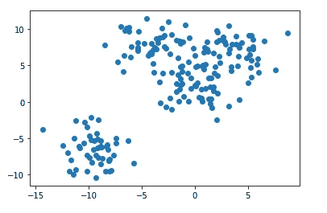
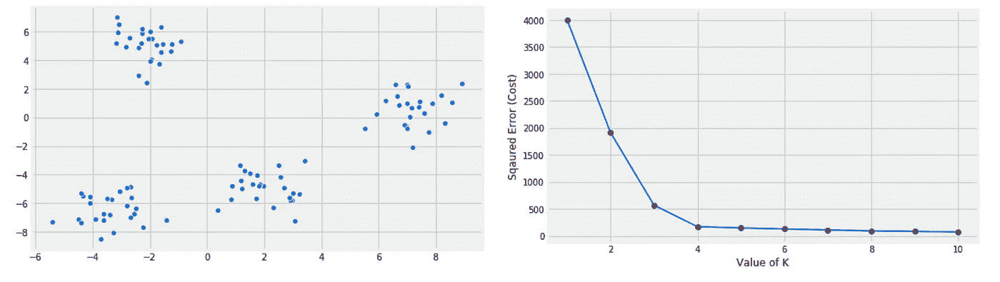
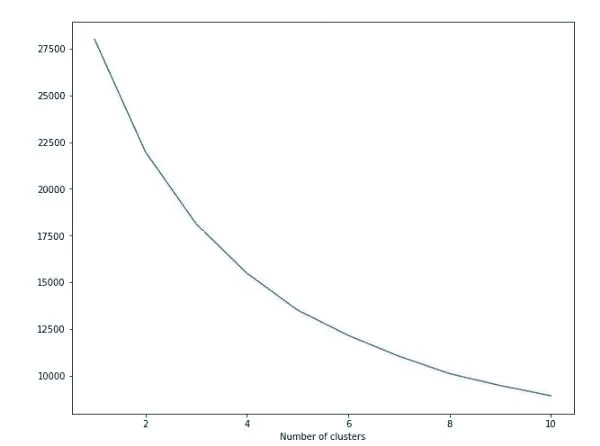
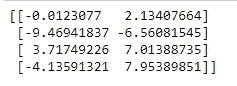
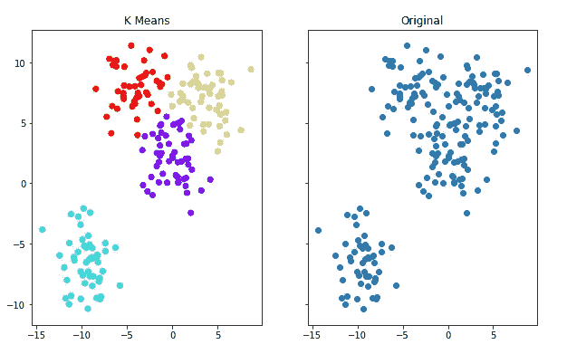

# k 表示使用 Python 进行集群

> 原文：<https://towardsdatascience.com/k-means-clustering-with-python-66288925e5f6?source=collection_archive---------30----------------------->

## 在本文中，我们将了解 K 均值聚类的基础知识，并使用著名的机器学习库 Scikit-learn 在 Python 中实现它


尼克尼斯在 [Unsplash](https://unsplash.com?utm_source=medium&utm_medium=referral) 上的照片

# 什么是 K 均值聚类？

**K 均值聚类**是一种**无监督机器学习算法**。它接收**混合数据**并且**基于**数据**中的**模式**将**数据分成小的**组/簇**。

# K 均值算法的目标

[**奥德里布**](https://www.education-ecosystem.com/andreybu/REaxr-machine-learning-model-python-sklearn-kera/oPGdP-machine-learning-model-python-sklearn-kera/) 曾经说过:

> K-means 的目标很简单:将相似的数据点组合在一起，发现潜在的模式。为了实现这个目标，K-means 在数据集中寻找固定数量的聚类( *k* )。

# K 均值聚类的工作原理

为了解释 **K 均值算法**的工作原理，让我们假设我们有一些使用**散点图**绘制出来的数据。



数据绘制在散点图上，照片由作者提供

现在在**稍微分析**数据之后，我们可以看到我们的数据可以分成两个独立的**组/簇**。现在， **K 表示**将要做的是，它还会**将**数据**划分为**两个簇**，并为每个**簇标记一些**边界**。**因此，每当一些新的**数据**被馈送到**模型**时，它将检查这个**数据点**落入了什么**边界**，并在最后告诉我们**集群的名称**或**编号。****

# k 均值聚类算法讲解

首先我们会选择**簇数(k)** (本例中 **k=2** )。这意味着现在我们将随机假设 **2 个点**，它们将作为我们的**簇质心**。(**簇形心**是**簇**的**中心点**)。

**K 均值聚类**有两个主要步骤:

*   **聚类分配步骤**:在该步骤中，靠近质心的数据点将分别落在那些质心聚类中。
*   **移动质心步骤**:在这一步中，我们将计算一个聚类中所有数据点的平均值，并将该聚类的质心移动到该平均值位置。

一旦后的**条件之一**为真:**，我们将**重复上述**两步******

1.  我们的质心停止改变位置。
2.  达到最大迭代次数。

我们的**数据**现在被安排到**簇中。**

# 选择 K 的值

为了选择最适合我们数据的**簇数**，我们可以使用著名的**肘法**。这种**肘方法**背后的基本思想是，它用**变化的集群数量(k)** 来绘制**成本(误差)**的各种值。随着**组数(k)** **增加**，每个组的**数据点数** **减少**。因此**平均失真减少**。**小于**一个**簇**中的**个数的数据点**，这些**数据点**离它们的**质心**越近**。所以 **k** 处**畸变下降**最大的值称为**拐点。****



选择合适的 **k** 值，作者照片

有时我们图的**斜率**是**相当平滑**所以**很难**选择 **k** 的值，因为没有明确的**拐点。**在这种情况下，我们利用我们的**行业经验**和**连续实验**来确定 k 的**值。**



没有清晰的**肘点**，作者照片

# 用 Python 实现

现在我们已经很好地理解了 **K 意味着聚类算法**是如何工作的。所以现在我们将在一个数据集**上实现 **K Means** 以获得关于它的更清晰的**直觉**。为此，我们将使用 **Python 的**著名的**机器学习库**、 **Scikit-learn。****

# 什么是 Scikit-learn？

**Scikit-learn** (又名 **sklearn** )是一个针对 Python 的机器学习库。它包括各种**分类**、**回归、**和**聚类算法**以及**支持向量机(SVM)** 、**随机森林**、**梯度提升**、**、 *k* -means** 和 **DBSCAN** ，并且被设计为与像 **NumPy** 、**这样的 Python 库一起工作**

# k 表示使用 Scikit-learn 进行聚类

**K 表示聚类**是一种非常直接且易于使用的**算法**。特别是在这个 **Scikit learn** 库的帮助下，它的实现和使用变得相当容易。现在，我们开始使用 **Sklearn** 。

***在 Python 中导入重要库***

```
import seaborn as sns
import matplotlib.pyplot as plt
```

***创建人工数据***

```
from sklearn.datasets import make_blobs
data = make_blobs(n_samples=200, n_features=2,centers=4, cluster_std=1.8,random_state=101)
```

***可视化我们的数据***

```
plt.scatter(data[0][:,0],data[0][:,1],c=data[1],cmap='rainbow')
```


可视化我们的数据，作者照片

***创建集群***

```
from sklearn.cluster import KMeans
kmeans = KMeans(n_clusters=4)
kmeans.fit(data[0])
```

现在，在从`sklearn.cluster`导入了`KMeans` 之后，我们创建了一个`KMeans`类的对象`kmeans`。在这里，你可能会发现**奇怪**的一点是我们指定了`n_clusters=4`。这是因为在创建**数据**时，我们指定了`centers=4`，所以我们知道该数据应该有 **4 个簇**。所以我们手动指定了它。但是如果我们不知道这些中心，那么我们将不得不使用**肘方法**来确定正确的星团数量。

好了，现在继续向前，我们的代码**的这`kmeans.fit(data[0])`段分析数据**，**使集群、**甚至**将每个**集群**的质心**匹配到它们的**适当位置**。

现在为了检查我们的**质心**的**位置**，我们可以使用下面的代码。

```
print(kmeans.cluster_centers_)
```

它会打印出一个 **(4，2)** **数组**，分别显示每个**簇**的**质心**的位置。



每个聚类的质心值，照片由作者提供

***应用 K 后对比原始数据集 VS 表示***

```
f, (ax1, ax2) = plt.subplots(1, 2, sharey=True,figsize=(10,6))
ax1.set_title('K Means')
ax1.scatter(data[0][:,0],data[0][:,1],c=kmeans.labels_,cmap='rainbow')
ax2.set_title("Original")
ax2.scatter(data[0][:,0],data[0][:,1])
```



*对比* ***原始数据集*** *VS 应用* ***K 表示*** *，作者照片*

**恭喜恭喜！**我们已经在我们的**数据集**上成功实现了 **K 均值聚类**。

# **学习成果**

到目前为止，我们已经了解了什么是 **K 均值聚类算法**，它的**工作**，以及**如何选择 K 的值**。另外，我们已经使用 **Python 的**著名的**机器学习库**，即 **Scikit-learn，在**数据集**上实现了 **K Means** 。**