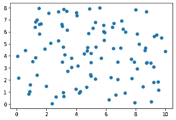
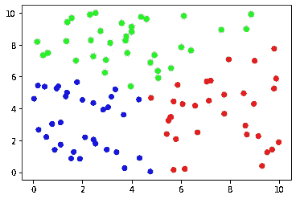
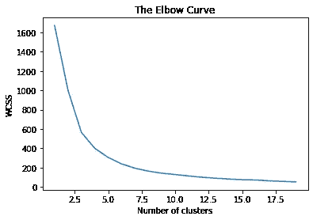

# k 表示用 python 代码解释的集群

> 原文：<https://towardsdatascience.com/k-means-clustering-with-python-code-explained-5a792bd19548?source=collection_archive---------3----------------------->

## *一种解决聚类问题的简化无监督学习算法*

k 均值聚类是机器学习中的另一种简化算法。它被归类为无监督学习，因为这里我们还不知道结果(不知道将形成哪个聚类)。该算法用于数据的*矢量量化*，取自信号处理方法。这里数据被分成几组，每组中的数据点都有相似的特征。这些聚类通过计算数据点之间的距离来决定。这个距离是众多无人认领的数据点之间关系的度量。

k 表示不应与 [**KNN 算法**](https://medium.com/@yogeshchauhan09/simplified-knn-algorithm-using-python-with-coding-explanation-ab597391b4c3) 混淆，因为二者使用相同的距离测量技术。这两种流行的机器学习算法有一个基本的区别。K means 处理数据，并将其分成不同的聚类/组，而 KNN 处理新的数据点，并通过计算最近邻方法将它们放入组中。数据点将移动到具有最大数量邻居的簇。



随机点数据集

**K 表示聚类算法步骤**

1.  在数据中选择随机数量的质心。即 k=3。
2.  在 2D 画布上选择与质心数量相同的随机点。
3.  计算每个数据点到质心的距离。
4.  将数据点分配到距质心距离最小的聚类中。
5.  重新计算新的质心。
6.  重新计算每个数据点到新质心的距离。
7.  重复从第 3 点开始的步骤，直到没有数据点改变其聚类。

k 表示将数据分成不同的簇，簇的数量等于 k 的值，即如果 k=3，则数据将被分成 3 个簇。k 的每个值都是质心，数据点将围绕质心聚集。


取自 rosalind.info 的欧氏距离图像

距离计算可以通过四种方法中的任何一种来完成，即欧几里得、曼哈顿、相关和艾森。这里，我们使用欧几里德方法进行距离测量，即两点(x1，y1)和(x2，y2)之间的距离为


以下是在机器学习中使用 k 均值聚类算法的一些优点和缺点

**优点:**

1.  一种相对简单的算法
2.  灵活，能够很好地处理大量数据
3.  保证了收敛

**缺点:**

1.  我们必须手动定义质心的数量
2.  无法避免离群值
3.  取决于所选质心的初始值

现在，我们将尝试用 python 语言创建一个算法。在这里，我们将调用一些基本的和重要的库来工作。

```
import pandas as pd
import numpy as np 
import matplotlib.pyplot as plt
from sklearn.cluster import KMeans
```

sklearn 是机器学习中最重要的包之一，它提供了最大数量的函数和算法。要使用 k 意味着聚类我们需要从 sklearn 包中调用它。

为了获得一个样本数据集，我们可以使用 numpy 生成一个随机序列

```
x1=10*np.random.rand(100,2)
```

通过上面的代码行，我们得到了一个包含 100 个点的随机代码，它们组成了一个形状为(100，2)的数组，我们可以使用这个命令来检查它

```
x1.shape
```

现在，我们将通过处理所有数据来训练我们的算法。这里，簇的数量将是 3。这个数字是我们任意给定的。我们可以选择任何数字来定义集群的数量

```
kmean=KMeans(n_clusters=3)
kmean.fit(x1)
```

使用下面的命令，我们可以看到我们的三个中心

```
kmean.cluster_centers_
```

要检查创建的标签，我们可以使用下面的命令。它给出了为我们的数据创建的标签

```
kmean.labels_
```



通过 k 均值聚类输出 3 个聚类

我们可以看到，由于手动选择质心的数量，我们的集群没有很大的分离。一个集群有一组相似的信息，我们的目标是使集群尽可能的独特。它有助于从给定的数据集中提取更多的信息。因此，我们可以绘制一条肘形曲线，它可以清楚地描述质心数量和信息增益之间的平衡。

```
wcss = []
for i in range(1,20):
 kmeans = KMeans(n_clusters=i,init=’k-means++’,max_iter=300,n_init=10,random_state=0)
 kmeans.fit(x1)
 wcss.append(kmeans.inertia_)
 print(“Cluster”, i, “Inertia”, kmeans.inertia_)
plt.plot(range(1,20),wcss)
plt.title(‘The Elbow Curve’)
plt.xlabel(‘Number of clusters’)
plt.ylabel(‘WCSS’) ##WCSS stands for total within-cluster sum of square
plt.show()
```

你可以看到有 **K-means++作为方法比传统的 K-means。前一种方法克服了人工选择时容易出现的质心选择错误的缺点。有时选择的质心离点太远，以至于在它们的簇中没有任何数据点。**

输出图可以帮助我们确定为更好的聚类选择的质心的数量。



确定质心实际数量的曲线

该曲线清楚地表明，如果我们选择质心的数量为 7、8、9 或 10，那么我们有更好的机会进行精细聚类。数据非常分散，我们甚至可以选择 14 作为质心的数量。这条曲线有助于在计算开销和从数据集获取知识之间做出决定。现在，让我们选择质心为 10，这样我们有 10 个独立的集群。


10 个由 K 均值聚类创建的聚类

**结论:**

我们已经成功地从随机数据集中创建了三个集群。所有数据分类以不同的颜色显示。我们可以使用相同的代码对其他数据进行聚类，甚至可以改变算法中聚类的数量。然后通过使用肘方法，我们预测更多的质心可以改善聚类。因此，在选择更多的聚类之后，我们得到了具有改进的信息增益的更好的聚类。