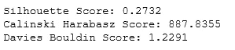
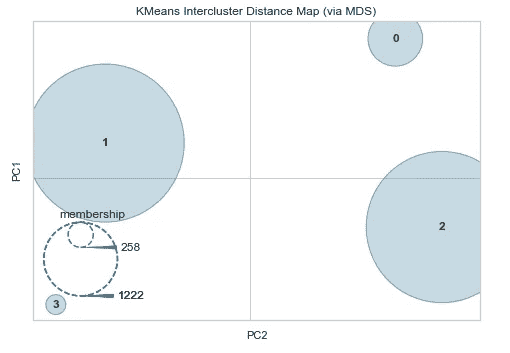
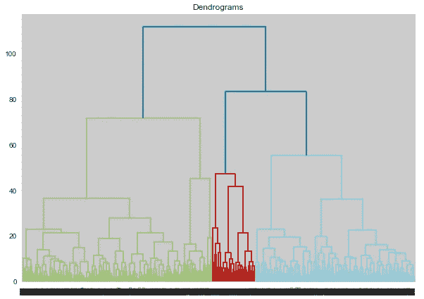
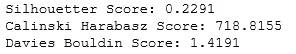
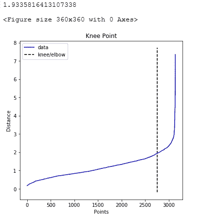
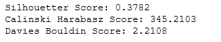
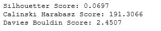
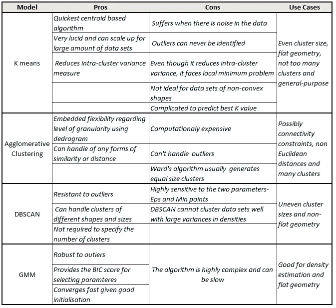

# K-means、DBSCAN、GMM、凝聚聚类——掌握细分问题中的流行模型

> 原文：<https://towardsdatascience.com/k-means-dbscan-gmm-agglomerative-clustering-mastering-the-popular-models-in-a-segmentation-c891a3818e29?source=collection_archive---------2----------------------->

## 为无监督聚类实现 python 中最广泛使用的模型的一站式商店


梅尔·普尔在 [Unsplash](https://unsplash.com/?utm_source=medium&utm_medium=referral) 上的照片

在当今时代，大量客户/产品的粒度数据的可用性以及高效处理数 Pb 数据的技术能力正在快速增长。正因为如此，现在有可能提出非常有战略意义和有意义的集群来进行有效的定位。并且识别目标分段需要稳健的分段练习。在这篇博客中，我们将讨论最流行的无监督聚类算法，以及如何用 python 实现它们。

在这篇博客中，我们将使用一家为孕妇提供服装的在线商店的点击流[数据](https://archive.ics.uci.edu/ml/datasets/clickstream+data+for+online+shopping)。它包括产品类别、照片在网页上的位置、IP 地址的来源国以及产品的美元价格等变量。它有 2008 年 4 月到 2008 年 8 月的数据。

*第一步是为分割准备数据。我建议您在继续下一步之前，查看下面的文章，以深入了解为分段准备数据的不同步骤:*

[*One Hot 编码、标准化、PCA:python 中分割的数据准备*](/one-hot-encoding-standardization-pca-data-preparation-steps-for-segmentation-in-python-24d07671cf0b)

*选择最佳聚类数是处理分割问题时需要注意的另一个关键概念。如果您阅读下面的文章，将有助于您理解选择集群的流行指标的完整列表:*

[*Python 中选择最佳聚类数的 7 种方法实现清单*](/cheat-sheet-to-implementing-7-methods-for-selecting-optimal-number-of-clusters-in-python-898241e1d6ad)

我们将在本博客中讨论 4 类模型:

1.  k 均值
2.  凝聚聚类
3.  基于密度的空间聚类
4.  高斯混合模型(GMM)

**K-表示**

K 均值算法是一个迭代过程，有三个关键阶段:

1.  **选择初始聚类质心**

该算法从选取初始的 k 个聚类中心开始，这些聚类中心被称为质心。确定最佳聚类数(即 k)以及正确选择初始聚类对于模型的性能极其重要。聚类的数量应该总是取决于数据集的性质，而初始聚类的不良选择会导致局部收敛的问题。幸运的是，我们对这两者都有解决方案。

有关选择最佳集群数量的更多详细信息，请参考这篇详细的[博客](/cheat-sheet-to-implementing-7-methods-for-selecting-optimal-number-of-clusters-in-python-898241e1d6ad)。对于初始聚类的选择，我们可以运行具有各种初始化的模型的多次迭代来挑选最稳定的一个，或者使用具有以下步骤的“k-means++”算法:

1.  *从数据集中随机选择第一个质心*
2.  *计算数据集中所有点与所选质心的距离*
3.  *选择一个点作为新的质心，该点具有与该距离成比例的最大概率*
4.  *重复步骤 2 和 3，直到 k 个质心被采样*

该算法将质心初始化为彼此远离，从而产生比随机初始化更稳定的结果。

2.**集群分配**

K-means 然后根据点和所有质心之间的欧几里德距离将数据点分配给最近的聚类质心。

**3。移动质心**

该模型最后计算聚类中所有点的平均值，并将质心移动到该平均位置。

重复步骤 2 和 3，直到聚类中没有变化或者可能满足一些其他停止条件(例如最大迭代次数)。

为了在 python 中实现模型，我们需要首先指定集群的数量。我们使用了肘方法、间隙统计、轮廓评分、Calinski Harabasz 评分和 Davies Bouldin 评分。对于这些方法中的每一种，最佳聚类数如下:

1.  肘法:8
2.  差距统计:29
3.  剪影评分:4
4.  卡林斯基·哈拉巴斯得分:2
5.  戴维斯·波尔丁得分:4

如上所述，5 种方法中有 2 种建议我们应该使用 4 个集群。如果每个模型建议不同数量的聚类，我们可以取平均值或中值。找到最佳 k 数的代码可以在[这里](https://github.com/IDB-FOR-DATASCIENCE/Segmentation-Modelling.git)找到，关于每种方法的更多细节可以在[博客](/cheat-sheet-to-implementing-7-methods-for-selecting-optimal-number-of-clusters-in-python-898241e1d6ad)中找到。

一旦我们有了最佳数量的聚类，我们就可以拟合模型，并使用 Silhouette 评分、Calinski Harabasz 评分和 Davies Bouldin 评分来获得模型的性能。

```
# K meansfrom sklearn.cluster import KMeans
from sklearn.metrics import silhouette_score 
from sklearn.metrics import calinski_harabasz_score
from sklearn.metrics import davies_bouldin_score# Fit K-Means
kmeans_1 = KMeans(n_clusters=4,random_state= 10)# Use fit_predict to cluster the dataset
predictions = kmeans_1.fit_predict(cluster_df)# Calculate cluster validation metricsscore_kemans_s = silhouette_score(cluster_df, kmeans_1.labels_, metric='euclidean')score_kemans_c = calinski_harabasz_score(cluster_df, kmeans_1.labels_)score_kemans_d = davies_bouldin_score(cluster_df, predictions)print('Silhouette Score: %.4f' % score_kemans_s)
print('Calinski Harabasz Score: %.4f' % score_kemans_c)
print('Davies Bouldin Score: %.4f' % score_kemans_d)
```



图 1:K-Means 的聚类验证指标(作者图片)

我们还可以使用簇间距离图来检查簇的相对大小和分布。

```
# Inter cluster distance map
from yellowbrick.cluster import InterclusterDistance# Instantiate the clustering model and visualizervisualizer = InterclusterDistance(kmeans_1)visualizer.fit(cluster_df)        # Fit the data to the visualizer
visualizer.show()        # Finalize and render the figure
```



图 2:聚类间距离图:K 均值(图片由作者提供)

如上图所示，两个集群相对于其他集群来说相当大，并且它们之间似乎有适当的间隔。然而，如果两个聚类在 2D 空间重叠，这并不意味着它们在原始特征空间重叠。关于这款车型的更多细节可以在[这里](https://projecteuclid.org/euclid.bsmsp/1200512992)找到。最后，K-means 的其他变体，如小批量 K-Means，K-Medoids 将在单独的博客中讨论。

# 凝聚聚类

凝聚聚类是一类通用的聚类算法，它通过连续合并数据点来构建嵌套聚类。这种聚类层次结构可以表示为一个树形图，称为树状图。树的顶部是包含所有数据点的单个聚类，而底部包含各个点。以连续方式链接数据点有多种选择:

*   **单连锁:**它**最小化成对聚类的最近观测值之间的距离**
*   **完全或最大关联:**试图最小化成对聚类的观测值之间的最大距离
*   **平均关联:**最小化所有聚类对之间的平均距离
*   **Ward:** 类似于 k-means，因为它最小化了所有聚类内的平方差之和，但采用了分层方法。我们将在练习中使用该选项。

通过基于聚类验证指标(Silhouette 评分、Calinski Harabasz 评分和 Davies Bouldin 评分)检查哪种连锁方法表现最佳，可以挑选出理想的选项。与 K-means 相似，我们必须指定该模型中的聚类数，树状图可以帮助我们做到这一点。

```
# Dendrogram for Hierarchical Clustering
import scipy.cluster.hierarchy as shc
from matplotlib import pyplot
pyplot.figure(figsize=(10, 7))  
pyplot.title("Dendrograms")  
dend = shc.dendrogram(shc.linkage(cluster_df, method='ward'))
```



图 3:树状图(图片由作者提供)

从图 3 中，我们可以看到我们可以选择 4 或 8 个集群。我们还使用肘方法、剪影得分和 Calinski Harabasz 得分来寻找最佳聚类数，并得到以下结果:

1.  肘法:10
2.  戴维斯·波尔丁得分:8
3.  剪影评分:3
4.  卡林斯基·哈拉巴斯得分:2

我们将按照戴维斯·波尔丁评分和树状图的建议进行 8 分。如果指标给出了不同的集群数量，我们可以继续使用树状图建议的数量(因为它是基于这个特定的模型),或者取所有指标的平均值/中值。寻找最佳集群数量的代码可以在这里[找到](https://github.com/IDB-FOR-DATASCIENCE/Segmentation-Modelling.git)，关于每种方法的更多细节可以在这个[博客](/cheat-sheet-to-implementing-7-methods-for-selecting-optimal-number-of-clusters-in-python-898241e1d6ad)中找到。

与 K-means 类似，我们可以用最佳的集群数量和链接类型来拟合模型，并使用 K-means 中使用的三个指标来测试其性能。

```
# Agglomerative clustering
from numpy import unique
from numpy import where
from sklearn.cluster import AgglomerativeClustering
from matplotlib import pyplot# define the model
model = AgglomerativeClustering(n_clusters=4)
# fit model and predict clusters
yhat = model.fit(cluster_df)
yhat_2 = model.fit_predict(cluster_df)
# retrieve unique clusters
clusters = unique(yhat)# Calculate cluster validation metricsscore_AGclustering_s = silhouette_score(cluster_df, yhat.labels_, metric='euclidean')score_AGclustering_c = calinski_harabasz_score(cluster_df, yhat.labels_)score_AGclustering_d = davies_bouldin_score(cluster_df, yhat_2)print('Silhouette Score: %.4f' % score_AGclustering_s)
print('Calinski Harabasz Score: %.4f' % score_AGclustering_c)
print('Davies Bouldin Score: %.4f' % score_AGclustering_d)
```



图 4:聚类验证指标:聚集聚类(作者图片)

比较图 1 和图 4，我们可以看到，基于所有的聚类验证指标，K-means 优于凝聚聚类。

# 基于密度的空间聚类

DBSCAN 将紧密聚集在一起的点组合在一起，同时将其他点标记为孤立在低密度区域中的异常值。定义“密度”需要模型中的两个关键参数:形成密集区域所需的最小点数`min_samples`和定义邻域的距离`eps`。更高的`min_samples`或更低的`eps`需要更大的密度来形成集群。

基于这些参数，DBSCAN 从任意点 x 开始，根据`eps`识别 x 邻域内的点，并将 x 分类为以下类型之一:

1.  **核心点**:如果邻域内的点数至少等于`min_samples`参数，则称之为核心点，并在 x 周围形成一个聚类。
2.  **边界点**:如果 x 是具有不同核心点的聚类的一部分，但其邻域内的点数小于`min_samples`参数，则 x 被视为边界点。直观上，这些点位于星团的边缘。

3.**异常值或噪声**:如果 x 不是核心点，且与任何核心样本的距离至少等于或大于`eps`，则认为是异常值或噪声。

为了调整模型的参数，我们首先通过找到一个点的相邻点之间的距离并绘制最小距离来确定最佳的`eps`值。这给了我们找到数据点密度的肘形曲线，并且可以在拐点找到最佳的`eps`值。我们使用`NearestNeighbours`函数来获得最小距离，使用`KneeLocator`函数来识别拐点。

```
# parameter tuning for eps
from sklearn.neighbors import NearestNeighbors
nearest_neighbors = NearestNeighbors(n_neighbors=11)
neighbors = nearest_neighbors.fit(cluster_df)
distances, indices = neighbors.kneighbors(cluster_df)
distances = np.sort(distances[:,10], axis=0)from kneed import KneeLocator
i = np.arange(len(distances))
knee = KneeLocator(i, distances, S=1, curve='convex', direction='increasing', interp_method='polynomial')
fig = plt.figure(figsize=(5, 5))
knee.plot_knee()
plt.xlabel("Points")
plt.ylabel("Distance")print(distances[knee.knee])
```



图 5:每股收益的最佳值(图片由作者提供)

如上所示，`eps`的最佳值是 1.9335816413107338。我们将该值用于参数向前发展，并尝试根据剪影得分、Calinski Harabasz 得分和 Davies Bouldin 得分找到`min_samples`参数的最佳值。对于这些方法中的每一种，最佳聚类数如下:

1.  剪影得分:18
2.  卡林斯基·哈拉巴斯得分:29
3.  戴维斯·波尔丁得分:2

找到最佳数量`min_samples`的代码可以在[这里找到](https://github.com/IDB-FOR-DATASCIENCE/Segmentation-Modelling.git)，关于每种方法的更多细节可以在这个[博客](/cheat-sheet-to-implementing-7-methods-for-selecting-optimal-number-of-clusters-in-python-898241e1d6ad)中找到。我们继续采用建议的中间值，即侧影得分为 18。如果我们没有时间对这些指标进行网格搜索，一个快速的经验法则是将`min_samples`参数设置为特性数量的两倍。

```
# dbscan clustering
from numpy import unique
from numpy import where
from sklearn.cluster import DBSCAN
from matplotlib import pyplot
# define dataset
# define the model
model = DBSCAN(eps=1.9335816413107338, min_samples= 18)# rule of thumb for min_samples: 2*len(cluster_df.columns)# fit model and predict clusters
yhat = model.fit_predict(cluster_df)
# retrieve unique clusters
clusters = unique(yhat)# Calculate cluster validation metricsscore_dbsacn_s = silhouette_score(cluster_df, yhat, metric='euclidean')score_dbsacn_c = calinski_harabasz_score(cluster_df, yhat)score_dbsacn_d = davies_bouldin_score(cluster_df, yhat)print('Silhouette Score: %.4f' % score_dbsacn_s)
print('Calinski Harabasz Score: %.4f' % score_dbsacn_c)
print('Davies Bouldin Score: %.4f' % score_dbsacn_d)
```



图 6:集群验证指标:DBSCAN(作者图片)

比较图 1 和图 6，我们可以看到 DBSCAN 在轮廓得分上比 K-means 表现得更好。该模型在论文中描述为:

*   [一种基于密度的算法，用于在带有噪声的大型空间数据库中发现聚类](https://www.osti.gov/biblio/421283)，1996。

在另一篇博客中，我们将讨论更高级版本的 DBSCAN，称为基于层次密度的空间聚类(HDBSCAN)。

# 高斯混合模型(GMM)

高斯混合模型是一种基于距离的概率模型，它假设所有数据点都是由具有未知参数的多元高斯分布的线性组合生成的。像 K-均值一样，它考虑了潜在高斯分布的中心，但与 K-均值不同，它还考虑了分布的协方差结构。该算法实现了期望最大化(EM)算法，以迭代方式查找使模型质量度量(称为对数似然)最大化的分布参数。该模型中执行的关键步骤是:

1.  初始化 k 个高斯分布
2.  计算每个点与每个分布关联的概率
3.  根据与分布相关的每个点的概率重新计算分布参数
4.  重复该过程，直到对数似然最大化

在 GMM，有 4 种计算协方差的方法:

1.  **完整:**每个分布都有自己的一般协方差矩阵
2.  **并列:**所有分布共享一般协方差矩阵
3.  **Diag:** 每个分布都有自己的对角协方差矩阵
4.  **球形:**每个分布都有自己的单方差

除了选择协方差类型，我们还需要选择模型中的最佳聚类数。我们使用 BIC 评分、剪影评分、Calinski Harabasz 评分和 Davies Bouldin 评分来使用网格搜索选择两个参数。对于这些方法中的每一种，最佳聚类数如下:

1.  BIC 分数:协方差-“满”和聚类数- 26
2.  轮廓得分:协方差-“并列”和聚类数- 2
3.  Calinski Harabasz 得分:协方差-“球形”和聚类数- 4
4.  戴维斯·波尔丁得分:协方差-“满”和聚类数- 8

寻找最佳参数值的代码可以在[这里](https://github.com/IDB-FOR-DATASCIENCE/Segmentation-Modelling.git)找到，关于每种方法的更多细节可以在这个[博客](/cheat-sheet-to-implementing-7-methods-for-selecting-optimal-number-of-clusters-in-python-898241e1d6ad)中找到。我们选择协方差为“完全”,基于 BIC 评分的聚类数为 26，因为它是基于这个特定的模型。如果我们有来自多个指标的相似配置，我们可以取所有指标的平均值/中值/众数。我们现在可以拟合模型并检查模型性能。

```
# gaussian mixture clustering
from numpy import unique
from numpy import where
from sklearn.mixture import GaussianMixture
from matplotlib import pyplot
# define the model
model = GaussianMixture(n_components= 26,covariance_type= "full", random_state = 10)
# fit the model
model.fit(cluster_df)
# assign a cluster to each example
yhat = model.predict(cluster_df)
# retrieve unique clusters
clusters = unique(yhat)# Calculate cluster validation scorescore_dbsacn_s = silhouette_score(cluster_df, yhat, metric='euclidean')score_dbsacn_c = calinski_harabasz_score(cluster_df, yhat)score_dbsacn_d = davies_bouldin_score(cluster_df, yhat)print('Silhouette Score: %.4f' % score_dbsacn_s)
print('Calinski Harabasz Score: %.4f' % score_dbsacn_c)
print('Davies Bouldin Score: %.4f' % score_dbsacn_d)
```



图 7:集群验证指标:GMM(图片由作者提供)

比较图 1 和图 7，我们可以看到 K-means 在所有集群验证指标上都优于 GMM。在另一篇博客中，我们将讨论 GMM 的更高级版本，称为变分贝叶斯高斯混合。

# 结论

这篇博客的目的是帮助读者理解 4 种流行的聚类模型是如何工作的，以及它们在 python 中的具体实现。如下所示，每种模式都有其优缺点:



图 8:聚类算法的利与弊(图片由作者提供)

最后，重要的是要理解这些模型只是一种手段，用于找到合理的、易于理解的、可以有效定位的客户/产品细分市场。因此，在大多数实际情况下，我们将最终尝试多种模型，并从每次迭代中创建客户/产品档案，直到我们找到最具商业意义的细分市场。因此，分段既是一门艺术也是一门科学。

你对这个博客有什么问题或建议吗？请随时留言。

# 感谢您的阅读！

如果你和我一样，对人工智能、数据科学或经济学充满热情，请随时添加/关注我的 [LinkedIn](http://www.linkedin.com/in/indraneel-dutta-baruah-ds) 、 [Github](https://github.com/IDB-FOR-DATASCIENCE) 和 [Medium](https://medium.com/@indraneeldb1993ds) 。

# 参考

1.  Ester，M .，Kriegel，H . P .，Sander，J .，，Xu .*一种基于密度的算法，用于在带有噪声的大型空间数据库中发现聚类*。美国:不扩散条约，1996 年。网络。
2.  多变量观察的分类和分析的一些方法。第五届伯克利数理统计和概率研讨会会议录，第 1 卷:统计，281–297，加州大学出版社，伯克利，加利福尼亚州，1967 年。[https://projecteuclid.org/euclid.bsmsp/1200512992](https://projecteuclid.org/euclid.bsmsp/1200512992)
3.  [sci kit-learn:Python 中的机器学习](http://jmlr.csail.mit.edu/papers/v12/pedregosa11a.html)，Pedregosa *等人*，JMLR 12，第 2825–2830 页，2011 年。