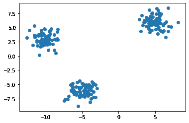
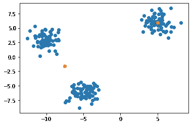
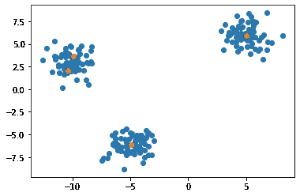
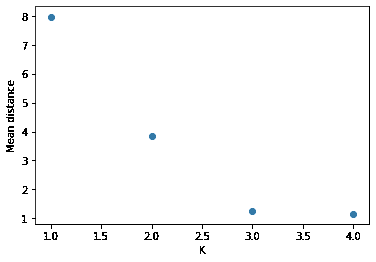
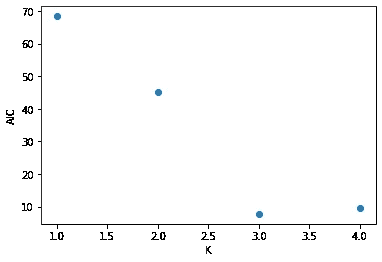

# k-意味着用 NumPy 从头开始

> 原文：<https://towardsdatascience.com/k-means-from-scratch-with-numpy-74f79d2b1694?source=collection_archive---------18----------------------->

## 使用这种快速简单的聚类算法回归基础


图片来自 [unsplash](https://unsplash.com/photos/0vV4SEdf4gI)

K-means 是最简单的聚类算法。它很容易理解和实现，当试图理解无监督学习的世界时，这是一个很好的起点。

无监督学习指的是机器学习的整个子领域，其中数据没有标签。我们不是训练一个模型来预测标签，而是希望揭示数据中的某种潜在结构，否则这些结构可能不明显。

## 它是如何工作的？

K-means 从假设数据可以分成 K 个不同的簇开始。每个聚类的特征在于与该聚类相关的点的平均值(因此得名… K-means)。

识别 K 个不同装置位置的程序如下:

1.  **随机分配**数据中的每个点到一个簇中
2.  **计算分配给特定聚类的每个点的平均值**
3.  对于每个点，**根据最接近该点的平均值更新分配的平均值**。
4.  重复步骤 2 和 3，直到平均值收敛到恒定值。

## 来实施吧！

为了便于跟踪不同的点以及它们之间的关联，让我们构建一个小类(注意，同样的事情可以通过命名元组或字典轻松实现)。

```
import numpy as npK = 3class point():
    def __init__(self, data):
        self.data = data
        self.k = np.random.randint(0,K)

    def __repr__(self):
        return str({"data":self.data, "k":self.k})
```

也不需要`__repr__`函数，但它有助于查看引擎内部发生了什么。

现在我们需要一些模拟数据来玩:

```
N = 200
data1 = np.random.randn(N//3,2) + np.array([5,6])
data2 = np.random.randn(N//3,2) + np.array([-5,-6])
data3 = np.random.randn(N//3,2) + np.array([-10,3])
data = np.concatenate((data1, data2, data3))
```

绘制如下图:



用 3 个集群模拟数据

## 第一步:随机分配

当我们为每个数据点实例化类时，我们的类通过随机选择一个指定的平均值来处理这个问题。

```
points = [point(d) for d in data]
```

## 第二步:计算平均值

为了完成这一步，我们需要构建两个函数。一个创建分配给每个分类的点的列表，另一个计算每个分类的平均值。我们可以使用如下的`collections.defaultdict`实现第一个:

```
from collections inport defaultdictdef make_k_mapping(points):
    point_dict = defaultdict(list)
    for p in points:
        point_dict[p.k] = point_dict[p.k] + [p.data]
    return point_dict
```

然后是第二个功能:

```
def calc_k_means(point_dict):
    means = [np.mean(point_dict[k],axis=0) for k in range(K)]
    return means
```

## 步骤 3:更新点群分配

现在我们需要计算距离，并根据最接近的聚类平均值更新关联的聚类。

```
def update_k(points,means):
    for p in points:   
        dists = [np.linalg.norm(means[k]-p.data) for k in range(K)]
        p.k = np.argmin(dists)
```

## 训练循环

现在，我们只需要将这些函数组合在一个循环中，为我们的新聚类算法创建一个训练函数。

```
def fit(points, epochs=10):
    for e in range(epochs):
        point_dict = make_k_mapping(points)
        means = calc_k_means(point_dict)
        update_k(points, means)
    return means, pointsnew_means, new_points = fit(points)
```

如果我们把新的方法和原始点一起画出来，我们会得到这样的结果:


聚类和原始数据

## 参数调谐

对于你们当中目光敏锐的人来说，你们会意识到我们从一开始就选择了正确的集群数量。如果我们选择 K 大于或小于 3，我们会有一个较差的数据拟合。



K = 2



K = 4

这就引出了一个问题，我们如何更好地量化模型的拟合度？一个自然的选择是计算一个点与其聚类平均值的平均距离。考虑到点被分配给具有欧几里德距离的簇，使用这个作为性能的度量看起来是一个合理的选择。

```
def evaluate(points):
    point_dict = make_k_mapping(points)
    means = calc_k_means(point_dict)
    dists = [np.linalg.norm(means[p.k]-p.data) for p in points]
    return np.mean(dists)
```



作为 K 的函数的平均距离

表面上看起来是可行的，但仍然有一个问题，K = 4 的平均距离小于 K = 3。仔细想想，这很有意义，每个数据点都有一个聚类，平均距离为 0。然而，这显然是一个过度拟合数据的模型。

对此的一个解决方案被称为 Akaike 信息标准(AIC)。该度量以模型参数的数量来惩罚模型的可能性。

对于 K-means，AIC 是点与其分配的均值之间的平方距离之和，由训练参数的数量决定。这来自于假设每个聚类是具有单位协方差的高斯分布。K 均值模型的训练参数的数量是`K * d`，其中`d`是维度的数量。



K 均值的 AIC

这个图有一个明确的最小值 3，这正是我们想要的！

## 我们学到了什么？

所以在这里，我们已经了解了 K-means 如何工作，如何用 NumPy 构建模型，以及如何训练它。我们还研究了一些评估模型性能的潜在方法，以及如何使用模型参数的数量来惩罚评估指标。

K-means 是一种轻量级但功能强大的算法，可用于解决许多不同的聚类问题。现在您知道它是如何工作的，以及如何自己构建它了！