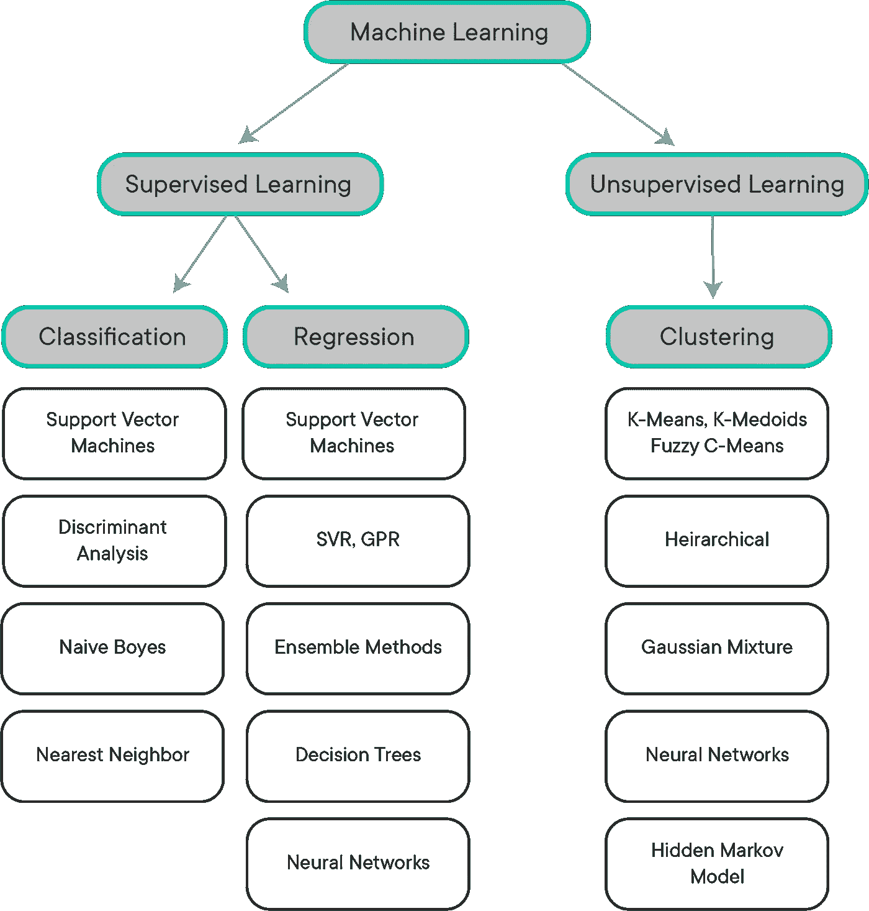
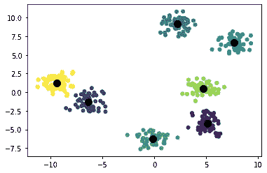
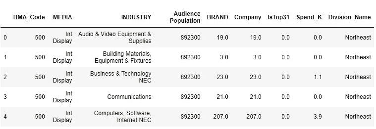
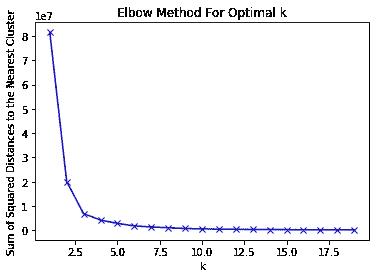
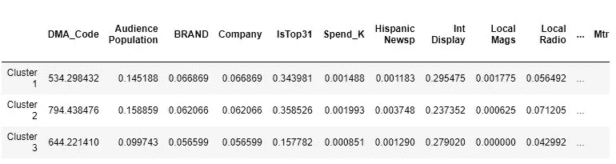
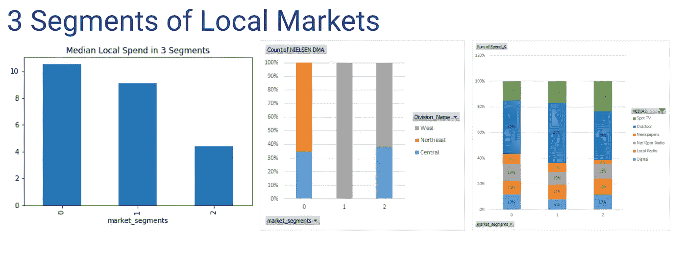

# 营销分析中的 K-Means:聚类 210 个美国 DMA

> 原文：<https://towardsdatascience.com/k-means-in-marketing-analysis-clustering-210-us-dmas-deb9e60e3fe5?source=collection_archive---------30----------------------->

## 从头到尾的 K-Means 聚类分析


佩德罗·拉斯特拉在 [Unsplash](https://unsplash.com/s/photos/chicago?utm_source=unsplash&utm_medium=referral&utm_content=creditCopyText) 上的照片

当我可以将机器学习技术应用于日常营销问题时，这让我非常兴奋。给你一些背景，我在一家大型广告公司工作，我的一些客户是美国的顶级广告商，他们的产品和服务覆盖整个国家，他们有很多营销预算要花(每年大约 9 位数！).所以我们的工作就是帮助他们聪明高效地花钱！

挑战之一是为所有当地市场制定战略，即 DMA(**DMA**代表“**指定市场区域**”，也可能被称为媒体市场)。美国有 210 个 DMA，你当然可以按地区划分，或者简单地按西部、东部和中部划分。然而，考虑到大区域内的人口统计和经济差异，我们可能希望使用一些更数据驱动的方式来查看所有这些 DMA。因此，今天我将使用聚类来获得几个市场聚类，每个聚类中具有最大的相似性。

在深入细节之前，我想给你看一下我在探索机器学习时最喜欢的图表。



聚类属于**无监督学习**的分支，该分支在没有预先存在标签的数据集中寻找以前未检测到的模式。聚类背后的主要思想是，您希望以一种方式将对象分组到相似的类中，即同一组的成员之间的相似性高，而不同组的相似性低。

最流行和最广泛使用的算法是 **K-Means 聚类算法。**k-means 聚类算法是一种迭代算法，在未标记的数据集中达到预定数量的聚类，基本工作方式如下:

1.  选择𝑘初始种子
2.  将每个观察值分配给具有最近平均值(最小平方欧几里得距离)的聚类
3.  为分配给每个聚类的观测值重新计算聚类质心
4.  继续迭代，直到质心没有变化



k 表示聚类示例(k = 7)

对于 k-means 聚类算法来说，两个假设非常重要:

1.  要计算“聚类中心”，需要计算属于该聚类的所有点的(算术)平均值。在每次新的迭代开始时，重新计算每个聚类中心
2.  在重新计算聚类中心之后，如果给定点现在比其当前聚类的中心更靠近不同的聚类中心，则该点被重新分配给最近的中心

我将用一个营销支出数据集来演示它在 Python 中是如何工作的，这个数据集是我从一家研究公司 Kantar 收集的，它是过去两年中排名前 30 位的科技公司的数据。

```
market.head(5)
```



**数据字典**

*   市场:指定市场区域(DMA)是指人们可以接收相同电视和广播电台节目的区域，也可能包括其他类型的媒体，包括报纸和互联网内容
*   媒体:10 种常见媒体类型，包括电视、广播、户外、数字等。
*   观众人口:12 岁以上的电视/广播观众人口
*   公司/品牌:在该市场做广告的公司/品牌数量
*   IsTop31:电信行业对市场重要性的主观分类。0 表示不是前 31 名市场，1 表示前 31 名市场
*   Spend_K:以千美元计的媒体支出(000)

**预处理分类值**

```
#Change MARKETS to categorical 
market['DMA_Code']=market['DMA_Code'].astype('category')#One Hot Encoding for Media and Industryfrom sklearn.preprocessing import LabelBinarizerdef labelcoder(data, column):
    onehot = data.copy()
    lb=LabelBinarizer()
    lb_results = lb.fit_transform(onehot[column])
    lb_results_df = pd.DataFrame(lb_results, columns=lb.classes_)
    return lb_results_dfmedia_features = labelcoder(market, 'MEDIA')
industry_features = labelcoder(market, 'INDUSTRY')
division_features = labelcoder(market, 'Division_Name')#Put them all together
market_df = pd.concat([market['DMA_Code'],scaled_features, media_features, industry_features, division_features], axis=1)
```

**标准化数字特征**

```
num_features = market[['Audience Population','BRAND','Company','IsTop31','Spend_K']]from sklearn.preprocessing import MinMaxScaler
#Scale the numerical features
scaler = MinMaxScaler()
scaled = scaler.fit_transform(num_features)
scaled_features = pd.DataFrame(scaled, columns = num_features.columns)
```

## **设置 K-Means**

**用肘法求最优 K**

这一步非常重要，因为我们不仅想要任意数量的聚类，还想要找到尽可能多地分隔数据点而不引入整体复杂性的 K 的数量。常用的度量是**惯性——样本到其最近聚类中心的平方距离之和**

```
import matplotlib.pyplot as plt
from sklearn.cluster import KMeanssum_of_squared_distances = []K = range(1,20)
for k in K:
    km = KMeans(n_clusters=k) 
    km = km.fit(market_df)
    sum_of_squared_distances.append(km.inertia_) plt.plot(K, sum_of_squared_distances, 'bx-')
plt.xlabel('k')
plt.ylabel('Sum of Squared Distances to the Nearest Cluster')
plt.title('Elbow Method For Optimal k')
plt.show()
```



如上图所示，收益递减达到 k = 3。在 k =3 之后，度量以慢得多的速度变得更好。

```
#Fit the model with k = 3
k_means = KMeans(n_clusters=3, random_state=0).fit(market_df)
cluster_preds = k_means.predict(market_df)
k_means.get_params
```

**使用 Calinski Harabasz 评分(方差比)评估聚类适合度**

```
from sklearn.metrics.cluster import calinski_harabasz_score calinski_harabasz_score(market_df, cluster_preds)39451.77110587817
```

## 解释

理解 k-means 聚类结果不像解释监督学习结果那样容易，因为我们本质上是在寻找数据的“底层”模式，并且经常需要领域知识。

但是，我们可以查看描述性统计数据来了解这些分类。

```
n_clusters = 3
k_means_cluster_stats = pd.DataFrame()for i in range(n_clusters):
    k_means_cluster_stats['Cluster ' + str(i+1)] = market_df[k_means.labels_ == i].mean(axis=0)

k_means_cluster_stats = k_means_cluster_stats.T
```



我们可以看出，集群 2 拥有最大的平均受众群体和最高的平均支出水平，这可能表明这一组市场是排名前 30 位的科技公司的主要关注点或领域。

*   集群 0 和集群 2 混合了不同的部门，而集群 1 只有西部市场
*   集群 0 的本地支出中值最高，数字支出的百分比也很高
*   第 1 组主要是户外活动，数字消费相对较低
*   群组 2 的广告电视支出最高

感谢您的关注，希望这对您的集群项目有所帮助！

完整的代码可以在我的 github [这里](https://github.com/bonniema/Competitive_Spend_Classifier)找到。