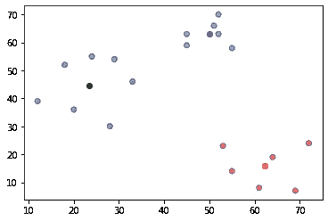
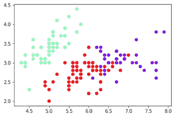
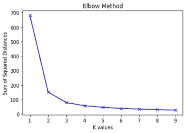
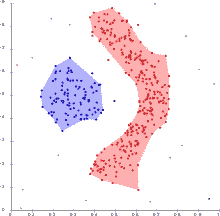
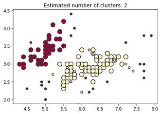
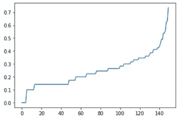

# K-Means 与 DBSCAN 聚类—适用于初学者

> 原文：<https://towardsdatascience.com/k-means-vs-dbscan-clustering-49f8e627de27?source=collection_archive---------3----------------------->


图片来源——un splash

# 聚类——一种无监督的机器学习技术

聚类是将未标记的数据点以这样的方式分组:
***同一组内的数据点彼此相似，
不同组内的数据点彼此不相似。***
目标是创建具有高的类内相似性和低的类间相似性的类。

# k 均值聚类

*K-Means 聚类是最常用的无监督机器学习聚类技术之一。这是一种基于质心的聚类技术，需要您决定聚类(质心)的数量，并随机放置聚类质心来开始聚类过程。目标是重复地将 N 个观察值分成 K 个簇，直到不能形成更多的组。*



## K 均值的优势

*   易于理解和实施。
*   能很好的处理大型数据集。

## K 均值的缺点

*   对选择的簇/质心的数量敏感。即使使用了像 Elbow 方法这样的技术，有时也很难生成好的集群。
*   不适用于异常值。质心可能会被离群值拖住，导致聚类偏斜。
*   在高维空间中变得困难，因为点之间的距离增加，欧几里德距离发散(收敛到恒定值)。
*   随着维数的增加而变慢。

# k-均值算法

1.决定集群的数量。这个数叫做 K，聚类数等于质心数。基于 K 的值，生成 K 个随机质心的坐标。

2.对于每个点，计算该点和每个质心之间的欧几里德距离。

3.将该点指定给其最近的质心。分配给同一个质心的点形成一个簇。

4.一旦聚类形成，通过取聚类平均值来计算每个聚类的新质心。聚类平均值是属于该聚类的所有点的 x 和 y 坐标的平均值。

5.重复步骤 2、3 和 4，直到质心不能再移动。换句话说，重复这些步骤直到收敛。

# 使用 Scikit Learn 的虹膜数据集的 k 均值

```
import pandas as pd
from sklearn import metrics
from sklearn.cluster import KMeans
import matplotlib.pyplot as plt# reading the classic iris dataset into a df
iris_df = pd.read_csv(“iris_dataset.csv”)# Setting the independent features (input)
X = iris_df.drop(“species”, axis=1).values# Creating the KMeans object and fitting it to the Iris data
iris_kmeans = KMeans(n_clusters=3)iris_kmeans.fit(X)# Predicting the cluster labels
labels = iris_kmeans.predict(X)
print(labels)# Finding the final centroids
centroids = iris_kmeans.cluster_centers_# Evaluating the quality of clusters
s = metrics.silhouette_score(X, labels, metric=’euclidean’)
print(f”Silhouette Coefficient for the Iris Dataset Clusters: {s:.2f}”)# plotting the clusters using sepal_length and sepal_width
plt.scatter(X[:, 0], X[:, 1], c=labels, cmap=”rainbow”)
plt.show()
```

## 输出

标签值代表聚类数。

```
[1 1 1 1 1 1 1 1 1 1 1 1 1 1 1 1 1 1 1 1 1 1 1 1 1 1 1 1 1 1 1 1 1 1 1 1 1
1 1 1 1 1 1 1 1 1 1 1 1 1 2 2 0 2 2 2 2 2 2 2 2 2 2 2 2 2 2 2 2 2 2 2 2 2
2 2 2 0 2 2 2 2 2 2 2 2 2 2 2 2 2 2 2 2 2 2 2 2 2 2 0 2 0 0 0 0 2 0 0 0 0
0 0 2 2 0 0 0 0 2 0 2 0 2 0 0 2 2 0 0 0 0 0 2 0 0 0 0 2 0 0 0 2 0 0 0 2 0
0 2]Silhouette Coefficient for the Iris Dataset Clusters: 0.55
```



三个 K 均值聚类

# 寻找 K-Means 的最佳聚类数(肘方法)

使用 K-Means 形成的聚类的质量很大程度上取决于 K 的选定值。K 的错误选择会导致较差的聚类。那么如何挑选 K 呢？我们来看看常用的手法叫做“**肘法**”。目标是选择形成弯头的 K 点。

**步骤:**

1.对于不同的 K 值，执行以下步骤:

2.对于每个聚类，计算每个点到其质心的距离的平方和。

3.将每个聚类的距离平方和相加，得到 k 值的距离平方和。

4.不断将每个 K 的距离平方和添加到列表中。

5.绘制距离平方和(使用上一步创建的列表)及其 K 值。

6.选择发生急剧变化的 K(看起来像曲线的弯头)。

```
# Arbitrarily selecting a range of values for K
K = range(1,10)sum_of_squared_distances = []# Using Scikit Learn’s KMeans Algorithm to find sum of squared distancesfor k in K:
    model = KMeans(n_clusters=k).fit(X)
    sum_of_squared_distances.append(model.inertia_)plt.plot(K, sum_of_squared_distances, “bx-”)
plt.xlabel(“K values”)
plt.ylabel(“Sum of Squared Distances”)
plt.title(“Elbow Method”)
plt.show()
```



查看该图，我们可以看到 K=3 处的拐点，因此这是该数据集的最佳聚类数。

有时，我们可能会以多个值显示一个肘形结束。在这种情况下，为了找到最佳 K，可以使用像轮廓系数这样的评估度量。应该选择将返回轮廓系数的最高正值的 K。

# 基于密度的含噪声应用空间聚类(DBSCAN)

*DBSCAN 是一种基于密度的聚类算法，它形成数据点密集区域的聚类，忽略低密度区域(将其视为噪声)。*



维基百科图片

## DBSCAN 的优势

*   适用于噪声数据集。
*   可以轻松识别异常值。
*   聚类可以采取任何不规则的形状，不像 K-Means 中的聚类或多或少是球形的。

## DBSCAN 的缺点

*   不适用于稀疏数据集或密度变化的数据集。
*   对 eps 和 minPts 参数敏感。
*   对于多处理器系统不可分区。

# DBSCAN 参数

DBSCAN 使用以下两个用户定义的参数进行聚类:

**ε(EPS)**:定义为被认为是相邻点(属于同一个聚类)的两点之间的最大距离。

**最小点(min_samples 或 minPts)** :这定义了一个给定点需要被视为核心数据点的相邻点的最小数量。这包括点本身。例如，如果最小点数设置为 4，则给定点需要有 3 个或更多的相邻数据点才能被视为核心数据点。

如果最小数量的点满足ε距离要求，则它们被视为一个聚类。

# **DBS can 中的重要术语**

```
**Core Point:** A data point is considered to be a core point if it has minimum number of neighboring data points (min_samples) at an epsilon distance from it. This minimum number of data points includes the original data point.**Border Point:** A data point that has less than minimum number of data points needed but has at least one core point in the neighborhood.**Noise:** A data point that is not a core point or a border point is considered noise or an outlier.
```

# **DBSCAN 算法**

**1** 。决定 eps 和 minPts 的值。

**2** 。对于每个点:

*   计算它与所有其他点的距离。如果距离小于或等于 eps，则将该点标记为 x 的邻居。
*   如果该点的相邻点计数大于或等于 minPts，则将其标记为核心点或已访问点。

**3** 。对于每个核心点，如果它还没有被分配给一个集群，则创建一个新的集群。递归地找到它的所有邻近点，并把它们分配到与核心点相同的簇中。

**4** 。继续这些步骤，直到覆盖所有未访问的点。

# **使用 Scikit Learn 对虹膜数据集进行 DBSCAN 聚类**

```
import pandas as pd
from sklearn import metrics
from sklearn.cluster import DBSCAN
import matplotlib.pyplot as plt# reading the classic iris dataset into a df
iris_df = pd.read_csv(“iris_dataset.csv”)X = iris_df.drop(“species”, axis=1).valuesiris_dbscan = DBSCAN(eps=0.5, min_samples=5)
iris_dbscan.fit(X)labels = iris_dbscan.labels_# label=-1 means the point is an outlier. Rest of the values represent the label/cluster number starting from 0
print(labels)# Creating a numpy array with all values set to false by default
core_samples_mask = np.zeros_like(labels, dtype=bool)# Setting core and border points (all points that are not -1) to True
core_samples_mask[iris_dbscan.core_sample_indices_] = True# Finding the number of clusters in labels (ignoring noise if present)
n_clusters_ = len(set(labels)) — (1 if -1 in labels else 0)
n_noise_ = list(labels).count(-1)# Printing the number of clusters and number of noise points (outliers)
print(“Estimated number of clusters: %d” % n_clusters_)
print(“Estimated number of noise points: %d” % n_noise_)# Evaluating the quality of clusters
s = metrics.silhouette_score(X, iris_dbscan.labels_)
print(f”Silhouette Coefficient for the Iris Dataset Clusters: {s:.2f}”)
```

## 输出

Label = -1 表示它是一个噪声点(异常值)。
Label = 0 或以上，表示集群编号。

```
[ 0 0 0 0 0 0 0 0 0 0 0 0 0 0 0 0 0 0 0 0 0 0 0 0
0 0 0 0 0 0 0 0 0 0 0 0 0 0 0 0 0 -1 0 0 0 0 0 0
0 0 1 1 1 1 1 1 1 -1 1 1 -1 1 1 1 1 1 1 1 -1 1 1 1
1 1 1 1 1 1 1 1 1 1 1 1 1 1 1 -1 1 1 1 1 1 -1 1 1
1 1 -1 1 1 1 1 1 1 -1 -1 1 -1 -1 1 1 1 1 1 1 1 -1 -1 1
1 1 -1 1 1 1 1 1 1 1 1 -1 1 1 -1 -1 1 1 1 1 1 1 1 1
1 1 1 1 1 1]Estimated number of clusters: 2Estimated number of noise points: 17Silhouette Coefficient for the Iris Dataset Clusters: 0.49
```

## 绘制聚类图

```
unique_labels = set(labels)colors = plt.cm.Spectral(np.linspace(0, 1, len(unique_labels)))for k, col in zip(unique_labels, colors):
    if k == -1:
        # Black used for noise
        col = “k”

    class_member_mask = (labels == k)
    xy = X[class_member_mask & core_samples_mask]
    plt.plot(xy[:, 0], xy[:, 1], “o”, markerfacecolor=col,
    markeredgecolor=”k”, markersize=10) xy = X[class_member_mask & ~core_samples_mask]
    plt.plot(xy[:, 0], xy[:, 1], “o”, markerfacecolor=col,
    markeredgecolor=”k”, markersize=5)plt.title(“Estimated number of clusters: %d” % n_clusters_)
plt.show()
```



黑色代表异常值，彩色点代表两个 DBSCAN 集群

# 寻找每股收益的最佳值(拐点法)

DBSCAN 聚类算法对我们选择的 eps 值很敏感。那么如何才能知道我们选择了最优的 eps 值呢？这里有一个常用的手法叫做“**膝法**”。目标是找出每个点到其 K 个最近邻点的平均距离，并选择曲率最大或发生急剧变化的距离。K 的值被设置为等于 minPoints。

以下是一个使用 Scikit Learn 的 NearestNeighbors 模块显示最佳 eps 值选择的示例。

```
from sklearn.neighbors import NearestNeighbors
nearest_neighbors = NearestNeighbors(n_neighbors=5)nearest_neighbors.fit(X)
distances, indices = nearest_neighbors.kneighbors(X)
distances = np.sort(distances, axis=0)[:, 1]
print(distances)plt.plot(distances)
plt.show()
```

## 输出

```
[0\. 0\. 0\. 0\. 0\. 0.1
0.1 0.1 0.1 0.1 0.1 0.1
0.1 0.14142136 0.14142136 0.14142136 0.14142136 0.14142136
0.14142136 0.14142136 0.14142136 0.14142136 0.14142136 0.14142136
0.14142136 0.14142136 0.14142136 0.14142136 0.14142136 0.14142136
0.14142136 0.14142136 0.14142136 0.14142136 0.14142136 0.14142136
0.14142136 0.14142136 0.14142136 0.14142136 0.14142136 0.14142136
0.14142136 0.14142136 0.14142136 0.14142136 0.14142136 0.14142136
0.17320508 0.17320508 0.17320508 0.17320508 0.17320508 0.17320508
0.17320508 0.2 0.2 0.2 0.2 0.2
0.2 0.2 0.2 0.2 0.2 0.2
0.2236068 0.2236068 0.2236068 0.2236068 0.2236068 0.2236068
0.2236068 0.2236068 0.2236068 0.2236068 0.24494897 0.24494897
0.24494897 0.24494897 0.24494897 0.24494897 0.24494897 0.24494897
0.24494897 0.24494897 0.24494897 0.24494897 0.26457513 0.26457513
0.26457513 0.26457513 0.26457513 0.26457513 0.26457513 0.26457513
0.26457513 0.26457513 0.26457513 0.26457513 0.28284271 0.28284271
0.28284271 0.28284271 0.3 0.3 0.3 0.3
0.3 0.3 0.3 0.31622777 0.31622777 0.31622777
0.33166248 0.33166248 0.33166248 0.33166248 0.33166248 0.34641016
0.34641016 0.34641016 0.34641016 0.34641016 0.34641016 0.34641016
0.36055513 0.36055513 0.36055513 0.36055513 0.37416574 0.38729833
0.38729833 0.38729833 0.41231056 0.41231056 0.41231056 0.41231056
0.42426407 0.42426407 0.43588989 0.45825757 0.48989795 0.48989795
0.53851648 0.53851648 0.55677644 0.6244998 0.63245553 0.73484692]
```



最佳值应该是我们看到最大曲率的值，在这种情况下，该值似乎接近 0.5。

有时，我们可能会以多个值显示急剧变化而告终。在这种情况下，为了找到最佳 K，可以使用像轮廓系数这样的评估度量。应该选择将返回轮廓系数的最高正值的 K。

*何时使用这两种聚类技术中的哪一种，取决于问题。尽管 K-Means 是最流行的聚类技术，但也有使用 DBSCAN 得到更好的聚类的用例。*